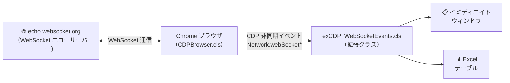
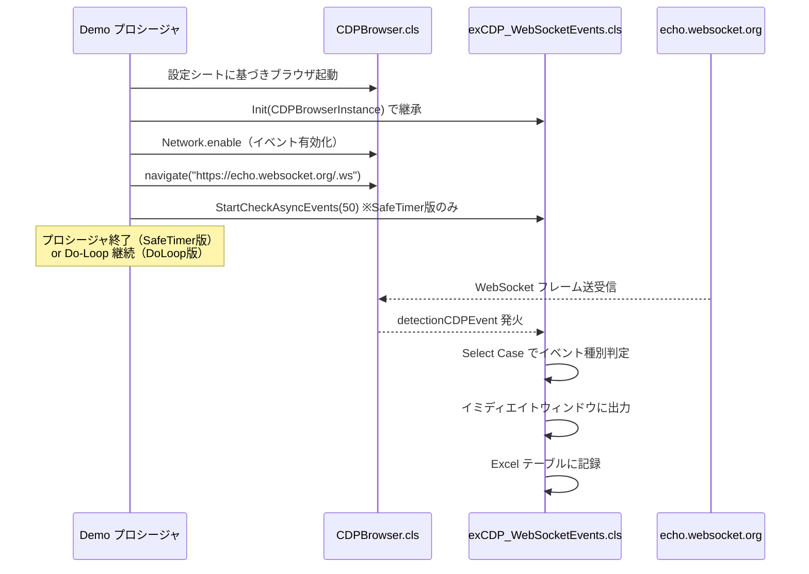
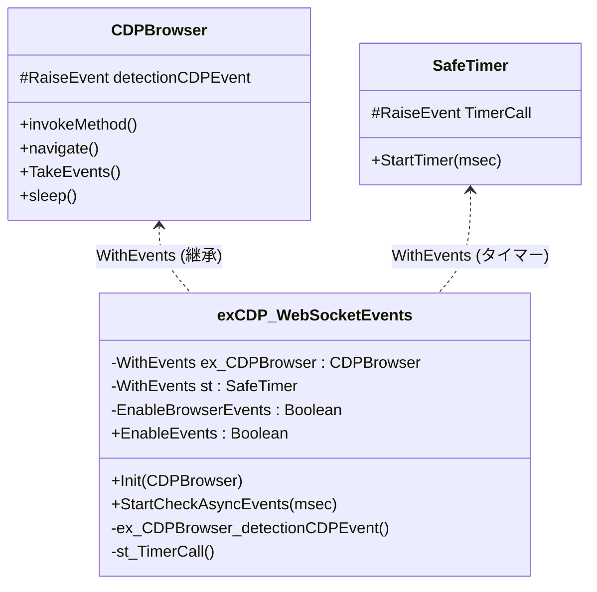

# Data Streamer For WebSocket Demo

`CDPBrowser.cls` × `VBA-SafeTimer` の連携を体感できる実践的なデモです。\
CDP の `Network.*` 系イベントを活用し、WebSocket の通信フレームをリアルタイムで\
イミディエイトウィンドウ＆Excel テーブルに記録します。

***

## 📁 ファイル構成

```
Data Streamer For WebSocketDemo/
├── exCDP_WebSocketEvents.cls    ← Advanced テンプレートを実装した拡張クラス
└── Demo_SafeTimerWithCDP.bas    ← 2種類の監視方式を比較できるデモモジュール
```

***

## 🔰 デモの概要

[echo.websocket.org](https://echo.websocket.org/.ws) の WebSocket エコーサーバーに接続し、\
ユーザーが入力したメッセージの**送受信フレーム**を CDP 経由でリアルタイム取得します。



***

## 📡 監視対象の CDP イベント

`exCDP_WebSocketEvents.cls` が処理する CDP イベントの一覧です。

| CDP イベント名 | タイミング |
| --- | --- |
| `Network.webSocketCreated` | WebSocket 接続が確立されたとき |
| `Network.webSocketHandshakeResponseReceived` | ハンドシェイク応答を受け取ったとき |
| `Network.webSocketWillSendHandshakeRequest` | ハンドシェイクリクエストを送信する直前 |
| `Network.webSocketFrameSent` | フレームを**送信**したとき |
| `Network.webSocketFrameReceived` | フレームを**受信**したとき |
| `Network.webSocketFrameError` | 受信中にエラーが発生したとき |
| `Network.webSocketClosed` | WebSocket 接続が閉じられたとき |

***

## 🚀 デモの実行方法

### 事前準備

Excel テーブルを用意してください。

1. `Sheet1` に新規テーブルを追加し、テーブル名を `テーブル1` にする
2. 列を3列用意する（例: `ステータス` / `リクエストID` / `メッセージ内容`）

### デモ実行

`Demo_SafeTimerWithCDP.bas` に2つのデモプロシージャがあります。

| プロシージャ名 | 監視方式 |
| --- | --- |
| `StartDoLoopVer` | Do-Loop によるポーリング（従来方式） |
| `StartSetTimerVer` | VBA-SafeTimer による自動監視（推奨） |

どちらも以下の順で動作します。



***

## 🔍 2つの監視方式の違い

このデモの最大の見どころは、**DoLoop 版 vs SafeTimer 版** の比較です。

| 比較項目 | `StartDoLoopVer`（DoLoop 版） | `StartSetTimerVer`（SafeTimer 版） |
| --- | --- | --- |
| ポーリング方法 | `Do~Loop` 内で手動呼び出し | SafeTimer が 50ms ごとに自動呼び出し |
| プロシージャの終了 | ❌ ループが終わらないため戻らない | ✅ 起動後すぐ終了（監視は継続） |
| 並行して他の処理 | ❌ 不可 | ✅ 可能（タイマーは非同期） |
| VBA ブレーク時 | ループが止まる | ✅ タイマーも自動停止（クラッシュしない） |
| コードの見通し | やや複雑 | ✅ シンプル |

> [!NOTE]
> SafeTimer 版では、`exCDP_WebSocketEvents` を `Static` 変数として宣言しています。\
> プロシージャが終了してもオブジェクトが破棄されないようにするための重要なポイントです。

```vba
' ✅ Static にすることで、プロシージャ終了後もタイマーが生き続ける
Static d As New exCDP_WebSocketEvents
```

***

## 🏗️ クラス設計（`exCDP_WebSocketEvents.cls`）

Advanced テンプレート（`exCDP_TemplateWithSafeTimer.cls`）をベースに実装されています。



***

## 📝 このデモから学べること

1. **SafeTimer を使うと何が変わるか** — DoLoop 版との比較で体感できる
2. **CDP の Network イベントの種類と取得方法** — WebSocket フレームの構造を実際のデータで確認できる
3. **Advanced テンプレートの実装パターン** — 独自の拡張クラスを作る際の参考になる

***

## 🔗 関連リソース

| リソース | 場所 |
| --- | --- |
| Advanced テンプレート | `ForDevelopers/TemplateExtensions/CDP/Advanced/` |
| テンプレート使い分けガイド | `ForDevelopers/TemplateExtensions/CDP/README.md` |
| VBA-SafeTimer 元リポジトリ | [cristianbuse/VBA-SafeTimer](https://github.com/cristianbuse/VBA-SafeTimer) |
| CDP Network ドメイン仕様 | [Chrome DevTools Protocol - Network](https://chromedevtools.github.io/devtools-protocol/tot/Network/) |
