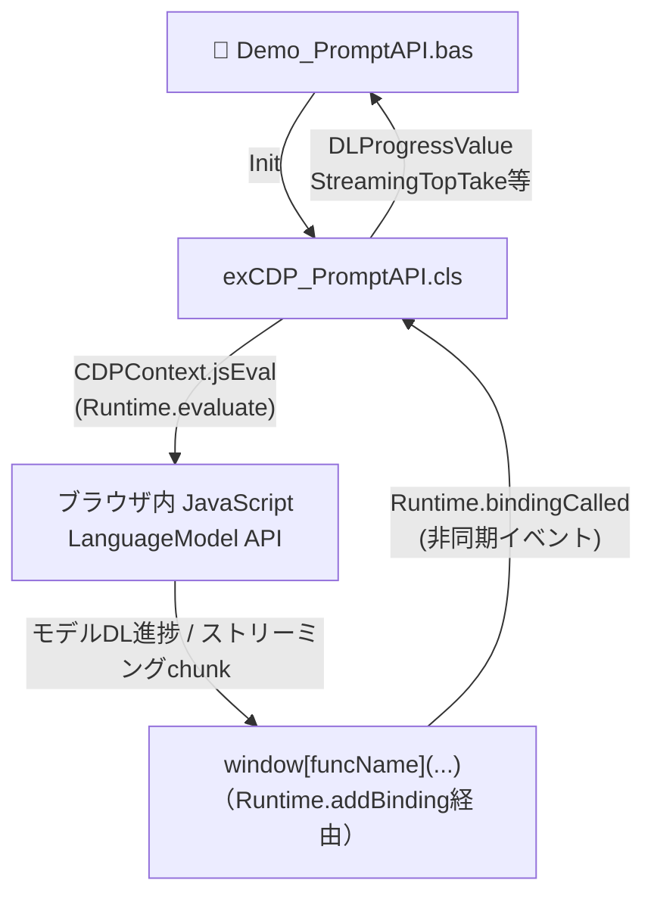
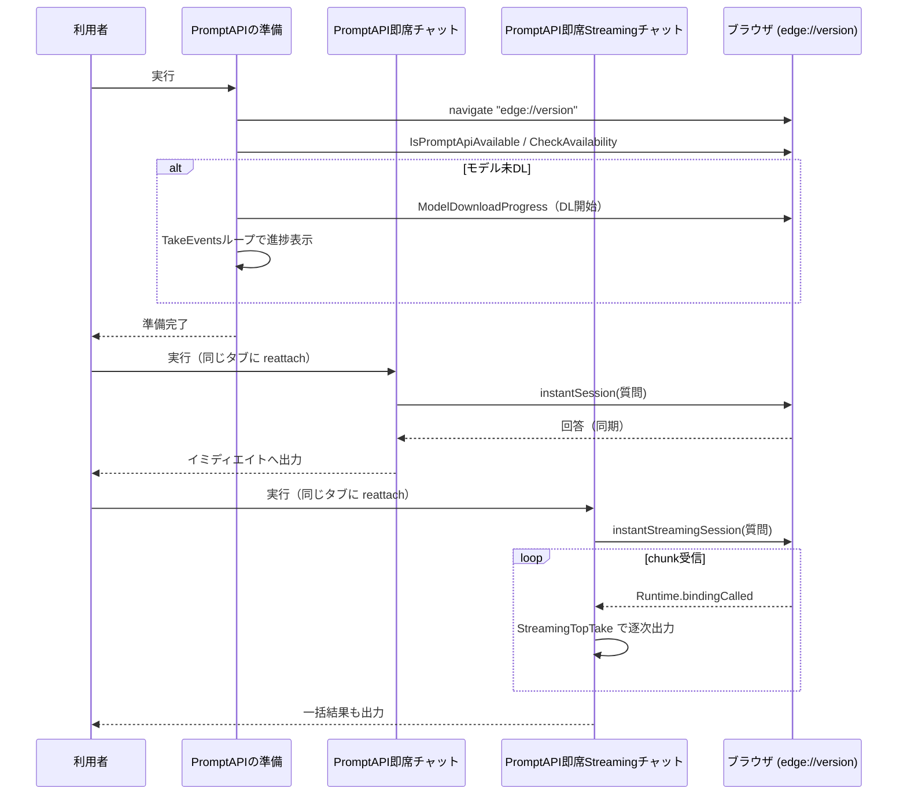

# LocalAI (Prompt API) POC

`CDPContext.cls` 経由で、ブラウザ内蔵のローカルAI「**Prompt API**」（Edge/ChromeのオンデバイスAI、Gemini Nano系）をVBAから操作するPOC（概念実証）コードです。\
外部APIキーも通信費も不要で、ブラウザに同梱されたAIモデルとVBAだけでチャット・ストリーミング応答を試せます。

> [!WARNING]
> **実験的機能です。** ブラウザのアップデートで、ある日突然動かなくなる可能性があります。\
> また現時点では、`edge://version` のようなブラウザ固有の特殊ページなど、**限られた場所でのみ動作**します（詳細は後述）。

***

## 📁 ファイル構成

```
LocalAI/
├── exCDP_PromptAPI.cls    ← Prompt API 操作用の拡張クラス
└── Demo_PromptAPI.bas     ← 準備〜チャット〜ストリーミングまでのデモモジュール
```

***

## 🔰 Prompt API とは

Prompt API は、ブラウザに組み込まれたローカルAIモデル（Edgeの場合は Phi 系、ChromeはGemini Nano）に対して、\
JavaScriptから直接チャット形式でやり取りできる実験的なWeb APIです。

- 参考資料
  - [Prompt API (Microsoft Edge / Learn)](https://learn.microsoft.com/ja-jp/microsoft-edge/web-platform/prompt-api)
  - [Prompt API (Chrome for Developers)](https://developer.chrome.com/docs/ai/prompt-api?hl=ja)

このツールでは、CDPの `Runtime.evaluate` / `Runtime.callFunctionOn` でこのJavaScript APIをブラウザ側で叩き、\
結果をVBA側に戻す、という形で「VBAからローカルAIを操作する」を実現しています。

### 動作条件・制約

| 項目 | 内容 |
| --- | --- |
| 対応ブラウザ | Prompt APIに対応したバージョンのEdge / Chrome（対応バージョンはまだ変動が大きいです） |
| 有効化FLAGS | バージョンによっては `edge://flags` 等での実験的機能の有効化が必要な場合があります |
| 動作可能な場所 | **現時点では全サイトでは動作しません。** `edge://version` のような、ブラウザ内蔵の特殊ページ（限られたオリジン）でのみ動作を確認しています |
| モデルデータ | 初回利用時、ブラウザが数GB単位のAIモデルデータをダウンロードします（後述の`ModelDownloadProgress`で進捗監視） |
| システムプロンプト | このPOCの実装（`instantSession` / `instantStreamingSession`）では非対応です |
| 会話履歴 | 非対応です（1回ごとにセッションを作成→質問→即破棄、を行う「一度切りトーク」実装のため） |

***

## 🏗️ 全体の流れ



- **単発の問い合わせ**（`IsPromptApiAvailable` / `CheckAvailability` / `instantSession`）は、`jsEval` の戻り値をそのまま受け取るだけの同期処理です
- **進捗監視・ストリーミング**（`ModelDownloadProgress` / `instantStreamingSession`）は、`Runtime.addBinding` でブラウザ→VBAの「通信口」を先に開けておき、JavaScript側から `window[funcName](...)` を呼んでもらう形で、非同期にデータを受け取ります（CDPの `Runtime.bindingCalled` イベントとして届く）

***

## 🧩 `exCDP_PromptAPI.cls` の公開API

### 準備系

| メンバー | 役割 |
| --- | --- |
| `Init(CDPContext)` | 拡張クラスの初期化。タブ（`CDPContext`）を継承します |
| `IsPromptApiAvailable() As Boolean` | `LanguageModel` オブジェクトの存在確認（APIが利用可能な環境か） |
| `CheckAvailability() As String` | モデルの利用可否を4段階（`"unavailable"` / `"downloadable"` / `"downloading"` / `"available"`）で返す |
| `ModelDownloadProgress() As String` | モデルデータのDLを開始し、進捗通知（`Runtime.addBinding`）を有効化する |
| `DLProgressValue As Double`（Get） | 直近のモデルDL進捗値（%） |

### チャット系

| メンバー | 役割 |
| --- | --- |
| `instantSession(ChatString) As String` | 1回限りの問い合わせ（セッション作成→質問→破棄を一括実行、結果を同期的に返す） |
| `instantStreamingSession(ChatString) As String` | 同上だが、応答を`Streaming`（chunk単位）で受け取る非同期版。呼び出し自体は即座に戻る |
| `StreamingTopTake As String`（Get） | ストリーミング中、前回取得分以降の新規chunkだけを取り出す（進捗表示用） |
| `StreamingAllTake As String`（Get） | ストリーミングでこれまでに蓄積された全文を取り出す（完成データ用） |
| `StreamingEOFExist As Boolean`（Get） | ストリーミングが終端（EOF）まで届いたかどうか |

### 共通

| メンバー | 役割 |
| --- | --- |
| `EnableEvents As Boolean` | この拡張クラスの非同期イベント処理そのもののON/OFFスイッチ |

***

## 🚀 デモの実行方法（`Demo_PromptAPI.bas`）

3つのプロシージャを、**この順番で**実行してください。



| # | プロシージャ名 | 内容 |
| --- | --- | --- |
| 1 | `PromptAPIの準備` | ブラウザを起動し`edge://version`へ遷移、API可否確認、（必要なら）モデルDLと進捗待機まで行う |
| 2 | `PromptAPI即席チャット` | 準備済みタブに`reattach`し、1回限りの質問応答を同期的に実行 |
| 3 | `PromptAPI即席Streamingチャット` | 同じく`reattach`し、ストリーミング形式で応答を逐次受信・表示 |

> [!NOTE]
> プロシージャ2・3は、`ShSetting01_StartBrowser.CurrentUserName` を使って **既存タブへの`reattach`** から始まります。\
> Prompt APIが動作するページ（`edge://version`）に、`PromptAPIの準備`で開いたタブへ戻って会話を続ける形になるためです。\
> 何らかの理由でreattachに失敗する場合は、`PromptAPIの準備`から再実行してください。

***

## ⚠️ 実装上の注意点

- **バッファ管理**：`instantStreamingSession`の受信バッファ（`promptStreaming`）は固定長から始まり、溢れそうになると倍々で拡張されますが、想定を超える極端に長い応答ではオーバーフローに対応できていません
- **`Runtime.addBinding`の使い回し**：DL進捗用（`sendDLprogressNotification`）とストリーミング用（`pushAiStream`）で別々のバインディング名を使っています。同じセッション内で両方使う際は競合しない設計です
- **EOF判定**：ストリーミングの終端は、制御文字（文字コード30）を目印にしています。応答本文にこの文字が偶然含まれると誤判定する可能性があります
- **タイムアウト**：AIの応答は数秒〜要することがあるため、デモでは`CDPContext.TimeOutSecond`を60秒に延長しています

***

## 🔗 関連リソース

| リソース | 場所 |
| --- | --- |
| Prompt API（Microsoft Edge） | [learn.microsoft.com](https://learn.microsoft.com/ja-jp/microsoft-edge/web-platform/prompt-api) |
| Prompt API（Chrome for Developers） | [developer.chrome.com](https://developer.chrome.com/docs/ai/prompt-api?hl=ja) |
| CDP `Runtime.addBinding` 仕様 | [Chrome DevTools Protocol - Runtime](https://chromedevtools.github.io/devtools-protocol/tot/Runtime/#method-addBinding) |
| 拡張機能テンプレート一覧 | `ForDevelopers/TemplateExtensions/CDP/README.md` |
