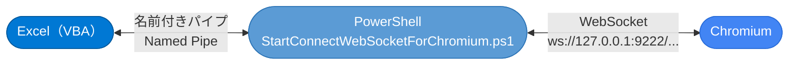
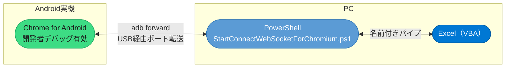
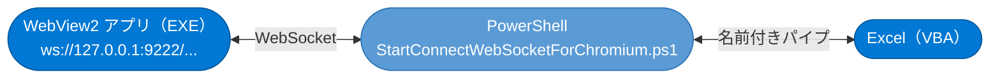
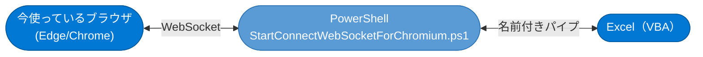
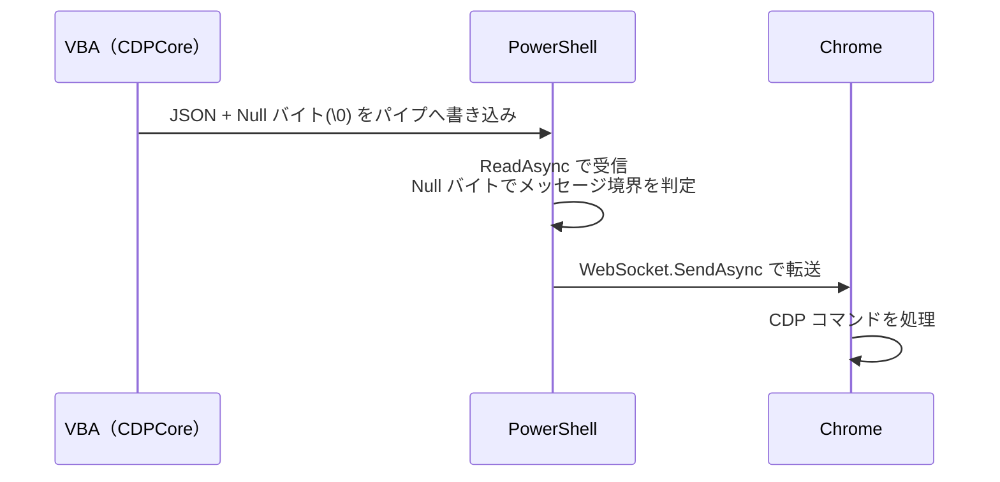
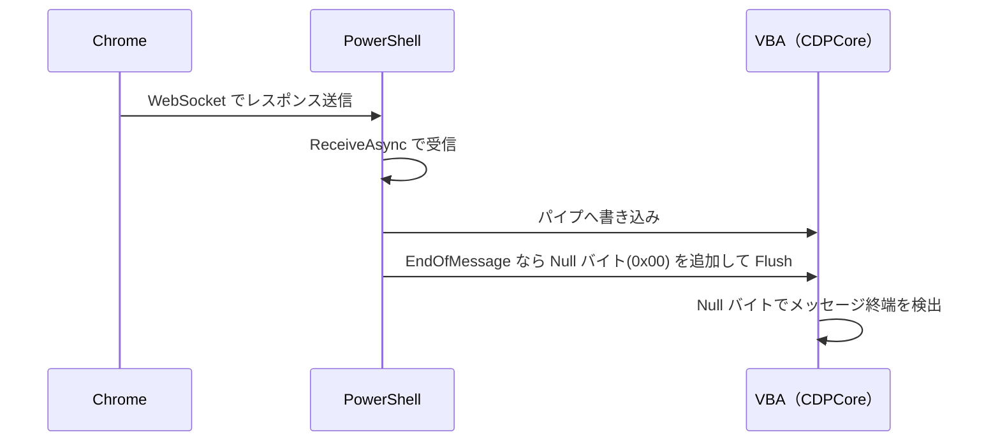
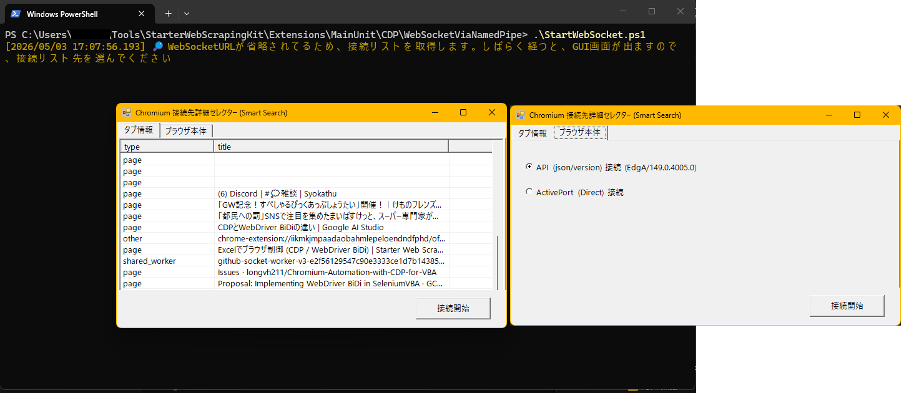

# WebSocketViaNamedPipe 拡張機能

## 概要

`CDPCore.cls` の通信方式は **`remote-debugging-pipe`（匿名パイプ）** です。  
これは高速・低レイテンシである一方、Chromium プロセスとの**直接パイプ接続**が前提です。

この拡張機能は、**WebSocket（`ws://`）経由で外部 Chromium に接続したい場合**のために用意されています。  
VBA の名前付きパイプと PowerShell の WebSocket クライアントの間に **中継レイヤー** を挟み、  
既存の `CDPCore.cls` を変えずにそのまま利用できるようになります



---

## WebSocket だからこそできること

`remote-debugging-pipe` は高速ですが、**同一 PC 上の Chromium プロセスとの直接接続** に限られます。  
`WebSocket` 経由にすることで、以下のようなニッチなシナリオにも対応できます。

### 📱 Android スマートフォンの Chromium を自動制御

Android 実機の Chrome を PC から CDP 操作できます。



**セットアップ例：**

```powershell
# adb でポートをフォワード
adb forward tcp:9222 localabstract:chrome_devtools_remote

# WebSocket URL を確認
# → http://127.0.0.1:9222/json/version の webSocketDebuggerUrl を使う
```

> [!NOTE]
> Android の Chrome を USB デバッグ対象にするには、Chrome の「デバッグを許可」設定と
> Android の開発者オプション「USB デバッグ」を有効にする必要があります。

---

### 🪟 WebView2 を `--remote-debugging-port` 経由で自動制御

WebView2 アプリを CDP で操作するには、環境変数 `WEBVIEW2_ADDITIONAL_BROWSER_ARGUMENTS` に  
`--remote-debugging-port=9222` を付与して起動します。

```powershell
# 環境変数を設定して WebView2 アプリを起動
$env:WEBVIEW2_ADDITIONAL_BROWSER_ARGUMENTS = "--remote-debugging-port=9222"
Start-Process ".\YourWebView2App.exe"
```

起動後は通常の Chrome WebSocket 接続と同様に扱えます。



> [!IMPORTANT]
> `CDPCore.cls` のデフォルト起動（`remote-debugging-pipe`）では WebView2 は操作できません。
> `WebSocketViaNamedPipe` を使うことで、他アプリ内の WebView2 も VBA から制御が可能になります。

---

### 🖥️ 「今起動中の目の前のブラウザ」を自動操作

通常、CDP 操作には `--remote-debugging-port` などの起動オプションが必要ですが、最新のブラウザ機能により、**「既に開いている通常のブラウザウィンドウ」** を後付けで制御できるようになりました。



**設定方法（Edge の場合）：**

1. Edge で `edge://inspect/#remote-debugging` を開きます。
2. **「Allow remote debugging for this browser instance」** を ON にします。
3. これにより、このブラウザインスタンスに対して WebSocket 経由のデバッグが許可されます。

**技術的な仕組み：**

この機能は元々「AI エージェント向け」として実装されたものですが、内部的には通常の `--remote-debugging-port=9222` と同じ WebSocket プロトコルを使用しています。

Edge の場合、接続に必要なポート番号やパスの情報は以下のファイルに出力されます：
- `%LOCALAPPDATA%\Microsoft\Edge\User Data\DevToolsActivePort`

このファイルから情報を読み取り、`webSocketDebuggerUrl` を特定すれば、既存の `StartConnectWebSocketForChromium.ps1` でそのまま接続・制御が可能になります。

> [!TIP]
> 「自動操作のためにブラウザを一度閉じて、特定のオプションで再起動する」という手間がなくなるため、ユーザーが手動で操作していた画面を引き継いで自動化する、といった柔軟なワークフローが実現できます。

---

## ファイル構成

| ファイル | 役割 |
|---|---|
| `CDPCoreWebSocketHelpers.bas` | VBA 側のWebSocket接続アシスト・管理用モジュール（Shift-JIS形式の標準モジュール） |
| `StartConnectWebSocketForChromium.ps1` | PowerShell 側のブリッジスクリプト |

---

## 通信フロー

### データ送信（VBA → Chrome）



### データ受信（Chrome → VBA）



> [!NOTE]
> PowerShell が Null バイト（`0x00`）をメッセージ区切りとして使用するのは、
> `CDPCore.cls` の `ReadFile` ループが同じ規約で動作しているためです。

---

## セットアップ手順

### Step 1：VBAモジュールのインポート

1. VBAのVBE（Visual Basic Editor）を開きます。
2. `CDPCoreWebSocketHelpers.bas` (Shift-JIS形式) をプロジェクトへインポートします。
   * **ポイント**: Shift-JIS形式で保存されているため、日本語コメントが文字化けすることなく安全にインポートでき、これ1枚でWebSocket接続アシスト（手動・自動接続やWebView2設定など）の準備が完了します。

---

### Step 2：ブラウザ（Chromium）を準備する

以下のいずれかの方法で、リモートデバッグが可能なブラウザを用意します。

- **方法A：起動オプションを付与して起動**
  ```powershell
  Start-Process "msedge" "--remote-debugging-port=9222"
  ```
- **方法B：起動中のブラウザで許可する（Chromium系統のみ）**
  `edge://inspect/#remote-debugging` を開き、「Allow remote debugging for this browser instance」を **ON** にします。

---

### Step 3：接続ブリッジの起動と接続（2つのパターン）

環境や用途に合わせて、以下のいずれかの方法で接続を確立します。

#### パターンA：手動実行（ManualSetup）
PowerShell スクリプトを手動で起動する方法です。

*   **メリット**: ウイルス対策ソフトによる誤検知のリスクがなく、安全です。
*   **デメリット**: 手動でコンソールを立ち上げる手間がかかります。

1.  **PowerShell ブリッジを起動**:
    コンソールで `StartConnectWebSocketForChromium.ps1` を実行し、GUI で接続先を選んで「接続開始」を押します。
    ```powershell
    powershell -ExecutionPolicy Bypass -File ".\StartConnectWebSocketForChromium.ps1"
    ```

    上記のような、引数なしで実行すると、現在起動中のブラウザから接続可能なタブやインスタンスを一覧表示します。
    

    ターゲットが固定されている場合は、引数に URL を渡して直接起動も可能です。この場合は、GUIセレクト画面を飛ばします

    ```powershell
    .\StartConnectWebSocketForChromium.ps1 "ws://127.0.0.1:9222/devtools/browser/..."
    ```

---

2.  **VBA から接続**:  
    VBAの `CDPCoreWebSocketHelpers.bas` にある `ManualSetup` を実行します。内部で `ConnectNamePipe` が呼ばれ、接続が確立されます。

#### パターンB：自動実行（AutoSetup）
PowerShell のコードを Excel 内に保持し、VBA から自動で呼び出す方法です。

*   **メリット**: Excel ファイル単体で完結し、ボタン一つでブラウザ選択から接続まで自動化できます。
*   **デメリット**: スクリプトの動的実行を行うため、環境によってはウイルス対策ソフトにブロックされる場合があります。

1.  **初期設定（初回のみ）**:
    `StartConnectWebSocketForChromium.ps1` の内容をコピーし、指定のセル（デフォルトは `Sheet1` の `A1`）に貼り付けます。
2.  **実行**:
    VBA から `AutoSetup` を実行します。内部で PowerShell が隠しウィンドウで起動し、自動的に接続待機状態になります。VBA 側も接続が確認できるまで自動でリトライを繰り返します。
3.  GUIセレクト画面が出たら、タイムアウトまでに、接続先を選択してください
---

### Step 4：CDP 操作を開始する

```vba
Sub WebSocketによる冒険の始まり()
    Dim WebSocketCDP As New CDPContext

    '識別名称を設定する
    Dim UseName As String
    UseName = "ChromiumWebSocket"

    ' まず targetID に再接続を試みる
    If Not WebSocketCDP.reattach(UseName) Then
        ' 失敗した場合はタブを取得して新規接続
        Set WebSocketCDP = WebSocketCDP.InheritanceCDPBrowser.newTab(setMain:=True)
    End If

    ' 通常の CDPBrowser と同様に操作可能
    WebSocketCDP.navigate "https://example.com"
    ' ...

    ' ブラウザを正常に閉じる（名前付きパイプのハンドルも自動クリーンされます）
    WebSocketCDP.InheritanceCDPBrowser.quit
End Sub
```

---

## API リファレンス（`CDPCoreWebSocketHelpers.bas`）

### `ConnectNamePipe(UserName As String) As Long`

PowerShell が作成した名前付きパイプにクライアントとして接続し、ハンドル情報を管理テーブルに保存します。

| 項目 | 内容 |
|---|---|
| 引数 `UserName` | 接続識別名（パイプ名のサフィックス） |
| 戻り値 | エラーコード（0 = 成功） |
| 注意 | PowerShell スクリプトが先に実行されている必要があります |

---

### `WebView2のクイックデバッグ切り替え(Optional port As Long = 9222)`

WebView2のデバッグポート（環境変数 `WEBVIEW2_ADDITIONAL_BROWSER_ARGUMENTS`）の設定・解除を行います。

| 項目 | 内容 |
|---|---|
| 引数 `port` | デバッグポート番号（0を指定すると環境変数を削除してデバッグポートを閉じます） |

---

> [!WARNING]
> Excel テーブルに記録されていないパイプハンドルは破棄できません。
> 接続エラーが続く場合は Excel プロセスの再起動が必要になることがあります。

---

## デモコードの実行順序

### パターンA：手動実行の場合
```
① （PowerShell コンソールで StartConnectWebSocketForChromium.ps1 を実行）
② ManualSetup()                ← VBA からパイプへ接続
③ WebSocketによる冒険の始まり()  ← 操作開始
```

### パターンB：自動実行の場合
```
① AutoSetup()                 ← PS起動から接続まで自動実行
② WebSocketによる冒険の始まり()  ← 操作開始
```

> [!NOTE]
> `WebSocketCDP.InheritanceCDPBrowser.quit` を呼び出すと、ブラウザを閉じると同時に、名前付きパイプのハンドルも自動的にクリーンアップ（解放）されます。

---

## 内部設計メモ

### serialize / deserialize（設定の永続化）

`CDPCoreWebSocketHelpers.bas` は、パイプハンドル（`hNamePipe`）を  
`ShSetting01_StartBrowser` シートの専用テーブルに書き込みます（`serialize`）。  
再接続時はテーブルから読み戻します（`deserialize`）。

これにより、VBA のスコープをまたいでもパイプハンドルを保持できます。

### PowerShell 側のバッファリングロジック

`StartConnectWebSocketForChromium.ps1` は以下のハイブリッドロジックでメッセージを処理します：

| ケース | 処理 |
|---|---|
| データが Null バイトで終わる（1回で完結） | 即座に WebSocket.SendAsync |
| データが途中で切れている（分割送信） | `MemoryStream` に蓄積し、Null バイト到着で一括送信 |

これは CDPBrowser の `strBuffer` によるフラグメント再組み立てと対称的な設計です。

### WriteThrough フラグ

```powershell
$pipeOptions = [System.IO.Pipes.PipeOptions]::WriteThrough -bor [System.IO.Pipes.PipeOptions]::Asynchronous
```

`WriteThrough` を指定することでバッファリングを無効化し、VBA 側が即座にデータを受信できるようにしています。

---

## 関連リンク

- [Chrome DevTools Protocol ドキュメント](https://chromedevtools.github.io/devtools-protocol/)
- [Chrome リモートデバッグガイド](https://developer.chrome.com/docs/devtools/remote-debugging?hl=ja)
- [Debug your browser session（Chrome DevTools MCP）](https://developer.chrome.com/blog/chrome-devtools-mcp-debug-your-browser-session?hl=ja)
- [System.Net.WebSockets（PowerShell側で使用）](https://learn.microsoft.com/ja-jp/dotnet/api/system.net.websockets)
