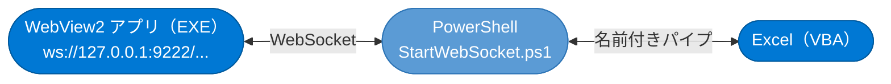
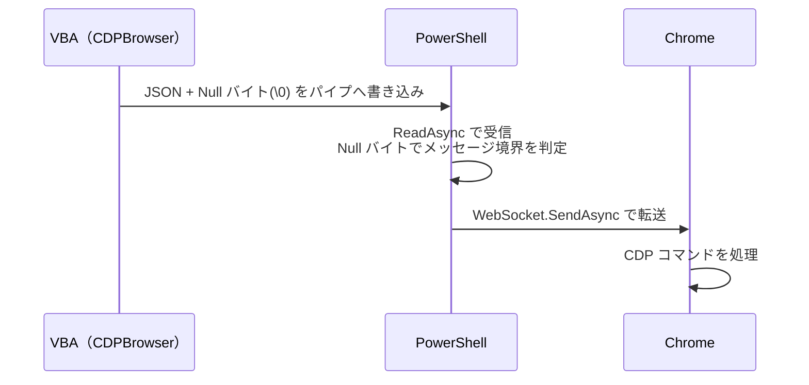
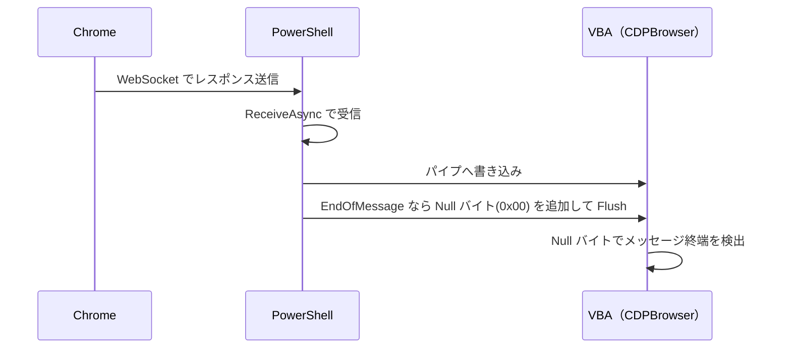

# WebSocketViaNamedPipe 拡張機能

## 概要

`CDPBrowser.cls` の通信方式は **`remote-debugging-pipe`（匿名パイプ）** です。  
これは高速・低レイテンシである一方、Chromium プロセスとの**直接パイプ接続**が前提です。

この拡張機能は、**WebSocket（`ws://`）経由で外部 Chromium に接続したい場合**のために用意されています。  
VBA の名前付きパイプと PowerShell の WebSocket クライアントの間に **中継レイヤー** を挟み、  
既存の `CDPBrowser.cls` API をそのまま利用できるようにします。


---

## WebSocket だからこそできること

`remote-debugging-pipe` は高速ですが、**同一 PC 上の Chromium プロセスとの直接接続** に限られます。  
`WebSocket` 経由にすることで、以下のようなニッチなシナリオにも対応できます。

### 📱 Android スマートフォンの Chromium を自動制御

Android 実機の Chrome を PC から CDP 操作できます。


**セットアップ例：**

```powershell
# adb でポートをフォワード
adb forward tcp:9222 localabstract:chrome_devtools_remote

# WebSocket URL を確認
# → http://127.0.0.1:9222/json/version の webSocketDebuggerUrl を使う
```

> [!NOTE]
> Android の Chrome を USB デバッグ対象にするには、Chrome の「デバッグを許可」設定と
> Android の開発者オプション「USB デバッグ」を有効にする必要があります。

---

### 🪟 WebView2 を `--remote-debugging-port` 経由で自動制御

WebView2 アプリを CDP で操作するには、環境変数 `WEBVIEW2_ADDITIONAL_BROWSER_ARGUMENTS` に  
`--remote-debugging-port=9222` を付与して起動します。

```powershell
# 環境変数を設定して WebView2 アプリを起動
$env:WEBVIEW2_ADDITIONAL_BROWSER_ARGUMENTS = "--remote-debugging-port=9222"
Start-Process ".\YourWebView2App.exe"
```

起動後は通常の Chrome WebSocket 接続と同様に扱えます。



> [!IMPORTANT]
> `CDPBrowser.cls` のデフォルト起動（`remote-debugging-pipe`）では WebView2 は操作できません。
> `WebSocketViaNamedPipe` を使うことで、他アプリ内の WebView2 も VBA から制御が可能になります。

---

## ファイル構成

| ファイル | 役割 |
|---|---|
| `WebSocketViaNamedPipe.cls` | VBA 側の名前付きパイプ管理クラス |
| `StartWebSocket.ps1` | PowerShell 側のブリッジスクリプト |
| `Demo_WebSocketViaNamedPipe.bas` | 動作確認用デモコード |

---

## 通信フロー

### データ送信（VBA → Chrome）



### データ受信（Chrome → VBA）



> [!NOTE]
> PowerShell が Null バイト（`0x00`）をメッセージ区切りとして使用するのは、
> `CDPBrowser.cls` の `ReadFile` ループが同じ規約で動作しているためです。

---

## セットアップ手順

### Step 1：Chrome を WebSocket モードで起動

**既に起動中の Chrome を使う場合**は、以下のいずれかで WebSocket URL を確認します。

```
http://127.0.0.1:9222/json/version
```

表示される `webSocketDebuggerUrl` をコピーします。

**新規起動する場合**は、`--remote-debugging-port=9222` フラグを付けて Chrome / Edge を起動します。

```powershell
Start-Process "msedge" "--remote-debugging-port=9222"
```

---

### Step 2：`StartWebSocket.ps1` のパラメータを設定

スクリプト冒頭の 2つの変数を設定します。

```powershell
# ① WebSocket URL（↑で確認した URL を貼る）
$wsUrl    = "ws://127.0.0.1:9222/devtools/browser/XXXX-XXXX-XXXX"

# ② 名前付きパイプ名（VBA 側と一致させる）
$pipeName = "ChromiumWebSocket"
```

---

### Step 3：VBA 側でパイプを作成（`FirstStep`）

VBA から `Demo_WebSocketViaNamedPipe.bas` の `FirstStep` を実行します。

```vba
Sub FirstStep()
    Dim WebSocketMode As New WebSocketViaNamedPipe
    Dim ResultCode As Long
    ResultCode = WebSocketMode.OpenAndConnectNamePipe("ChromiumWebSocket")
    ' ← ここで Excel は PowerShell の接続を待って「フリーズ（待機中）」になります
End Sub
```

> [!IMPORTANT]
> `OpenAndConnectNamePipe` を呼ぶと、Excel は PowerShell が接続してくるまで
> **フリーズ（ブロッキング待機）** 状態になります。これは正常な動作です。

---

### Step 4：PowerShell スクリプトを実行

別ウィンドウで `StartWebSocket.ps1` を実行します。

```powershell
powershell -ExecutionPolicy Bypass -File ".\StartWebSocket.ps1"
```

PowerShell が名前付きパイプへ接続すると、VBA のフリーズが解除されます。

---

### Step 5：CDP 接続（`WebSocketにてCDPの始まり`）

```vba
Sub WebSocketにてCDPの始まり()
    Dim WebSocketCDP As New CDPBrowser

    ' まず targetID に再接続を試みる
    If Not WebSocketCDP.reattach("ChromiumWebSocket") Then
        ' 失敗した場合はタブを取得して新規接続
        WebSocketCDP.getTab setMain:=True
    End If

    ' ← ここからは通常の CDPBrowser と同じように使える
    ' WebSocketCDP.navigate "https://example.com"
    ' ...

    WebSocketCDP.quit
End Sub
```

---

## API リファレンス（`WebSocketViaNamedPipe.cls`）

### `OpenAndConnectNamePipe(UserName As String) As Long`

名前付きパイプを新規作成し、PowerShell の接続を待機します。

| 項目 | 内容 |
|---|---|
| 引数 `UserName` | 接続識別名（パイプ名のサフィックス） |
| 戻り値 | エラーコード（0 = 成功） |
| 注意 | PowerShell が接続するまで **Excel がフリーズ（待機中）** になります |

---

### `ReConnectNamedPipe(Optional UserName As String) As Long`

既存のパイプハンドルを一旦切断し、再接続待機します。  
主に `reattach` 呼び出し時に内部で使用されます。

| 項目 | 内容 |
|---|---|
| 引数 `UserName` | 省略時は内部のハンドルをそのまま使用 |
| 戻り値 | エラーコード（0 = 成功） |
| 注意 | 事前に `deserialize` または `OpenAndConnectNamePipe` でハンドルが設定されている必要があります |

---

### `ClosePipeCDP(Optional UserName As String, Optional OnlyDisconnect As Boolean)`

パイプハンドルをクリーニングします。

| 引数 | 内容 |
|---|---|
| `UserName` | 省略時は内部ハンドルを使用 |
| `OnlyDisconnect = True` | ハンドルを閉じずに切断だけ行う |
| `OnlyDisconnect = False` | 切断 → ハンドルも `CloseHandle` する（デフォルト） |

> [!WARNING]
> Excel テーブルに記録されていないパイプハンドルは破棄できません。
> 接続エラーが続く場合は Excel プロセスの再起動が必要になることがあります。

---

## デモコードの実行順序

```
① FirstStep()              ← パイプ作成・PowerShell の接続待ち
② （別ウィンドウで StartWebSocket.ps1 を実行）
③ WebSocketにてCDPの始まり()  ← CDPBrowser でタブ接続・操作
④ cleanNamedPipe()         ← 後片付け（パイプクロース）
```

再接続が必要な場合（PowerShell が落ちた場合など）：

```
① ReConnect()              ← 既存パイプに再接続待ち
② （StartWebSocket.ps1 を再実行）
③ WebSocketにてCDPの始まり()  ← 再操作
```

---

## 内部設計メモ

### serialize / deserialize（設定の永続化）

`WebSocketViaNamedPipe.cls` は、パイプハンドル（`hNamePipe`）を  
`ShSetting01_StartBrowser` シートの専用テーブルに書き込みます（`serialize`）。  
再接続時はテーブルから読み戻します（`deserialize`）。

これにより、VBA のスコープをまたいでもパイプハンドルを保持できます。

### PowerShell 側のバッファリングロジック

`StartWebSocket.ps1` は以下のハイブリッドロジックでメッセージを処理します：

| ケース | 処理 |
|---|---|
| データが Null バイトで終わる（1回で完結） | 即座に WebSocket.SendAsync |
| データが途中で切れている（分割送信） | `MemoryStream` に蓄積し、Null バイト到着で一括送信 |

これは CDPBrowser の `strBuffer` によるフラグメント再組み立てと対称的な設計です。

### WriteThrough フラグ

```powershell
$pipeOptions = [System.IO.Pipes.PipeOptions]::WriteThrough -bor [System.IO.Pipes.PipeOptions]::Asynchronous
```

`WriteThrough` を指定することでバッファリングを無効化し、VBA 側が即座にデータを受信できるようにしています。

---

## 関連リンク

- [Chrome DevTools Protocol ドキュメント](https://chromedevtools.github.io/devtools-protocol/)
- [Chrome リモートデバッグガイド](https://developer.chrome.com/docs/devtools/remote-debugging?hl=ja)
- [System.Net.WebSockets（PowerShell側で使用）](https://learn.microsoft.com/ja-jp/dotnet/api/system.net.websockets)
