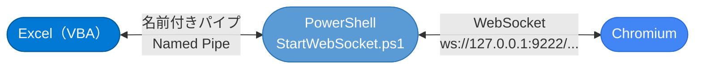
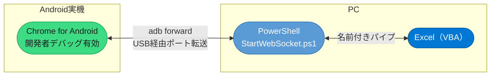
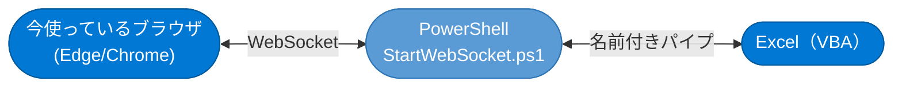
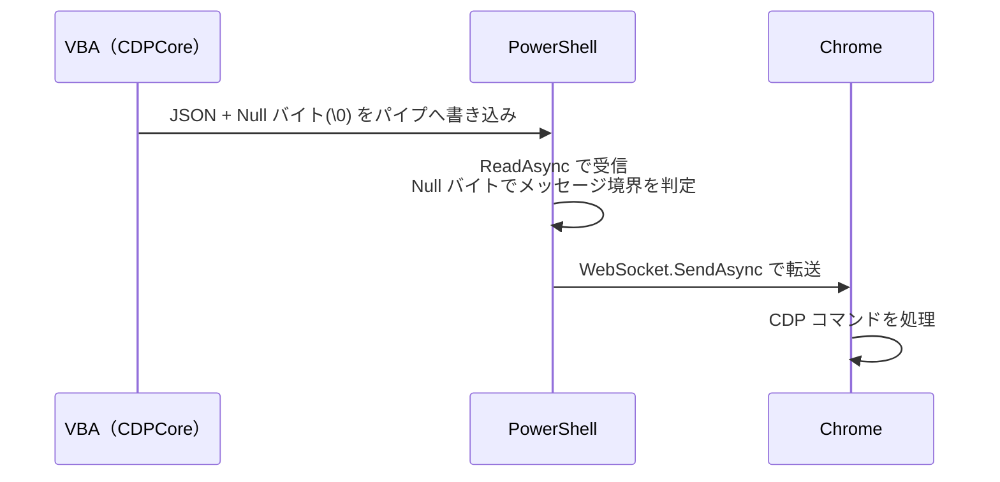
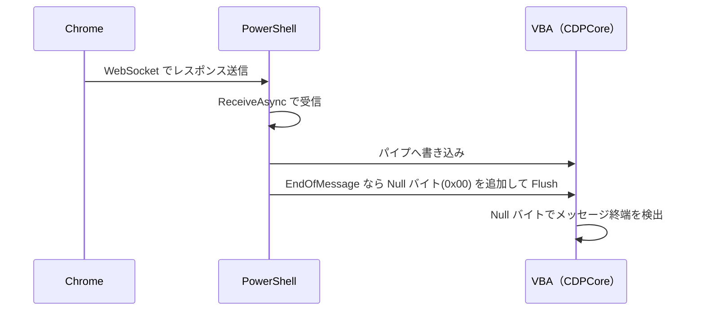

# WebSocketViaNamedPipe 拡張機能

## 概要

`CDPCore.cls` の通信方式は **`remote-debugging-pipe`（匿名パイプ）** です。  
これは高速・低レイテンシである一方、Chromium プロセスとの**直接パイプ接続**が前提です。

この拡張機能は、**WebSocket（`ws://`）経由で外部 Chromium に接続したい場合**のために用意されています。  
VBA の名前付きパイプと PowerShell の WebSocket クライアントの間に **中継レイヤー** を挟み、  
既存の `CDPCore.cls` を変えずにそのまま利用できるようになります



---

## WebSocket だからこそできること

`remote-debugging-pipe` は高速ですが、**同一 PC 上の Chromium プロセスとの直接接続** に限られます。  
`WebSocket` 経由にすることで、以下のようなニッチなシナリオにも対応できます。

### 📱 Android スマートフォンの Chromium を自動制御

Android 実機の Chrome を PC から CDP 操作できます。



**セットアップ例：**

```powershell
# adb でポートをフォワード
adb forward tcp:9222 localabstract:chrome_devtools_remote

# WebSocket URL を確認
# → http://127.0.0.1:9222/json/version の webSocketDebuggerUrl を使う
```

> [!NOTE]
> Android の Chrome を USB デバッグ対象にするには、Chrome の「デバッグを許可」設定と
> Android の開発者オプション「USB デバッグ」を有効にする必要があります。

---

### 🪟 WebView2 を `--remote-debugging-port` 経由で自動制御

WebView2 アプリを CDP で操作するには、環境変数 `WEBVIEW2_ADDITIONAL_BROWSER_ARGUMENTS` に  
`--remote-debugging-port=9222` を付与して起動します。

```powershell
# 環境変数を設定して WebView2 アプリを起動
$env:WEBVIEW2_ADDITIONAL_BROWSER_ARGUMENTS = "--remote-debugging-port=9222"
Start-Process ".\YourWebView2App.exe"
```

起動後は通常の Chrome WebSocket 接続と同様に扱えます。


> [!IMPORTANT]
> `CDPCore.cls` のデフォルト起動（`remote-debugging-pipe`）では WebView2 は操作できません。
> `WebSocketViaNamedPipe` を使うことで、他アプリ内の WebView2 も VBA から制御が可能になります。

---

### 🖥️ 「今起動中の目の前のブラウザ」を自動操作

通常、CDP 操作には `--remote-debugging-port` などの起動オプションが必要ですが、最新のブラウザ機能により、**「既に開いている通常のブラウザウィンドウ」** を後付けで制御できるようになりました。



**設定方法（Edge の場合）：**

1. Edge で `edge://inspect/#remote-debugging` を開きます。
2. **「Allow remote debugging for this browser instance」** を ON にします。
3. これにより、このブラウザインスタンスに対して WebSocket 経由のデバッグが許可されます。

**技術的な仕組み：**

この機能は元々「AI エージェント向け」として実装されたものですが、内部的には通常の `--remote-debugging-port=9222` と同じ WebSocket プロトコルを使用しています。

Edge の場合、接続に必要なポート番号やパスの情報は以下のファイルに出力されます：
- `%LOCALAPPDATA%\Microsoft\Edge\User Data\DevToolsActivePort`

このファイルから情報を読み取り、`webSocketDebuggerUrl` を特定すれば、既存の `StartWebSocket.ps1` でそのまま接続・制御が可能になります。

> [!TIP]
> 「自動操作のためにブラウザを一度閉じて、特定のオプションで再起動する」という手間がなくなるため、ユーザーが手動で操作していた画面を引き継いで自動化する、といった柔軟なワークフローが実現できます。

---

## ファイル構成

| ファイル | 役割 |
|---|---|
| `WebSocketViaNamedPipe.cls` | VBA 側の名前付きパイプ管理クラス |
| `StartWebSocket.ps1` | PowerShell 側のブリッジスクリプト |
| `Demo_WebSocketViaNamedPipe.bas` | 動作確認用デモコード |

---

## 通信フロー

### データ送信（VBA → Chrome）



### データ受信（Chrome → VBA）



> [!NOTE]
> PowerShell が Null バイト（`0x00`）をメッセージ区切りとして使用するのは、
> `CDPCore.cls` の `ReadFile` ループが同じ規約で動作しているためです。

---

---

## セットアップ手順

### Step 1：ブラウザ（Chromium）を準備する

以下のいずれかの方法で、リモートデバッグが可能なブラウザを用意します。

- **方法A：起動オプションを付与して起動**
  ```powershell
  Start-Process "msedge" "--remote-debugging-port=9222"
  ```
- **方法B：起動中のブラウザで許可する（Chromium系統のみ）**
  `edge://inspect/#remote-debugging` を開き、「Allow remote debugging for this browser instance」を **ON** にします。

---

### Step 2：PowerShell ブリッジを起動する

先に PowerShell スクリプトを実行し、名前付きパイプのサーバーを起動して待機状態にします。

#### パターン1：GUI で接続先を選ぶ（推奨）
引数なしで実行すると、現在起動中のブラウザから接続可能なタブやインスタンスを一覧表示します。


```powershell
powershell -ExecutionPolicy Bypass -File ".\StartWebSocket.ps1"
```
1. 表示された GUI で、操作したいタブまたはブラウザ本体を選択します。
2. 「接続開始」をクリックすると、PowerShell が名前付きパイプを作成し、VBA からの接続を待機します。

#### パターン2：WebSocket URL を直接指定して起動
ターゲットが固定されている場合は、引数に URL を渡して直接起動します。

```powershell
.\StartWebSocket.ps1 "ws://127.0.0.1:9222/devtools/browser/..."
```

---

### Step 3：VBA 側から接続する（`FirstStep`）

PowerShell が待機状態になったら、VBA から `Demo_WebSocketViaNamedPipe.bas` の `FirstStep` を実行して接続を確立します。

```vba
Sub FirstStep()
    Dim WebSocketMode As New WebSocketViaNamedPipe
    Dim ResultCode As Long
    ' PowerShell側と同じ名前付きパイプ名を指定して接続
    ResultCode = WebSocketMode.ConnectNamePipe("ChromiumWebSocket")
    
    If ResultCode = 0 Then
        MsgBox "接続に成功しました！"
    End If
End Sub
```

---

### Step 4：CDP 操作を開始する

```vba
Sub WebSocketにてCDPの始まり()
    Dim WebSocketCDP As New CDPBrowser

    ' まず targetID に再接続を試みる
    If Not WebSocketCDP.reattach("ChromiumWebSocket") Then
        ' 失敗した場合はタブを取得して新規接続
        WebSocketCDP.getTab setMain:=True
    End If

    ' 通常の CDPBrowser と同様に操作可能
    WebSocketCDP.navigate "https://example.com"
    ' ...

    WebSocketCDP.quit
End Sub
```

---

## API リファレンス（`WebSocketViaNamedPipe.cls`）

### `ConnectNamePipe(UserName As String) As Long`

PowerShell が作成した名前付きパイプにクライアントとして接続し、ハンドル情報を管理テーブルに保存します。

| 項目 | 内容 |
|---|---|
| 引数 `UserName` | 接続識別名（パイプ名のサフィックス） |
| 戻り値 | エラーコード（0 = 成功） |
| 注意 | PowerShell スクリプトが先に実行されている必要があります |

---


> [!WARNING]
> Excel テーブルに記録されていないパイプハンドルは破棄できません。
> 接続エラーが続く場合は Excel プロセスの再起動が必要になることがあります。

---

## デモコードの実行順序

```
① （PowerShell コンソールで StartWebSocket.ps1 を実行）
② FirstStep()              ← VBA からパイプへ接続
③ WebSocketにてCDPの始まり()  ← CDPBrowser でタブ接続・操作
④ cleanNamedPipe()         ← 後片付け（パイプクロース）
```

再接続が必要な場合（PowerShell が落ちた場合など）：

```
① （StartWebSocket.ps1 を再実行）
② FirstStep()              ← 再接続
③ WebSocketにてCDPの始まり()  ← 再操作
```

---

## 内部設計メモ

### serialize / deserialize（設定の永続化）

`WebSocketViaNamedPipe.cls` は、パイプハンドル（`hNamePipe`）を  
`ShSetting01_StartBrowser` シートの専用テーブルに書き込みます（`serialize`）。  
再接続時はテーブルから読み戻します（`deserialize`）。

これにより、VBA のスコープをまたいでもパイプハンドルを保持できます。

### PowerShell 側のバッファリングロジック

`StartWebSocket.ps1` は以下のハイブリッドロジックでメッセージを処理します：

| ケース | 処理 |
|---|---|
| データが Null バイトで終わる（1回で完結） | 即座に WebSocket.SendAsync |
| データが途中で切れている（分割送信） | `MemoryStream` に蓄積し、Null バイト到着で一括送信 |

これは CDPBrowser の `strBuffer` によるフラグメント再組み立てと対称的な設計です。

### WriteThrough フラグ

```powershell
$pipeOptions = [System.IO.Pipes.PipeOptions]::WriteThrough -bor [System.IO.Pipes.PipeOptions]::Asynchronous
```

`WriteThrough` を指定することでバッファリングを無効化し、VBA 側が即座にデータを受信できるようにしています。

---

## 関連リンク

- [Chrome DevTools Protocol ドキュメント](https://chromedevtools.github.io/devtools-protocol/)
- [Chrome リモートデバッグガイド](https://developer.chrome.com/docs/devtools/remote-debugging?hl=ja)
- [Debug your browser session（Chrome DevTools MCP）](https://developer.chrome.com/blog/chrome-devtools-mcp-debug-your-browser-session?hl=ja)
- [System.Net.WebSockets（PowerShell側で使用）](https://learn.microsoft.com/ja-jp/dotnet/api/system.net.websockets)
