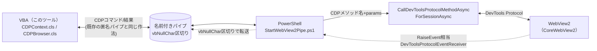

# WebView2 via PowerShell

`--remote-debugging-pipe` も `--remote-debugging-port` もポリシーで封じられた環境向けの、\
**最終手段**です。PowerShell がホストする WebView2 を、名前付きパイプ経由でこのツール（VBA）から操作します。

> [!WARNING]
> **実務としては完全にオーバースペックです。** 通常は本体の `--remote-debugging-pipe`（匿名パイプ）で\
> 十分足ります。ここから先が必要になるのは、会社のセキュリティポリシーがそれすら許さない、\
> 一部の限られた現場だけです。

***

## 📁 ファイル構成

```
WebView2ViaPowerShell/
├── CDPCoreWebView2Helpers.bas    ← VBA側：名前付きパイプへの接続専用ヘルパー
└── StartWebView2Pipe.ps1         ← PowerShell側：WebView2をホストし、CDPをパイプ越しに中継するサーバー
```

***

## 🔰 なぜこれが必要か

素の `CDPBrowser.cls`（匿名パイプ版）は、ブラウザを `--remote-debugging-pipe` 付きで直接起動します。\
しかし、一部の企業ポリシーはこの経路そのものを塞いできます。

| 塞がれる経路 | 塞ぐ仕組み |
| --- | --- |
| `--remote-debugging-pipe` / `--remote-debugging-port` の起動オプション自体 | [RemoteDebuggingAllowed（Microsoft Edge ポリシー）](https://learn.microsoft.com/ja-jp/DeployEdge/microsoft-edge-policies/remotedebuggingallowed) による既定禁止 |
| `WEBVIEW2_ADDITIONAL_BROWSER_ARGUMENTS` × `SetEnvironmentVariableW` で\ExcelのWebView2に`--remote-debugging-port=9222`を仕込む手（`ShSetting01_StartBrowser.EnsureWebView2Debug`） | ポートそのものをセキュリティ製品/ポリシーで塞ぐ措置 |

つまり、「ブラウザをデバッグモードで起動する」というアプローチ自体が、入口からすべて封じられているケースです。

そこで発想を変え、**リモートデバッグ用の`port`も`pipe`起動オプションも一切使わず**、WebView2 SDK が\
標準で公開している .NET API（`CoreWebView2.CallDevToolsProtocolMethodAsync` /\
`CallDevToolsProtocolMethodForSessionAsync`）を PowerShell から直接呼ぶことで、CDP コマンドを\
発行します。これなら「デバッグポートを開く」という行為自体が発生しないため、上記のポリシーが\
そもそも監視・禁止しようがない経路になります。

> [!NOTE]
> [純VBAからWebView2を制御する](https://github.com/tarboh/WebView2-For-Excel-VBA)、という夢のような仕組みも存在しますが、\
> 現時点ではまだ開発中のプロジェクトのため、しばらくは本フォルダのようにPowerShellを介する形で提供します。\
> いずれこちらが安定したら、うまい具合な統合を計画中です。

***

## 🏗️ 全体の流れ



`CDPCore.cls` / `CDPBrowser.cls` / `CDPContext.cls`（本体側）は、パイプの生成元が\
`CreateProcess`（匿名パイプ）か`CreateFile`（名前付きパイプ）かを一切区別しません。\
そのため **本体側の実装には一切手を入れず**、「パイプの向こう側」を丸ごとPowerShell+WebView2に\
差し替えるだけで成立しています。

***

## 🧩 `CDPCoreWebView2Helpers.bas` の公開API

| メンバー | 役割 |
| --- | --- |
| `ConnectNamePipe(UserName, UserDataFolder, TimeoutSeconds) As Boolean` | PowerShellホストを`Shell`で自動起動し、名前付きパイプへ接続してハンドルを記録する（既定の使い方） |
| `ConnectNamePipeManual(UserName, TimeoutSeconds) As Boolean` | PowerShell起動は行わず、**接続のみ**行う（後述の手動起動版向け） |

いずれも、`BrowserHandleInfo`テーブルに接続情報が残っていれば内部で生存確認を行い、\
生きていればPowerShellの再起動や再接続をせずそのまま使い回します。

***

## 🚀 使い方

### 自動起動版（通常はこちら）

```vb
CDPCoreWebView2Helpers.ConnectNamePipe "WebView2CDP"

Dim c As New CDPContext
If Not c.reattach("WebView2CDP", False) Then
    Set c = c.InheritanceCDPBrowser.newTab(setMain:=True)
End If
c.navigate "https://example.com"
```

### 手動起動版

> [!NOTE]
> ExcelからPowerShellを直接`Shell`起動すると、環境によってはアンチウイルス/EDRの\
> 「Office → PowerShell」ヒューリスティックに誤検知されることがあります。\
> その場合は、PowerShellを自分で（Windows Terminal等から）先に起動しておき、\
> VBA側は接続のみ行ってください。

```vb
'1. 手元のPowerShellコンソールで、あらかじめ下記を実行して待機させておく
'   powershell.exe -sta -NoProfile -ExecutionPolicy Bypass -File "...\WebView2ViaPowerShell\StartWebView2Pipe.ps1" -PipeName "WebView2CDP"

'2. VBA側は`Shell`を呼ばず、接続だけ行う（数十秒リトライして待つ）
CDPCoreWebView2Helpers.ConnectNamePipeManual "WebView2CDP"

Dim c As New CDPContext
If Not c.reattach("WebView2CDP", False) Then
    Set c = c.InheritanceCDPBrowser.newTab(setMain:=True)
End If
c.navigate "https://example.com"
```

***

## ⚠️ 実装上の注意点（WebView2ならではの制約）

### 複数タブ（`Target`ドメイン）は疑似実装

Chromium本来の`--remote-debugging-pipe`は、1ブラウザプロセスに対して複数タブを`Target`ドメインで\
生成・列挙できます。しかしWebView2の`CoreWebView2`は **1インスタンス = 1ページ** が原則で、\
.NET APIとしての複数タブ管理は存在しません。

そのため`StartWebView2Pipe.ps1`は、`Target.createTarget`等のコマンドを横取りし、\
非表示Formを複数作って各々に`CoreWebView2Controller`を紐付けることで、\
複数タブがあるかのように疑似的に振る舞います（`TargetManager`セクション）。

> [!NOTE]
> 1ページ内の**iframeセッション**については、`Target.setAutoAttach` / `attachToTarget`がWebView2に\
> ネイティブ対応しており、`CallDevToolsProtocolMethodForSessionAsync`はこちら向けの正規APIです。\
> 疑似実装が必要なのは、あくまで「独立した複数のWebView2インスタンス（＝タブ相当）」をまたぐ\
> 部分だけです。

### 非同期処理は`.ContinueWith(...)`必須（`GetAwaiter().GetResult()`厳禁）

WebView2の非同期API（`...Async`）の完了通知は、生成スレッドのWindowsメッセージループが\
回っていることが前提です。`StartWebView2Pipe.ps1`が`.GetAwaiter().GetResult()`のような\
同期待機を一切使わず、すべて`.ContinueWith(...)`のコールバック形式で処理しているのはこのためです\
（同期待機するとメッセージポンプが止まり、デッドロックします）。

さらに、その`.ContinueWith(...)`には`TaskScheduler.FromCurrentSynchronizationContext()`を\
明示的に渡す必要があります（実機検証で判明）。PowerShellプロセスは単一のランスペースしか持たず、\
既定のスケジューラ（ThreadPool）で継続処理を実行しようとすると、別スレッドが同じランスペースの\
使用を試みて事実上デッドロックするためです。

### パイプのフレーミングは本体側とまったく同じ

`Write-FramedMessage`は、JSONを UTF-8 化したうえで **`vbNullChar`（0x00）区切り** でパイプに\
書き込みます。これは本体の`--remote-debugging-pipe`実装と全く同じ作法のため、`CDPCore.cls`の\
受信ロジックはそのまま読み書きできます。

### `WebView2Loader.dll`は追加ダウンロード不要

`StartWebView2Pipe.ps1`は、Excelに同梱されている**PowerQueryアドインのWebView2 SDK**\
（`...\ADDINS\Microsoft Power Query for Excel Integrated\bin`）をそのまま流用します。\
そのため、別途WebView2 Runtime/SDKを配布・インストールする必要はありません。

***

## 🔗 関連リソース

| リソース | 場所 |
| --- | --- |
| RemoteDebuggingAllowed ポリシー | [learn.microsoft.com](https://learn.microsoft.com/ja-jp/DeployEdge/microsoft-edge-policies/remotedebuggingallowed) |
| `WEBVIEW2_ADDITIONAL_BROWSER_ARGUMENTS`によるポート開放（本ツール既存機能） | `ShSetting01_StartBrowser.EnsureWebView2Debug` |
| `CoreWebView2.CallDevToolsProtocolMethodAsync` | [learn.microsoft.com](https://learn.microsoft.com/ja-jp/dotnet/api/microsoft.web.webview2.core.corewebview2.calldevtoolsprotocolmethodasync) |
| `CoreWebView2.CallDevToolsProtocolMethodForSessionAsync` | [learn.microsoft.com](https://learn.microsoft.com/ja-jp/dotnet/api/microsoft.web.webview2.core.corewebview2.calldevtoolsprotocolmethodforsessionasync) |
| 純VBAからのWebView2制御（将来の統合候補・開発中） | [tarboh/WebView2-For-Excel-VBA](https://github.com/tarboh/WebView2-For-Excel-VBA) |
| Chrome DevTools Protocol 仕様 | [chromedevtools.github.io](https://chromedevtools.github.io/devtools-protocol/) |
