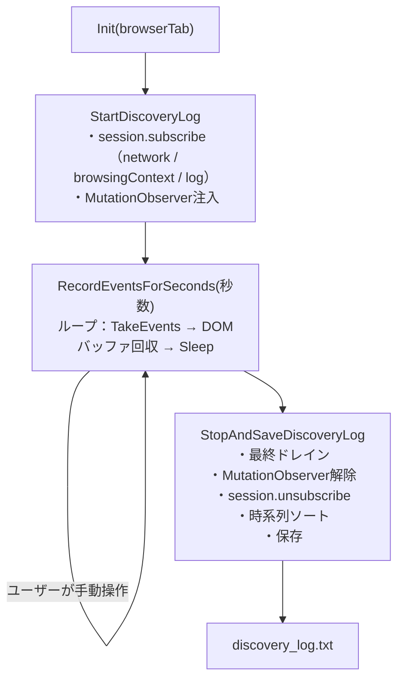

# Discovery Log Recorder（WebDriver BiDi版）

一定時間だけブラウザの中で起きた出来事（通信・ページ遷移・コンソールログ・DOM変化）を記録し、
テキストログとして保存する調査用エクステンションです。

> [!NOTE]
> 参照元は `ForAI\個人用Web自動化\WebDriver-BiDi-for-SeleniumVBA\src\BiDi_Sample.bas` の `Main09`（Manual Discovery Log recorder）です。
> ただし、このフォルダの実装はそのコードを移植したものではなく、このプロジェクト独自の `WebDriverBiDiContext` / `WebDriverBiDiCore` アーキテクチャ（BiDiイベント購読＋`jsEval`）の上に、一から書き起こしたものです。

***

## 📁 ファイル構成

```
Discovery Log Recorder/
├── exBiDi_DiscoveryLogRecorder.cls   … 記録本体（BiDiイベント購読 + MutationObserver注入）
├── Demo_DiscoveryLogRecorder.bas     … デモ & 動作確認モジュール
└── ReadMe.md                          … このファイル
```

***

## 🎯 これは何をするものか

1. `StartDiscoveryLog` で、ネットワーク／ナビゲーション／コンソールログのBiDiイベントを購読し、
   併せて現在のページへ `jsEval` で `MutationObserver` を注入します。
2. `RecordEventsForSeconds` を呼んでいる間（ユーザーが手動でブラウザを操作する想定）、
   BiDiイベントとDOM変化バッファを定期的にドレインし、内部のリングバッファへ蓄積し続けます。
3. `StopAndSaveDiscoveryLog` で記録を止め、購読解除・DOM監視解除を行った上で、
   蓄積したログ行を時系列に並べ替え、ヘッダーと集計サマリーを添えて1本のテキストとして返却・保存します。

既存の `Extensions\MainUnit\WebDriverBiDi\AdvanceWait\exBiDi_SpaSettler.cls`（SPA待機用に「DiscoveryLog」という
概念を使った未完成のコード）とは無関係の、完全に独立したエクステンションです。

***

## 🏗️ 全体の流れ



ページ遷移で `browsingContext.load` を受信した際は、その場で `MutationObserver` を自動的に再設置します
（フルナビゲーションでJS側の状態が失われるため）。

***

## 🧩 `exBiDi_DiscoveryLogRecorder.cls` の公開API

| メンバー | 役割 |
|---|---|
| `Init(browserTab As WebDriverBiDiContext)` | 継承処理。使用前に必ず呼び出してください |
| `StartDiscoveryLog(excludeImagesAndCss:=True, captureDom:=True)` | 記録開始。イベント購読＋DOM監視の注入 |
| `RecordEventsForSeconds(seconds, pollIntervalSeconds:=0.2)` | 指定秒数の間、記録を継続（この間に手動操作する） |
| `StopAndSaveDiscoveryLog(FolderPath, FileName:="discovery_log.txt")` | 記録停止・整形・保存。整形済み全文を戻り値として返す |
| `IsRecording` | 現在、記録中かどうか（Get専用） |

***

## 📝 出力ログの行フォーマット

各行は `[経過秒数s] [種別] 内容` の形式で、`StopAndSaveDiscoveryLog` 実行時に時系列へ並べ替えられます。

| 種別 | 意味 |
|---|---|
| `[REQ]` | `network.beforeRequestSent`（リクエスト送信） |
| `[RES]` | `network.responseCompleted`（レスポンス受信・ステータス/MIME付き） |
| `[ERR]` | `network.fetchError`（通信エラー） |
| `[NAV]` | `browsingContext.navigationStarted` / `domContentLoaded` / `load` |
| `[LOG]` | `log.entryAdded`（コンソールログ・JS例外） |
| `[DOM-ADD]` / `[DOM-DEL]` | 要素の追加・削除（`MutationObserver`の`childList`） |
| `[DOM-TXT]` | テキストノードの変化（`MutationObserver`の`characterData`） |

本文の末尾には、`excludeImagesAndCss=True` によってログから除外された静的リソースの
URL別件数サマリーが付きます（実際の通信自体はブロックされません）。

***

## 🚀 デモの実行方法

| プロシージャ | 内容 |
|---|---|
| `Demo_DiscoveryLogRecorder_手動操作の記録` | note.com を開き、案内ダイアログの[OK]後20秒間の手動操作を記録し、`discovery_log.txt`として保存 |

デモ実行前に、`Demo_DiscoveryLogRecorder.bas` 冒頭の `WORKSPACE_PATH` をご自身の環境に合わせて設定してください。

***

## ⚠️ 既知の制約・注意事項

- **DOM監視はメインドキュメントのみ**：クロスオリジンiframe内部のDOM変化は監視できません
- **`attributes`変更は既定で監視対象外**：フレームワークのUI更新等で大量に発火し、ログが埋もれるための措置です。必要であれば`InjectMutationObserver`内の`observe`オプションを調整してください
- **DOM変化の時刻精度はポーリング間隔単位**：`RecordEventsForSeconds`の既定間隔（0.2秒）でしかVBA側に届かないため、ネットワークイベントとの厳密な前後関係（因果順序）までは保証しません。あくまで「手動操作の目安」としての記録です
- **リングバッファの上限は既定5000行**：これを超えると、最も古い行から破棄されます（`StopAndSaveDiscoveryLog`のヘッダーに破棄件数が表示されます）
- **`excludeImagesAndCss`はログ出力のみを間引くもの**：実際のブラウザ通信をブロックするものではありません

***

## 🔗 関連リソース

- 参照元（アイデアの出所）：`ForAI\個人用Web自動化\WebDriver-BiDi-for-SeleniumVBA\src\BiDi_Sample.bas` の `Main09`
- 構成パターンの参考にした既存拡張：[../File Chooser/](../File%20Chooser/)
- W3C WebDriver BiDi仕様：
  - [script.evaluate](https://w3c.github.io/webdriver-bidi/#command-script-evaluate)
  - [network module](https://w3c.github.io/webdriver-bidi/#module-network)
  - [browsingContext module](https://w3c.github.io/webdriver-bidi/#module-browsingContext)
  - [log.entryAdded](https://w3c.github.io/webdriver-bidi/#event-log-entryAdded)
