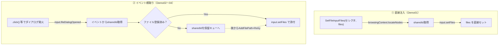

# File Chooser (WebDriver BiDi版)

WebDriver BiDi で、`<input type="file">` へファイルを添付する2つのデモです。\
[CDP版](../../CDP/File%20Chooser)（`exCDP_FileChooser.cls`）の移植依頼を受けて作成しました。

> [!WARNING]
> **お詫びと訂正**：本READMEの初版では「BiDiには`Page.fileChooserOpened`に相当する
> ダイアログ横取りの概念が存在しない」と記載していましたが、これは誤りでした。
> `input.fileDialogOpened`という、CDPの`Page.fileChooserOpened`を内部でそのまま
> BiDi形式に変換して再送しているイベントが実在し、横取り添付・キャンセル・
> 添付忘れリトライのすべてがCDP版と同様に実装可能です。本版はこの訂正版です。
> なお実装は`assset/mapperTab.js`（Chromium製BiDi-CDP Mapperの読解）に基づいており、
> **実機（VBA/Excel）での動作検証はできていません**。挙動に差異があれば教えてください。

***

## 📁 ファイル構成

```
File Chooser/
├── exBiDi_FileChooser.cls   ← input.setFiles / input.fileDialogOpened のラッパークラス
└── Demo_FileChooser.bas     ← 直接注入・3種類の横取り・キャンセル・リトライの4デモ
```

***

## 🔰 CDP版との対応表

| CDP版 | BiDi版 | 対応関係 |
| --- | --- | --- |
| `DOM.setFileInputFiles`（`CDPElement.SetFileInputFiles`） | `input.setFiles`（`exBiDi_FileChooser.SetFileInputFiles`） | ほぼ1:1。要素の指定方法だけ異なる（下記） |
| `Page.fileChooserOpened` | `input.fileDialogOpened` | ほぼ1:1。BiDi-CDP Mapperが内部でCDPイベントをそのまま変換・再送しているだけ |
| `Page.setInterceptFileChooserDialog` | `session.new`の`unhandledPromptBehavior`capability | **ここだけ構造が違う**（後述） |
| `CDPElement`（要素ラップクラス、`objectId`保持） | 無し。`script.SharedReference`（`sharedId`）を都度解決 | BiDi側に要素ラップクラスが存在しないため |

### 要素の指定方法の違い

CDPでは`CDPElement`が`objectId`を保持し続けるのに対し、BiDiには相当するクラスがありません。\
そのため`exBiDi_FileChooser.cls`は、2つの手段で`script.SharedReference`（`sharedId`）を得ています。

| 手段 | 使う場面 |
| --- | --- |
| `browsingContext.locateNodes`（CSSロケータ） | `SetFileInputFiles(cssSelector, files)` — 既に存在する要素へ直接注入する場合 |
| `input.fileDialogOpened`イベントの`element`フィールド | イベント経由の横取り添付 — 動的生成inputなど、セレクタで特定できない場合にも対応できる |

> [!NOTE]
> `input.setFiles`の`element`パラメーターは`script.SharedReference`型で、**`sharedId`が必須**です
> （`handle`は任意の付加情報でしかありません）。当初`jsEval(..., Ownership:=True)`で得られる
> `handle`のみを使う実装にしていましたが、`assset/mapperTab.js`のスキーマ定義
> （`SharedReferenceSchema`）を確認したところ`sharedId`必須と判明したため、`browsingContext.locateNodes`
> 経由に修正しています。

***

## 🏗️ 全体の流れ



***

## 🧩 `exBiDi_FileChooser.cls` の公開API

| メンバー | 役割 |
| --- | --- |
| `Init(WebDriverBiDiContext)` | 拡張クラスの初期化。既定でイベント監視も有効化されます |
| `SetFileInputFiles(cssSelector, files) As Boolean` | ダイアログを介さない直接注入（Demo01） |
| `EnableEvents(Optional cancel) = True/False` | `input.fileDialogOpened`の購読ON/OFF。`cancel:=True`で添付スキップモード |
| `AddFilePath = "path"` | 添付予定ファイルを1件ずつ登録（複数回でマルチ添付） |
| `FilePathCount` / `UnprocessedCount` | 登録済み件数 / 添付忘れの保留件数 |
| `AutoWaitFileDialogOpened(TimeOutSecond)` | 次の`input.fileDialogOpened`が来るまで待機（Boolean） |
| `RetrySetFileInputFiles()` | 保留になった`sharedId`へ再添付（Boolean） |
| `ClearFilePaths` / `ClearUnprocessed` | 各リストのクリア |

***

## 🚀 デモの実行方法（`Demo_FileChooser.bas`）

テストHTMLは [CDP版と同じもの](../../../OperationCheck/TestHtml/Test_FileChooser/index.html) をそのまま使います。

| # | プロシージャ名 | 内容 |
| --- | --- | --- |
| 1 | `Demo_FileChooser_01_直接注入_単一と複数` | `#singleInput`（単一）/ `#multiInput`（複数）への直接注入 |
| 2 | `Demo_FileChooser_02_3種類の添付` | 単一 / 複数 / 動的生成inputの3パターンを`input.fileDialogOpened`経由で添付 |
| 3 | `Demo_FileChooser_03_キャンセル機能` | `EnableEvents(cancel:=True)`で添付をスキップできることを確認 |
| 4 | `Demo_FileChooser_04_添付忘れからのリトライ` | 3パターンそれぞれで、添付忘れ→`RetrySetFileInputFiles`による復旧を確認 |

***

## ⚠️ OSダイアログの抑制について（重要・要検証）

CDPでは`Page.setInterceptFileChooserDialog`をタブ単位で呼ぶだけでOSダイアログを抑制できましたが、\
BiDiではこれに相当する抑制を、**`session.new`時点の`capabilities`で事前に設定しておく必要があります**。

```vb
' Demo_FileChooser.bas の BuildFileDialogCapabilities で組み立てているもの
{
  "capabilities": {
    "alwaysMatch": {
      "unhandledPromptBehavior": { "file": "dismiss" }
    }
  }
}
```

Demo02〜04では、この capabilities を`StartBiDiModeContext`の`sessionCapabilitiesRequest`引数に\
渡した状態でブラウザを起動しています（Demo01は直接注入のみでダイアログを開かせないため不要です）。

> [!WARNING]
> **`assset/mapperTab.js`の読解に基づく未検証事項**：
> - `unhandledPromptBehavior.file`を`"ignore"`以外にすると、Mapperは`Page.setInterceptFileChooserDialog`を
>   常に`cancel:true`付きで呼んでいるように見えます。CDP版での`cancel:true`は「ブラウザが即座に
>   キャンセル扱いにする」動作でした。BiDi側でこれが**毎回**発生するのか、`input.setFiles`を
>   後から呼んだ場合にその結果が正しく上書きされるのかは、ソースコードの読解のみで判断しており
>   実機検証はできていません
> - `sessionCapabilitiesRequest`は、`StartBiDiModeContext`が**新規に**ブラウザ/BiDiセッションを
>   起動した場合のみ適用されます（既存セッションへの`reattach`時は無効です）
> - `session.subscribe`はBiDiセッション全体に対して行われます。同一セッション内で複数タブ／
>   複数の`exBiDi_FileChooser`インスタンスを使う場合、購読状態の相互影響にご注意ください

実機で試された際の挙動（特にキャンセルモードの動作）は、ぜひフィードバックをお願いします。

***

## 🔗 関連リソース

| リソース | 場所 |
| --- | --- |
| CDP版（比較元） | `Extensions/MainUnit/CDP/File Chooser/` |
| テストHTML（共通） | `Extensions/OperationCheck/TestHtml/Test_FileChooser/index.html` |
| WebDriver BiDi 仕様 - input module | [w3c.github.io/webdriver-bidi](https://w3c.github.io/webdriver-bidi/#module-input) |
| WebDriver BiDi 仕様 - `input.setFiles` | [w3c.github.io/webdriver-bidi](https://w3c.github.io/webdriver-bidi/#command-input-setFiles) |
| WebDriver BiDi 仕様 - `browsingContext.locateNodes` | [w3c.github.io/webdriver-bidi](https://w3c.github.io/webdriver-bidi/#command-browsingContext-locateNodes) |
| BiDi-CDP Mapper（本プロジェクト同梱） | `assset/mapperTab.js` |
| BiDiモード起動ヘルパー | `ShSetting01_StartBrowser.StartBiDiModeContext` |
