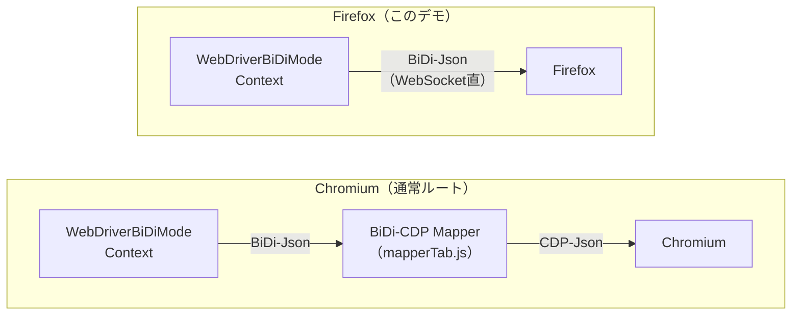

# Firefox 制御（WebDriver BiDi 直結版）

Firefox に、**WebDriver BiDi プロトコルをそのまま WebSocket で送って**制御するためのデモです。\
メインのリリースには含めていませんが、「いざとなればFirefoxもこのツールで制御できる」という切り札として用意しています。

> [!NOTE]
> コア（`src/`）に少し書き足しが必要なため、メインの配布物には入っていません。\
> 書き足し分は、このエクステンションと同じブランチ(ex-Firefox)で管理しています（[コア側の追記内容](#-コア側に追記したもの)）。

***

## 📁 ファイル構成

```
Firefox/
├── Demo_FirefoxBiDi.bas   ← 接続ヘルパー + デモ4本（イベント購読 / リアタッチ3種）
└── ReadMe.md              ← このファイル
```

専用のクラスはありません。`WebDriverBiDiMode` / `WebDriverBiDiContext` をそのまま使います。

***

## 🎯 これは何をするものか

Chromium 系のブラウザは、WebDriver BiDi を**ネイティブでは話せません**。そのためこのツールは、隠しタブに「BiDi-CDP Mapper」（`mapperTab.js`）を注入し、BiDi を CDP に翻訳して中継しています。

一方 Firefox は、**WebDriver BiDi をネイティブで話せます**。つまり翻訳機が要りません。このデモは、Mapper を経由せず、BiDi の JSON を WebSocket でそのまま Firefox へ送受信します。



`WebDriverBiDiMode` / `WebDriverBiDiContext` の上側の使い方（`navigate` / `getTab` / `SubscribeBiDiEvent` / `TakeEvents` など）は、Chromium のときと同じです。

***

## 🚀 使い方

### 1. デバッグ用 Firefox を起動しておく

事前に、デバッグ用の Firefox を下記のように起動しておく必要があります。

```bash
"firefox.exe" -no-remote --remote-debugging-port=0 -profile "%UserProfile%\AppData\Roaming\Mozilla\Firefox\Profiles\FirefoxDebug"
```

| 引数 | 意味 |
| --- | --- |
| `-no-remote` | 既に起動中の Firefox とは別のインスタンスとして起動します |
| `--remote-debugging-port=0` | 空いているポートで、WebDriver BiDi のサーバーを立ち上げます |
| `-profile "..."` | デバッグ専用のプロファイルフォルダ（普段使いのものと分けておくのがおすすめです） |

### 2. 接続先のポートを確認する

Firefox が実際に待ち受けているポート番号は、プロファイルフォルダ内の `WebDriverBiDiServer.json` に書かれています。

```
%UserProfile%\AppData\Roaming\Mozilla\Firefox\Profiles\FirefoxDebug\WebDriverBiDiServer.json
```

`Demo_FirefoxBiDi.bas` の接続ヘルパー `ConnectFirefox` には、ポート番号（`57221`）が直書きされています。**ご自身の環境の値に書き換えてください。**

### 3. 接続の書き方

肝は、`CDPCoreViaWebSocket` の **`DirectWebDriverBiDiMode = True`** です。これをONにしてから接続し、その WebSocket を `WebDriverBiDiMode.reattach` に渡します。

```vb
'接続ヘルパー（Demo_FirefoxBiDi.bas より抜粋）
Private Function ConnectFirefox(Optional ReusingWinSockHandle As Boolean) As CDPCoreViaWebSocket
    Dim UserName As String
    UserName = ShSetting01_StartBrowser.CurrentUserName

    Set ConnectFirefox = New CDPCoreViaWebSocket
    ConnectFirefox.DirectWebDriverBiDiMode = True       '← Mapperを使わず、BiDiを直接やり取りするスイッチ

    If ReusingWinSockHandle Then
        ConnectFirefox.ReConnectCDP UserName, True      '記録済みのWinSockハンドルを使いまわす
    Else
        Debug.Print ConnectFirefox.ConnectCDP(UserName, "/session", 57221)    'パスは`/session`、ポートは環境に合わせる
    End If
End Function
```

```vb
Sub Firefoxを動かす()
    Dim UserName As String
    UserName = ShSetting01_StartBrowser.CurrentUserName

    '1. Firefoxへ接続して、`WebDriverBiDiMode`として受け取る
    Dim WebSocketFirefox As New WebDriverBiDiMode
    WebSocketFirefox.reattach UserName, , ConnectFirefox

    '2. 既存のタブに接続（必ず`setMain:=True`）
    Dim t As WebDriverBiDiContext
    Set t = WebSocketFirefox.getTab(setMain:=True)

    '3. あとはいつものBiDi制御
    t.navigate "https://example.com"

    '4. ブラウザは閉じずに、BiDiのセッションだけ終了する
    WebSocketFirefox.sessionEnd
End Sub
```

***

## 🧪 デモの実行方法（`Demo_FirefoxBiDi.bas`）

| プロシージャ | 内容 |
| --- | --- |
| `checkNetworkEvents` | `network.beforeRequestSent` / `network.responseCompleted` / `log.entryAdded` を購読し、イベントをJSONで保存。保存・無効化・再開の流れも確認できます（Chromium版の同名デモの Firefox 版） |
| `demoReattachmentPart1` | 接続してページを開き、`sessionEnd` でセッションだけ終了して終わる |
| `demoReattachmentPart2` | 別プロシージャから再接続し、タブへ接続して遷移 |
| `demoReattachmentPart2ForTab` | 最後に操作したタブ（`WebDriverBiDiContext`）を直接再接続して遷移し、`sessionEnd` で後始末 |

> [!NOTE]
> 再接続のしかたは、前回の接続状態によって変わります。
> - `session.end` 済み、または WebSocket を切断済みの場合：通常どおり `ConnectCDP` で接続し直します
> - 切断も `session.end` もしていない場合：`ReConnectCDP UserName, True`（`ConnectFirefox(True)`）で、記録済みの WinSock ハンドルを使いまわせます

***

## 🔧 コア側に追記したもの

Mapper を経由しないために、コアへ次の追記をしています。

| 場所 | 追記内容 |
| --- | --- |
| `CDPCoreViaWebSocket` | `Public DirectWebDriverBiDiMode As Boolean`。ONにすると、受信したJSONを CDP としては解釈せず、BiDi の生JSONとして扱うスイッチ |
| `CDPCore` | `writeWebSocketBiDi`（BiDi-Json をそのまま WebSocket へ送信）と、`DirectWebDriverBiDiRes` イベント（受信した生JSONを、`WebDriverBiDiCore` へ通知） |
| `WebDriverBiDiCore` | `DirectWebDriverBiDiMode` の WebSocket が渡されたとき、Mapper の再始動を行わず、直接やり取りモードへ切り替える処理（`RunDirectWebDriverBiDi`）。送信は `writeWebSocketBiDi`、受信は `DirectWebDriverBiDiRes` 経由になります。あわせて、`BiDi-context`（メインタブ）を Excel テーブルに記録する枠も用意します |

***

## ⚠️ 既知の制約・注意事項

- **WebSocket ルートのみ**：BiDi をネイティブで話す相手へ直接つなぐ方式のため、Pipe 経由では使えません
- **Chromium 独自の機能は使えません**：BiDi+（`goog:cdp.*`）や `UpgradeBiDiPlus` による CDP 制御への切り替え、`CDPContext` / `CDPElement` は、Firefox では利用できません。使えるのは、標準の WebDriver BiDi の範囲です
- **ブラウザは自分で起動します**：`StartBiDiModeContext` などの起動ヘルパーは、Chromium 向けです。Firefox は上記のコマンドで事前に起動してください
- **ポート番号は環境依存です**：`ConnectFirefox` に直書きされた値は、作者環境のものです
- **Firefox 側の BiDi 実装の差異**：Firefox は独自に WebDriver BiDi を実装しているため、Chromium（Mapper経由）と挙動や対応状況が異なるコマンド／イベントがあり得ます。うまく動かない場合は、Firefox のバージョンと、下記の仕様・ドキュメントを確認してください

***

## 🔗 関連リソース

| リソース | 場所 |
| --- | --- |
| BiDi-CDP Mapper（本プロジェクト同梱） | `assset/mapperTab.js` |
| WebSocket 接続の基本 | [WebSocket モードでできること（公式ドキュメント）](https://eschamali.github.io/StarterWebScrapingKit/websocket/capabilities) |
| BiDi の基本 | [WebDriverBiDiMode（公式ドキュメント）](https://eschamali.github.io/StarterWebScrapingKit/api/bidi/WebDriverBiDiMode) |
| Firefox で BiDi 接続を作る方法 | [Create BiDi connection（MDN）](https://developer.mozilla.org/en-US/docs/Web/WebDriver/How_to/Create_BiDi_connection) |
| WebDriver BiDi 仕様 | [w3c.github.io/webdriver-bidi](https://w3c.github.io/webdriver-bidi/) |
