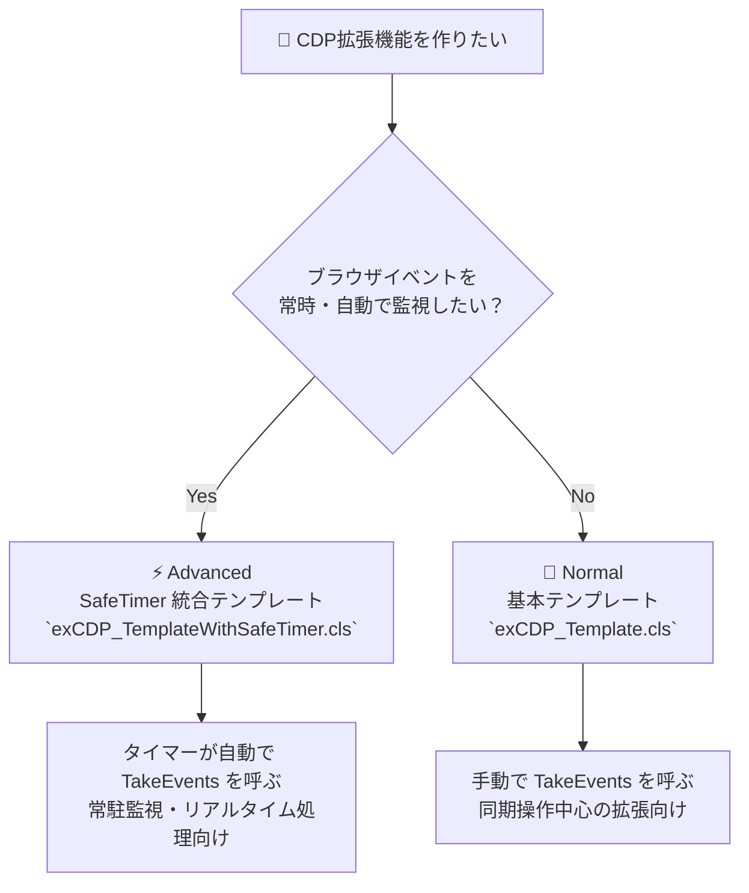

# CDP 拡張機能テンプレート

`CDPBrowser.cls` に対して独自の機能拡張を追加するためのテンプレート集です。\
用途に応じて **Normal** と **Advanced** の2種類から選んでご利用ください。

***

## 📁 ディレクトリ構成

```
ForDevelopers/TemplateExtensions/CDP/
├── Normal/
│   └── exCDP_Template.cls                  ← 基本テンプレート
└── Advanced/
    ├── exCDP_TemplateWithSafeTimer.cls     ← SafeTimer 統合テンプレート
    ├── SafeTimer.cls                       ← VBA-SafeTimer 本体
    ├── LibTimers.bas                       ← VBA-SafeTimer サポートモジュール
    └── TimerForm.frm / .frx               ← VBA-SafeTimer サポートフォーム
```

***

## 🔰 Normal — 基本テンプレート

**`Normal/exCDP_Template.cls`**

### こんな用途に

* CDP の非同期イベントを受け取り、何らかの処理を行いたいとき

* `invokeMethod` を使って CDP コマンドを送信したいとき

* **ほとんどのケースはこちらで十分です**

### 仕組み

```
CDPBrowser.cls
  └── WithEvents ex_CDPBrowser
        └── detectionCDPEvent → あなたの処理をここに書く
```

`CDPBrowser` を `WithEvents` で保持し、ブラウザから非同期イベントが届いたとき、\
`ex_CDPBrowser_detectionCDPEvent` が呼び出されます。\
`TakeEvents` を手動で呼ぶことでイベントをポーリングします。

### 主な構成要素

| プロシージャ / プロパティ                    | 役割                        |
| --------------------------------- | ------------------------- |
| `Init(Inheritance As CDPBrowser)` | `CDPBrowser` を継承する初期化メソッド |
| `EnableEvents` プロパティ              | 非同期イベント処理の ON/OFF スイッチ    |
| `ex_CDPBrowser_detectionCDPEvent` | 非同期イベントのハンドラ（ここに実装する）     |
| `Main01`                          | 独自機能の実装場所（自由に追加・改名してOK）   |
| `invokeMethod`                    | CDP コマンド送信のラッパー           |
| `TakeEvents`                      | イベントをポーリングして発火させる         |

### 導入ファイル

```
exCDP_Template.cls  ← これだけインポートすればOK
```

***

## ⚡ Advanced — SafeTimer 統合テンプレート

**`Advanced/exCDP_TemplateWithSafeTimer.cls`**

### こんな用途に

* ブラウザの非同期イベントを、**自分でポーリングしなくても自動的に監視**させたいとき

* バックグラウンドで継続的にイベントを処理し続ける常駐型の拡張機能を作りたいとき

* ダウンロード監視・通信傍受・ページ状態監視など、**リアルタイム性が求められる処理**を実装するとき

### 仕組み

```
CDPBrowser.cls
  └── WithEvents ex_CDPBrowser
        └── detectionCDPEvent → あなたの処理をここに書く

SafeTimer.cls  ← Windows SetTimer API による定期タイマー
  └── WithEvents st
        └── st_TimerCall → TakeEvents を自動呼び出し
                               ↓
                        イベントが自動発火
```

`VBA-SafeTimer`（[元リポジトリ](https://github.com/cristianbuse/VBA-SafeTimer)）の機能を `StarterWebScrapingKit` に合わせて統合したテンプレートです。\
`StartCheckAsyncEvents` を1回呼ぶだけで、指定間隔（デフォルト 50ms）ごとに\
`TakeEvents` が自動的に呼ばれ、CDP 非同期イベントを継続監視し続けます。

### Normal との違い

| 比較項目               | Normal        | Advanced                 |
| ------------------ | ------------- | ------------------------ |
| `TakeEvents` の呼び出し | 手動（自分でループを書く） | 自動（タイマーが定期呼び出し）          |
| 常駐監視               | ❌ 非対応         | ✅ 対応                     |
| ブレーク時の安全性          | —             | ✅ デバッグ中はタイマー停止（クラッシュしない） |
| 導入コスト              | 低い（1ファイル）     | やや高い（4ファイル）              |
| 向いている用途            | 同期的な操作中心の拡張   | リアルタイム監視・常駐型の拡張          |

### 主な追加要素（Normal との差分）

| プロシージャ                                 | 役割                                |
| -------------------------------------- | --------------------------------- |
| `StartCheckAsyncEvents(msec, addData)` | タイマーを起動し、イベント自動監視を開始する            |
| `st_TimerCall`                         | タイマーコールバック。内部で `TakeEvents` を呼ぶだけ |

### 導入ファイル

```
exCDP_TemplateWithSafeTimer.cls   ← メインテンプレート
SafeTimer.cls                     ← VBA-SafeTimer 本体
LibTimers.bas                     ← サポートモジュール
TimerForm.frm / .frx              ← サポートフォーム
```

> [!NOTE]
> `TimerForm` はフォームを新規作成して `TimerForm` にリネームすることでも代替できます。\
> 詳細は [本家リポジトリ](https://github.com/cristianbuse/VBA-SafeTimer) を参照してください。

***

## 🤔 どちらを使う？ 判断フローチャート



***

## 🚀 クイックスタート

### Normal の場合

```vba
' 使用例（呼び出し元）
Dim ex As New exCDP_Template
ex.Init CDPBrowserInstance   ' CDPBrowser を継承
ex.Main01 "arg1", "arg2"
```

### Advanced の場合

```vba
' 使用例（呼び出し元）
Dim ex As New exCDP_TemplateWithSafeTimer
ex.Init CDPBrowserInstance           ' CDPBrowser を継承
ex.StartCheckAsyncEvents 50          ' 50ms 間隔でイベント自動監視開始
ex.Main01 "arg1", "arg2"
```

***

## 📝 テンプレートを使って拡張機能を作る流れ

1. 対応するフォルダのファイルを `StarterWebScrapingKit`にインポートする
2. クラス名を用途に合わせてリネームする（例: `exCDP_DownloadWatcher`）
3. `ThisClassName` 定数もリネームに合わせて変更する
4. `ex_CDPBrowser_detectionCDPEvent` の `Select Case` に、\
   監視したい CDP イベント名（例: `"Page.downloadWillBegin"`）を追加する
5. `Main01` などのパブリックメソッドに、独自のロジックを実装する

***

*元となる* *`VBA-SafeTimer`* *ライブラリ:* *[cristianbuse/VBA-SafeTimer](https://github.com/cristianbuse/VBA-SafeTimer)*
