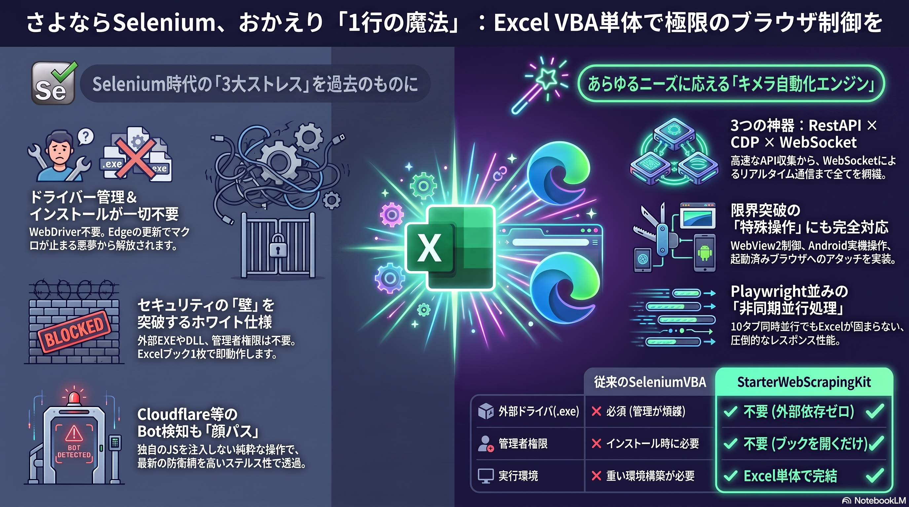

# Excel VBA Web Automation Starter Kit




## インターネットの世界を、その手に

スクレイピングに必要なすべての要素を、このマクロブック「1つ」に詰め込みました。  
面倒な環境構築はもう必要ありません。このマクロブックを開いたその瞬間から、あなたの業務効率化とインターネット自動操作への旅が始まります。

本ツールは、現代のWeb技術を攻略するために必須となる「3つの神器」を実装しています。

1. **🚀 REST WebAPI (WinHTTP 5.1)**
    * 高速・軽量なデータ収集の王道。参照設定のみで完結する堅牢な実装です。
2. **🤖 ブラウザ自動操作 (CDP via Pipe & WebDriver BiDi)**
    * Chromiumベースのブラウザ（Edge/Chrome）を自在に操ります。外部ドライバー(exe)を必要としない、パイプ通信によるモダンな実装です。
3. **⚡ WebSocket 通信**
    * リアルタイム通信への挑戦。WinAPIを駆使し、最低限の接続・送受信機能を搭載しました。VBAの限界を押し広げる、発展途上の機能です。

---

## 🔥【本ツールの強み】🔥

* **究極のポータブルブラウザ対応（Driverバージョン管理からの解放！）**
  * Selenium等で悩まされる「ブラウザとWebDriverのバージョン不一致エラー」は一切起こりません！
  * 改造ブラウザ、アンチディテクトブラウザ、USB内のポータブルChromeでも、 **「設定シートのセルにexeのパスを貼るだけ」** で、一瞬で完全な自動操作が可能です😎

* **無限の拡張性で、あなた専用のツールに！**
  * AIに「[テンプレート](https://github.com/Eschamali/StarterWebScrapingKit/tree/dev/ForDevelopers/TemplateExtensions)」と「欲しい機能」を伝えるだけで、複雑な自動化コードが秒速で完成！
  * 面倒なCDPの仕様を覚える必要はありません。アイデアさえあれば、誰でも簡単に機能拡張が可能です。
  * プロンプトの工夫次第で、丁寧な解説付きの「デモコード」まで全自動で生成できます！

* **🚀 Playwright / Puppeteer と並ぶ、VBA界の「新・標準」アーキテクチャ**
  * WebDriver という「足跡」を残さず、ブラウザの心臓部へダイレクトにアクセス。本ツールは、VBA でありながら **Playwright / Puppeteer と同等の低レイヤー・ポジション**に位置しています。
  * 最大の強みは、その「クリーンさ」にあります。検知の引き金となる独自の JS 変数やパッチを一切注入しない「純粋無垢」な操作スタイルにより、**Cloudflare 等の最新防衛網を「顔パス」で突破しやすいステルス性**を手に入れました。
  ※あくまでも、突破を保証するものではありませんが、SeleniumVBAよりは突破しやすいケースを確認済みです。

---

## 🌈 選べる2つのメインルート

当プロジェクトは、用途に合わせて2つのブランチ（実装方式）を展開しています。

### 1. Main ブランチ (Edge x Pipe x CDP)
**「ブラウザを、外から、自在に操る」** 
- 通常の Edge/Chrome をパイプ通信で制御。
- 既存のブラウザプロファイル（お気に入りやログイン状態）をそのまま流用可能。
- 安定性が高く、デバッグも容易な主流の方式です。

### 2. WebView2 ブランチ (UserForm x Native) 【開発中】
**「ブラウザを、Excelに、取り込む」**
- Excel UserForm 内に WebView2 を直接埋め込み。
- **「ど～～～～しても、Excelと一体化して動いてる感を味わいたい」** 方への究極のUI体験。
- UserForm 上のボタンからネイティブにスクレイピングを実行可能です。

---

## ⭐️ 新機能：WebDriver BiDi 完全対応！（VBA初🦊）

従来の CDP (Chrome DevTools Protocol) 操作に加え、現在 W3C で世界標準として次世代プロトコル策定が進められている **「WebDriver BiDi」** にいち早く対応しました（`WebDriverBiDiCore.cls` を実装）。

外部ツールの `chromedriver.exe` や Selenium 等の中間ウェアを一切使わず、**「VBA単体で完結する」** という当プロジェクトの理念はそのままに、以下のような高度な操作が可能になりました。

*   📥 **非同期イベントの完璧な購読**（読込完了やコンソールエラーのリアルタイム検知）
*   ⚠️ **JavaScript アラートダイアログの細密制御**（VBAをフリーズさせないフォールバックの実装）
*   🔌 **BiDi+ による CDP トンネリング**（標準機能では足りない部分を柔軟にカバー）

**📖 詳細な技術ドキュメントや使い方は、公式ドキュメント（GitHub Pages）をご覧ください。**
*   ➡️ **[公式ドキュメントトップ (使い方・技術アーキテクチャ)](https://eschamali.github.io/StarterWebScrapingKit/)**

---

### 【Credits & Acknowledgments】

このツールは、世界中のVBA職人が公開してくれた素晴らしいライブラリの数々を、実務で使いやすい形に統合（マッシュアップ）したものです。
偉大な先人たちの知恵とコードに、心からの敬意と感謝を表します。

* **WebSocket実装のコアロジック**
  * [ChromeControler-No-Selenium-WebDriver-VBAJSON](https://github.com/24000/ChromeControler-No-Selenium-WebDriver-VBAJSON)
    * 製作者：[@kabkabkab](https://qiita.com/kabkabkab/items/9952a796ee9244fc98ad)氏
* **CDP制御・パイプ通信の基盤**
  * [Chromium-Automation-with-CDP-for-VBA](https://github.com/longvh211/Chromium-Automation-with-CDP-for-VBA)
    * 製作者：longvh211氏
* **WinHTTP 5.1 ラッパー**
  * [VBA-Web](https://github.com/VBA-Tools-v2/VBA-Web)
    * オリジナル製作者：Tim Hall氏
* **CDP/WebDriverBiDiレスポンス専用の超高速JSONパーサー**
  * [vbacollective-json](https://github.com/vbacollective/json)
    * 製作者：Ueslei Paim
    * `CopyMemory`不使用版に改良
* **`VBA-JSON`の上位互換の高速JSONパーサー**
  * [VBA-FastJSON](https://github.com/cristianbuse/VBA-FastJSON)
    * 製作者：Cristian Buse
* **高速な文字コード変換ラッパー**
  * [How to convert VBA/VB6 Unicode strings to UTF-8](https://di-mgt.com.au/howto-convert-vba-unicode-to-utf8.html)
    * David Ireland DI Management Services Pty
  * [VBAで Windows APIを使った UTF-8 ←→ Unicode相互変換](https://qiita.com/yamashiroakihito/items/9b609653fef6fa8a5ab2)
    * 製作者：@yamashiroakihito
* **ログレベルの基礎部分**
  * [VBA-Log](https://github.com/VBA-tools/VBA-Log)
    * 製作者：timhall氏
* **ChromiumブラウザをBiDi化するためのコアロジック**
  * [chromium-bidi](https://github.com/GoogleChromeLabs/chromium-bidi)
    * 製作者：GoogleChromeLabsチーム
* **UserFormにWebView2を追加DLなしで埋め込んだすごい方**
  * [WebView2-For-Excel-VBA](https://github.com/tarboh/WebView2-For-Excel-VBA)
    * 製作者：[たーぼー氏](https://x.com/fenblen_puyo)

※各機能の詳細な使用方法やメソッドについては、上記オリジナルライブラリのドキュメントをご参照ください。

## 💡 はじめに：ダウンロードしたファイルを開くと表示される「保護ビュー」について


ダウンロードしたマクロブックを開くと、Excelの上部に **「保護ビュー」** という黄色いバーが表示され、「編集を有効にする」ボタンを押す必要がある場合があります。  
さらに、マクロを実行しようとすると、セキュリティの警告が表示されることがあります。  


これは、**あなたのPCが、インターネットから来た、"見知らぬ"ファイルから、あなた自身を守ろうとしている**、正常で、非常に賢い動作です。

### 解除方法

1. Excelを全て閉じてください
2. DLしたExcelファイルを右クリックして、**プロパティ**を選択  

3. **許可する** チェックボックスをオンにして **OK**ボタンをクリック  

4. 再度、ツールを開いて、「編集を有効にする」ボタンを押す

このマクロブックを、安全に、そして最大限に活用していただくために、**「なぜ、このような一手間が必要なのか」** を、少しだけ、ご説明させてください。

### なぜ、こんな「一手間」が必要になったの？【物語】

昔々、インターネットは、もっとのどかな場所でした。  
しかし、ある時から、**Excelマクロのふりをした、悪意のある「ウイルス」** が、世界中で大流行し始めました。  
人々は、メールに添付された、ただのExcelファイルを開いただけで、PCを乗っ取られてしまう、という悲劇に、何度も見舞われたのです。

そこで、Microsoftは、**大きな決断**をしました。

**「もう、インターネットから来た、すべてのファイルを、『出身不明の、怪しいヤツ』として、扱うことにしよう！」** と。

#### 「Mark of the Web (MOTW)」という"刻印"

あなたが、インターネット（Webブラウザ、メールソフトなど）からファイルをダウンロードした瞬間、Windowsは、そのファイルの **"見えない"部分** に、**「こいつは、インターネットという、無法地帯から来た、要注意人物だ」** という、**`Mark of the Web` (MOTW)** という、特別な **"刻印"** を押します。

Excelは、ファイルを開く時に、まず、この「刻印」があるかどうかをチェックします。  
そして、刻印を見つけると、こう判断するのです。

**「待て！こいつは、素性の知れないヤツだ！**  
**いきなり、自由に動き回らせるのは、危険すぎる。**  
**まずは、『保護ビュー』という名の、"隔離室"に入れよう。マクロも、絶対に動かすな！」**

### あなたが「許可する」チェックボックスを押す、ということ

  
この、厳重な警備体制を、安全に解除するための、唯一の、**正規の「身元保証」手続き**。  
それが、ファイルのプロパティを開き、**「許可する」** のチェックボックスを押す、という行為です。

これは、あなたが、Windowsに対して、
**「分かってる、分かってる。こいつが、インターネットから来たのは知っている。**
**でも、こいつの"身元"は、この私（あなた）が、責任を持って、保証する！**
**だから、もう、怪しいヤツとして扱うのはやめて、このPCの、正式な"市民"として、迎え入れてやってくれ」**
と、**宣言**しているのと同じなのです。

この「身元保証」が行われると、Windowsは、そのファイルの **`MOTW`という"刻印"を、永久に消し去ります**。  
その結果、Excelは、そのファイルを「信頼できる、安全なファイル」と認識し、「保護ビュー」を表示することなく、マクロを、正常に実行させてくれるようになるのです。

---
**このマクロブックは、安全です。**  
**どうか、あなたという"保証人"の力で、この子に、あなたのPCで活躍する「許可」を与えてあげてください。**

---

##  高度な機能と技術的詳細について (Migrated to GitHub Pages)

本プロジェクトの「独自の改良点（日本語UTF-8対応、BrowserEventsプロパティ等）」、「API仕様リファレンス」、「深い仕組みや設計思想」などの重厚なドキュメントは、すべて **美しい静的サイト（GitHub Pages）** に移設整理されました。

 **[公式ドキュメントサイト (Features / API Reference)](https://Eschamali.github.io/StarterWebScrapingKit/)** をぜひご覧いただき、VBAの限界を超えたブラウザ制御の深淵に触れてみてください！

## ワークシート：ブラウザ起動設定について


基本的な説明は、ワークシート上に書いてあります。ここでは起動引数について説明します。

### 初期に記載してる追加の起動引数の意味

自動操作中で厄介な存在を排除するため、いくつか初期引数を設けつつ、W3C準拠の引数も付与します。

| 引数名                        | 意味                                                                                                                                                                                             | 
| ----------------------------- | ------------------------------------------------------------------------------------------------------------------------------------------------------------------------------------------------ | 
| no-first-run                  | Chromiumベースのブラウザを初回起動時のセットアップ画面なしで立ち上げる。<br>初めて起動したときに表示される「ようこそ」画面や、Google,Microsoftアカウントのログインを促す画面などをスキップする。 | 
| disable-fre                   | `no-first-run`と同じ。バージョンや環境によっては、`no-first-run`だけでは完全に抑制できないことがあるので、併用する                                                                               | 
| disable-popup-blocking        | ポップアップのブロックを無効にします                                                                                                                                                             | 
| disable-sync                  | アカウントへの自動ログインや同期を無効化します                                                                                                                                                     | 
| disable-background-networking | バックグラウンドでネットワークリクエストを実行するいくつかのサブシステムを無効にします。<br>目的の通信以外の通信をなるべく排除します                                                             | 
| disable-default-apps          | 初回起動時にデフォルトアプリのインストールを無効にします                                                                                                                                         | 
| no-service-autorun            | 余計なバックグラウンドサービス起動を抑制します                                                                                                                                                   | 
| enable-automation             | ブラウザが自動化によって制御されていることを示す表示を有効にします。<br>これにより、通常のブラウザとの混合を防ぐ目印になります。                                                                 | 
| test-type=ExcelVBA            | テストハーネスの種類を指定します。言ってしまえば、飾りです                                                                                                                                       | 

### Bot検知回避モードについて

起動引数に、`disable-blink-features=AutomationControlled`を付与します。これにより、`navigator.webdriver`が`false`にオーバーライドされ、Bot検知回避が可能です。  
一部のサイトはこのフラグをチェックして、アクセスできないように仕組んでいるので、必要に応じてONにしてください。

ただしこの引数、公式ではサポートされていないようなので、いつか効かなくなる可能性があることを念頭に置いて下さい。  
一応、執筆段階では注意メッセージはでますが、まだ効いています。  


### VBA内部での起動引数について

ブラウザを自動操作するための最低限の必須引数を記述してます。クラスモジュール`CDPBrowser`の350行目周辺にその引数が見受けられると思います。

| 引数名                | 意味                                                                                                                                                                                                                                                                                                                                                                                                                                                 | 
| --------------------- | ---------------------------------------------------------------------------------------------------------------------------------------------------------------------------------------------------------------------------------------------------------------------------------------------------------------------------------------------------------------------------------------------------------------------------------------------------- | 
| remote-debugging-pipe | ブラウザの"本体プロセス"とは、"別のプロセス(Excel)"から、デバッグするように仕向けます。<br>通信方式は、パイプ通信です。「リモート」とありますが、同じPC内からしかアクセスできない仕様となっています。                                                                                                                                                                                                                                                | 
| user-data-dir         | ブラウザのデータディレクトリ(Cookieや拡張機能、パスワード倉庫など)のフルパスを指定します。<br>通常は`C:\Users\%USERNAME%\AppData\Local\Microsoft\Edge\User Data`ですが、[デバッグ機能を悪用したCookie盗難対策](https://developer.chrome.com/blog/remote-debugging-port?hl=ja)により必ず、`User Data`以外のフォルダパスを指定するように義務付けられました。<br>このツールはデフォルトで、`Automation Data`として`User Data`と同じ階層のパスに作られます。 | 
| homepage              | ブラウザ起動時の最初のURLを指定しますが余計な通信を抑えるため、`about:blank`で空白ページにしてます。<br>ただし、次項の`app`に任意のURLが渡されるとこれは、付与しなくなります。                                                                                                                                                                                                                                                                       | 
| app                   | `start`メソッドの第2引数にあたります。ブラウザ起動時の最初のURLを指定したい場合は、ここを指定することになります。<br>ここにURLを渡して起動すると<br>・任意のURLへの変更不可<br>・タブ生成不可<br><br>といったユーザー側による自動化を妨げる行為をある程度防ぐことが可能です。ちょっとしたキオスクモードです。                                                                                                                                        | 
| KioskMode             | `start`メソッドの第6引数にあたります。UserForm にEdgeを埋め込む際にご利用ください。`fullscreen`推奨。詳細は[こちら](https://learn.microsoft.com/ja-jp/deployedge/microsoft-edge-configure-kiosk-mode)                                                                                                                                                                                                                                                | 

## 🚀 No more WebDriver.exe

**「IEの頃のあのお手軽な呼び出し呪文を、今、ふたたび。」**

かつて、私たちはたった3行のコードで世界を操っていました。

```bas
Set ie = CreateObject("InternetExplorer.Application")
ie.Visible = True
ie.Navigate "URL"
```

IEが消え、Driverのバージョン管理や環境構築の重圧に押し潰されそうになっている全てのVBAerへ。  
このツールは、 **「Excelファイル1枚」** というロマンを捨てず、CDP直叩きによってあの頃の全能感を現代に蘇らせます。

基本的な起動のテンプレートは下記になります。  
ワークシート：ブラウザ起動設定　で設定した内容でブラウザが起動してくれるので、特にこだわりがなければこのテンプレートコードを推奨します。  
その場合、たったの1行で、自動化の旅が始まります。

### CDP制御の場合

```bas
Public Function 設定シートからのCDP起動(Optional StartURL As String, Optional SwitchUser As String, Optional KioskMode As edgeKioskType) As CDPBrowser
    '設定シートの各セルから設定値を取得し、適用
    With ShSetting01_StartBrowser
        '起動ブラウザ種類の設定
        '※CDP－Json コマンドによる操作なので、Chromium系統であれば、Edge,Chrome 以外にもできるかと思いますが一旦はメジャーなやつのみで
        Dim ブラウザ名 As String: ブラウザ名 = IIf(.Range(.UseRangeName(4, "Demo_CDP.設定シートからのCDP起動")).value, "chrome", "edge")

        '第2引数が省略ならシート側の設定を適用
        Dim UseDataDir As String: UseDataDir = IIf(StrPtr(SwitchUser) = 0, .Range(.UseRangeName(2, "Demo_CDP.設定シートからのCDP起動")).value, SwitchUser)

        'ブラウザ起動
        Set 設定シートからのCDP起動 = New CDPBrowser
        設定シートからのCDP起動.start ブラウザ名, StartURL, .Range(.UseRangeName(6, "Demo_CDP.設定シートからのCDP起動")).value, UseDataDir, .Range(.UseRangeName(3, "Demo_CDP.設定シートからのCDP起動")).value, KioskMode
    End With
End Function

Sub CDPによる冒険の始まり()
    '設定シートに基づくブラウザ立ち上げ
    Dim HelloWorldAutomationBrowser As CDPBrowser: Set HelloWorldAutomationBrowser = 設定シートからのCDP起動

    '↓ここから、あなたのイメージをコードに落とし込む↓


    'ブラウザを正常に閉じる
    HelloWorldAutomationBrowser.quit
End Sub
```

### BiDi制御の場合

```bas
Public Function 設定シートからのBiDi起動(Optional StartURL As String, Optional SwitchUser As String, Optional KioskMode As edgeKioskType, Optional sessionCapabilitiesRequest As Dictionary) As WebDriverBiDiCore
    '設定シートの各セルから設定値を取得し、適用
    With ShSetting01_StartBrowser
        '起動ブラウザ種類の設定
        '※BiDi-Json コマンドによる操作ですが、Chromium系統に特化した制御のため、Edge,Chrome 以外にもできるかと思いますが一旦はメジャーなやつのみで
        Dim ブラウザ名 As String: ブラウザ名 = IIf(.Range(.UseRangeName(4, "Demo_WebDriverBiDi.設定シートからのBiDi起動")).value, "chrome", "edge")

        '第2引数が省略ならシート側の設定を適用
        Dim UseDataDir As String: UseDataDir = IIf(StrPtr(SwitchUser) = 0, .Range(.UseRangeName(2, "Demo_WebDriverBiDi.設定シートからのBiDi起動")).value, SwitchUser)

        'ブラウザ起動
        Set 設定シートからのBiDi起動 = New WebDriverBiDiCore
        設定シートからのBiDi起動.start ブラウザ名, StartURL, .Range(.UseRangeName(6, "Demo_WebDriverBiDi.設定シートからのBiDi起動")).value, UseDataDir, .Range(.UseRangeName(3, "Demo_WebDriverBiDi.設定シートからのBiDi起動")).value, KioskMode, sessionCapabilitiesRequest
    End With
End Function

Sub BiDiによる冒険の始まり()
    '設定シートに基づくブラウザ立ち上げ
    Dim HelloWorldAutomationBrowser As WebDriverBiDiCore: Set HelloWorldAutomationBrowser = 設定シートからのBiDi起動

    '↓ここから、あなたのイメージをコードに落とし込む↓


    'ブラウザを正常に閉じる
    HelloWorldAutomationBrowser.quit
End Sub
```

## 🔌 新機能：WebSocket（Port）接続でのブラウザ操作デモ

V2.3.0より、すでに起動しているEdgeやChromeなどの既存ブラウザセッションにExcelからアタッチ（制御を乗っ取る）できる「WebSocket（Port）ルート」が正式に解禁されました。

標準モジュール `Demo_CDP` の中に、この機能を試すためのシンプルなデモコード **`SetupWebSocketMode`** が同梱されています。

---

> [!CAUTION]
> このポート接続デモを動かすためには、あらかじめ対象のブラウザを**リモートデバッグポートを有効にした状態で起動しておく**必要があります。  
> コマンドプロンプトやショートカットのプロパティ等から、以下の引数を付けてEdgeまたはChromeをあらかじめ起動しておいてください。

```bash
# デフォルトポート 9222 を開いてブラウザを起動する
msedge.exe --remote-debugging-port=9222
```

---

### 💻 デモコード：`SetupWebSocketMode`

このマクロを実行すると、ポートフォワード経由で既存のブラウザを乗っ取り、指定のタブ（または新規タブ）から目的のページへ遷移します。

```vb
Sub SetupWebSocketMode()
    ' 1. 設定シート（ShSetting01_StartBrowser）から、ユーザー名を取得
    Dim UserName As String
    UserName = ShSetting01_StartBrowser.UseRangeID(2, "Demo_CDP.SetupWebSocketMode")

    ' 2. 指定のデバッグポートを開いているブラウザ（WebSocket）へ接続
    ' ※ 引数: ConnectCDP(ユーザー名, エンドポイント名, [ポート番号: デフォルトは9222])
    Dim WebSocketCDP As New CDPCoreViaWebSocket
    WebSocketCDP.ConnectCDP UserName, "/devtools/browser"

    ' 3. 接続したWebSocketオブジェクトを、ブラウザメインクラスの `reattach` メソッドにバトンタッチ
    Dim b As New CDPBrowser
    If Not b.reattach(UserName, WebSocketCDP) Then 
        MsgBox "「" & UserName & "」に接続できませんでした。ブラウザ側が起動していないか、WebSocket情報が消失しています。", vbCritical, "Chrome DevTools Protocol"
        Exit Sub
    End If

    ' 4. アタッチしたブラウザ上で、タブを制御する
    Dim t As CDPContext
    ' ※ 既存のタブを取得して操作する場合は、必ず `setMain:=True` を指定してください
    ' Set t = b.getTab(setMain:=True)
    
    ' 新しいタブを生成して操作を開始する場合はこちら（どちらでもOKです）
    Set t = b.newTab(setMain:=True) 

    ' 5. 目的のページへ、お馴染みのインターフェースで同期・遷移！
    'ちなみにこのURLは、開発者の推しのYouTubeチャンネルに飛びます🤠
    t.navigate "https://www.youtube.com/@islandfox6864"

    ' 6. 処理が完了したら、安全にWebSocketから切断
    WebSocketCDP.DisconnectCDP
End Sub
```

### 💡 応用と設定のカスタマイズ

* **ポート番号を変更したい場合**：
  `WebSocketCDP.ConnectCDP` の第3引数に、任意のポート番号（例：`9222` 以外に指定したポート）を渡すことで、特定のポートで待機しているブラウザや、Android等の実機内のブラウザにも柔軟に接続できます。
* **このコードを基にして**：
  面倒なログイン認証はユーザーがブラウザ上で手動で終わらせておき、 **「Excelのボタンを押した瞬間から、ログイン済みの画面をVBAが引き継いで複雑なスクレイピングを爆速で開始する」** といった、実務上最高に便利で壊れにくいハイブリッド自動化システムを簡単に組み立てることができます。
