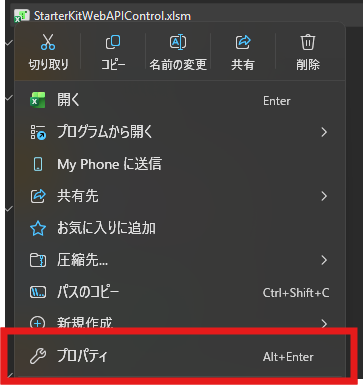
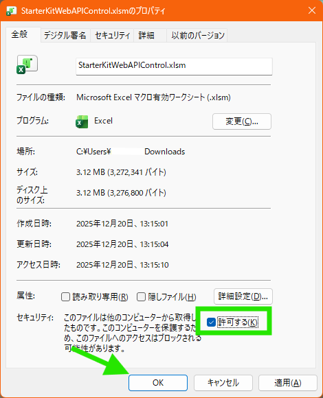
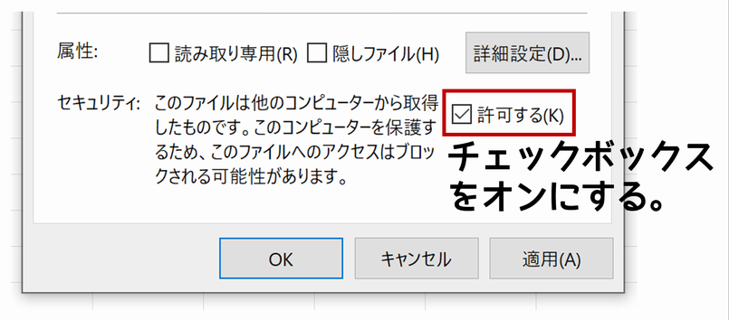
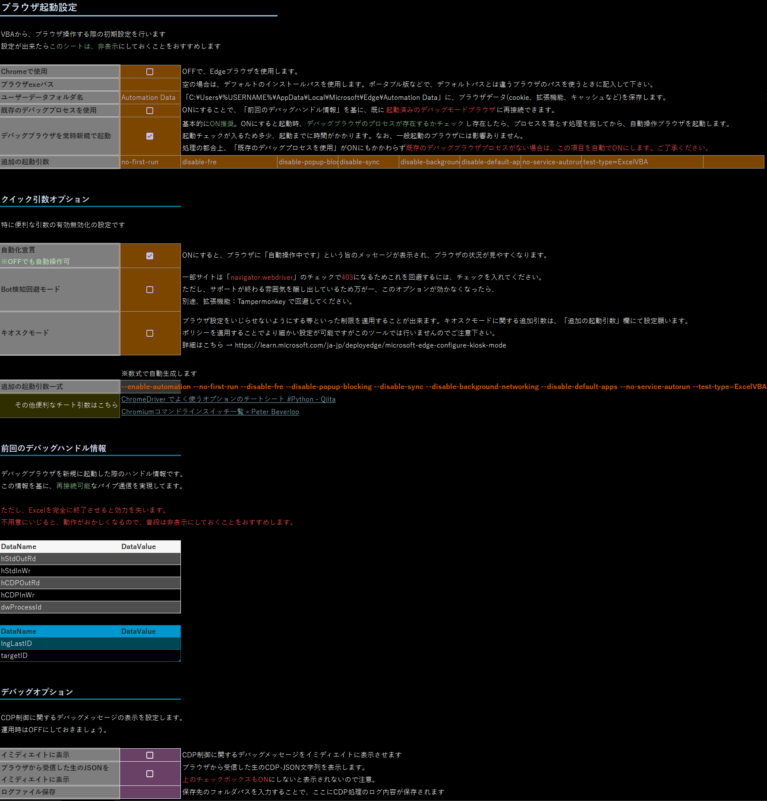
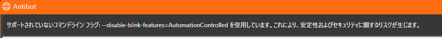

# Excel VBA Web Automation Starter Kit


## インターネットの世界を、その手に

スクレイピングに必要なすべての要素を、このマクロブック「1つ」に詰め込みました。  
面倒な環境構築はもう必要ありません。このファイルを開いたその瞬間から、あなたの業務効率化とインターネット自動操作への旅が始まります。

本ツールは、現代のWeb技術を攻略するために必須となる「3つの神器」を実装しています。

1. **🚀 REST WebAPI (WinHTTP 5.1)**
    * 高速・軽量なデータ収集の王道。参照設定のみで完結する堅牢な実装です。
2. **🤖 ブラウザ自動操作 (CDP via Pipe)**
    * Chromiumベースのブラウザ（Edge/Chrome）を自在に操ります。外部ドライバー(exe)を必要としない、パイプ通信によるモダンな実装です。
3. **⚡ WebSocket 通信 (Beta)**
    * リアルタイム通信への挑戦。WinAPIを駆使し、最低限の接続・送受信機能を搭載しました。VBAの限界を押し広げる、発展途上の機能です。

### 【Credits & Acknowledgments】

このツールは、世界中のVBA職人が公開してくれた素晴らしいライブラリの数々を、実務で使いやすい形に統合（マッシュアップ）したものです。
偉大な先人たちの知恵とコードに、心からの敬意と感謝を表します。

* **WebSocket実装のコアロジック**
  * [ChromeControler-No-Selenium-WebDriver-VBAJSON](https://github.com/24000/ChromeControler-No-Selenium-WebDriver-VBAJSON)
* **CDP制御・パイプ通信の基盤**
  * [Chromium-Automation-with-CDP-for-VBA](https://github.com/GCuser99/Chromium-Automation-with-CDP-for-VBA)
* **WinHTTP 5.1 ラッパー**
  * [VBA-Web](https://github.com/VBA-Tools-v2/VBA-Web)
* **高速・高機能なJSONパーサー**
  * [WebJsonConverter.cls (from SeleniumVBA)](https://github.com/GCuser99/SeleniumVBA/blob/main/src/VBA/WebJsonConverter.cls)
  * ※メンテナンス性を考慮し、既存のJsonConverterからこちらへ換装済み

※各機能の詳細な使用方法やメソッドについては、上記オリジナルライブラリのドキュメントをご参照ください。

## 💡 はじめに：ダウンロードしたファイルを開くと表示される「保護ビュー」について


ダウンロードしたマクロブックを開くと、Excelの上部に**「保護ビュー」**という黄色いバーが表示され、「編集を有効にする」ボタンを押す必要がある場合があります。  
さらに、マクロを実行しようとすると、セキュリティの警告が表示されることがあります。  


これは、**あなたのPCが、インターネットから来た、"見知らぬ"ファイルから、あなた自身を守ろうとしている**、正常で、非常に賢い動作です。

### 解除方法

1. Excelを全て閉じてください
2. DLしたExcelファイルを右クリックして、**プロパティ**を選択  

3. **許可する** チェックボックスをオンにして **OK**ボタンをクリック  

4. 再度、ツールを開いて、「編集を有効にする」ボタンを押す

このマクロブックを、安全に、そして最大限に活用していただくために、**「なぜ、このような一手間が必要なのか」** を、少しだけ、ご説明させてください。

### なぜ、こんな「一手間」が必要になったの？【物語】

昔々、インターネットは、もっとのどかな場所でした。  
しかし、ある時から、**Excelマクロのふりをした、悪意のある「ウイルス」** が、世界中で大流行し始めました。  
人々は、メールに添付された、ただのExcelファイルを開いただけで、PCを乗っ取られてしまう、という悲劇に、何度も見舞われたのです。

そこで、Microsoftは、**大きな決断**をしました。

**「もう、インターネットから来た、すべてのファイルを、『出身不明の、怪しいヤツ』として、扱うことにしよう！」** と。

#### 「Mark of the Web (MOTW)」という"刻印"

あなたが、インターネット（Webブラウザ、メールソフトなど）からファイルをダウンロードした瞬間、Windowsは、そのファイルの **"見えない"部分** に、**「こいつは、インターネットという、無法地帯から来た、要注意人物だ」** という、**`Mark of the Web` (MOTW)** という、特別な **"刻印"** を押します。

Excelは、ファイルを開く時に、まず、この「刻印」があるかどうかをチェックします。  
そして、刻印を見つけると、こう判断するのです。

**「待て！こいつは、素性の知れないヤツだ！**  
**いきなり、自由に動き回らせるのは、危険すぎる。**  
**まずは、『保護ビュー』という名の、"隔離室"に入れよう。マクロも、絶対に動かすな！」**

### あなたが「許可する」チェックボックスを押す、ということ

  
この、厳重な警備体制を、安全に解除するための、唯一の、**正規の「身元保証」手続き**。  
それが、ファイルのプロパティを開き、**「許可する」** のチェックボックスを押す、という行為です。

これは、あなたが、Windowsに対して、
**「分かってる、分かってる。こいつが、インターネットから来たのは知っている。**
**でも、こいつの"身元"は、この私（あなた）が、責任を持って、保証する！**
**だから、もう、怪しいヤツとして扱うのはやめて、このPCの、正式な"市民"として、迎え入れてやってくれ」**
と、**宣言**しているのと同じなのです。

この「身元保証」が行われると、Windowsは、そのファイルの **`MOTW`という"刻印"を、永久に消し去ります**。  
その結果、Excelは、そのファイルを「信頼できる、安全なファイル」と認識し、「保護ビュー」を表示することなく、マクロを、正常に実行させてくれるようになるのです。

---
**このマクロブックは、安全です。**  
**どうか、あなたという"保証人"の力で、この子に、あなたのPCで活躍する「許可」を与えてあげてください。**

---

## シート：ブラウザ起動設定について



基本的な説明は、ワークシート上に書いてあります。ここでは起動引数について説明します。

### 初期に記載してる追加の起動引数の意味

自動操作中で厄介な存在を排除するため、いくつか初期引数を設けつつ、W3C準拠の引数も付与します。

| 引数名                        | 意味                                                                                                                                                                                             | 
| ----------------------------- | ------------------------------------------------------------------------------------------------------------------------------------------------------------------------------------------------ | 
| no-first-run                  | Chromiumベースのブラウザを初回起動時のセットアップ画面なしで立ち上げる。<br>初めて起動したときに表示される「ようこそ」画面や、Google,Microsoftアカウントのログインを促す画面などをスキップする。 | 
| disable-fre                   | `no-first-run`と同じ。バージョンや環境によっては、`no-first-run`だけでは完全に抑制できないことがあるので、併用する                                                                               | 
| disable-popup-blocking        | ポップアップのブロックを無効にします                                                                                                                                                             | 
| disable-sync                  | アカウントへの自動ログインや同期を抑制します                                                                                                                                                     | 
| disable-background-networking | バックグラウンドでネットワークリクエストを実行するいくつかのサブシステムを無効にします。<br>目的の通信以外の通信をなるべく排除します                                                             | 
| disable-default-apps          | 初回起動時にデフォルトアプリのインストールを無効にします                                                                                                                                         | 
| no-service-autorun            | 余計なバックグラウンドサービス起動を抑制します                                                                                                                                                   | 
| enable-automation             | ブラウザが自動化によって制御されていることを示す表示を有効にします。<br>これにより、通常のブラウザとの混合を防ぐ目印になります。                                                                 | 
| test-type=ExcelVBA            | テストハーネスの種類を指定します。言ってしまえば、飾りです                                                                                                                                       | 

### Bot検知回避モードについて

起動引数に、`disable-blink-features=AutomationControlled`を付与します。これにより、`navigator.webdriver`が`false`にオーバーライドされ、Bot検知回避が可能です。  
一部のサイトはこのフラグをチェックして、アクセスできないように仕組んでいるので、必要に応じてONにしてください。

ただしこの引数、公式ではサポートされていないようなので、いつか効かなくなる可能性があることを念頭に置いて下さい。  
一応、執筆段階では注意メッセージはでますが、まだ効いています。  


### VBA内部での起動引数について

ブラウザを自動操作するための最低限の必須引数を記述してます。クラスモジュール`CDPBrowser`の154行目周辺にその引数が見受けられると思います。

| 引数名                | 意味                                                                                                                                                                                                                                                                                                                                                                                                                                                 | 
| --------------------- | ---------------------------------------------------------------------------------------------------------------------------------------------------------------------------------------------------------------------------------------------------------------------------------------------------------------------------------------------------------------------------------------------------------------------------------------------------- | 
| remote-debugging-pipe | ブラウザの"本体プロセス"とは、"別のプロセス(Excel)"から、デバッグするように仕向けます。<br>通信方式は、パイプ通信です。「リモート」とありますが、同じPC内からしかアクセスできない仕様となっています。                                                                                                                                                                                                                                                | 
| user-data-dir         | ブラウザのデータディレクトリ(Cookieや拡張機能、パスワード倉庫など)のフルパスを指定します。<br>通常は`C:\Users\%USERNAME%\AppData\Local\Microsoft\Edge\User Data`ですが、[デバッグ機能を悪用したCookie盗難対策](https://developer.chrome.com/blog/remote-debugging-port?hl=ja)により必ず、`User Data`以外のフォルダパスを指定するように義務付けられました。<br>このツールはデフォルトで、`Automation Data`として`User Data`と同じ階層のパスに作られます。 | 
| homepage              | ブラウザ起動時の最初のURLを指定しますが余計な通信を抑えるため、`about:blank`で空白ページにしてます。<br>ただし、次項の`app`に任意のURLが渡されるとこれは、付与しなくなります。                                                                                                                                                                                                                                                                       | 
| app                   | `start`メソッドの第2引数にあたります。ブラウザ起動時の最初のURLを指定したい場合は、ここを指定することになります。<br>ここにURLを渡して起動すると<br>・任意のURLへの変更不可<br>・タブ生成不可<br><br>といったユーザー側による自動化を妨げる行為をある程度防ぐことが可能です。ちょっとしたキオスクモードです。                                                                                                                                                                                                                                                     | 

### [キオスクモードについて](https://learn.microsoft.com/ja-jp/deployedge/microsoft-edge-configure-kiosk-mode)

ワークシートにある`クイック引数オプション`欄にてONにすると使うことが出来ます。  
先述の`app`よりもネイティブなキオスクモードでの起動ができます。  
デフォルトでは、フルスクリーン起動になるため、追加の起動引数欄で、`edge-kiosk-type=public-browsing`を加えることをおすすめします。

## ブラウザ起動方法について

基本的な起動のテンプレートは下記になります。  
ワークシート：ブラウザ起動設定　で設定した内容でブラウザが起動してくれるので、特にこだわりがなければこのテンプレートコードを推奨します。  

```bas
Function 設定シートからの起動(Optional StartURL As String) As CDPBrowser
    '設定シートの各セルから設定値を取得し、適用
    With ShSetting01_StartBrowser
        '起動ブラウザ種類の設定
        '※CDP－Json コマンドによる操作なので、Chromium系統であれば、Edge,Chrome 以外にもできるかと思いますが一旦はメジャーなやつのみで
        Dim ブラウザ名 As String
        If .Range(.UseRangeName(4, "Demo_CDP.設定シートからの起動")).value Then ブラウザ名 = "chrome" Else ブラウザ名 = "edge"

        'ブラウザ起動
        Dim objBrowser As CDPBrowser: Set objBrowser = New CDPBrowser
        objBrowser.start ブラウザ名, StartURL, .Range(.UseRangeName(6, "Demo_CDP.設定シートからの起動")).value, .Range(.UseRangeName(5, "Demo_CDP.設定シートからの起動")).value, .Range(.UseRangeName(2, "Demo_CDP.設定シートからの起動")).value, .Range(.UseRangeName(3, "Demo_CDP.設定シートからの起動")).value
    End With

    'オブジェクトを返却
    Set 設定シートからの起動 = objBrowser
End Function


Sub 冒険の始まり()
    '設定シートに基づくブラウザ立ち上げ
    Dim HelloAutomationBrowser As CDPBrowser: Set HelloAutomationBrowser = 設定シートからの起動

    '↓ここから、あなたのイメージをコードに落とし込む↓


    'ブラウザを正常に閉じる
    HelloAutomationBrowser.quit
End Sub
```

### デモ紹介：`invokeMethod`の参照渡しを利用した、非同期イベントのキャプチャ

Demo_CDP.bas内のネットワークイベントの確認プロシージャは、CDP (Chrome DevTools Protocol) の非同期イベントを、VBAで効果的にハンドリングするための、実践的なデモです。

```bas
Sub ネットワークイベントの確認()
    '設定シートに基づくブラウザ立ち上げ
    Dim Demo_NetworkEvent As CDPBrowser: Set Demo_NetworkEvent = 設定シートからの起動
    
    'ネットワークイベント受信を有効化する
    Dim ResultCDP As Dictionary: Set ResultCDP = Demo_NetworkEvent.invokeMethod("Network.enable")
    
    'URL遷移して、Msgboxで待機
    '`iscomplete`だと内部で、イベント情報の破棄が行われるため、破棄されない`isLoading`にしておく
    Demo_NetworkEvent.navigate "http://officetanaka.net/excel/vba/file/file11.htm", isLoading
    MsgBox "ブラウザのURL遷移がある程度終わったら、OKを押してください", vbInformation, "イベント待機"   '愚直にmsgboxで待機

    '無意味なコマンドをあえて送り、先ほどのURL遷移から下記のinvokeMethodメソッド実行までに来たイベント情報を取得させる
    Dim Events As Dictionary, JsonDicObj As CDPJConv
    
    Set Events = New Dictionary
    Set ResultCDP = Demo_NetworkEvent.invokeMethod("hoge", , Events)    '存在しないコマンドなので、ブラウザに影響なし

    'イベント情報をDownloadsフォルダに保存
    '※参照渡しにより、Events にイベント情報が蓄積される
    Set JsonDicObj = New CDPJConv
    SaveUTF8 JsonDicObj.ConvertToJson(Events), Environ("UserProfile") & "\Downloads", "Event.json"

    'ブラウザを閉じる
    Demo_NetworkEvent.quit
End Sub
```

1. **`Network.enable`:**
    まず、ネットワーク関連のイベント購読を開始します。
2. **`navigate`:**
    対象のURLへ遷移させ、多数のネットワークイベントを意図的に発生させます。
3. **`invokeMethod`（空コマンド）：**
    `navigate`の完了を待たずに、あえて存在しないコマンド（例: `"hoge"`）を送信します。このメソッドが完了した時点で、`navigate`開始から、この`invokeMethod`の応答が返るまでの間に発生した、すべてのCDPメッセージ（非同期イベント）が、参照渡しした`Events`ディクショナリに格納されます。
4. **結果の保存：**
    蓄積された`Events`ディクショナリを、JSON形式でファイルに保存し、どのようなイベントがキャプチャできたかを確認できるようにしています。

**応用可能性：**
この基本的なテクニックを応用することで、VBAから、より高度なブラウザオートメーションを実装できます。

* **動的な待機処理：**
    特定の通信リクエスト（`Network.requestWillBeSent`）や、レスポンス（`Network.responseReceived`）が、イベントとして現れるまで、ループで待機する。
* **隠されたデータの抽出：**
    `localStorage`やCookieには保存されない、APIレスポンスのボディにのみ含まれる、一時的なトークンなどを、`Network.loadingFinished`イベントなどから抽出する。
* **DOMイベントの監視：**
    ネットワークだけでなく、`DOM.childNodeInserted`のようなDOMイベントを監視すれば、「JavaScriptによって、特定の要素が出現した」という、より高度な描画完了のトリガーを、待つことも可能です。

## そもそも `invokeMethod` メソッドとは？

Chrome DevTools Protocol (CDP) のコマンドを直接指定して実行するための**低レベル操作用メソッド**です。

このライブラリには、`navigate`や`getElementByXPath`といった、日常的な操作のための、シンプルで強力なメソッドが、いくつか用意されています。
しかし、もし、あなたが、 **ライブラリが提供する"定食メニュー"** に満足できず、**ブラウザの、より深く、より根源的な力を、意のままに操りたい**と願うなら。

―――その時、あなたの手には、 **`invokeMethod`** という名の、 **"万能の魔法詠唱スティック"** が、握られています。

* **ライブラリの基本セット**が、使いやすく調整された **「市販の魔法」** だとすれば、
* **`invokeMethod`** は、あなたが、**自分だけの「オリジナルの魔法」を、ゼロから創造**するための、究極のツールなのです。

### 1. invokeMethod の引数と返り値

| 項目名 | 型 | 概要 |
| :--- | :--- | :--- |
| **引数: methodName** | String | 実行したい**CDPメソッド名**を指定します（例: `"Network.getCookies"`、`"Browser.getVersion"` など）。 |
| **引数: params** | Scripting.Dictionary (Optional) | メソッドに渡す**オプションパラメータ**です。呼び出し側でJson-Dictionaryとして組み立てておく必要があります。 |
| **引数: EventMessages** | Dictionary (Optional) | ブラウザからの**イベント情報**を取得したい場合に指定します。参照渡しにより、実行までに届いた過去のイベントが蓄積されます。省略すると過去のイベントは破棄されます。 |
| **引数: dbgMsg** | Boolean (Optional) | 実行結果を**イミディエイトウィンドウに出力するか**どうかを指定します。デフォルトは `False` です。 |
| **返り値** | Scripting.Dictionary | 実行結果のJSON応答に含まれる **`result` セクション**をDictionary形式で返します。 |

#### 補足事項

* **エラー処理**: 実行に失敗した場合は内部関数 `invokeError` によってエラー内容が解析され、イミディエイトウィンドウにメッセージが表示されます。
* **イベントの取得**: 第三引数に `New Dictionary` した変数を渡すことで、特定の操作に伴って発生したネットワークイベントなどの詳細を確認することが可能です。
* **内部動作**: 引数 `params` で渡されたDictionaryは、内部で `CDPJConv` を通じてJSON文字列に変換され、ブラウザへ送信されます。

---

### 2. 何ができるのか？ ― "ほぼ、すべて"

CDPが提供する、**数百にも及ぶ、ありとあらゆるコマンド**を、あなたは、この`invokeMethod`を通じて、直接、ブラウザの脳内に、送り込むことができます。

*   **直接的なメソッド指定：**
    `"Network.getCookies"`や`"Browser.getVersion"`といった、**CDPの公式ドキュメントに書かれている呪文**を、文字列で、そのまま唱えることができます。

*   **柔軟なパラメータ送信：**
    `Scripting.Dictionary`で組み立てた、複雑な**魔法陣（パラメータ）**を、引数`params`に渡すだけ。
    ライブラリが、それを、完璧な**JSON**形式のテレパシーに変換し、ブラウザに送信します。

---

### 3. `invokeMethod` の"真髄" ― 非同期イベントのキャプチャ

`invokeMethod`の、真に革命的な力は、ただコマンドを送るだけではありません。
オプションの`EventMessages`引数に、**参照渡しで`Dictionary`を渡す**ことで、ブラウザの **"心の声（非同期イベント）"を、盗聴する** ことができるのです。

あなたが過去にコマンドを送り、その返事を待っている、わずかな時間の"裏側"で。
ブラウザは、
「ネットワークの読み込みが始まった！」
「JavaScriptで、新しい要素が追加されたぞ！」
「ページの描画が、完了した！」
といった、無数の**内部イベント**を、絶え間なく叫んでいます。

`invokeMethod`は、それらの **貴重な"つぶやき"** を、一つ残らずキャプチャし、あなたの`Dictionary`に、蓄積してくれるのです。
これにより、VBAという、シングルスレッドの世界にいながら、 **WebDriver BiDiが目指す、"双方向通信"** の夢を、現実にすることができます。

---

### 4. 活用例：このライブラリ自身が、"証明"である

このライブラリの**内部動作の、ほとんどすべて**が、この`invokeMethod`を、内部で、駆使することによって、実現されています。

* **物理的なキー入力の模倣：**
    `"DOM.focus"`で要素に魂を集中させ、`"Input.insertText"`で、神のタイプを叩き込む。
* **ウィンドウの自在な操作：**
    `"Browser.getWindowForTarget"`でウィンドウの魂を掴み、`"Browser.setWindowBounds"`で、ウィンドウサイズと位置を、決定する。
* **ネットワークの完全な支配：**
    前述のDemoコードの通り、`"Network.enable"`で監視の網を張り、ブラウザ内を流れる、すべての通信を、その手中に収める。

`invokeMethod`は、単なる一つのメソッドではありません。
それは、 **あなたが、このライブラリの"利用者"から、"拡張者"、そして、"創造主"へと、進化するための、開かれた"扉"** なのです。

さあ、[CDPの公式ドキュメント](https://chromedevtools.github.io/devtools-protocol/)という名の、広大な「魔導書」を片手に。
あなただけの、最高の魔法を、創造してみてください。
