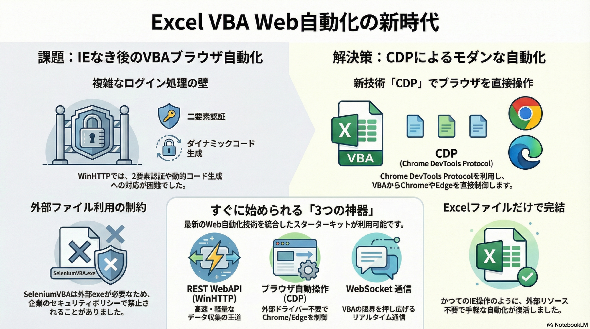
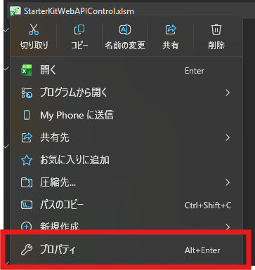
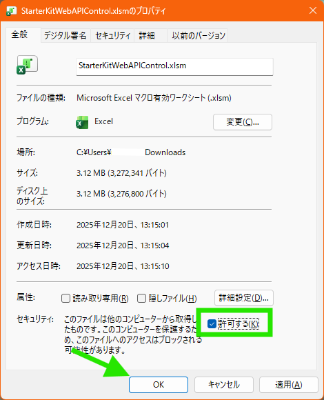
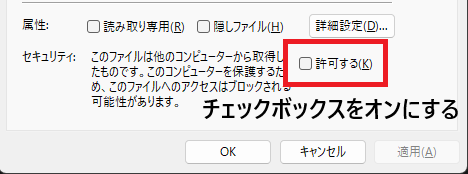
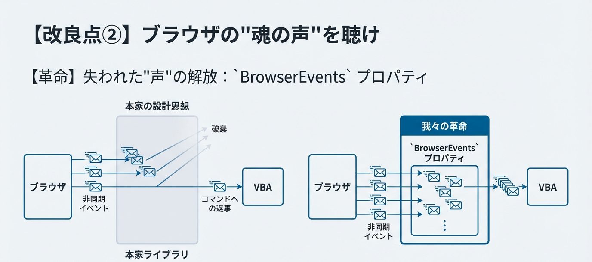
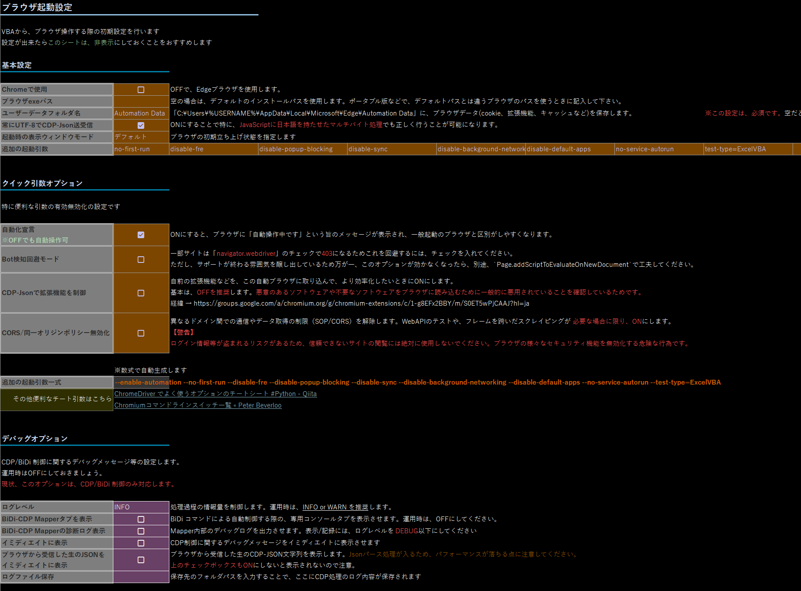
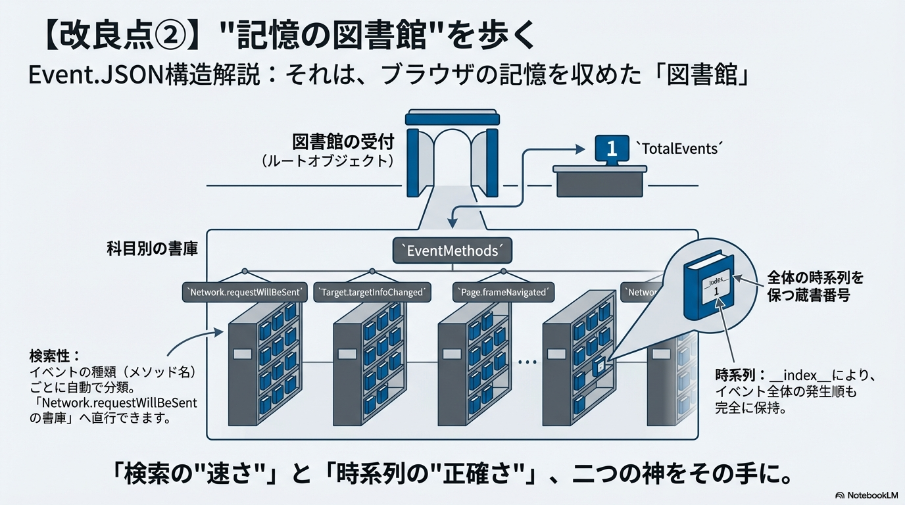
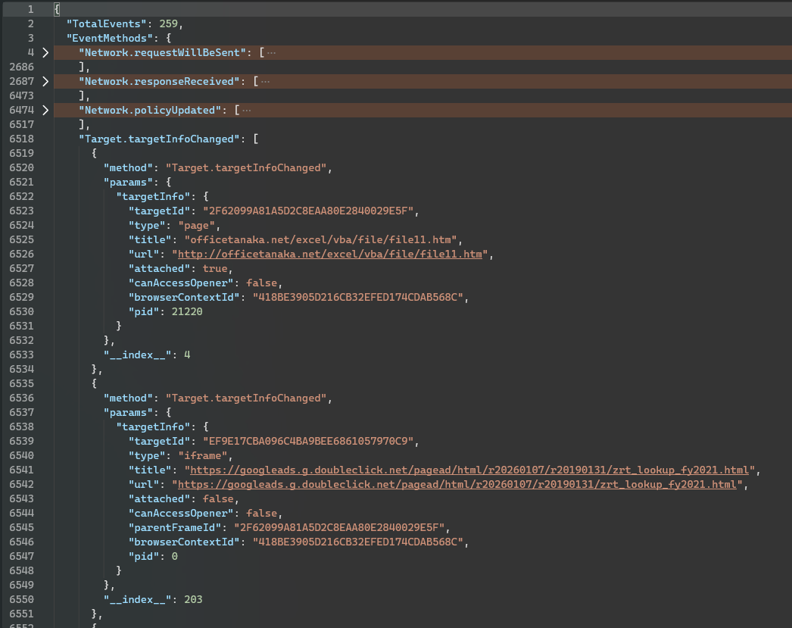

# Excel VBA Web Automation Starter Kit



## インターネットの世界を、その手に

スクレイピングに必要なすべての要素を、このマクロブック「1つ」に詰め込みました。  
面倒な環境構築はもう必要ありません。このマクロブックを開いたその瞬間から、あなたの業務効率化とインターネット自動操作への旅が始まります。

本ツールは、現代のWeb技術を攻略するために必須となる「3つの神器」を実装しています。

1. **🚀 REST WebAPI (WinHTTP 5.1)**
    * 高速・軽量なデータ収集の王道。参照設定のみで完結する堅牢な実装です。
2. **🤖 ブラウザ自動操作 (CDP via Pipe)**
    * Chromiumベースのブラウザ（Edge/Chrome）を自在に操ります。外部ドライバー(exe)を必要としない、パイプ通信によるモダンな実装です。
3. **⚡ WebSocket 通信 (Beta)**
    * リアルタイム通信への挑戦。WinAPIを駆使し、最低限の接続・送受信機能を搭載しました。VBAの限界を押し広げる、発展途上の機能です。

### 【Credits & Acknowledgments】

このツールは、世界中のVBA職人が公開してくれた素晴らしいライブラリの数々を、実務で使いやすい形に統合（マッシュアップ）したものです。
偉大な先人たちの知恵とコードに、心からの敬意と感謝を表します。

* **WebSocket実装のコアロジック**
  * [ChromeControler-No-Selenium-WebDriver-VBAJSON](https://github.com/24000/ChromeControler-No-Selenium-WebDriver-VBAJSON)
    * 製作者：[@kabkabkab](https://qiita.com/kabkabkab/items/9952a796ee9244fc98ad)氏
* **CDP制御・パイプ通信の基盤**
  * [Chromium-Automation-with-CDP-for-VBA](https://github.com/longvh211/Chromium-Automation-with-CDP-for-VBA)
    * 製作者：longvh211氏
* **WinHTTP 5.1 ラッパー**
  * [VBA-Web](https://github.com/VBA-Tools-v2/VBA-Web)
    * オリジナル製作者：Tim Hall氏
* **高速・高機能なJSONパーサー**
  * [WebJsonConverter.cls (from SeleniumVBA)](https://github.com/GCuser99/SeleniumVBA/blob/main/src/VBA/WebJsonConverter.cls)
    * GCuser99氏による改良
    * メンテナンス性を考慮し、既存のJsonConverterからこちらへ換装済み
* **高速な文字コード変換ラッパー**
  * [How to convert VBA/VB6 Unicode strings to UTF-8](https://di-mgt.com.au/howto-convert-vba-unicode-to-utf8.html)
    * David Ireland DI Management Services Pty
  * [VBAで Windows APIを使った UTF-8 ←→ Unicode相互変換](https://qiita.com/yamashiroakihito/items/9b609653fef6fa8a5ab2)
    * 製作者：@yamashiroakihito
* **ログレベルの基礎部分**
  * [VBA-Log](https://github.com/VBA-tools/VBA-Log)
    * 製作者：timhall氏

※各機能の詳細な使用方法やメソッドについては、上記オリジナルライブラリのドキュメントをご参照ください。

## 💡 はじめに：ダウンロードしたファイルを開くと表示される「保護ビュー」について


ダウンロードしたマクロブックを開くと、Excelの上部に **「保護ビュー」** という黄色いバーが表示され、「編集を有効にする」ボタンを押す必要がある場合があります。  
さらに、マクロを実行しようとすると、セキュリティの警告が表示されることがあります。  


これは、**あなたのPCが、インターネットから来た、"見知らぬ"ファイルから、あなた自身を守ろうとしている**、正常で、非常に賢い動作です。

### 解除方法

1. Excelを全て閉じてください
2. DLしたExcelファイルを右クリックして、**プロパティ**を選択  

3. **許可する** チェックボックスをオンにして **OK**ボタンをクリック  

4. 再度、ツールを開いて、「編集を有効にする」ボタンを押す

このマクロブックを、安全に、そして最大限に活用していただくために、**「なぜ、このような一手間が必要なのか」** を、少しだけ、ご説明させてください。

### なぜ、こんな「一手間」が必要になったの？【物語】

昔々、インターネットは、もっとのどかな場所でした。  
しかし、ある時から、**Excelマクロのふりをした、悪意のある「ウイルス」** が、世界中で大流行し始めました。  
人々は、メールに添付された、ただのExcelファイルを開いただけで、PCを乗っ取られてしまう、という悲劇に、何度も見舞われたのです。

そこで、Microsoftは、**大きな決断**をしました。

**「もう、インターネットから来た、すべてのファイルを、『出身不明の、怪しいヤツ』として、扱うことにしよう！」** と。

#### 「Mark of the Web (MOTW)」という"刻印"

あなたが、インターネット（Webブラウザ、メールソフトなど）からファイルをダウンロードした瞬間、Windowsは、そのファイルの **"見えない"部分** に、**「こいつは、インターネットという、無法地帯から来た、要注意人物だ」** という、**`Mark of the Web` (MOTW)** という、特別な **"刻印"** を押します。

Excelは、ファイルを開く時に、まず、この「刻印」があるかどうかをチェックします。  
そして、刻印を見つけると、こう判断するのです。

**「待て！こいつは、素性の知れないヤツだ！**  
**いきなり、自由に動き回らせるのは、危険すぎる。**  
**まずは、『保護ビュー』という名の、"隔離室"に入れよう。マクロも、絶対に動かすな！」**

### あなたが「許可する」チェックボックスを押す、ということ

  
この、厳重な警備体制を、安全に解除するための、唯一の、**正規の「身元保証」手続き**。  
それが、ファイルのプロパティを開き、**「許可する」** のチェックボックスを押す、という行為です。

これは、あなたが、Windowsに対して、
**「分かってる、分かってる。こいつが、インターネットから来たのは知っている。**
**でも、こいつの"身元"は、この私（あなた）が、責任を持って、保証する！**
**だから、もう、怪しいヤツとして扱うのはやめて、このPCの、正式な"市民"として、迎え入れてやってくれ」**
と、**宣言**しているのと同じなのです。

この「身元保証」が行われると、Windowsは、そのファイルの **`MOTW`という"刻印"を、永久に消し去ります**。  
その結果、Excelは、そのファイルを「信頼できる、安全なファイル」と認識し、「保護ビュー」を表示することなく、マクロを、正常に実行させてくれるようになるのです。

---
**このマクロブックは、安全です。**  
**どうか、あなたという"保証人"の力で、この子に、あなたのPCで活躍する「許可」を与えてあげてください。**

---

## このツール独自の、追加・改良点

このツールは、偉大なオリジナル（本家）への、最大限の敬意から生まれました。
しかし、我々は、 **日本の、VBAの"現場"** で、日々、戦う、あなたのために、歩みを止めるわけには、いきませんでした。

**「もっと、簡単に」**  
**「もっと、安定して」**  
**「もっと、"VBAらしく"」**

―――これは、そんな、 **声なき"声"** に応えるための、我々の **「答え」** です。

---

### 🌟 **Chromium-Automation-with-CDP-for-VBA: "Excel"こそが、あなたの司令塔**

もう、VBAのコードと、にらめっこする必要はありません。
**あなたの"戦場"は、使い慣れた「Excelシート」の上**にもあります。

* **【脱・ハードコーディング】起動設定は、"シート"の上で：**  
    起動引数とかどうしよう...😣  
    ―――すべて、**「ブラウザ起動設定」ワークシート**に、書き込むだけ。  
    コードを一行も変えることなく、あなたのブラウザは、**千の顔**を持ちます。  

* **【デバッグの"ON/OFF"も、シートの上で】：**  
    ログのON/OFF、ログファイルのパス指定も、**もはや、あなたの指先一つ**。

* **【さらば、tmpフォルダ】：**  
    セッション情報などの、 **デバッグの"痕跡"** は、もう、PCの片隅に散らばりません。  
    すべては、**ワークシート上の「テーブル」に、美しく、記録**されます。

* **【ポータブルブラウザ、完全対応】：**  
    PCにインストールされたブラウザだけが、友達じゃない。  
    **USBメモリの中**にいる、あなただけの **"相棒"（ポータブル版ブラウザ）** も、これからは、共に戦えます。

* **【"魂の声"を聴け】：**  
    
    新設された **`BrowserEvents`プロパティ**が、ブラウザの**非同期イベント** を、あなたの手の中に。詳細は、別記のデモをご覧ください。

* **【日本語の直接記述のサポート】：**  
    `常にUTF-8でCDP-Json送信`をシート上でONにするだけ！`\u30ad\u30bf\u30ad\u30c4\u30cd`や`Worksheetfunction.EncodeURL`といった面倒な変換作業は不要です😂

---

### 🌐 **VBA-Web: "文字化け"よ、永遠に、さようなら**

あの、悪夢のようなエラーメッセージ。  
**「Unicode 文字のマッピングがターゲットのマルチバイトコードページにありません」**  
―――我々は、その **"絶望"** を、完全に、葬り去りました。  
現代のWeb（UTF-8）と、古のVBAの間にあった、悲しい「壁」は、もう、ありません。

---

### 🔌 **WebSocket: "どんな相手"とも、対話せよ**

* **接続先の、完全な"自由"** を手に入れました。URLも、ポートも、セキュア設定も、あなたの意のまま。
* 取得した**WebSocketハンドル**を、外部で保持し、再利用する、という **プロの"芸当"** も、可能に。
* そして、もちろん。**日本語の送受信**も、完璧です。

---

これは、単なるフォーク（分岐）では、ありません。  
これは、**VBAという"現場"を、誰よりも深く愛する者**たちが、作り上げた、 **"進化（Evolution）"** です。

---

## ワークシート：ブラウザ起動設定について



基本的な説明は、ワークシート上に書いてあります。ここでは起動引数について説明します。

### 初期に記載してる追加の起動引数の意味

自動操作中で厄介な存在を排除するため、いくつか初期引数を設けつつ、W3C準拠の引数も付与します。

| 引数名                        | 意味                                                                                                                                                                                             | 
| ----------------------------- | ------------------------------------------------------------------------------------------------------------------------------------------------------------------------------------------------ | 
| no-first-run                  | Chromiumベースのブラウザを初回起動時のセットアップ画面なしで立ち上げる。<br>初めて起動したときに表示される「ようこそ」画面や、Google,Microsoftアカウントのログインを促す画面などをスキップする。 | 
| disable-fre                   | `no-first-run`と同じ。バージョンや環境によっては、`no-first-run`だけでは完全に抑制できないことがあるので、併用する                                                                               | 
| disable-popup-blocking        | ポップアップのブロックを無効にします                                                                                                                                                             | 
| disable-sync                  | アカウントへの自動ログインや同期を無効化します                                                                                                                                                     | 
| disable-background-networking | バックグラウンドでネットワークリクエストを実行するいくつかのサブシステムを無効にします。<br>目的の通信以外の通信をなるべく排除します                                                             | 
| disable-default-apps          | 初回起動時にデフォルトアプリのインストールを無効にします                                                                                                                                         | 
| no-service-autorun            | 余計なバックグラウンドサービス起動を抑制します                                                                                                                                                   | 
| enable-automation             | ブラウザが自動化によって制御されていることを示す表示を有効にします。<br>これにより、通常のブラウザとの混合を防ぐ目印になります。                                                                 | 
| test-type=ExcelVBA            | テストハーネスの種類を指定します。言ってしまえば、飾りです                                                                                                                                       | 

### Bot検知回避モードについて

起動引数に、`disable-blink-features=AutomationControlled`を付与します。これにより、`navigator.webdriver`が`false`にオーバーライドされ、Bot検知回避が可能です。  
一部のサイトはこのフラグをチェックして、アクセスできないように仕組んでいるので、必要に応じてONにしてください。

ただしこの引数、公式ではサポートされていないようなので、いつか効かなくなる可能性があることを念頭に置いて下さい。  
一応、執筆段階では注意メッセージはでますが、まだ効いています。  


### VBA内部での起動引数について

ブラウザを自動操作するための最低限の必須引数を記述してます。クラスモジュール`CDPBrowser`の154行目周辺にその引数が見受けられると思います。

| 引数名                | 意味                                                                                                                                                                                                                                                                                                                                                                                                                                                 | 
| --------------------- | ---------------------------------------------------------------------------------------------------------------------------------------------------------------------------------------------------------------------------------------------------------------------------------------------------------------------------------------------------------------------------------------------------------------------------------------------------- | 
| remote-debugging-pipe | ブラウザの"本体プロセス"とは、"別のプロセス(Excel)"から、デバッグするように仕向けます。<br>通信方式は、パイプ通信です。「リモート」とありますが、同じPC内からしかアクセスできない仕様となっています。                                                                                                                                                                                                                                                | 
| user-data-dir         | ブラウザのデータディレクトリ(Cookieや拡張機能、パスワード倉庫など)のフルパスを指定します。<br>通常は`C:\Users\%USERNAME%\AppData\Local\Microsoft\Edge\User Data`ですが、[デバッグ機能を悪用したCookie盗難対策](https://developer.chrome.com/blog/remote-debugging-port?hl=ja)により必ず、`User Data`以外のフォルダパスを指定するように義務付けられました。<br>このツールはデフォルトで、`Automation Data`として`User Data`と同じ階層のパスに作られます。 | 
| homepage              | ブラウザ起動時の最初のURLを指定しますが余計な通信を抑えるため、`about:blank`で空白ページにしてます。<br>ただし、次項の`app`に任意のURLが渡されるとこれは、付与しなくなります。                                                                                                                                                                                                                                                                       | 
| app                   | `start`メソッドの第2引数にあたります。ブラウザ起動時の最初のURLを指定したい場合は、ここを指定することになります。<br>ここにURLを渡して起動すると<br>・任意のURLへの変更不可<br>・タブ生成不可<br><br>といったユーザー側による自動化を妨げる行為をある程度防ぐことが可能です。ちょっとしたキオスクモードです。                                                                                                                                                                                                                                                     | 

### [キオスクモードについて](https://learn.microsoft.com/ja-jp/deployedge/microsoft-edge-configure-kiosk-mode)

ワークシートにある`クイック引数オプション`欄にてONにすると使うことが出来ます。  
先述の`app`よりもネイティブなキオスクモードでの起動ができます。  
デフォルトでは、フルスクリーン起動になるため、追加の起動引数欄で、`edge-kiosk-type=public-browsing`を加えることをおすすめします。

## ブラウザ起動方法について

基本的な起動のテンプレートは下記になります。  
ワークシート：ブラウザ起動設定　で設定した内容でブラウザが起動してくれるので、特にこだわりがなければこのテンプレートコードを推奨します。  

```bas
Public Function 設定シートからの起動(Optional StartURL As String, Optional SwitchUser As String) As CDPBrowser
    '設定シートの各セルから設定値を取得し、適用
    With ShSetting01_StartBrowser
        '起動ブラウザ種類の設定
        '※CDP－Json コマンドによる操作なので、Chromium系統であれば、Edge,Chrome 以外にもできるかと思いますが一旦はメジャーなやつのみで
        Dim ブラウザ名 As String: ブラウザ名 = IIf(.Range(.UseRangeName(4, "Demo_CDP.設定シートからの起動")).value, "chrome", "edge")

        '第2引数が省略ならシート側の設定を適用
        Dim UseDataDir As String: UseDataDir = IIf(StrPtr(SwitchUser) = 0, .Range(.UseRangeName(2, "Demo_CDP.設定シートからの起動")).value, SwitchUser)

        'ブラウザ起動
        Set 設定シートからの起動 = New CDPBrowser
        設定シートからの起動.start ブラウザ名, StartURL, .Range(.UseRangeName(6, "Demo_CDP.設定シートからの起動")).value, UseDataDir, .Range(.UseRangeName(3, "Demo_CDP.設定シートからの起動")).value
    End With
End Function

Sub 冒険の始まり()
    '設定シートに基づくブラウザ立ち上げ
    Dim HelloWorldAutomationBrowser As CDPBrowser: Set HelloWorldAutomationBrowser = 設定シートからの起動

    '↓ここから、あなたのイメージをコードに落とし込む↓


    'ブラウザを正常に閉じる
    HelloWorldAutomationBrowser.quit
End Sub
```

### **デモ紹介1：【🎌日本語よ、こんにちは！🎌】もう、"`\uXXXX`"の呪縛からは、さようなら。**

海外の、優れたライブラリ:`Chromium-Automation-with-CDP-for-VBA`  
その輝かしい力の前に、我々、日本のVBA使いは、常に、 **たった一つの「壁」** に、絶望してきました。

**―――日本語（マルチバイト文字）という、越えられない、壁。**

`id`や`name`属性に、**日本語**が使われているだけで、止まる。  
`sendString`で、**日本語**を送ろうとすれば、文字化けするか、エラーになる。  
我々は、泣く泣く、**`\u3046\u307f\u306d\u3053\uff01\u307f\u3083\uff5e\u304a\uff01`** のような、 **古代の"呪文"（Unicodeエスケープ）** を、手作業で、唱え続けるしか、ありませんでした。

**しかし、その"暗黒時代"は、今日、終わりを告げます。**

#### **【革命の、"スイッチ"】**

このライブラリは、**設定を、たった一つ、`常にUTF-8でCDP-Json送信`を`ON`にするだけ**で、 **VBAと、Chromiumの間に、"奇跡"の直通回線（UTF-8ブリッジ）** を、架けます。

**【あなたのコードが、"詩"になる】**  
もう、呪文は、いらない。  
あなたのVBEは、 **ありのままの「日本語」** を、受け入れます。

* **日本語のIDを持つ、要素を探したい？**
  → `Demo_Japanese.getElementByID("var_身長")`  
  **書くだけ**で、いい。

* **日本語の文字列を、ブラウザに送りたい？**
  → `Demo_Japanese.notify "身長を入力しました"`  
  **書くだけ**で、いい。

* **なんなら、"絵文字"だって？**
  → `WorksheetFunction.Unichar`  
  で、召喚した **「🖋️」** や **「⚖️」** も、**何の問題もなく**、ブラウザの世界へ、旅立ちます。

#### **【Demoが、"証明"する、新世界】**

`JapaneseElementTest`を実行してみてください。

```bas
Sub JapaneseElementTest()
    '設定シートに基づくブラウザ立ち上げ、体脂肪率計算サイトへアクセスします
    Dim Demo_Japanese As CDPBrowser: Set Demo_Japanese = 設定シートからの起動("https://keisan.site/exec/system/1161228728")
    
    ' 身長をセット
    Dim height As CDPElement
    Set height = Demo_Japanese.getElementByID("var_身長")
    
    '日本語と絵文字入力テスト
    height.sendString "うみねこ！" & WorksheetFunction.Unichar(128566) & WorksheetFunction.Unichar(8205) & WorksheetFunction.Unichar(127787) & WorksheetFunction.Unichar(65039) & "みゃ～お！" & WorksheetFunction.Unichar(129442)  '日本語兼サロゲートペア絵文字入力テスト(U+1F636 U+200D U+1F32B U+FE0F、U+1F9A2)
    Demo_Japanese.notify "身長を入力しました" & WorksheetFunction.Unichar(129418)       '日本語兼絵文字通知表示テスト(U+1F98A)
    Demo_Japanese.sleep 3

    'ちゃんと数字で入力しなおす
    height.sendString "170.5"
    Demo_Japanese.notify "身長を入力し直しました" & WorksheetFunction.Unichar(128397) & WorksheetFunction.Unichar(65039)    '日本語兼サロゲートペア絵文字通知表示テスト(U+1F58D U+FE0F)
    Demo_Japanese.sleep 3
    
    ' 体重をセット
    Dim weight As CDPElement
    Set weight = Demo_Japanese.getElementByID("var_体重")
    weight.sendString "48.5"
    Demo_Japanese.notify "体重を入力しました" & WorksheetFunction.Unichar(9878) & WorksheetFunction.Unichar(65039)    '日本語兼サロゲートペア絵文字通知表示テスト(U+2696 U+FE0F)
    Demo_Japanese.sleep 3

    ' ボタンクリック
    Demo_Japanese.getElementByID("executebtn").click
    Demo_Japanese.notify "体脂肪率を計算しました" & WorksheetFunction.Unichar(129518)    '日本語兼絵文字通知表示テスト(U+1F9EE)
    Demo_Japanese.sleep 3

    ' 体脂肪率を取得
    Dim 体脂肪率 As Double
    体脂肪率 = Demo_Japanese.getElementByID("ans1").innerText
    Debug.Print "体脂肪率は、" & 体脂肪率 & "% です。"


    'ブラウザを閉じる。demo終了
    Demo_Japanese.quit
End Sub
```

* **設定ON：**  
    日本語のIDを持つ要素を、完璧に捕捉し、日本語と絵文字の通知を、美しく表示させ、計算結果を、イミディエイトウィンドウに、誇らしげに、出力するでしょう。
* **設定OFF：**  
    ―――世界は、再び、**沈黙**します。  
    日本語のIDを持つ要素を見つけられず、虚しい **「タイムアウトエラー」**が、あなたを、**"あの頃"の絶望**へと、引き戻します。

**これは、単なる機能追加では、ありません。**  
**日本のVBA開発者を、**  
**文字コードという、"牢獄"から、**  
**完全に、"解放"するための、**  
**我々の、"革命"なのです。**

### **デモ紹介2：`BrowserEvents`プロパティによる、非同期イベントのキャプチャ機能**


**背景：本家ライブラリにおける、イベントハンドリングの"設計思想"**  
偉大なる本家ライブラリ`Chromium-Automation-with-CDP-for-VBA`。  
その堅牢な"城壁"の内側には、我々が決して触れることのできなかった、一つの **"秘宝"** が、眠っていました。

―――それは、ブラウザが絶え間なく発する、**「非同期イベント」という名の、"魂のつぶやき"**。

**【失われた"声"】**  
本家の設計では、これらの貴重な"声"は、コマンドへの **「返事」以外、すべて、"ノイズ"** として扱われ、ライブラリの内部で、静かに、 **闇へと、"破棄"** されていました。  
我々、利用者には、その存在を知ることすら、許されていなかったのです。

**「内部で必要な時しか、使わない」**  
―――その、あまりにも、もったいない **"宝の持ち腐れ"** に、我々は、終止符を打ちます。

**【"革命"の、狼煙（のろし）】**  
この改良ツールは、その**閉ざされた"扉"を、こじ開けました**。  
新設された **`BrowserEvents`プロパティ**こそが、その **革命の"鍵"** です。

`Demo_CDP.bas`内の`ネットワークイベントの確認`プロシージャは、`BrowserEvents`プロパティを活用した、高度なイベントハンドリングの実践的なデモです。  
このデモは、**①有効化、②無効化（と状態の退避）、③退避した状態からの再開**、という3つのフェーズで構成されています。

```bas
Sub ネットワークイベントの確認()
    '必要な変換オブジェクトを用意
    Dim JsonDicObj As New WebJsonConverter
    Dim CharConvObj As New CharacterCodeConversion:
    
    '設定シートに基づくブラウザ立ち上げ
    Dim Demo_NetworkEvent As CDPBrowser: Set Demo_NetworkEvent = 設定シートからの起動
    
    
    '-------------------------------- 機能1：イベントキャプチャを有効化する --------------------------------
    Set Demo_NetworkEvent.BrowserEvents = New Dictionary        '`New Dictionary`を渡すことで、新規イベントキャプチャが可能になる。

    
    'ネットワークイベント受信を有効化する
    Dim ResultCDP As Dictionary: Set ResultCDP = Demo_NetworkEvent.invokeMethod("Network.enable")
    
    'URL遷移して、読み込み終わるまで待機
    Demo_NetworkEvent.navigate "http://officetanaka.net/excel/vba/file/file11.htm"

    '無意味なコマンドをあえて送り、先ほどのURL遷移から下記のinvokeMethodメソッド実行までに来たイベント情報を取得させる
    Demo_NetworkEvent.invokeMethod "hoge", StopError:=False  '存在しないコマンドなので、ブラウザに影響なし

    'イベント情報をDownloadsフォルダに保存
    CharConvObj.BytesToSaveFile CharConvObj.BytesFromString(JsonDicObj.ConvertToJson(Demo_NetworkEvent.BrowserEvents)), Environ("UserProfile") & "\Downloads", "Event.json"


    '-------------------------------- 機能2：セーブデータを作成し、イベントキャプチャを無効化する --------------------------------
    Dim SaveDataEvents As Dictionary: Set SaveDataEvents = Demo_NetworkEvent.BrowserEvents  'セーブデータ作成
    Set Demo_NetworkEvent.BrowserEvents = Nothing               '`Nothing`を渡すことで、イベントを破棄するようになる


    'URL遷移して、読み込み終わるまで待機
    Demo_NetworkEvent.navigate "http://officetanaka.net/youtube/20200714b.htm"

    '無意味なコマンドをあえて送り、先ほどのURL遷移から下記のinvokeMethodメソッド実行までに来たイベント情報を取得させようと試みる
    Demo_NetworkEvent.invokeMethod "hoge", StopError:=False  '存在しないコマンドなので、ブラウザに影響なし

    'イベント情報をDownloadsフォルダに保存しますが、無効中なので0バイトになります
    CharConvObj.BytesToSaveFile CharConvObj.BytesFromString(JsonDicObj.ConvertToJson(Demo_NetworkEvent.BrowserEvents)), Environ("UserProfile") & "\Downloads", "NotEvent.json"


    '-------------------------------- 機能3：セーブデータを読み込み、そこからイベントキャプチャを再開する --------------------------------
    Set Demo_NetworkEvent.BrowserEvents = SaveDataEvents        '既存のセーブデータを読み込む
    

    'URL遷移して、読み込み終わるまで待機
    Demo_NetworkEvent.navigate "http://officetanaka.net/index.stm"

    '無意味なコマンドをあえて送り、先ほどのURL遷移から下記のinvokeMethodメソッド実行までに来たイベント情報を取得させる
    Demo_NetworkEvent.invokeMethod "hoge", StopError:=False  '存在しないコマンドなので、ブラウザに影響なし

    'イベント情報をDownloadsフォルダに保存
    CharConvObj.BytesToSaveFile CharConvObj.BytesFromString(JsonDicObj.ConvertToJson(Demo_NetworkEvent.BrowserEvents)), Environ("UserProfile") & "\Downloads", "EventFromSaveData.json"


    'ブラウザを閉じる。demo終了
    Demo_NetworkEvent.quit
End Sub
```

#### **フェーズ1：イベントキャプチャの有効化**

* `BrowserEvents`プロパティに、`New Dictionary`で生成した、新しい`Dictionary`インスタンスをセットします。
* これにより、イベントキャプチャが**有効**になり、`navigate`中に発生した全ての非同期イベントが、その`Dictionary`に蓄積されます。
* デモでは、この結果が`Event.json`に保存されることを確認します。

#### **フェーズ2：イベントキャプチャの無効化と、状態の"セーブ"**

* まず、現在の`BrowserEvents`プロパティが保持している`Dictionary`オブジェクトの**参照**を、`SaveDataEvents`という、別のローカル変数に **退避（Set）** させます。
* 次に、`BrowserEvents`プロパティに`Nothing`をセットします。
* これにより、イベントキャプチャは**無効**となり、`navigate`中に発生したイベントは、すべて破棄されます。
* デモでは、`NotEvent.json`のファイルサイズが0バイトとなり、イベントがキャプチャされていないことを確認します。

#### **フェーズ3：退避した状態からの、キャプチャ"再開"**

* `BrowserEvents`プロパティに、フェーズ2で **退避させておいた`SaveDataEvents`** を、再び、セットします。
* これにより、イベントキャプチャは、 **以前の状態を引き継いだ形で、"再開"** されます。
* `navigate`を実行すると、新しいイベントは、**`SaveDataEvents`が指し示す、元の`Dictionary`オブジェクト**に、**追記**される形で、蓄積されていきます。
* デモでは、`EventFromSaveData.json`に、**フェーズ1の内容**と、**フェーズ3で新たに追加された内容**が、**両方とも**含まれていることを確認します。

**この「状態のセーブ＆ロード」という概念により、開発者は、イベントを監視する区間を、より柔軟に、そして、動的に、コントロールすることが可能になります。**

## **Event.JSON構造解説：これは、ブラウザの"記憶"を収めた、巨大な「図書館」だ**

あなたが、このライブラリを通じて手に入れる`Event.json`は、単なるデータの羅列ではありません。  
それは、 **ブラウザの、儚い"意識の流れ"** を、完璧に捉え、分類し、整理した、 **壮大な「記憶の図書館」** なのです。  
さあ、その図書館の歩き方を、ご案内しましょう。



<details>
<summary>Jsonの文字列の整形状態を見る場合はここをクリック</summary>


</details>

### **1. 図書館の"受付"：ルートオブジェクト `{}`**

まず、JSON全体の**ルート**は、この図書館そのものです。
ここには、図書館のすべてを管理する、二人の"司書"がいます。

* **`TotalEvents`:**
  **「蔵書管理司書」** です。
  * 彼に聞けば、「この図書館には、今、全部で**259冊**の本（イベント）が、収められていますよ」と、全体の数を、一瞬で教えてくれます。

* **`EventMethods`:**
  * **「索引（インデックス）の管理人」** です。彼こそが、この図書館の、真の支配者です。

### **2. "科目別"の書庫：`EventMethods` オブジェクト**

`EventMethods`の中には、 **イベントの「種類（メソッド名）」** ごとに、完璧に分類された、 **巨大な「書庫」** が、並んでいます。画像を例にすると、

* `"Network.requestWillBeSent": [ ... ]` → **「ネットワーク通信」** に関する本だけを集めた書庫。
* `"Target.targetInfoChanged": [ ... ]` → **「タブやウィンドウの状態変化」** に関する本だけを集めた書庫。

あなたは、もはや、**何千もの本（イベント）の山**から、目的の情報を、探し回る必要はありません。  
**目的の「書庫」に、直行すればいい**のです。

### **3. 書庫の中の"本棚"：`[ ... ]` (配列 / Collection)**

各書庫の中には、その科目の本が、**発生した順番**に、綺麗に、並べられています。  
`"Target.targetInfoChanged"`の書庫には、 **`page`**の報告書も、**`iframe`** の報告書も、時系列で、完璧に、ファイリングされています。

### **4. 一冊の"本"：単一のイベントオブジェクト `{}`**

そして、本棚から、一冊の本を取り出す。
それが、 **一つのイベントの、すべての情報** が**そのまま**詰まった、 **完璧な「報告書」** です。  
`"method"`や`"params"`といった、詳細な情報が、そこに記されています。

### **5.【神の"一手"】`"__index__"`：失われなかった"時系列"**

そして、最も注目すべきは、この **`"__index__"`** という、小さな、しかし、 **決定的な「蔵書番号」** です。  
**「科目別に分けたら、全体の"時系列"が、失われるのでは？」** という、問題...  
―――この蔵書番号が、それを、 **完璧に、解決** しています。

* **`"__index__": 4`**
* **`"__index__": 203`**

これは、 **「この本は、科目に関係なく、この図書館に、"全体で何番目"に、到着したか」** を示す、 **普遍的な「タイムスタンプ」** なのです。
これにより、あなたは、  
**「科目別の、検索の"速さ"」**  
と、  
**「全体を貫く、時系列の"正確さ"」**  
という、**二つの"神"を、同時に、その手に収めた**のです。

## **メソッド/プロパティリファレンス："神々"との、対話術**

ここでは、本家`Chromium-Automation-with-CDP-for-VBA`から改良/追加されたメソッドを説明します。  
真の力は、 **主に8つの、根源的なメソッド（プロパティ）** に、集約されています。  
これらを、マスターした時、あなたは、ブラウザという「宇宙」の、 **"時間"と"空間"** を、自在に、支配するでしょう。  

### **1. `invokeMethod`** ― 同期的な、"神託"の要求

**「答えが、"今"、欲しい」**  
―――そんな、あなたのための、最も、基本的で、最も、強力な呪文です。  
CDPコマンドを送信し、ブラウザからの **「返事」が、返ってくるまで、"待機"** します。

```vb
Public Function invokeMethod( _
    methodName As String, _
    Optional params As Scripting.Dictionary, _
    Optional alwaysBrowserContext As Boolean, _
    Optional StopError As Boolean = True _
) As Scripting.Dictionary
```

| 引数 | 型 | 説明 |
| :--- | :--- | :--- |
| `methodName` | `String` | **【必須】** 実行したいCDPメソッド名。<br>（例: `"Browser.getVersion"`） |
| `params` | `Dictionary` | **【任意】** メソッドに渡すパラメータを格納した`Dictionary`オブジェクト。 |
| `alwaysBrowserContext` | `Boolean` | **【任意】** `True`にすると、タブ（セッション）ではなく、 **ブラウザ"本体"** に、コマンドを送信します。<br>`Extensions.loadUnpacked`などで使用します。 |
| `StopError` | `Boolean` | **【任意】** デフォルトは **`True`** 。<br>コマンド失敗時に **`Err.Raise`** で処理を停止します。`False`にすると、エラーを発生させず、`Nothing`を返します。 |

*   **返り値：**
    *   **成功時：** 応答JSONをパースした`Dictionary`オブジェクト。
    *   **失敗時：** `Nothing`（`StopError:=False`の場合）、または実行時エラー。

> [!TIP]
> 実行に失敗した場合は内部関数 `invokeError` によってエラー内容が解析され、`LastCDPJsonError`プロパティで、エラー情報の取得が可能になります。  
> 引数`StopError`にて、`False`にした際はこの手法で、エラーハンドリングが可能となります。  
> 詳細は`Demo_CDP.UseExtensions`をご覧ください。

---

### **2. `invokeMethodAsync`** ― 非同期の、"未来"への、問いかけ

**「答えは、"後"でいい。今は、ただ、"引き金"を、引きたい」**  
―――`alert`の"壁"を、越えるための、時を操る魔法。コマンドの**応答を、"待たず"に**、即座に、次の処理へ進みます。

```vb
Public Function invokeMethodAsync( ... ) As Long
' ※引数は、invokeMethodと、全く同じです。
```

> [!NOTE]
> 引数は、`invokeMethod`と同じです。

*   **返り値：**
    *   `Long`型の、**「整理券番号（コマンドID）」**。この番号を使い、後で`ResultCDPForAsync`から、結果を、受け取ります。

---

### **3. `LastCDPJsonError`** ― "最後の悲劇"を、記録する「石板」

**「`invokeMethod`が、`Nothing`を返した…。しかし、"なぜ"だ…？」**  
―――その、**最も、知りたい「答え」**が、ここに、刻まれています。

```vb
Property Get LastCDPJsonError() As Dictionary
```

| プロパティ | 説明 |
| :--- | :--- |
| **`Get`** | **同期的な`invokeMethod`**　が、最後に、失敗した時の、　**ブラウザから返された「生のエラー情報（JSONをパースした`Dictionary`）」** を、取得します。 |

> [!IMPORTANT]
> **目印は、`Nothing`：**
> `invokeMethod`が、 **`Nothing`** を返した時。それは、 **「この石板を、読め」** という、合図です。  
> *  **成功は、"上書き"しない：**
> このプロパティは、**`Err.LastDllError`**の哲学に、準拠しています。
> コマンドが**成功**しても、この石板の**内容は、クリアされません**。**"最後の"失敗**の記録が、そこに、残り続けます。  
> *  **`StopError:=False`の、世界でのみ、意味を持つ：**
> `invokeMethod`が、デフォルトの`StopError:=True`で、エラーを発生させた場合、このプロパティを読む前に、コードは、停止します。  
> *  **"非同期"の涙は、拭わない：**
> `invokeMethodAsync`の失敗は、この石板には、記録されません。
> 彼の涙は、`ResultCDPForAsync`の、`ErrorExist`引数で、受け止めてあげてください。

---

### **4. `TakeEvents`** ― "時"の川から、"出来事"を、すくい上げる

**「コマンドは、送りたくない。ただ、そこに、"流れて"いる、"声（イベント）"を、聞きたい」**  
―――受信バッファに溜まった、すべてのメッセージを、**副作用なく**、`BrowserEvents`に、蓄積します。

```vb
Public Sub TakeEvents(Optional destruction As Boolean)
```

| 引数 | 型 | 説明 |
| :--- | :--- | :--- |
| `destruction` | `Boolean` | **【任意】** `True`にすると、**究極のパフォーマンスモード**に。JSON解析すら行わず、受信バッファを、高速に、空にします。 |

---

### **5. `ResultBoxCDPForAsync`** ― "未来"からの、返事を、受け取る「箱」

`invokeMethodAsync`が、受け取るべき「結果」を、一時的に保管しておく、"箱"の、上限数を、設定・取得します。

```vb
Property Get ResultBoxCDPForAsync() As Long
Property Let ResultBoxCDPForAsync(Number As Long)
```

| プロパティ | 型 | 説明 |
| :--- | :--- | :--- |
| `Get` / `Let` | `Long` | `invokeMethodAsync`の結果を、蓄積する、内部バッファの、最大件数を、設定/取得します。（デフォルト：`10`） |

---

### **6. `ResultCDPForAsync`** ― "整理券番号"で、"奇跡"を、手に入れる

**「整理券『123番』の、お客様！」**  
―――非同期で実行したコマンドの、"結果"を、あなたの「現在」に、呼び戻す、最後の呪文。

```vb
Property Get ResultCDPForAsync( _
    CommandID As Long, _
    ByRef ErrorExist As Boolean _
) As Dictionary
```

| 引数 | 型 | 説明 |
| :--- | :--- | :--- |
| `CommandID` | `Long` | **【必須】** `invokeMethodAsync`が返した **「整理券番号」** を指定します。 |
| `ErrorExist` | `Boolean` | **【参照渡し/出力】** もし、コマンドが失敗していた場合、ここが`True`になります。 |

*   **返り値：**
    *   **成功結果**が見つかれば、`Dictionary`の`Result`オブジェクト。
    *   **エラー結果**が見つかれば、`Dictionary`のオブジェクトそのまんまが返り、`ErrorExist`が`True`になります。
    *   **まだ、返事が届いていなければ**、`Nothing`が返り、`ErrorExist`は`True`のままです。

> [!IMPORTANT]
> このプロパティで、一度、取り出された「結果」は、**内部のバッファから、"自動で"、削除**されます。  
> ここで検知されたエラーは、`LastCDPJsonError`プロパティには、**反映されません**。

---

### **7. `TimeOutSecond`** ― "待つ"ことの、"限界"を、定義する

**「いつまでも、待てない」**
―――その、あなたの**貴重な「時間」**を、守るための、**命綱**です。

```vb
Property Get TimeOutSecond() As Long
Property Let TimeOutSecond(TimeSec As Long)
```

| プロパティ | 説明 |
| :--- | :--- |
| **`Get` / `Let`** | **同期的な**CDPコマンド（`invokeMethod`など）が、ブラウザからの**応答を、"何秒間"、待つか**を、設定します。（デフォルト：`10`秒） |

---

### **8. `BrowserEvents`** ― ブラウザの"魂"を、記録する「器」

**ブラウザの"声（非同期イベント）"**を、聴くか、聴かざるか。  
その**運命**を、このプロパティが、支配します。

```vb
Property Get BrowserEvents() As Dictionary
Property Set BrowserEvents(ObjDic As Dictionary)
```

| プロパティ | 説明 |
| :--- | :--- |
| **`Get`** | 現在、イベントの記録に使われている`Dictionary`オブジェクトの**参照**を、返します。これを、別の変数に **退避（セーブ）** させることが可能です。 |
| **`Set`** | イベントの**記録モード**を、切り替えます。 |

#### **`Set BrowserEvents`の、"作法"**

このプロパティは、あなたが渡す`Dictionary`の **"状態"** によって、その挙動を、インテリジェントに、変化させます。

*   **`Set .BrowserEvents = New Dictionary`**
    *   **【記録、開始】**
    *   **まっさらな`Dictionary`** を渡すと、ライブラリは、 **新しい「記録の章」** を開始します。
    *   内部で、`TotalEvents`や`EventMethods`といった、 **記録に必要な"構造"** が、自動的に、準備されます。

*   **`Set .BrowserEvents = Nothing`**
    *   **【記録、停止・破棄】**
    *   `Nothing`を渡すと、イベントのキャプ-チャは、**完全に、停止**されます。
    *   パフォーマンスを、最大化したい区間で、使用します。

*   **`Set .BrowserEvents = (退避させたDictionary)`**
    *   **【記録、"再開"（ロード）】**
    *   以前に`Get`で**退避**させておいた`Dictionary`オブジェクトを、再び、セットすると。
    *   ライブラリは、その **"歴史"の、"続き"** から、新しいイベントを、**追記**し始めます。

> [!IMPORTANT]
> このプロパティは、あなたが渡した`Dictionary`が、 **正しい「器」** であるかを、厳しく、チェックします。  
> もし、**不正な構造**の`Dictionary`を渡そうとすると、あなたの **世界の"崩壊"** を防ぐため、警告メッセージ（`Err.Raise`）と共に、処理を、安全に、停止します。

---

## `invokeMethod`/`invokeMethodAsync` メソッドの取り扱いについて

これらは、Chrome DevTools Protocol (CDP) のコマンドを直接指定して実行するための**低レベル操作用メソッド**です。

このライブラリには、`navigate`や`getElementByXPath`といった、日常的な操作のための、シンプルで強力なメソッドが、いくつか用意されています。
しかし、もし、あなたが、 **ライブラリが提供する"定食メニュー"** に満足できず、**ブラウザの、より深く、より根源的な力を、意のままに操りたい**と願うなら。

―――その時、あなたの手には、 **`invokeMethod`** という名の、 **"万能の魔法詠唱スティック"** が、握られています。

* **ライブラリの基本セット**が、使いやすく調整された **「市販の魔法」** だとすれば、
* **`invokeMethod`** は、あなたが、**自分だけの「オリジナルの魔法」を、ゼロから創造**するための、究極のツールなのです。

### 1. **⚠️【最重要】`invokeMethod`を、使いこなすための、"唯一"の掟**

`invokeMethod`は、あなたに、神の如き力を与えます。  
しかし、**神々の世界には、神々の「作法」** があります。  
その、たった一つの、しかし、絶対的な作法を、忘れてはなりません。

**―――何かを"要求"する前に、まず、"挨拶"をせよ。**

CDPの、`Page`, `Network`, `DOM`, `Runtime`といった、強力な「ドメイン（神々の一族）」。  
彼らは、あなたが、**話しかけるまで、"眠って"います**。

もし、あなたが、**挨拶（`.enable`コマンド）** もなしに、いきなり、彼らの**奥義（`Page.addScriptToEvaluateOnNewDocument`など）** を、要求しても。  
彼らは、**あなたを、"無視"する**でしょう。
エラーすら、返しません。ただ、**完全なる「沈黙」** あるのみです。

#### 【鉄の掟】

**`〇〇`ドメインの、コマンドや、イベントを、使いたいなら。**  
**必ず、その"前"に、一度だけ、**  
**`invokeMethod "〇〇.enable"`**  
**と、唱えなさい。**

これは、**神官（ドメイン）の"目"を、開かせるための、儀式**です。  
この、**たった一行の「敬意」**を、払う者だけが、  
CDPの、真の力を、引き出すことを、許されるのです。

```bas
' 【正しい、儀式の例】
' まず、"挨拶"をする
HelloWorldAutomationBrowser.invokeMethod "Page.enable"
HelloWorldAutomationBrowser.invokeMethod "Network.enable"

' そして、"要求"する
HelloWorldAutomationBrowser.invokeMethod "Page.addScriptToEvaluateOnNewDocument", ...
HelloWorldAutomationBrowser.invokeMethod "Network.getCookies", ...
```

**この掟を、忘れるべからず。**

### 2. **推奨プラクティス：不要なドメインの、`disable`**

`invokeMethod`で、特定のドメイン（例: `Network`）を **`enable`** した後は、そのドメインの機能が**不要になった時点**で、対応する **`disable`** コマンドを、呼び出すことを、**強く、推奨**します。

**例：**

```bas
' ネットワーク監視を開始
HelloWorldAutomationBrowser.invokeMethod "Network.enable"

' --- (ネットワーク関連の、必要な操作) ---

' 監視が不要になったら、ただちに無効化する
HelloWorldAutomationBrowser.invokeMethod "Network.disable"
```

#### 理由：パフォーマンスへの、潜在的な影響の、排除

`enable`コマンドを実行すると、ブラウザは、そのドメインに関連する、**すべての非同期イベント**の、生成と、送信を、開始します。

たとえ、VBA側で、**イベントキャプチャを無効（`Set .BrowserEvents = Nothing`）** にしていても、  
ブラウザは、**イベントを、生成し続け**、CDPのパイプラインに、それを、送り込もうとします。  
そして、ライブラリの内部では、それらの**不要なメッセージを受信し、「破棄する」** という、**わずかな、しかし、無視できない「オーバーヘッド」** が、発生し続けます。

特に、`Network`や`Log`といった、高頻度でイベントを発生させるドメインを、**不必要に`enable`し続ける**ことは、アプリケーション全体の、パフォーマンスに、影響を与える可能性があります。

#### **用が済んだら、`disable`する。**

それは、**神官に、「もう、よい。休んでおれ」と、"慈悲"を与える**行為。  
これにより、あなたのプログラムは、**不要なノイズ**から、完全に、解放され、  
**"本当に"、重要な処理**だけに、その**すべての力**を、集中させることができるのです。

### 3. **`WebDriver`との、比較：**

`Selenium`などの、高レベルなWebDriverクライアントは、多くの場合、こういった**リソース管理を、内部で、自動的に**行っています。  
しかし、CDPを**直接**操作する本ライブラリでは、その**きめ細やかなコントロールと、それに伴う「責任」は、利用者（あなた）に、委ねられています**。

これは、CDPの **「定め」** とも言えますが、同時に、WebDriverの**内部実装**を、より深く、理解するための、良い機会となるでしょう。  
**必要な時に、有効化し、不要になったら、速やかに、無効化する。**  
この、**クリーンな「ライフサイクル管理」** を、心掛けてください。

`invokeMethod`は、単なる一つのメソッドではありません。
それは、 **あなたが、このライブラリの"利用者"から、"拡張者"、そして、"創造主"へと、進化するための、開かれた"扉"** なのです。

さあ、[CDPの公式ドキュメント](https://chromedevtools.github.io/devtools-protocol/)という名の、広大な「魔導書」を片手に。
あなただけの、最高の魔法を、創造してみてください。

## このフォークでの`Chromium-Automation-with-CDP-for-VBA`の立ち位置について

### **【設計思想】なぜ、我々は「Excel」を、選んだのか？**

このライブラリ群には、偉大なる本家`Chromium-Automation-with-CDP-for-VBA`への、最大限の敬意から、生まれました。  
現時点では我々は、その **"すべて"の機能** を、引き継いでいます。  
―――ただし、**たった一つ**の、 **"例外"** を除いて。

**我々は、「Excel以外の、すべて」を、捨てました。**

---

**「なぜだ！」**  
**「Wordは？Accessは？"移植のしやすさ"という、美徳は、どこへ行ったんだ！」**  
―――そう、叫ぶ声が、聞こえてくるようです。

**答えは、シンプルです。**  
**「中途半端な"優しさ"は、"才能"を、殺すから」**

本家のコードは、 **「どのOffice製品でも動く」** という、 **高潔な「汎用性」** のために、
 **Excelが、本来、持っていたはずの、"神の力"** を、自ら、**封印**してしまっていました。

**我々は、その"封印"を、解き放ちます。**

* **「セル」**という、究極の**GUI**であり、**データベース**。
* **「ワークシート」**という、無限の**キャンバス**。
* **「`WorksheetFunction`」** という、頼れる、**賢者の知恵**。
* そして、 **`Evaluate`** という、世界の理をねじ曲げる、**禁断の"魔法"**…。

これら、 **Excelだけが、持つことを許された「至宝」** の数々を、このライブラリは、**余すことなく、その血肉として**取り込んでいます。  
（例えば、設定は、すべて、ワークシート上で、完結します）

**「では、WordやAccessとは、もう、話せないのか？」**  
―――いいえ。むしろ、**より、"美しく"、対話できる**ようになります。

**"メイン制御"は、最強の「司令塔」である、Excelに、 任せる。**  
**そして、**  
**「COMオブジェクト」という、忠実な"伝令"を通じて、**  
**Wordに「報告書」を、書かせ、**  
**Accessに「データベース」を、更新させる。**  
これこそが、Officeアプリケーション連携の、**最も、"現実的"で、"強力"な、布陣**であると、我々は、信じています。

---

このライブラリは、**ガラパゴス諸島**で、独自の進化を遂げた、 **"異端児"** かもしれません。  
しかし、これこそが、 **Excel VBAの"ポテンシャル"を、120%、解き放った、一つの「完成形」** であると、我々は、自負しています。

これは、**フォーク**です。  
だからこそ、我々は、 **オリジナルの"魂"** を、尊重しつつも、  
**我々が、"最強"だと信じる道**を、突き進む。

もし、あなたが、 **"汎用性"** という名の、古き良き道を、歩みたいのであれば、いつでも、本家という「故郷」に、帰ることができます。  
しかし、もし、あなたが、**Excelという"神"の、真の力を、見たい**のであれば。

―――ようこそ、我々の、新しい世界へ。
