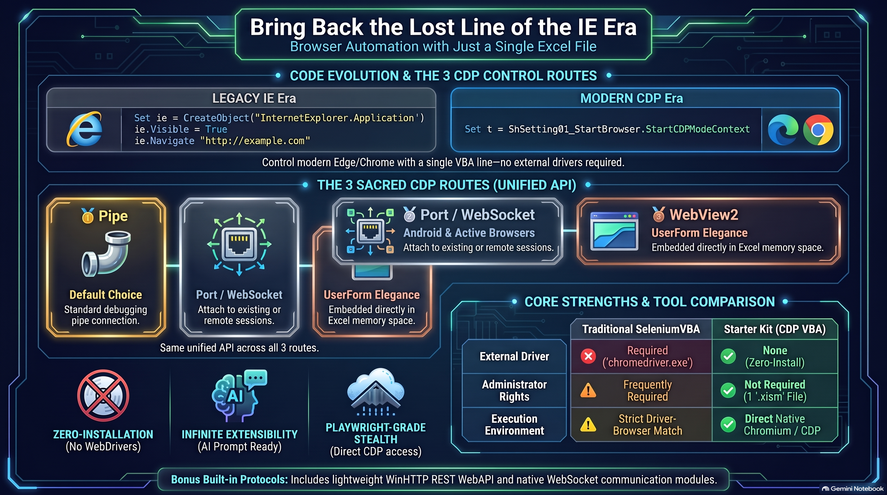
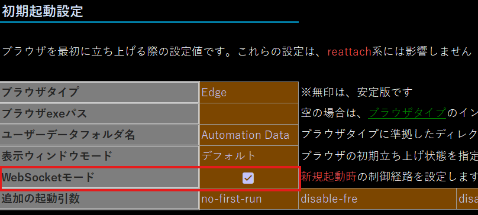
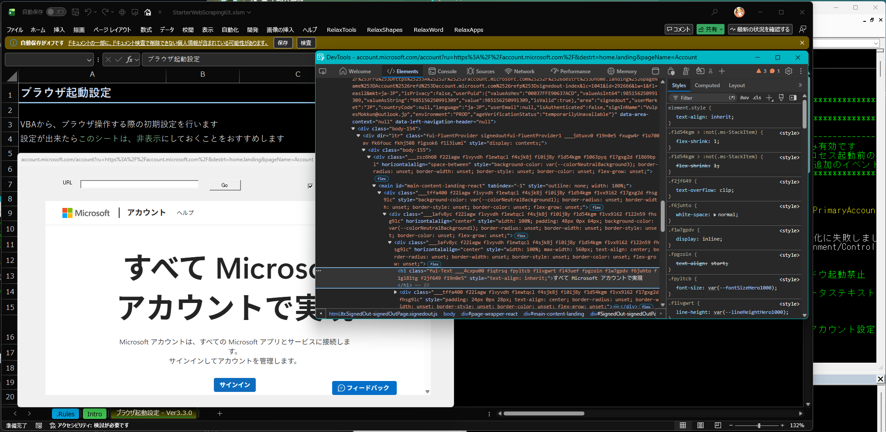
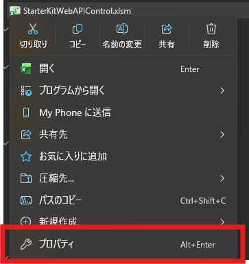
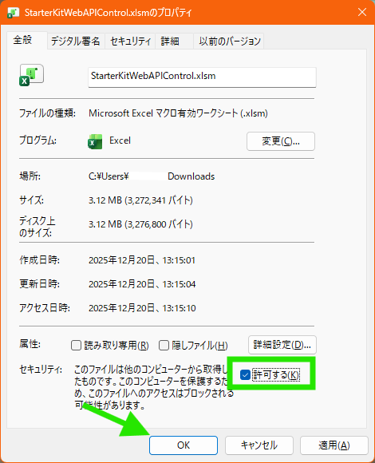
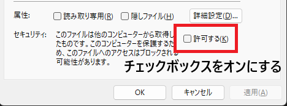
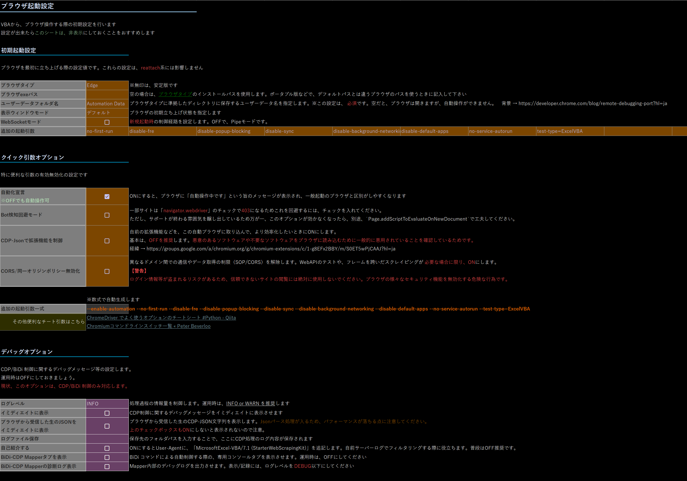

# Excel VBA Web Automation Starter Kit


> [!IMPORTANT]
> This text was translated into English by AI based on "README-jp.md".

[🇯🇵日本語のREADMEはこちら](README-jp.md)



## Reclaim the Lost Line from the IE Days

Once, we controlled the world with just three lines of code.

```bas
Set ie = CreateObject("InternetExplorer.Application")   ' <- this one line launched the browser
ie.Visible = True
ie.Navigate "URL"
```

To all VBAers who are being crushed by the weight of driver version management and environment setup after the disappearance of IE.  
This tool does not give up on the romance of a **"single Excel file"** and brings back the omnipotence of those days to the modern era by **driving CDP (Chrome DevTools Protocol) directly**.

```bas
Dim t As CDPContext
Set t = ShSetting01_StartBrowser.StartCDPModeContext   ' <- the lost line, right here. The browser launches with the settings sheet's configuration
t.navigate "URL"
```

No more tedious environment setup. From the moment you open this workbook, your journey toward business efficiency and automated internet operations begins.

---

## 🌈 Three CDP Control Routes (The "Three Sacred Treasures" of CDP)

The core of this tool is **CDP control**. Without any external driver (exe, ps1), it accesses the heart of Chromium-based browsers (Edge/Chrome) directly, using nothing but VBA.  
There are three control routes. Pick the one that fits your situation.

| Route | In a word | When to use it |
| --- | --- | --- |
| 🥇 **Pipe** | **When in doubt, use this** | Pipe communication via `--remote-debugging-pipe`. The most proven, stable, and easy-to-debug method. |
| 🥈 **Port** (WebSocket) | Android, or the browser right in front of you | Communication via `--remote-debugging-port`. Supports attaching to an already-running browser. You can reuse existing browser profiles (favorites, login state, etc.) as-is!<br>*Depending on your network setup, you can even control a browser on a different PC.* It can also **launch a local browser and connect to it** through this route. |
| 🥉 **WebView2** | For environments where neither a port nor a pipe is allowed | Opens no debug port and no named pipe at all — it talks CDP directly through the WebView2 SDK. The beauty of **"fully self-contained inside a UserForm"**: complete browser control from nothing but Excel's own memory space. |

Whichever route you pick, you use **exactly the same API** — `CDPContext.navigate`, `CDPElement.getElementByQuery`, and so on. See the demo code below, or the [official documentation](https://eschamali.github.io/StarterWebScrapingKit/concepts/architecture) for details on choosing between them.

---

## 🔥【Strengths of This Tool】🔥

* **Zero installs. No WebDriver. One xlsm file, and both Chromium and WebView2 are yours to command**
  * You will never encounter the "Browser and WebDriver version mismatch error" that plagues Selenium users!
  * Besides the stable channel, Edge/Chrome **Beta / Dev / Canary** can also be used simply by selecting them on the settings sheet
  * With the WebView2 route, there's no external browser exe to launch at all. **A single xlsm file** lets you drive everything from external browsers to a WebView2 embedded right inside Excel itself, all with the same feel

* **Infinite Extensibility: Your Own Custom Tool!**
  * Simply tell an AI about the "[Template](https://github.com/Eschamali/StarterWebScrapingKit/tree/dev/ForDevelopers/TemplateExtensions)" and the "function you want," and complex automation code will be completed in seconds!
  * No need to memorize tedious CDP specifications. Anyone can easily extend functionality as long as they have an idea.
  * Depending on how you craft your prompts, you can even generate "demo code" with detailed explanations fully automatically!

* **🚀 A "New Standard" Architecture for VBA, on par with Playwright / Puppeteer**
  * Directly access the heart of the browser without leaving the "footprints" of WebDriver. This tool occupies a **low-layer position equivalent to Playwright / Puppeteer**, even though it's VBA.
  * Its greatest strength lies in its "cleanliness." By using a "pure" operation style that doesn't inject any unique JS variables or patches (which often trigger detection), it has achieved **stealthiness that makes it somewhat easier to get past bot detection like Cloudflare's** as if you had a VIP pass.  
  * *Note: While bypass is not guaranteed, we have confirmed cases where it is easier to bypass than SeleniumVBA.*

---

## 🚀 Basic Template

The basic startup template is as follows.  
The browser will start with the settings defined in the **Worksheet: Browser Startup Settings**, so we recommend this template code unless you have specific requirements.  
In that case, your automation journey begins with just one or two lines.

### In Case of CDP Control

```bas
Sub BeginningOfAdventureByCDP()
    ' Launch browser based on settings sheet
    Dim HelloWorldAutomationBrowser As CDPContext
    Set HelloWorldAutomationBrowser = ShSetting01_StartBrowser.StartCDPModeContext

    ' ↓ From here, turn your image into code ↓


    ' Close the browser normally
    HelloWorldAutomationBrowser.ThisCDPBrowser.quit
End Sub
```

### In Case of BiDi Control

```bas
Sub BeginningOfAdventureByBiDi()
    ' Launch browser based on settings sheet
    Dim HelloWorldAutomationBrowser As WebDriverBiDiContext
    Set HelloWorldAutomationBrowser = ShSetting01_StartBrowser.StartBiDiModeContext

    ' ↓ From here, turn your image into code ↓


    ' Close the browser normally
    HelloWorldAutomationBrowser.ThisWebDriverBiDiMode.quit
End Sub
```

---

## 🛤️ Demos by Route

### 🥇 Pipe

The basic template above uses the Pipe route by default. If you change nothing, this is what runs.

### 🥈 Port (WebSocket)

#### Switch with a worksheet cell (launching a local browser and connecting to it)



Just **turn ON "WebSocketモード" (WebSocket mode)** on the Worksheet: Browser Startup Settings, and the basic template above (`StartCDPModeContext`, etc.) launches and connects to the browser via the Port route instead of the Pipe. You don't have to change a single character of your code.

```vb
Sub LaunchNewBrowserInWebSocketMode()
    ' 1. With "WebSocketモード" turned ON in the settings sheet, launch as usual
    Dim t As CDPContext
    Set t = ShSetting01_StartBrowser.StartCDPModeContext

    ' 2. Proceed as usual
    t.navigate "https://www.youtube.com/@islandfox6864"

    ' 3. Done
    t.ThisCDPBrowser.quit
End Sub
```

Internally, this automatically handles checking for policies that block remote debugging, cleaning up leftover sessions, and disabling the crash-recovery prompt.

#### Attach to an already-running browser

You can also have Excel attach to (take control of) an existing browser session — such as Edge or Chrome — that is already running. A simple demo code for this feature is bundled in the standard module `Demo_CDP`, in the section titled `起動済みWebSocketブラウザ経由版Demo` ("demos via an already-running WebSocket browser").

Before running it, start the target browser with the **remote debugging port enabled**:

```bash
# Launch the browser with the default port 9222 open
msedge.exe --remote-debugging-port=9222
```

```vb
Sub AutoConnectTab()
    ' 1. Get the username from the setting cell
    Dim UserName As String
    UserName = ShSetting01_StartBrowser.CurrentUserName

    ' 2. Connect to the specified WebSocketForCDP-page
    Dim WebSocketCDP As New CDPCoreViaWebSocket
    Debug.Print WebSocketCDP.AutoConnectPageCDP(UserName)

    ' 3. Pass the connected WebSocket object to the `reattachWebSocket` method
    Dim t As New CDPContext
    If Not t.reattachWebSocket(UserName, WebSocketCDP) Then MsgBox "Could not connect to '" & UserName & "'. The WebSocket information is no longer valid.", vbCritical, "Chrome DevTools Protocol": Exit Sub

    ' 4. Navigate
    ' By the way, this URL takes you to the developer's favorite YouTube channel 🤠
    t.navigate "https://www.youtube.com/@islandfox6864"

    ' 5. Disconnect from the WebSocket
    WebSocketCDP.DisconnectCDP
End Sub
```

* **Changing the port number**:
  By passing any port number as the fourth argument of `WebSocketCDP.AutoConnectPageCDP` (e.g., a port other than `9222`), you can flexibly connect to a browser waiting on a specific port, or to a browser inside an actual device such as an Android phone.
* **Building on this code**:
  You can have users handle tedious login authentication manually in the browser beforehand. Then, **"the moment a button in Excel is clicked, VBA takes over the logged-in session and instantly starts complex scraping."** This allows you to easily build a highly useful and robust hybrid automation system.
* **About the connection types**:
  Three types are provided: a specific page (`AutoConnectPageCDP`), the browser itself (`AutoConnectBrowserCDP`), and the browser right in front of you (`ReConnectCDP`). See the `Demo_CDP` demos for usage examples of each.

### 🥉 WebView2

You can **launch and control WebView2 directly from within Excel VBA's own memory space, with no external process (such as PowerShell) required.** This is the ace up the sleeve for the toughest environments yet — those where **neither a port nor a pipe** is permitted.



```vb
' Note: Some `ICoreWebView2Settings` properties only take effect before navigation.
'       `ICoreWebView2EnvironmentOptions` settings only take effect before the WebView2 process starts.
Sub WebView2OnExcelUserForm()
    With WebView2Form
        ' 1. Apply pre-launch settings (optional)
        .ThisWebView2.EnvironmentOptions.Set_AllowSingleSignOnUsingOSPrimaryAccount = False  ' Toggle single sign-on

        ' 2. Launch the WebView2 process
        If Not .StartCDPModeWebView2 Then Debug.Print "Failed to initialize WebView2.": Exit Sub

        ' 3. Apply pre-navigation settings (optional)
        .ThisWebView2.DevToolsEnabled = False       ' Disallow opening DevTools
        .ThisWebView2.ContextMenuEnabled = False    ' Disallow right-click menu

        ' 4. Navigate, as CDP
        ' SSO disabled: shows the Microsoft account introduction page
        ' SSO enabled : auto-navigates to the settings page for the account currently signed in on this PC
        .ThisCDPContext.navigate "https://account.microsoft.com/"

        ' 5. Show the form (blocks until the UserForm is closed)
        .show
    End With
End Sub
```

There are two moments when settings can be applied: **before launch** (via `EnvironmentOptions` — only read when the Environment is created, so changing it afterward has no effect) and **before navigation** (via `ICoreWebView2Settings`-family properties — a per-page setting, so it must be set before the next navigation). In the demo above, you can also see how toggling `Set_AllowSingleSignOnUsingOSPrimaryAccount` changes the outcome of navigating to the very same URL.

Once embedded, the `CDPContext` (`ThisCDPContext`) / `CDPElement` API is **identical** to the Pipe and Port routes. The bundled demo is `Demo_WebView2.WebView2OnExcelUserForm`.

> [!NOTE]
> The heart of this feature (the machine-code thunks and vtable calls) is ported directly from [WebView2-For-Excel-VBA](https://github.com/tarboh/WebView2-For-Excel-VBA) (by Tarboh). Our sincere thanks once again 🙏 For the full story behind this integration, see the [official documentation's development story](https://eschamali.github.io/StarterWebScrapingKit/stories/webview2-story).

---

## 🦊 WebDriver BiDi Supported Too! (A VBA First)

In addition to CDP (Chrome DevTools Protocol) operations, we have quickly implemented support for **"WebDriver BiDi"** (`WebDriverBiDiCore.cls`), the next-generation protocol currently being established as a global W3C standard.

While maintaining the project's philosophy of being **"self-contained in VBA"** without using external `chromedriver.exe` or middleware like Selenium, the following advanced operations are possible:

*   📥 **Perfect Subscription to Asynchronous Events** (Real-time detection of page load completion or console errors)
*   ⚠️ **Fine-grained Control of JavaScript Alert Dialogs** (Implementation of fallbacks that prevent VBA from freezing)
*   🔌 **CDP Tunneling via BiDi+** (Flexibility to cover areas where standard features are insufficient. With `UpgradeBiDiPlus`, you can also switch the same tab over to CDP control)

**📖 For detailed technical documentation and usage, please visit the official documentation (GitHub Pages).**
*   ➡️ **[Official Documentation Top (Usage & Technical Architecture)](https://eschamali.github.io/StarterWebScrapingKit/)**

---

## 🎁 Bonus Features

Besides CDP control, the following two are also included.

* **🚀 REST WebAPI (WinHTTP 5.1)**
  * The standard for high-speed, lightweight data collection. A robust implementation that works solely with reference settings. The standard module `Template_WebAPI` is provided as a template for building the basics.
* **⚡ WebSocket Communication (General-purpose)**
  * A challenge for real-time communication, separate from browser control. Equipped with minimal connection and send/receive functions using WinAPI. An evolving feature that pushes the boundaries of VBA. The demo is in the standard module `Demo_WebSocket`.

---

### 【Credits & Acknowledgments】

This tool is a mashup of many wonderful libraries shared by VBA artisans around the world, integrated into a form that is easy to use in practice.  
I express my heartfelt respect and gratitude for the wisdom and code of my great predecessors.

* **Core Logic for WebSocket Implementation**
  * [ChromeControler-No-Selenium-WebDriver-VBAJSON](https://github.com/24000/ChromeControler-No-Selenium-WebDriver-VBAJSON)
    * Author: [@kabkabkab](https://qiita.com/kabkabkab/items/9952a796ee9244fc98ad)
* **Foundation for CDP Control and Pipe Communication**
  * [Chromium-Automation-with-CDP-for-VBA](https://github.com/longvh211/Chromium-Automation-with-CDP-for-VBA)
    * Author: longvh211
* **WinHTTP 5.1 Wrapper**
  * [VBA-Web](https://github.com/VBA-Tools-v2/VBA-Web)
    * Original Author: Tim Hall
* **Ultra-high-performance JSON parser specialized for CDP/WebDriverBiDi responses**
  * [vbacollective-json](https://github.com/vbacollective/json)
    * Original Author: Ueslei Paim
    * Modified version: Optimized for reliability by removing `CopyMemory` dependency
* **High-performance JSON parser (Upward compatible with `VBA-JSON`)**
  * [VBA-FastJSON](https://github.com/cristianbuse/VBA-FastJSON)
    * Author: Cristian Buse
* **A high-speed Dictionary that is a superset-compatible replacement for Microsoft's `Scripting.Dictionary`.**
  * [VBA-FastDictionary](https://github.com/cristianbuse/VBA-FastDictionary)
    * Author: Cristian Buse
* **Fast Character Code Conversion Wrapper**
  * [How to convert VBA/VB6 Unicode strings to UTF-8](https://di-mgt.com.au/howto-convert-vba-unicode-to-utf8.html)
    * David Ireland, DI Management Services Pty
  * [VBAで Windows APIを使った UTF-8 ←→ Unicode相互変換](https://qiita.com/yamashiroakihito/items/9b609653fef6fa8a5ab2)
    * Author: @yamashiroakihito
* **Log Level Basics**
  * [VBA-Log](https://github.com/VBA-tools/VBA-Log)
    * Author: timhall
* **Core Logic for BiDi in Chromium Browsers**
  * [chromium-bidi](https://github.com/GoogleChromeLabs/chromium-bidi)
    * Author: GoogleChromeLabs Team
* **The Amazing Person Who Embedded WebView2 in UserForm Without Extra Downloads**
  * [WebView2-For-Excel-VBA](https://github.com/tarboh/WebView2-For-Excel-VBA)
    * Author: [Tarboh](https://x.com/fenblen_puyo)

*Note: For detailed usage and methods of each function, please refer to the documentation of the original libraries above.*

## 💡 Introduction: About the "Protected View" Displayed When Opening Downloaded Files


When you open a downloaded macro workbook, a yellow bar saying **"Protected View"** may appear at the top of Excel, and you might need to click the "Enable Editing" button.  
Furthermore, a security warning might appear when you try to run the macro.  


This is a normal and very smart behavior where **your PC is trying to protect you from "unknown" files coming from the internet.**

### How to Unblock

1. Close all Excel instances.
2. Right-click the downloaded Excel file and select **Properties**.  

3. Check the **Unblock** checkbox and click the **OK** button.  

4. Open the tool again and click the "Enable Editing" button.

To help you use this macro workbook safely and to its full potential, let me briefly explain **"why this extra step is necessary."**

### Why is This "Extra Step" Necessary? 【A Story】

Once upon a time, the internet was a much more peaceful place.  
However, at some point, malicious **"viruses" pretending to be Excel macros** began to spread worldwide.  
People suffered tragedies where their PCs were taken over just by opening an ordinary Excel file attached to an email.

So, Microsoft made a **big decision**.

**"Let's treat all files coming from the internet as 'suspicious characters of unknown origin'!"**

#### The "Mark of the Web (MOTW)" Stamp

The moment you download a file from the internet (web browser, email client, etc.), Windows places a special **"stamp"** called **`Mark of the Web` (MOTW)** on the **"invisible" part** of the file, marking it as **"this person is a person of interest from the lawless land called the internet."**

When Excel opens a file, it first checks if this "stamp" exists.  
If it finds the stamp, it judges:

**"Wait! This guy is of unknown character!**  
**It's too dangerous to let them move around freely right away.**  
**First, let's put them in an 'isolation room' called 'Protected View.' And never run their macros!"**

### What It Means for You to Check the "Unblock" Box

  
The only **official "guarantee of identity" procedure** to safely lift this strict security system.  
That is the act of opening the file properties and checking the **"Unblock"** box.

This is the same as you **declaring** to Windows:
**"I know, I know. I know this guy came from the internet.**
**But I (you) personally take responsibility and guarantee this person's 'identity'!**
**So, stop treating them as suspicious and welcome them as a formal 'citizen' of this PC."**

Once this "guarantee of identity" is provided, Windows **permanently removes the `MOTW` "stamp"** from the file.  
As a result, Excel recognizes the file as a "trusted and safe file" and allows the macros to run normally without displaying "Protected View."

---
**This macro workbook is safe.**  
**Please, with your power as a "guarantor," give this file the "permission" to be active on your PC.**

---

##  Advanced Features and Technical Details (Migrated to GitHub Pages)

Extensive documentation such as "Unique Improvements (Japanese UTF-8 support, BrowserEvents property, etc.)," "API Specification Reference," and "Deep Mechanisms and Design Philosophy" has been moved and organized into a **beautiful static site (GitHub Pages)**.

Please visit the **[Official Documentation Site (Features / API Reference)](https://Eschamali.github.io/StarterWebScrapingKit/)** and touch the abyss of browser control that exceeds the limits of VBA!

## Worksheet: Browser Startup Settings



Basic explanations are provided on the worksheet. Here, we explain the startup arguments.

### Meaning of Initial Additional Startup Arguments

To eliminate troublesome elements during automation, we provide several initial arguments along with W3C-compliant arguments.

| Argument Name | Meaning | 
| ----------------------------- | ------------------------------------------------------------------------------------------------------------------------------------------------------------------------------------------------ | 
| no-first-run | Starts Chromium-based browsers without the first-run setup screens.<br>Skips the "Welcome" screen or prompts to log in to Google/Microsoft accounts. | 
| disable-fre | Same as `no-first-run`. Used together because `no-first-run` alone may not fully suppress it depending on the version or environment. | 
| disable-popup-blocking | Disables popup blocking. | 
| disable-sync | Disables automatic login and synchronization with accounts. | 
| disable-background-networking | Disables several subsystems that perform network requests in the background.<br>Eliminates communications other than the intended one as much as possible. | 
| disable-default-apps | Disables the installation of default apps on first run. | 
| no-service-autorun | Suppresses the startup of extra background services. | 
| enable-automation | Enables the display indicating that the browser is controlled by automation.<br>Serves as a marker to prevent mixing with normal browsers. | 
| test-type=ExcelVBA | Specifies the type of test harness. In short, it's just for decoration. | 

### About Bot Detection Bypass Mode

Adds `disable-blink-features=AutomationControlled` to the startup arguments. This overrides `navigator.webdriver` to `false`, enabling bot detection bypass.  
Some sites check this flag to block access, so turn it ON as needed.

However, keep in mind that this argument is not officially supported and may stop working someday.  
As of the time of writing, a warning message appears, but it still works.  


### Startup Arguments Within VBA

Contains minimum mandatory arguments for browser automation. You can find these arguments in the `GenerateArg○○`-family procedures of the `CDPHost` class module.

| Argument Name | Meaning | 
| --------------------- | ---------------------------------------------------------------------------------------------------------------------------------------------------------------------------------------------------------------------------------------------------------------------------------------------------------------------------------------------------------------------------------------------------------------------------------------------------- | 
| remote-debugging-pipe / remote-debugging-port | Makes the browser allow debugging from a "different process (Excel)" than the "main process."<br>`pipe` is pipe communication (the Pipe route); `port` is WebSocket communication (the Port route. The port number is `0`, i.e. automatically assigned to a free port, and the connection info is read from the `DevToolsActivePort` file).<br>Although it says "remote," `pipe` is specified to be accessible only from within the same PC. | 
| user-data-dir | Specifies the full path to the browser's data directory (Cookies, extensions, password vault, etc.).<br>Normally it is `C:\Users\%USERNAME%\AppData\Local\Microsoft\Edge\User Data`, but due to [measures against Cookie theft using debugging features](https://developer.chrome.com/blog/remote-debugging-port?hl=ja) it is now mandatory to specify a folder path other than `User Data`.<br>By default, this tool creates a path in the same hierarchy as `User Data` as `Automation Data`.<br>If you write a full path with a drive letter, such as `C:\Data\MyProfile`, in the "User data folder name" on the settings sheet, that path is used as-is as the storage location. | 
| homepage | Specifies the initial URL when the browser starts, but it is set to `about:blank` to suppress extra communication.<br>However, if an arbitrary URL is passed to the `app` in the next item, this will not be added. | 
| app | Corresponds to the 2nd argument of the `start` method. If you want to specify the initial URL when starting the browser, you specify it here.<br>Starting with a URL here allows you to prevent user actions that interfere with automation to some extent, such as:<br>・Changing to an arbitrary URL not allowed<br>・Creating tabs not allowed<br><br>It's like a simple kiosk mode. | 

---

## 🎓 Making Copilot Smarter with Excel's "`.Rules`"


We've added a `.Rules` sheet, written in the [official format](https://support.microsoft.com/ja-jp/excel/copilot/copilot-in-excel-rules) for Excel's built-in AI feature, "Copilot in Excel." Now, when you ask Copilot a web-scraping question about this workbook, it's steered toward answers based on **this workbook's own CDP/BiDi control features**, instead of the generic `SeleniumVBA`-flavored suggestions Copilot would otherwise default to.

> [!IMPORTANT]
> Since Copilot in Excel itself is an Excel-only feature, **Access is not supported**.
