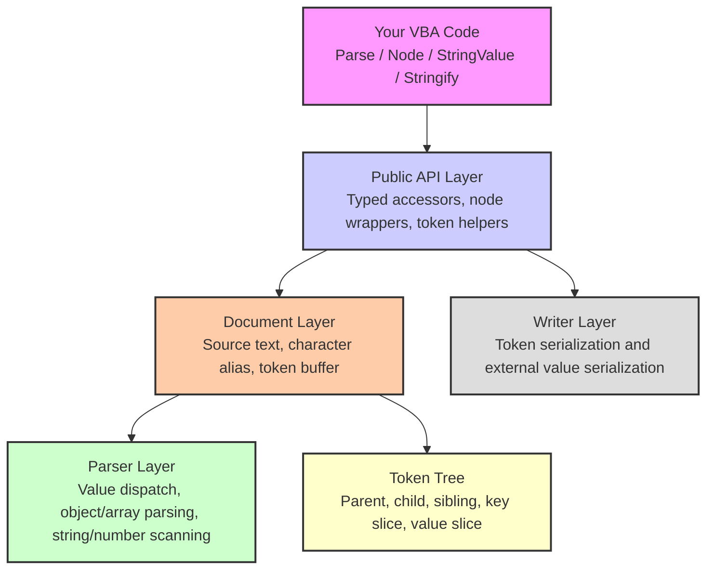
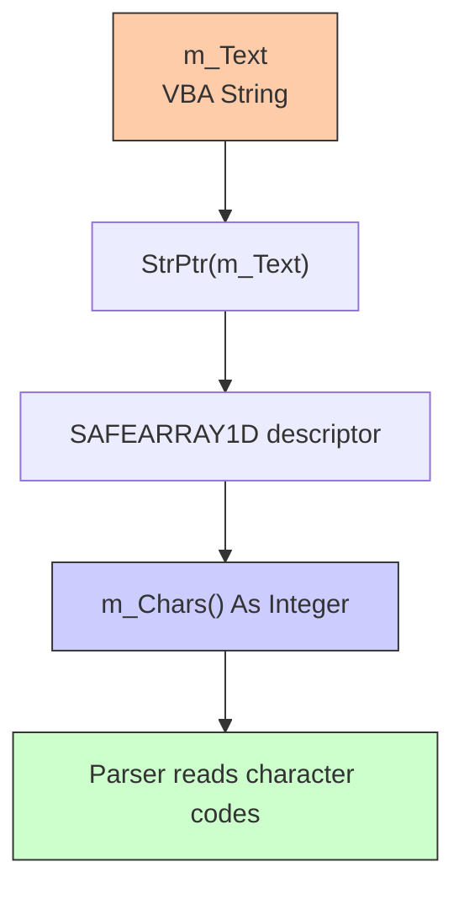
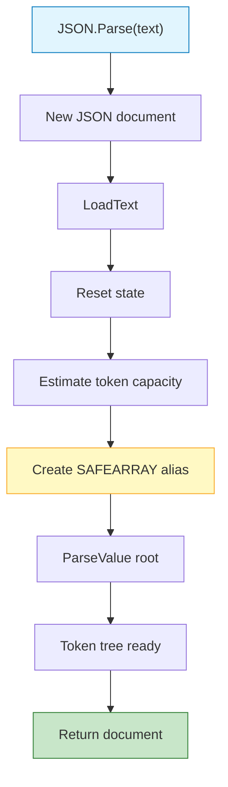
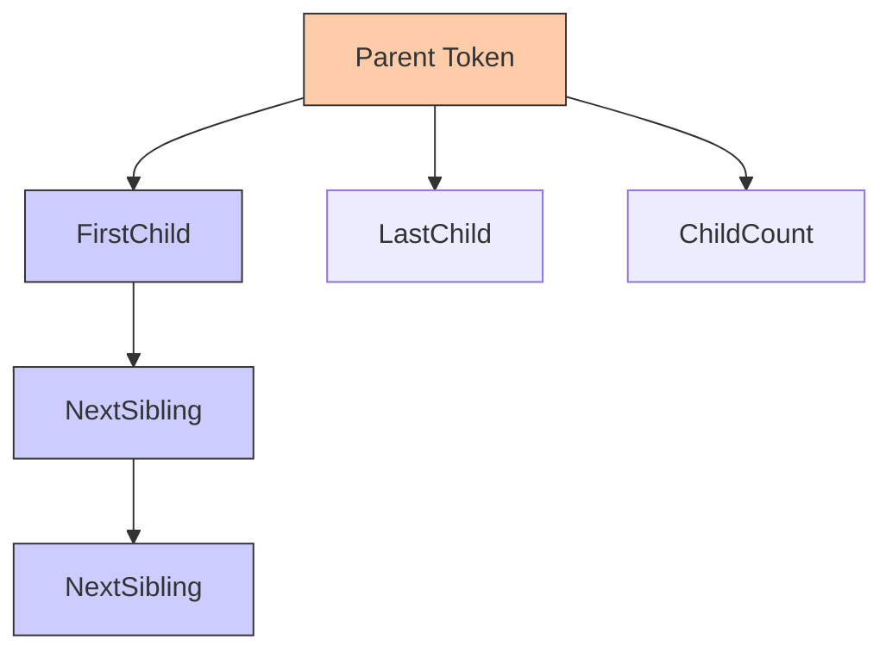
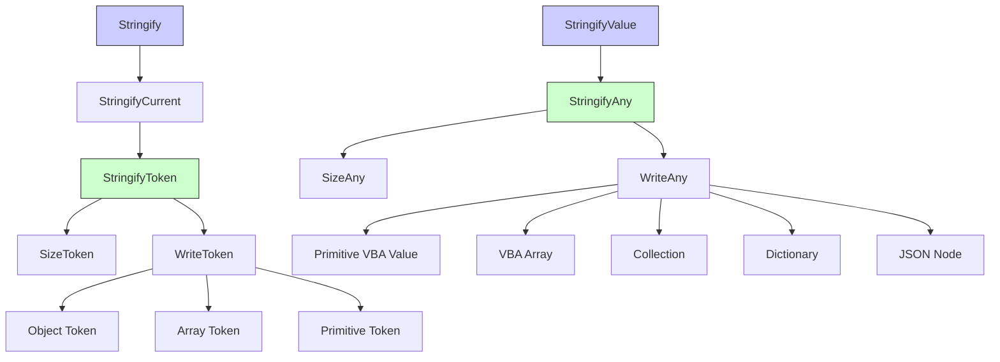

# JSON Architecture

JSON is a single-file VBA class (`JSON.cls`) that implements a high-performance zero-copy JSON reader and lightweight JSON writer for Microsoft Office hosts.

It combines compact token-tree parsing, SAFEARRAY string aliasing, native ordinal key comparison, native quote scanning, lazy node wrappers, typed accessors, raw field access, token iteration, and Stringify support while remaining contained inside one `.cls` file.

## Table of Contents

- [High-Level Overview](#high-level-overview)
- [Design Goals](#design-goals)
- [Runtime Model](#runtime-model)
- [Class Layout](#class-layout)
- [Global Constants](#global-constants)
- [Native API Layer](#native-api-layer)
- [SAFEARRAY String Alias](#safearray-string-alias)
- [JSType](#jstype)
- [JSToken](#jstoken)
- [Document State](#document-state)
- [Node Wrapper State](#node-wrapper-state)
- [Parsing Pipeline](#parsing-pipeline)
- [LoadText](#loadtext)
- [Token Allocation](#token-allocation)
- [Value Dispatch](#value-dispatch)
- [Object Parsing](#object-parsing)
- [Array Parsing](#array-parsing)
- [String Scanning](#string-scanning)
- [Number Parsing](#number-parsing)
- [Primitive Parsing](#primitive-parsing)
- [Hierarchy Linking](#hierarchy-linking)
- [Lookup Architecture](#lookup-architecture)
- [Object Key Lookup](#object-key-lookup)
- [Array Index Lookup](#array-index-lookup)
- [Native Key Comparison](#native-key-comparison)
- [Value Conversion](#value-conversion)
- [Raw Slice Access](#raw-slice-access)
- [Lazy Node Wrappers](#lazy-node-wrappers)
- [Token Iteration](#token-iteration)
- [Stringify Architecture](#stringify-architecture)
- [Parsed Token Serialization](#parsed-token-serialization)
- [External Value Serialization](#external-value-serialization)
- [Object Serialization](#object-serialization)
- [Array Serialization](#array-serialization)
- [Collection Serialization](#collection-serialization)
- [Dictionary Serialization](#dictionary-serialization)
- [String Escaping](#string-escaping)
- [Pretty Printing](#pretty-printing)
- [Memory Model](#memory-model)
- [Performance Strategy](#performance-strategy)
- [Compatibility Strategy](#compatibility-strategy)
- [Shutdown and Cleanup](#shutdown-and-cleanup)
- [Known Architectural Boundaries](#known-architectural-boundaries)

## High-Level Overview

JSON is a single-file VBA class (`JSON.cls`) that parses JSON text into a compact token tree instead of immediately materializing nested Dictionaries, Collections, or per-node objects.

The public API is designed to look simple:

```vb
Dim doc As JSON
Set doc = JSON.Parse(responseText)

Debug.Print doc.StringValue("name")
Debug.Print doc.NumberValue("id")
Debug.Print doc.BoolValue("active")
```

Internally, the parser keeps the original JSON string alive and stores token slices pointing into that string.



The main architectural idea is:

```txt
JSON text -> SAFEARRAY character alias -> token tree -> lazy wrappers / typed reads / raw slices
```

This keeps parsing allocation low and makes large JSON traversal practical in Office/VBA.

## Design Goals

| Goal | Architectural Choice |
| Single-file deployment | Everything lives inside `JSON.cls`. |
| No references required | Uses late-bound compatible behavior and direct declarations only. |
| Fast parsing | Parses into compact tokens instead of nested objects. |
| Low allocation | Keeps key/value slices into the original source text. |
| Fast traversal | Provides typed accessors and direct token iteration. |
| Large-array support | Token iteration avoids wrapper allocation per element. |
| Simple public API | `Parse`, `Item`, `Node`, `StringValue`, `Stringify`, and token helpers. |
| Office compatibility | Supports x86 and x64 VBA through conditional declarations. |
| Lightweight writer | Serializes parsed JSON and common VBA values without a separate builder object. |

JSON is not intended to be a fully validating JSON schema engine. It is a fast reader/writer optimized for practical Office automation, API responses, configuration files, and local data pipelines.

## Runtime Model

The runtime model has two object modes:

```txt
Root document = owns source text, character alias, and token buffer
Node wrapper  = points to a token owned by a root document
```

A parsed document owns:

```txt
m_Text       = original JSON text
m_Chars()    = Integer() alias over m_Text UTF-16 characters
m_Tokens()   = compact token buffer
m_RootId     = root token id
```

A child node wrapper owns only:

```txt
m_NodeId     = wrapped token id
m_Document   = reference to the root document
```

This allows code like:

```vb
Dim doc As JSON
Set doc = JSON.Parse("{""user"":{""name"":""Ueslei""}}")

Dim user As JSON
Set user = doc.Node("user")

Debug.Print user.StringValue("name")
```

The `user` wrapper does not duplicate the `"user"` object. It points back to `doc` and stores the token id of the object.

## Class Layout

`JSON.cls` is a predeclared class:

```vb
Attribute VB_Name = "JSON"
Attribute VB_PredeclaredId = True
```

This allows factory-style usage:

```vb
Set doc = JSON.Parse(text)
Debug.Print JSON.StringifyValue(value, True)
```

The same class acts as:

1. The public API object.
2. The root document storage.
3. The lightweight node wrapper.
4. The parser implementation.
5. The writer implementation.

This keeps deployment simple: one importable `.cls` file.

## Global Constants

### JSON_MIN_TOKEN_CAPACITY

```vb
Private Const JSON_MIN_TOKEN_CAPACITY As Long = 65536
```

Minimum token capacity allocated for a parsed document.

This avoids repeated `ReDim Preserve` calls on medium JSON documents.

### JSON_MAX_INITIAL_TOKEN_CAPACITY

```vb
Private Const JSON_MAX_INITIAL_TOKEN_CAPACITY As Long = 3000000
```

Maximum initial token capacity guessed from text length.

This prevents extremely large initial allocations based only on input size.

### JSON_LARGE_TOKEN_CAPACITY

```vb
Private Const JSON_LARGE_TOKEN_CAPACITY As Long = 1048576
```

Threshold after which token-buffer growth changes from doubling to 1.5x growth.

This reduces memory spikes for very large documents.

### JSON_DEFAULT_INDENT_SIZE

```vb
Private Const JSON_DEFAULT_INDENT_SIZE As Long = 2
```

Default indentation size for pretty-printed output.

## Native API Layer

JSON uses a small native layer for speed and compatibility.

### CopyMemory

```vb
Private Declare PtrSafe Sub CopyMemory Lib "kernel32" Alias "RtlMoveMemory" (...)
```

Used to attach and clear the internal SAFEARRAY descriptor that aliases the source string.

### VarPtrArray

```vb
Private Declare PtrSafe Function VarPtrArray Lib "vbe7" Alias "VarPtr" (...)
```

Used to obtain the internal array descriptor pointer for `m_Chars()`.

On 32-bit VBA, the declaration targets `msvbvm60`.

### CompareStringOrdinal

```vb
Private Declare PtrSafe Function CompareStringOrdinal Lib "kernel32" (...)
```

Used for ordinal UTF-16 key comparison without allocating key substrings during object lookup.

This is a major part of the fast field access path.

## SAFEARRAY String Alias

VBA strings are UTF-16. JSON creates an `Integer()` alias over the string memory so the parser can inspect characters by numeric code without repeatedly calling `Mid$`.

The descriptor layout is represented by:

```vb
Private Type SAFEARRAY1D
    cDims As Integer
    fFeatures As Integer
    cbElements As Long
    cLocks As Long
    pvData As LongPtr
    cElements As Long
    lLbound As Long
End Type
```

Conceptually:

```txt
m_Text = "{""name"":""Ueslei""}"

m_Chars(0) = AscW("{")
m_Chars(1) = AscW("""")
m_Chars(2) = AscW("n")
...
```

No character array copy is created. The array descriptor points directly at the string data.



This is why cleanup is important: the descriptor must be cleared before the object is destroyed.

## JSType

`JSType` is the internal enum used by each token.

```vb
Private Enum JSType
    jsNone = 0
    jsObject = 1
    jsArray = 2
    jsString = 3
    jsNumber = 4
    jsBool = 5
    jsNull = 6
End Enum
```

The public `JsonType` property converts these values to user-facing strings:

| Internal Type | Public Type |
| `jsObject` | `object` |
| `jsArray` | `array` |
| `jsString` | `string` |
| `jsNumber` | `number` |
| `jsBool` | `boolean` |
| `jsNull` | `null` |

## JSToken

`JSToken` is the core internal data structure.

```vb
Private Type JSToken
    Type As Integer
    Parent As Long
    NextSibling As Long
    FirstChild As Long
    LastChild As Long
    ChildCount As Long
    KeyStart As Long
    KeyLen As Long
    ValStart As Long
    ValLen As Long
End Type
```

Each token stores hierarchy links and source slices.

| Field | Purpose |
| `Type` | Internal JSON type. |
| `Parent` | Parent token id. |
| `NextSibling` | Next token under the same parent. |
| `FirstChild` | First direct child token. |
| `LastChild` | Last direct child token. |
| `ChildCount` | Number of direct children. |
| `KeyStart` | One-based start position of object key text. |
| `KeyLen` | Object key length. |
| `ValStart` | One-based start position of value text. |
| `ValLen` | Value text length. |

Objects and arrays use child links.

Strings, numbers, booleans, and null use value slices.

Object children also store key slices.

```txt
{
  "name": "Ueslei",
  "age": 18
}

Token 1: object
  FirstChild -> 2
  LastChild  -> 3

Token 2: string
  Parent   -> 1
  KeyStart -> "name"
  ValStart -> "Ueslei"
  Next     -> 3

Token 3: number
  Parent   -> 1
  KeyStart -> "age"
  ValStart -> "18"
```

## Document State

The root document stores:

```vb
Private m_Chars() As Integer
Private m_Text As String
Private m_Length As Long
Private m_Index As Long
Private m_Tokens() As JSToken
Private m_TokenCount As Long
Private m_TokenCap As Long
Private m_RootId As Long
Private m_NodeId As Long
Private m_Document As JSON
Private m_CharAliasActive As Boolean
```

| Field | Purpose |
| `m_Text` | Original JSON source text. |
| `m_Chars()` | SAFEARRAY alias over `m_Text`. |
| `m_Length` | Length of the source text. |
| `m_Index` | Current zero-based parser cursor. |
| `m_Tokens()` | Token buffer. |
| `m_TokenCount` | Number of active tokens. |
| `m_TokenCap` | Current token buffer capacity. |
| `m_RootId` | Root token id. |
| `m_NodeId` | Wrapped token id for node wrappers. |
| `m_Document` | Root document reference for wrappers. |
| `m_CharAliasActive` | Whether the SAFEARRAY alias must be cleared. |

## Node Wrapper State

A node wrapper is initialized through:

```vb
Friend Sub InitNode(ByVal TokenId As Long, ByVal Document As JSON)
    m_NodeId = TokenId
    Set m_Document = Document
End Sub
```

The wrapper does not own token memory.

When a method needs to operate, it calls `ResolveBase`:

```vb
Private Sub ResolveBase(ByRef Document As JSON, ByRef baseId As Long)
    If m_NodeId > 0 Then
        Set Document = m_Document
        baseId = m_NodeId
    Else
        Set Document = Me
        baseId = m_RootId
    End If
End Sub
```

This allows the same public methods to work on both root documents and child nodes.

```txt
Root document:
    Document = Me
    BaseId   = m_RootId

Node wrapper:
    Document = m_Document
    BaseId   = m_NodeId
```

## Parsing Pipeline

The full parse flow starts with `Parse`:

```vb
Public Function Parse(ByRef Text As String) As JSON
    Dim doc As JSON
    Set doc = New JSON
    doc.LoadText Text
    Set Parse = doc
End Function
```

The heavy work is performed by `LoadText`.



## LoadText

`LoadText` performs document initialization.

Main responsibilities:

1. Clear any existing character alias.
2. Store the source text.
3. Reset parser state.
4. Allocate the initial token buffer.
5. Create the SAFEARRAY alias over the string.
6. Parse the root JSON value.

Conceptual flow:

```txt
Clear previous alias
m_Text = Text
m_Length = Len(m_Text)
m_Index = 0
Erase previous chars/tokens
Estimate token capacity
ReDim m_Tokens
Attach m_Chars() to m_Text
m_RootId = ParseValue(0, 0, 0)
```

Token capacity is estimated from input length:

```vb
m_TokenCap = m_Length \ 24
```

Then clamped between the minimum and maximum initial capacity.

## Token Allocation

Tokens are allocated through `AddToken`.

```vb
Private Function AddToken() As Long
    m_TokenCount = m_TokenCount + 1

    If m_TokenCount > m_TokenCap Then
        If m_TokenCap < JSON_LARGE_TOKEN_CAPACITY Then
            m_TokenCap = m_TokenCap * 2
        Else
            m_TokenCap = m_TokenCap + (m_TokenCap \ 2)
        End If

        ReDim Preserve m_Tokens(1 To m_TokenCap)
    End If

    AddToken = m_TokenCount
End Function
```

Growth strategy:

| Current Capacity | Growth |
| Below large threshold | 2x |
| Above large threshold | 1.5x |

This keeps small/medium documents fast while reducing huge memory jumps for very large payloads.

## Value Dispatch

`ParseValue` is the central parser dispatcher.

It skips whitespace, creates a token, links it to the parent, and dispatches based on the current character:

| Character | JSON Type | Parser |
| `{` | Object | `ParseObject` |
| `[` | Array | `ParseArray` |
| `"` | String | `ParseString` |
| `t` | Boolean true | Inline primitive parse |
| `f` | Boolean false | Inline primitive parse |
| `n` | Null | Inline primitive parse |
| `-`, `0-9` | Number | `ParseNumber` |

Conceptual dispatch:

```txt
SkipWhitespace
AddToken
Attach to parent
Select current character
    {       -> object
    [       -> array
    "       -> string
    true    -> bool
    false   -> bool
    null    -> null
    number  -> number
```

## Object Parsing

Objects are parsed by `ParseObject`.

Conceptual flow:

```txt
Consume {
Loop:
    Skip whitespace
    If } then finish
    Scan key string
    Skip whitespace
    Consume :
    Parse child value with key slice
    Skip whitespace
    If , then continue
```

The important optimization is that keys are not immediately copied into new VBA strings. The parser stores:

```txt
KeyStart
KeyLen
```

The key is converted only when needed by `GetRawKey`, `KeyAt`, or serialization.

## Array Parsing

Arrays are parsed by `ParseArray`.

Conceptual flow:

```txt
Consume [
Loop:
    Skip whitespace
    If ] then finish
    Parse child value with no key
    Skip whitespace
    If , then continue
```

Array elements are stored as sibling tokens under the array token.

```txt
array token
  FirstChild -> element 0
  element 0 NextSibling -> element 1
  element 1 NextSibling -> element 2
```

Indexed access walks this sibling chain.

## String Scanning

Strings are parsed by `ParseString`, which delegates to `ScanJSONString`.

The parser stores only the content slice:

```txt
"Ueslei"
 ^    ^
 ValStart
 ValLen = 6
```

The quotes are not included in the stored value slice.

The scanner is optimized around native quote searching and escape checks. This avoids checking every character one-by-one in the common case where strings do not contain escapes.

When a string is later read through `StringValue`, JSON applies lightweight unescaping only if a backslash is present.

## Number Parsing

Number tokens store the raw numeric slice.

```txt
123.45
^    ^
ValStart
ValLen
```

Conversion happens later through:

```vb
ValueAsDouble = Val(GetRawSlice(TokenId))
```

This means parse time stays low because numeric values are not converted eagerly.

## Primitive Parsing

Booleans and null are parsed inline.

| Literal | Type | Stored Slice |
| `true` | `jsBool` | `true` |
| `false` | `jsBool` | `false` |
| `null` | `jsNull` | `null` |

Boolean reading checks the first character:

```vb
ValueAsBool = (m_Chars(m_Tokens(TokenId).ValStart - 1) = 116)
```

`116` is the UTF-16 character code for `t`.

## Hierarchy Linking

Every child token is linked to its parent when created.

The parent stores:

```txt
FirstChild
LastChild
ChildCount
```

Each child stores:

```txt
Parent
NextSibling
```

Conceptual link operation:

```txt
If parent has no first child:
    parent.FirstChild = child
Else:
    parent.LastChild.NextSibling = child

parent.LastChild = child
parent.ChildCount += 1
```

This produces a compact forward-linked tree.



## Lookup Architecture

Public lookups route through `ResolveToken`.

```vb
Friend Function ResolveToken(ByVal ParentId As Long, ByVal key As Variant) As Long
    If VarType(key) = vbString Then
        ResolveToken = FindChildFast(ParentId, CStr(key))
    Else
        ResolveToken = FindIndexChild(ParentId, CLng(key))
    End If
End Function
```

This allows the same public API to support:

```vb
doc.StringValue("name")
arr.StringValue(0)
doc.Node("user")
arr.Node(0)
```

String keys use object lookup.

Numeric keys use index lookup.

## Object Key Lookup

Object lookup is performed by `FindChildFast`.

It walks the direct children of an object and compares key slices against the requested key.

Conceptual flow:

```txt
child = parent.FirstChild

Do While child exists:
    If key length matches:
        CompareStringOrdinal(source key slice, requested key)
        If equal, return child
    child = child.NextSibling
Loop
```

No key string allocation is required for normal lookup.

## Array Index Lookup

Array index lookup is performed by `FindIndexChild`.

```txt
child = parent.FirstChild
i = 0

Do While child exists:
    If i = requested index:
        return child
    i += 1
    child = child.NextSibling
Loop
```

This is simple and allocation-free.

For extremely large arrays where every element is visited, token iteration is better because it walks the sibling chain once.

## Native Key Comparison

`KeyEquals` compares token keys with a VBA string using `CompareStringOrdinal`.

Instead of doing this:

```vb
Mid$(m_Text, KeyStart, KeyLen) = KeyName
```

It compares directly against the string memory:

```txt
source pointer = StrPtr(m_Text) + ((KeyStart - 1) * 2)
key pointer    = StrPtr(KeyName)
CompareStringOrdinal(...)
```

This avoids creating a temporary key substring for every comparison.

Key lookup is case-sensitive and ordinal.

```vb
doc.Exists("name")
doc.Exists("Name")
```

These are different keys.

## Value Conversion

Primitive conversion is lazy.

### String

```vb
ValueAsString -> GetRawValue
```

Strings are copied only when read.

If the copied value contains `\`, it is passed through the unescape helper.

### Number

```vb
ValueAsDouble -> Val(GetRawSlice(TokenId))
```

Numbers are converted only when requested.

### Boolean

```vb
ValueAsBool -> first literal character check
```

`true` returns `True`.

`false` returns `False`.

### Null

`PrimitiveValue` returns `Null`.

String accessors return an empty string for null.

Numeric and boolean accessors return the default VBA value when the token is not the expected type.

## Raw Slice Access

Raw access uses `GetRawSlice`.

```vb
Friend Function GetRawSlice(ByVal TokenId As Long) As String
    GetRawSlice = Mid$(m_Text, m_Tokens(TokenId).ValStart, m_Tokens(TokenId).ValLen)
End Function
```

This returns the exact stored value slice without unescaping.

Raw access is used by:

- `RawStringValue`
- `RawStringAt`
- `TokenRawStringValue`
- `TokenRawString`
- `TokenRawField`
- `StringifyToken` for numbers and booleans

Raw field access is useful when nested JSON should be forwarded or cached without materializing a subtree.

## Lazy Node Wrappers

Objects and arrays are returned as lightweight `JSON` wrappers.

Example:

```vb
Dim user As JSON
Set user = doc.Node("user")
```

Internally:

```txt
Resolve token for "user"
If token type is object or array:
    Set nodeObj = New JSON
    nodeObj.InitNode tokenId, rootDocument
```

The wrapper stores:

```txt
m_NodeId = token id
m_Document = root document
```

This avoids creating wrappers for every parsed object or array.

Wrappers are only created when requested by:

- `Item`
- `Node`
- `NodeAt`
- `ValueAt`
- `TokenValue`
- `TokenNode`
- `NodeFromToken`

## Token Iteration

Token iteration exposes the internal sibling chain safely through public methods.

```vb
Dim t As Long
t = arr.FirstChildToken()

Do While t <> 0
    Debug.Print arr.TokenStringValue(t)
    t = arr.NextToken(t)
Loop
```

The relevant methods are:

| Method | Purpose |
| `FirstChildToken` | Gets first direct child token. |
| `LastChildToken` | Gets last direct child token. |
| `NextToken` | Gets next sibling token. |
| `NodeFromToken` | Wraps object/array token as a node. |
| `TokenValue` | Reads token as a Variant. |
| `TokenStringValue` | Reads token as String. |
| `TokenNumberValue` | Reads token as Double. |
| `TokenBoolValue` | Reads token as Boolean. |

Token field helpers are optimized for arrays of objects:

```vb
Dim rows As JSON
Set rows = doc.Node("rows")

Dim t As Long
t = rows.FirstChildToken()

Do While t <> 0
    Debug.Print rows.TokenString(t, "name")
    Debug.Print rows.TokenNumber(t, "score")
    t = rows.NextToken(t)
Loop
```

This avoids `NodeAt(i)` wrapper allocation in tight loops.

## Stringify Architecture

The writer has two main paths. Both use a two-pass buffer strategy: first compute the exact serialized character count, then allocate one output string and fill it with `Mid$`.

```txt
Parsed JSON node/document -> StringifyToken
External VBA value        -> StringifyAny
```

Public entry points:

```vb
doc.Stringify()
doc.Stringify(True)
doc.StringifyWithIndent(True, vbTab)

JSON.StringifyValue(value)
JSON.StringifyValue(value, True)
JSON.StringifyValueWithIndent(value, True, vbTab)
```



## Parsed Token Serialization

`StringifyCurrent` resolves whether the current object is the root document or a node wrapper, then delegates to `StringifyToken`. `StringifyToken` sizes the output with `SizeToken`, allocates a `JSWriter`, and writes with `WriteToken`.

```vb
Friend Function StringifyCurrent(ByVal Pretty As Boolean, ByVal IndentText As String) As String
    ResolveBase doc, baseId
    StringifyCurrent = doc.StringifyToken(baseId, Pretty, IndentText, 0)
End Function
```

`StringifyToken` remains a string-returning compatibility wrapper around the size/write path.

| Token Type | Serialization |
| Object | `WriteObjectToken` |
| Array | `WriteArrayToken` |
| String | `WriteQuotedJSONString(GetRawValue(TokenId))` |
| Number | Raw number slice |
| Boolean | Raw boolean slice |
| Null | `null` |

Numbers and booleans preserve their raw JSON text.

Strings are unescaped and then re-escaped to produce normalized JSON output.

## Object Serialization

`WriteObjectToken` walks the child chain and writes directly into the preallocated output buffer:

```txt
write "{"
child = FirstChild

Do While child exists:
    write quoted key
    write :
    write child value recursively
    child = child.NextSibling
Loop

write "}"
```

Pretty mode inserts:

- `vbCrLf`
- indentation based on depth
- space after `:`

Compact mode emits no unnecessary whitespace.

## Array Serialization

`WriteArrayToken` is similar to object serialization, but without keys.

```txt
write "["
child = FirstChild

Do While child exists:
    write child value recursively
    child = child.NextSibling
Loop

write "]"
```

Empty arrays serialize as:

```json
[]
```

Empty objects serialize as:

```json
{}
```

## External Value Serialization

`StringifyAny` serializes regular VBA values.

Supported values include:

| VBA Value | JSON Output |
| `String` | JSON string |
| `Boolean` | `true` / `false` |
| Numeric types | JSON number |
| `Currency` | JSON number |
| `Decimal` | JSON number |
| `Date` | ISO-like string |
| `Null` | `null` |
| `Empty` | `null` |
| One-dimensional array | JSON array |
| `Collection` | JSON array |
| `Dictionary` | JSON object |
| `Scripting.Dictionary` | JSON object |
| `JSON` object | Serialized JSON node/document |
| Unsupported object | `null` |

Object values are routed through `SizeObjectValue` and `WriteObjectValue`.

## Object Serialization

`WriteObjectValue` dispatches based on `TypeName`.

```vb
Select Case TypeName(Value)
    Case "JSON"
        WriteText writer, node.StringifyCurrent(...)
    Case "Collection"
        WriteCollection writer, ...
    Case "Dictionary", "Scripting.Dictionary"
        WriteDictionary writer, ...
    Case Else
        WriteText writer, "null"
End Select
```

This lets parsed JSON nodes and common VBA containers participate in the same writer pipeline.

## Array Serialization

`WriteArrayValue` serializes one-dimensional VBA arrays.

```vb
For i = LBound(Value) To UBound(Value)
    WriteAny writer, Value(i), Pretty, IndentText, Depth + 1
Next i
```

This supports arrays declared like:

```vb
Dim values(0 To 2) As Variant
```

## Collection Serialization

`SizeCollection` and `WriteCollection` serialize a VBA `Collection` as a JSON array.

```vb
Dim list As Collection
Set list = New Collection

list.Add "Excel"
list.Add "PowerPoint"

Debug.Print JSON.StringifyValue(list, True)
```

Collections are one-based in VBA, so the writer iterates from `1 To Value.Count`.

## Dictionary Serialization

`SizeDictionary` and `WriteDictionary` serialize a `Scripting.Dictionary` as a JSON object.

```vb
Dim dict As Object
Set dict = CreateObject("Scripting.Dictionary")

dict("name") = "JSON"
dict("language") = "VBA"

Debug.Print JSON.StringifyValue(dict, True)
```

Keys are converted to strings and escaped with `WriteQuotedJSONString`.

Values are recursively serialized through the `SizeAny` and `WriteAny` path.

## String Escaping

Strings are quoted through `SizeQuotedJSONString` and `WriteQuotedJSONString`.

Escaped characters include:

| Character | JSON Escape |
| `\` | `\\` |
| `"` | `\"` |
| CRLF | `\n` |
| CR | `\r` |
| LF | `\n` |
| Tab | `\t` |
| Backspace | `\b` |
| Form feed | `\f` |

String reading uses `UnescapeJSONString`, which handles the same basic JSON escapes.

## Pretty Printing

Pretty printing is controlled by two parameters:

```vb
Pretty As Boolean
IndentText As String
```

`Stringify(True, 2)` converts the indent size to spaces:

```vb
Space$(IndentSize)
```

`StringifyWithIndent(True, vbTab)` uses the exact indent string.

Indentation is sized with `IndentSize` and written through `WriteIndent`.

```vb
Private Sub WriteIndent(ByRef Writer As JSWriter, ByVal IndentText As String, ByVal Depth As Long)
```

The writer uses recursive depth to decide how many indentation units to write.

## Memory Model

JSON's memory model is centered around three things:

```txt
Source string
Character alias
Token buffer
```

### Source String

The original JSON text remains stored in `m_Text`.

All key and value slices point into this string by position and length.

### Character Alias

`m_Chars()` is an alias over `m_Text`.

It enables fast character-code access without creating a copy.

### Token Buffer

`m_Tokens()` is a dynamic array of `JSToken`.

Each token is compact and stores only integer metadata plus type information.

No Dictionaries, Collections, or per-node objects are allocated during parsing.

## Performance Strategy

The main performance choices are:

| Area | Strategy |
| Character access | SAFEARRAY alias over the source string. |
| Parse output | Compact token tree. |
| Object lookup | Native ordinal comparison against source key slices. |
| Value conversion | Lazy conversion only when requested. |
| Node access | Lazy wrappers only for requested objects/arrays. |
| Large arrays | Token iteration instead of wrapper allocation. |
| Raw forwarding | Raw slice extraction without subtree materialization. |
| Writing | Recursive string builder style over tokens and VBA containers. |

### Fast Path: Known Object Fields

```vb
Debug.Print doc.StringValue("name")
Debug.Print doc.NumberValue("score")
Debug.Print doc.BoolValue("active")
```

This path does:

```txt
Resolve base token
Find child by key
Convert only requested value
```

### Fast Path: Large Arrays

```vb
Dim t As Long
t = rows.FirstChildToken()

Do While t <> 0
    Debug.Print rows.TokenString(t, "name")
    t = rows.NextToken(t)
Loop
```

This path avoids:

- `NodeAt(i)` wrapper creation
- repeated index scans from the beginning
- Variant object returns for each row

### Fast Path: Raw Nested Payloads

```vb
raw = rows.TokenRawField(t, "payload")
```

This path avoids:

- wrapping the nested payload
- walking the subtree
- serializing it again

## Compatibility Strategy

JSON supports both 32-bit and 64-bit Office.

Conditional compilation controls:

```vb
#If VBA7 Then
    LongPtr declarations
    vbe7 VarPtrArray
    PTR_SIZE = 8
#Else
    Long declarations
    msvbvm60 VarPtrArray
    PTR_SIZE = 4
#End If
```

Pointer-sized operations are limited to:

- SAFEARRAY alias setup
- SAFEARRAY alias clearing
- native string pointer comparison

The public API remains normal VBA.

## Shutdown and Cleanup

Because `m_Chars()` aliases `m_Text`, the alias must be cleared before the object is destroyed.

`Class_Terminate` calls:

```vb
Private Sub Class_Terminate()
    ClearCharAlias
End Sub
```

`ClearCharAlias` sets the internal array descriptor pointer to zero.

Conceptually:

```txt
If alias active:
    m_Chars descriptor pointer = 0
    alias active = False
```

This prevents VBA from trying to free or manage memory that belongs to the string.

## Known Architectural Boundaries

### Parser Strictness

The parser is optimized for speed and assumes normal well-formed JSON.

It does not aim to provide detailed syntax diagnostics, schema validation, or rich parse-error reporting.

### Unicode Escapes

The lightweight unescape helper handles common JSON escapes:

```txt
\"
\\
\/
\b
\f
\n
\r
\t
```

It does not expand `\uXXXX` escape sequences into Unicode characters in the current version.

### Object Lookup Complexity

Object key lookup scans direct children linearly.

This is intentional because parsing does not allocate a Dictionary per object.

For typical API payloads, this keeps parsing much cheaper. For repeated heavy lookup against the same very large object, a future optional index layer could be added.

### Array Index Complexity

`ValueAt(i)` and `NodeAt(i)` find the i-th child by walking siblings.

For sequential scans of large arrays, use token iteration instead.

Recommended:

```vb
Dim t As Long
t = rows.FirstChildToken()

Do While t <> 0
    Debug.Print rows.TokenString(t, "name")
    t = rows.NextToken(t)
Loop
```

Avoid for huge arrays:

```vb
For i = 0 To rows.Count - 1
    Set row = rows.NodeAt(i)
Next i
```

### String Building

The writer uses Builder-Buffer.

### Threading

JSON is not thread-based and does not require background workers.

All parsing, traversal, and serialization happen synchronously in the calling VBA procedure.

### External Dependencies

There are no shipped external dependencies.

The module uses Windows/VBA runtime functions that are already available in normal Office hosts.

## Summary

JSON's architecture is built around one core idea:

```txt
Do the minimum work at parse time.
Convert, wrap, or copy only when the user actually asks for data.
```

That leads to the final design:

```txt
Single .cls file
    -> SAFEARRAY source alias
    -> compact token tree
    -> lazy node wrappers
    -> typed accessors
    -> token iteration
    -> raw field extraction
    -> lightweight Stringify pipeline
```

This makes JSON suitable for fast Office automation, API response parsing, configuration loading, data extraction, and practical JSON writing from VBA.

## License

MIT. Designed for fast JSON parsing, clean traversal, low allocation, and practical data automation inside Microsoft Office.
