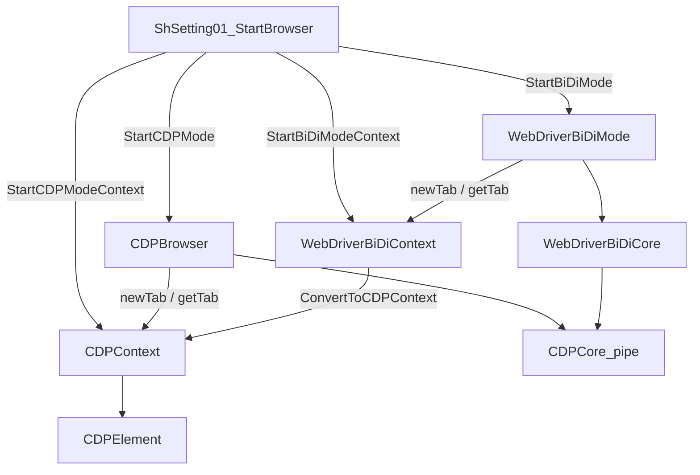

# アーキテクチャ

このキットは Playwright / Puppeteer と同じく、**ブラウザ → ページ（コンテキスト）→ 要素** の層で考えます。

## CDP スタック

| クラス | 役割 |
| --- | --- |
| `CDPCore` | `--remote-debugging-pipe` ロジックで CDP 送受信 |
| `CDPCoreViaWebSocket` | WebSocket(`--remote-debugging-port`)ロジックでの CDP 送受信（既存セッション） |
| `CDPBrowser` | プロセス起動・タブ一覧・ブラウザ単位の `ExecuteCDP` |
| `CDPContext` | 1 タブ分のナビ・JS・要素検索・イベント |
| `CDPElement` | クリック・入力・属性・Shadow DOM / iframe |
| `BiDiCDPJson` | CDP / BiDi 応答の高速 JSON ビュー |

## BiDi スタック

| クラス | 役割 |
| --- | --- |
| `WebDriverBiDiCore` | `mapperTab.js`（chromium-bidi）を CDP 上に載せ BiDi を中継 |
| `WebDriverBiDiMode` | セッション・タブ・購読・`ExecuteBiDi` |
| `WebDriverBiDiContext` | 1 browsing context のナビ・`jsEval`・CDP 変換 |

BiDi は内部的に CDP パイプ（または WebSocket）の上で動きます。足りない操作は次のどちらかで CDP 実行可能です。

- `WebDriverBiDiContext.ConvertToCDPContext`
- BiDi+ `goog:cdp.sendCommand`（[生プロトコル拡張](/guides/extend-raw-protocol)）

## 設定シートの位置づけ

`ShSetting01_StartBrowser` は「exe パス・プロファイル・起動引数等」を読み、上記スタックを組み立てる **エントリポイント** です。日常利用ではクラスを `New` せず、`Start○○ModeContext` を使うのが安全です。

## 通信経路

PipeルートとWebSocketルートの2種類に対応しております。  

- **Pipeルート**: `--remote-debugging-pipe`として起動します。同一PCで自動化する場合はこれ1択です。
- **WebSocketルート**: `--remote-debugging-port=9222`で起動しているブラウザに接続してから自動化を行います。（ガイドの WebSocket 節は後続。現状はデモ `Demo_CDP` / `Demo_WebDriverBiDi` を参照）

## 関連

- [CDP と BiDi](/concepts/cdp-vs-bidi)
- [再接続 (reattach)](/guides/reattach)
