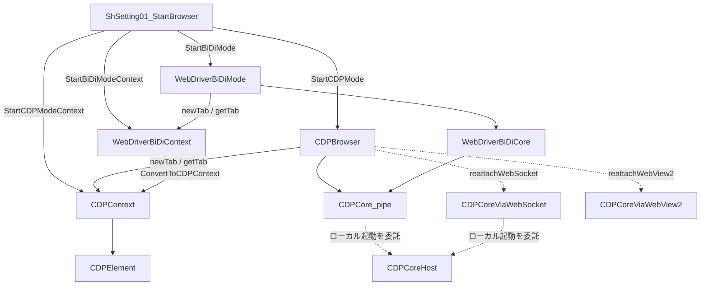

# アーキテクチャ

このキットは Playwright / Puppeteer と同じく、**ブラウザ → ページ（コンテキスト）→ 要素** の層で考えます。

## CDP スタック

| クラス | 役割 |
| --- | --- |
| `CDPCore` | `--remote-debugging-pipe` ロジックで CDP 送受信 |
| `CDPCoreViaWebSocket` | WebSocket(`--remote-debugging-port`)ロジックでの CDP 送受信（既存セッション、または `RunWebSocketModeBrowserCDP` による起動込み接続） |
| `CDPCoreViaWebView2` | WebView2（`ICoreWebView2`）を直接叩く3つ目のtransport。COM/vtableと機械語サンク経由でCDPコマンドを送受信（v3.0.0〜） |
| `CDPCoreHost` | ローカルPC上のブラウザプロセスに関する機能（起動・ポリシーチェック・後始末など）を集約。WebView2は対象外（v3.0.0〜、[`CDPBrowser`/`CDPCore`から分離](/stories/birth-story)） |
| `CDPBrowser` | プロセス起動・タブ一覧・ブラウザ単位の `ExecuteCDP` |
| `CDPContext` | 1 タブ分のナビ・JS・要素検索・イベント |
| `CDPElement` | クリック・入力・属性・Shadow DOM / iframe |
| `BiDiCDPJson` | CDP / BiDi 応答の高速 JSON ビュー |

`CDPBrowser` / `CDPContext` は、どのtransportで再接続するかに応じて `reattachPipe` / `reattachWebSocket` / `reattachWebView2` の3メソッドを使い分けます（詳細は [再接続 (reattach)](/guides/reattach)）。

## BiDi スタック

| クラス | 役割 |
| --- | --- |
| `WebDriverBiDiCore` | `mapperTab.js`（chromium-bidi）を CDP 上に載せ BiDi を中継 |
| `WebDriverBiDiMode` | セッション・タブ・購読・`ExecuteBiDi` |
| `WebDriverBiDiContext` | 1 browsing context のナビ・`jsEval`・CDP 変換 |

BiDi は内部的に CDP パイプ（または WebSocket）の上で動きます。足りない操作は次のどちらかで CDP 実行可能です。

- `WebDriverBiDiContext.ConvertToCDPContext`
- BiDi+ `goog:cdp.sendCommand`（[低レイヤー BiDi / CDP コマンドについて](/guides/extend-raw-protocol)）

## 設定シートの位置づけ

`ShSetting01_StartBrowser` は「exe パス・プロファイル・起動引数等」を読み、上記スタックを組み立てる **エントリポイント** です。日常利用ではクラスを `New` せず、`Start○○ModeContext` を使うのが安全です。

## 通信経路

Pipe・WebSocket・WebView2 の3ルートに対応しております。

- **Pipeルート**: `--remote-debugging-pipe`として起動します。同一PCで自動化する場合はこれ1択です。
- **WebSocketルート**: `--remote-debugging-port` で起動しているブラウザに接続してから自動化を行います。`RunWebSocketModeBrowserCDP` を使えばローカルブラウザの起動から一気に行うことも可能です。[WebSocket モードでの制御について](/websocket/design) を参照。
- **WebView2ルート**（v3.0.0〜）: デバッグポートもパイプも使わず、WebView2 SDK（`ICoreWebView2`）を直接叩いて CDP をやり取りします。ExcelのUserFormにブラウザを埋め込みたい場合の経路です。[WebView2モードでの制御について](/webview2/design) を参照。

## 関連

- [設計思想](/concepts/design-philosophy)
- [CDP と BiDi](/concepts/cdp-vs-bidi)
- [再接続 (reattach)](/guides/reattach)
- [WebSocketモードでできること](/websocket/capabilities)
- [WebView2モードでできること](/webview2/capabilities)
- [コアロジック徹底比較](/core-comparison/) — Puppeteer / Playwright の実ソースとの突き合わせ
