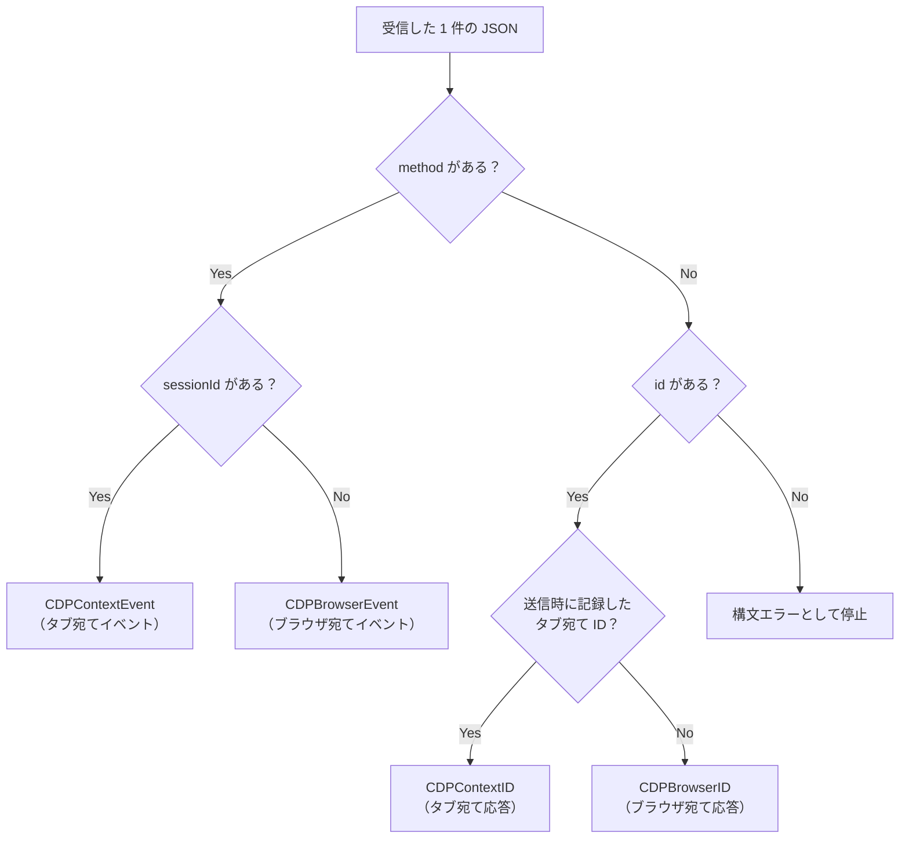

# ディスパッチとイベント配信

[前のページ](/core-comparison/transport)で1件の JSON 文字列を切り出せました。次はそれを **「誰に届けるか」** の判定です。ここが CDP ライブラリの心臓部にあたります。

## 1. CDP メッセージは3種類しかない

ブラウザから流れてくる JSON は、突き詰めると次のパターンに分かれます。

| 形 | 意味 | 届け先 |
| --- | --- | --- |
| `{"id":1,"result":{...}}` | 送ったコマンドへの応答 | その ID で待っている呼び出し元 |
| `{"method":"Page.loadEventFired","params":{...}}` | 非同期イベント | 購読者全員 |
| いずれかに `"sessionId":"ABC..."` が付く | 特定のタブ宛て | そのタブ |

`sessionId` は「1本の接続を複数のタブで多重化する」ための仕組みです。これがあるおかげで、タブを切り替えるたびに接続を張り直す必要がありません。

::: info なぜ多重化が効くのか
`sessionId` を使わない実装では、タブを切り替えるたびに WebSocket を切断して対象タブ専用の URL へ繋ぎ直すことになり、切り替えのたびにソケットの再接続コストが発生します。3者はいずれも**1本の接続を維持したまま宛先だけを切り替える**方式で、タブ間の往復コストが実質ゼロです。
:::

## 2. 3者の振り分けロジック

### Playwright ―― 2段構え（接続 → セッション）

`CRConnection` はまず `sessionId` だけを見て担当セッションへ丸投げします。

```ts
// playwright-core/src/server/chromium/crConnection.ts
async _onMessage(message: ProtocolResponse) {
  if (message.id === kBrowserCloseMessageId)
    return;
  const session = this._sessions.get(message.sessionId || '');
  if (session)
    session._onMessage(message);
}
```

`sessionId` が無いメッセージは `''`（空文字）をキーとするルートセッションに向かいます。**「ブラウザ全体宛て」を「空の sessionId を持つ特別なセッション」として扱う**のがうまいところです。

受け取った側の `CRSession` が、はじめて「応答か / イベントか」を判定します。

```ts
_onMessage(object: ProtocolResponse) {
  if (object.id && this._callbacks.has(object.id)) {
    // 応答 → Promise を解決
  } else if (object.id && object.error?.code === -32001) {
    // 閉じたセッション宛て → 無視
  } else {
    // イベント → emit
    Promise.resolve().then(() => {
      (this.emit as any)(object.method as any, object.params);
    });
  }
}
```

### Puppeteer ―― 1つの関数で3分岐

`Connection.onMessage` は `Target.attachedToTarget` / `detachedFromTarget` を先に特別扱いしてセッションの生成・破棄を済ませたうえで、本題の振り分けに入ります。

```ts
// puppeteer-core/src/cdp/Connection.ts
if (object.sessionId) {
  const session = this.#sessions.get(object.sessionId);
  if (session) {
    session.onMessage(object);
  }
} else if (object.id) {
  if (this.#callbacks.has(object.id)) {
    // 応答 → resolve / reject
  }
} else {
  this.emit(object.method, object.params);
}
```

### StarterWebScrapingKit ―― 判定順は同じ、出口が4本

`CDPCore.cls` の `BrowserReceivedDataCheck` も、同じ材料（`method` / `sessionId` / `id`）で同じ判定をしています。

```vb
'--------- 1. ブラウザからのイベントか？ ---------
If CDPNode.ExistsKey("method") Then
    AsynchronousEventName = CDPNode.StringKey("method")

    '--------- 2. タブに対する非同期イベントか？ ---------
    If CDPNode.ExistsKey("sessionId") Then
        sessionID = CDPNode.StringKey("sessionId")
        RaiseEvent CDPContextEvent(AsynchronousEventName, CDPJsonString, sessionID)
    Else
        RaiseEvent CDPBrowserEvent(AsynchronousEventName, CDPJsonString)
    End If
Else
    '--------- 2. `id`項目があるか？ ---------
    If CDPNode.ExistsKey("id") Then
        ResultCommandID = CDPNode.NumberKey("id")

        '--------- 3. タブに対するCDP-Jsonコマンド結果か？ ---------
        If DictionarySessionID.Exists(ResultCommandID) Then
            sessionID = DictionarySessionID(ResultCommandID)
            RaiseEvent CDPContextID(ResultCommandID, CDPJsonString, sessionID)
            DictionarySessionID.Remove (ResultCommandID)
        Else
            RaiseEvent CDPBrowserID(ResultCommandID, CDPJsonString)
        End If
    Else
        '構文エラーとして停止
    End If
End If
```

コマンド応答には `sessionId` が付かないことがあるため、**送信時に「この ID はどのタブ宛てか」を `DictionarySessionID` に記録しておき、応答が返ったら突き合わせる**という方式を取っています。これは Puppeteer が `session.hasCallback(object.id)` で全セッションを走査して同じ問題を解いているのと、目的が同じ処理です。



## 3. 同じ構造を、違う場所で表現している

3者の違いは判定ロジックではなく、**「ブラウザ宛て / タブ宛て」の区別をどこで表現するか**です。

| | 区別の表現方法 |
| --- | --- |
| **Playwright** | `Map<sessionId, CRSession>` の**引き先オブジェクト**が違う（ルートは空キー） |
| **Puppeteer** | `Map<sessionId, CdpCDPSession>` の**引き先オブジェクト**が違う |
| **StarterWebScrapingKit** | **イベントのシグネチャ自体**が違う（`sessionID` 引数の有無） |

Node 側は「セッションというオブジェクトに委譲する」ことで区別しますが、VBA には後から動的にイベントを生やす仕組みがありません。そこで **CDP のプロトコル構造（フラットなイベント / セッション付きイベント）を、そのまま4本のイベント宣言として型で表現する**という解を採っています。

```vb
' CDPCore.cls
Public Event CDPBrowserEvent(methodName As String, RawJson As String)                     'ブラウザに対する非同期イベント
Public Event CDPBrowserID(id As Long, RawJson As String)                                  'ブラウザに対するCDPコマンド結果
Public Event CDPContextEvent(methodName As String, RawJson As String, sessionID As String) 'タブに対する非同期イベント
Public Event CDPContextID(id As Long, RawJson As String, sessionID As String)              'タブに対するCDPコマンド結果
```

購読側は `sessionId` を生 JSON から自力で掘り出す必要がなく、**最初から引数として受け取れます**。

## 4. イベント配信 ―― EventEmitter と WithEvents

Playwright / Puppeteer はどちらも（独自拡張込みで）`EventEmitter` を使い、`Map<event, Handler[]>` の形で1つのイベントに複数のリスナーを保持します。

VBA 側は `RaiseEvent` / `WithEvents` という COM のコネクションポイント機構です。実装方式はまったく違いますが、**「同一イベントに複数の購読者がぶら下がれる」という性質は同等**です。同じ `CDPCore` インスタンスに対して、独立した拡張クラスを何個でも貼れます。

```vb
' 拡張クラス側。コア（CDPCore.cls）は一切編集しない
Private WithEvents ex_CDPCore As CDPCore

Private Sub ex_CDPCore_CDPBrowserEvent(methodName As String, RawJson As String)
    Select Case methodName
        Case "Browser.downloadWillBegin"
            ' ← 自分の処理を書く
    End Select
End Sub
```

これは同梱の `exCDP_DownloadWatcher` などが実際に採っている形で、拡張クラス A と B が両方 `Browser.downloadProgress` を購読しても互いに干渉しません。詳しくは [イベント購読](/guides/events) を参照してください。

| | イベント配信の仕組み | 複数購読 | 型チェック |
| --- | --- | --- | --- |
| **Playwright / Puppeteer** | `EventEmitter`（実行時のハンドラ配列） | ✅ | TypeScript による静的型付け |
| **StarterWebScrapingKit** | `RaiseEvent` / `WithEvents`（COM コネクションポイント） | ✅ | シグネチャ不一致はコンパイル時に検出 |

## 5. ただし「いつ配信されるか」は別問題

ここまでの振り分けロジックは3者ともほぼ同じですが、**その `RaiseEvent` を誰が呼ぶのか**という点で決定的な違いがあります。

Node 側は I/O 完了をランタイムが検知して自動的にコールバックを起動しますが、VBA では `TakeEvents` を能動的に呼ぶ必要があります。

```vb
' 届いている分をまとめて吸い上げ、1件ずつ RaiseEvent する
Public Sub TakeEvents(Optional StopApiError As Boolean = True, Optional destruction As Boolean)
```

これは実装の巧拙ではなく **VBA にイベントループが存在しない**ことに由来する構造的な差です。次のページで詳しく扱います。

## まとめ

| 観点 | 評価 |
| --- | --- |
| `method` / `id` / `sessionId` の3分岐 | ✅ 構造的にほぼ同一のロジック |
| セッション多重化（再接続なしのタブ切替） | ✅ 3者とも同じ発想 |
| コマンド ID と応答の待ち合わせ | ✅ 同じ課題を別ルートで解決 |
| 1イベント複数購読 | ✅ 概念的に同等 |
| 配信のトリガー | ❌ 自動（イベントループ）か、手動ポンプか |

## 次に読む

- [非同期実行とイベントループ](/core-comparison/async) — 配信トリガーの差はどこから来るのか
- [イベント購読](/guides/events) — このキットでの実際の書き方
- [マルチタブ](/guides/multi-tab) — `sessionId` 多重化のユーザー側の見え方
