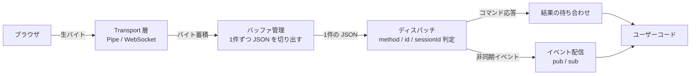

# コアロジック徹底比較 ― StarterWebScrapingKit vs Puppeteer / Playwright

Puppeteer と Playwright は、Google と Microsoft がそれぞれ何年もかけて磨き上げてきたブラウザ自動化の標準ツールです。一方このキットは、Excel VBA という「ブラウザ自動化には普通誰も選ばない言語」だけで CDP を喋ります。

では、**その心臓部（コアロジック）はどれくらい違うのか**。

このコーナーは、その疑問に「印象」ではなく**実際のソースコードの突き合わせ**で答えるための検証レポートです。

## 何を比較したのか

「コア」の範囲を、CDP メッセージがブラウザから届いてユーザーコードに渡るまでの一連の経路と定義しました。

この5つの層それぞれについて、3者の実装を並べています。加えて「クラス構成をどの軸で切ったか」と「コア以外にまだ残っている差」も扱います。

## 検証の前提

::: info 検証方法
Puppeteer / Playwright については、npm パッケージのドキュメントではなく **GitHub の実ソースツリー**（`packages/puppeteer-core/src`、`packages/playwright-core/src`）を直接読み、該当箇所のファイル名と行番号を添えています。StarterWebScrapingKit 側も同様に `VBAProject/Class/*.cls` の実コードを参照しています。

いずれも 2026年8月時点のソースに基づきます。3者とも活発に更新されるため、行番号は将来ずれる可能性があります。
:::

比較対象は次の3つに絞りました。VBA 製の他ライブラリとの比較はここでは扱いません。

| | 言語 / ランタイム | 位置づけ |
| --- | --- | --- |
| **StarterWebScrapingKit** | Excel VBA（外部 exe なし） | 個人・少人数によるスターターキット |
| **Puppeteer** | TypeScript / Node.js | Google 発の CDP 自動化ライブラリ |
| **Playwright** | TypeScript / Node.js | Microsoft 発のマルチエンジン自動化フレームワーク |

## 結論サマリ

先に結論から言うと、**「CDP を正しく捌く」というアルゴリズムの部分は肩を並べており、差が出るのはその外側**でした。

| 観点 | 評価 | 詳細 |
| --- | --- | --- |
| Pipe の NUL 区切りバッファ管理 | ✅ 同等 | [Transport 層とバッファ管理](/core-comparison/transport) |
| WebSocket のフレーム解析 | ⚠️ 土俵が違う | Node 側は `ws` ライブラリに丸投げ、こちらは自前実装 |
| `method` / `id` / `sessionId` の振り分け | ✅ 同等 | [ディスパッチとイベント配信](/core-comparison/dispatch) |
| イベントの pub / sub 設計 | ✅ 概念的に同等 | `EventEmitter` ⇄ `RaiseEvent` / `WithEvents` |
| 非同期実行 | ❌ 言語仕様の壁 | [非同期実行とイベントループ](/core-comparison/async) |
| Browser / Page / Element の三層モデル | ✅ 完全に一致 | [クラス構成の考え方](/core-comparison/classes) |
| クラス分割の粒度・抽象層 | ❌ VBA の制約により粗い | 同上 |
| テストによる品質保証 | ⚠️ 網羅性と自動化に差 | [残る差分と、埋まらない差](/core-comparison/gaps) |
| エラー分類・自動リカバリ | ❌ 体系化されていない | 同上 |
| マルチブラウザエンジン対応 | ❌ Chromium 限定 | 同上 |

::: tip このコーナーの要旨
コアのアルゴリズムは、3者とも**独立に同じ答えへたどり着いています**。CDP というプロトコルを正しく捌く方法は結局1つしかないからです。

残っている差は「設計センス」ではなく、**言語が用意してくれる下駄（Promise、`ws`、`JSON.parse`）を履けるかどうか**と、**何人年分のエンジニアリング投資が注がれたか**という、別の軸の話でした。
:::

## 各ページの内容

| ページ | 扱う内容 |
| --- | --- |
| [Transport 層とバッファ管理](/core-comparison/transport) | Pipe / WebSocket の選択、NUL 区切りフレーミング、O(n²) 回避策の比較 |
| [ディスパッチとイベント配信](/core-comparison/dispatch) | `method` / `id` / `sessionId` の3分岐、セッション多重化、pub / sub |
| [非同期実行とイベントループ](/core-comparison/async) | Promise と `ExecuteCDPAsync`、イベントループ不在という根源的制約 |
| [クラス構成の考え方](/core-comparison/classes) | Browser → Page → Element という共通モデルと、分割粒度・抽象層の差 |
| [残る差分と、埋まらない差](/core-comparison/gaps) | テスト量、エラー階層、型安全性、エコシステムの厚み |

## 関連

- [アーキテクチャ](/concepts/architecture) — このキット側のクラス構成
- [設計思想](/concepts/design-philosophy) — なぜ「コア」に全リソースを振ったのか
- [WebSocket モードの設計思想](/websocket/design) — 生 WinSock で組んだ理由
