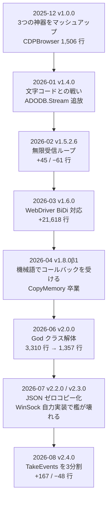

# 寄せ集めのマクロブックは、どうやってコアエンジンになったのか

::: tip 誕生秘話
〜v1.0.0 から v2.4.0 まで、61 個のタグに刻まれた 235 日の記録〜
:::

かつて、Windows と Excel を愛する開発者の手元には、1本の魔法の杖がありました。

```vb
Set objIE = CreateObject("InternetExplorer.Application")
```

たったこの1文で、外部ライブラリも環境構築も要らず、ブラウザが立ち上がった。IE のサポート終了は、その手軽さを丸ごと奪っていきました。

> 「あの頃の、インストール不要でブラウザを意のままに操れる手軽さを、現代の技術でなんとか復活させることはできないだろうか」

いま `git tag` を叩くと、61 個のタグが並びます。先頭は **2025年12月20日 の `v1.0.0`**、末尾は **2026年8月12日 の `v2.4.0`**。その間、235日。

いまでこそ「Excel VBA 単体で CDP と WebDriver BiDi を喋るコアエンジン」などと名乗っていますが、最初のコミットに詰まっていたのは、正直に言えば **他人のライブラリの寄せ集め** でした。

この記事は、そこから今日までに起きたことを、**コミットログとコード差分**を骨格に、当時の気持ちも織り交ぜて振り返る記録です。技術解説ではありません。数字と、そのとき自分が書いたコミットメッセージと、途中で何度も心が折れそうになった夜の話です。

---

## 序章 — 「3つの神器」を1つのブックに詰めた日

`v1.0.0` の README には、こう書いてありました。

> 本ツールは、現代のWeb技術を攻略するために必須となる「3つの神器」を実装しています。
>
> 1. 🚀 **REST WebAPI (WinHTTP 5.1)**
> 2. 🤖 **ブラウザ自動操作 (CDP via Pipe)**
> 3. ⚡ **WebSocket 通信 (Beta)**

そして、その下に続くのが `Credits & Acknowledgments` の一覧です。

| 借りたもの | 元のプロジェクト |
| --- | --- |
| CDP 制御・パイプ通信の基盤 | [Chromium-Automation-with-CDP-for-VBA](https://github.com/longvh211/Chromium-Automation-with-CDP-for-VBA) |
| WebSocket 実装のコアロジック | [ChromeControler-No-Selenium-WebDriver-VBAJSON](https://github.com/24000/ChromeControler-No-Selenium-WebDriver-VBAJSON) |
| WinHTTP 5.1 ラッパー | [VBA-Web](https://github.com/VBA-Tools-v2/VBA-Web) |
| JSON パーサー | `WebJsonConverter.cls` (from SeleniumVBA) |

README 自身が、こう白状しています。

> このツールは、世界中のVBA職人が公開してくれた素晴らしいライブラリの数々を、実務で使いやすい形に統合（マッシュアップ）したものです。

クラスモジュールは 13 個。そのうち CDP 制御に関わるのは `CDPBrowser` `CDPCore` `CDPElement` `CDPJConv` の **4 個だけ**で、残りは借りてきた WinHTTP ラッパーと WebSocket 実装でした。`CDPBrowser.cls` は **1,506 行**。この時点でのオリジナリティは「1つのブックにまとめたこと」しかありません。

Selenium や WebDriver を入れれば Edge は動かせる。それは誰もが知っている常識でした。けれど、うちの職場は **野良の exe をフォルダに置くこと自体がポリシーで禁じられていた**。先人たちのパイプ実装も WebSocket 実装も、更新は止まっていて、最新の環境では実用に届かない。

::: info このときの立ち位置
自分で書いたのは接着剤だけ。CDP を捌くロジックの本体は、longvh211 氏の *CDP Framework* をほぼそのまま使っていました。以降しばらく、開発は「本家の更新に追従する」ことが中心になります。

この時点ではまだ、高負荷をかけた瞬間に待ち受ける「低レイヤの理不尽な洗礼」を、知る由もありませんでした。
:::

---

## 第1章 — 本家に追いつく日々（v1.1.0 〜 v1.3.1.1）

年末年始は、ひたすら本家追従でした。`v1.2.0` のタグメッセージは「CDP Framework 3.0.0 への更新に伴う様々な改修作業」。差分は 6 ファイル、**1,410 行追加 / 555 行削除**。`CDPBrowser.cls` と `CDPElement.cls` がまとめて 894 行・875 行と書き換わっています。

ただ、この時期のコミットログをよく見ると、**追従に混ざって「自分の改良」が顔を出し始めて**います。

```text
2026-01-10 InStr+Rightループによるバッチ処理から、ストリーム処理に変更し、パフォーマンスを向上
2026-01-10 `core.readProcCDP`による受信ループの最適化
2026-01-09 `InStr`は、見つからなくても0を返すので、ダイレクトで返却するようにする
```

受信バッファを `Right$` で切り詰めながら回すと、メッセージが増えるほど遅くなる。それをストリーム処理に置き換えた、この 1 月10日のコミットが、たぶん **最初の「本家に無い改良」** です。

そして `v1.3.1.1`。差分はこれだけでした。

```text
 VBAProject/Class/CDPBrowser.cls | 2 +-
 1 file changed, 1 insertion(+), 1 deletion(-)
```

`getTab` の `SearchType` が反映されない、というだけのバグ。**1 行のためにタグを切った**わけですが、この「小さくても切る」癖が、後に 61 個という異常なタグ数を生むことになります。

同じ頃、もう一つだけ、どうしても欲しいものがありました。SeleniumVBA は基本的に「こちらから指示を出し、返事を待つ」一方通行です。ブラウザの内側で何かが起きた瞬間――ページが読み終わった、ダイアログが開いた、エラーが出た――を、その場で拾いたかった。

受信ループにメスを入れ、届いたイベントを `Dictionary` に溜めて任意のタイミングで取り出す。`v1.1.0` のタグメッセージ「空コマンドを利用したイベント取得に対応」は、その基礎です。操り人形が、**ブラウザの心拍を聴ける双方向の機械** に変わり始めた夜でした。

---

## 第2章 — 文字化けとの戦い、そして `ADODB.Stream` 追放（v1.4.0）

2026年1月15日。1日で 7 ファイル、**325 行追加 / 154 行削除**。タグメッセージは「文字コード関連の大幅見直し」です。

この日のコミットは、並べるとそのまま戦闘記録になっています。

```text
`ADODB.Stream`の置き換え準備
UTF-8のバイト配列で、`WriteFile`を実行する仕組みを導入
終端nullを除去するかを切り替えるスイッチングを実装
WebSocketの送受信にて、エンコード処理方法を変更
日本語と絵文字を含んだ送信兼通知テストができるように変更
Base64をファイル化する際も、`ADODB.Stream`から置き換え
```

VBA は Shift_JIS の世界で生きていて、相手の Chromium は UTF-8 が絶対です。日本語をそのまま送ると、こんな JSON エラーが返ってきました。

```json
{"error":{"code":-32700,"message":"JSON: invalid string at position 52"}}
```

VBA で「UTF-8 変換」と検索すると、必ず `ADODB.Stream` が出てきます。動く。けれど、どうしても拭えない違和感がありました。

> 「『Stream（データの流れ）』という名前のオブジェクトなのに、なぜテキストの文字コードを変換するためだけに使わされているんだ」

おまけにそのまんま使うと BOM 付きで出てくる。`.Position` をいじるおまじないまで含めて、不格好すぎた。

そこで生まれたのが **`CharacterCodeConversion.cls`（新規 221 行）**。`WideCharToMultiByte` / `MultiByteToWideChar` を直接叩いて自前で変換する、専任のクラスです。「サイズ確認のための1回目、本番の2回目」という、C 言語っぽい2往復の儀式。手間だけど、高級オブジェクトを挟むより速く、謎の Position 操作も要らない。`WebSocketCommunicator.cls` からは 94 行が消えました。

::: warning 伏線
ここで「敵」として追放された `ADODB.Stream` は、**5か月後に味方として帰ってきます**。第9章で回収します。
:::

続く `v1.4.0.1` では `Logger.cls`（新規 230 行）が生まれ、`CDPJConv.cls` が `WebJsonConverter.cls` にリネームされました。ログと JSON、地味ですが「借り物の名前」を自分の命名規則に塗り替え始めた瞬間でもあります。

---

## 第3章 — 小数点以下が伸びていく季節（v1.5.x）

`v1.5.0` から `v1.5.4.1` まで、タグは **15 個**。`v1.5.2` に至っては `.1` `.3` `.5` `.6` `.7` `.8` `.9` と枝番が伸び続けます。2月はほぼこれで溶けました。

なかでも一番怖かったのが `v1.5.2.6`「無限受信ループの修正」です。

```text
 VBAProject/Class/CDPBrowser.cls | 106 ++++++-----------------
 1 file changed, 45 insertions(+), 61 deletions(-)
```

**追加より削除のほうが多い**。無限ループの原因は、だいたい「良かれと思って足した判定」です。パイプから読むべきデータがもう無いのに、終端の判定条件が甘くて延々と回り続ける。直し方は、足すのではなく削ることでした。2 日後の `v1.5.2.7`「破棄側のロジックも終端null判定を加える」で、ようやく反対側の穴も塞いでいます。

この時期の主役は `invokeMethod` でした。`v1.5.1`・`v1.5.3` と 2 度改良し、`v1.5.4` でついに **非同期版** を追加。`CDPBrowser.cls` は 1,983 行から **2,471 行** に膨らみます。

動機は、自動化開発者を沈める悪魔の仕様でした。JavaScript の `alert` が出ると Chrome は Pipe の返事を一切返さず、VBA は永遠に待ち続ける。だから「投げっぱなし」が要った。そして投げたあとの「ダイアログが開いたぞ」は、`v1.1.0` で血を吐いて作ったイベント `Dictionary` が裏で拾う。過去の苦労が、実戦の武器として蘇った瞬間でした。

まだこのときは、それを問題だと思っていませんでした。

同じ時期、本家の Issues を覗いて、現場の叫びにも突き当たります。グループポリシーでリモートデバッグが禁止されていると、Edge はエラーも出さず **起動はするのに通信だけサイレント失敗** する。個人 PC では `WMI` でポリシーを読めて「これでいける」と確信したのに、職場の EDR はそれを **マルウェアの偵察と同じ挙動** として一瞬でブロックした。

> 「WMI やシェルが駄目なら、Windows に怪しまれない、最もお行儀の良い低レイヤ API を使うしかない」

のちの `v1.7.3.1` で `RegGetValueW` に切り替える伏線は、この「セキュリティの番兵」との出会いでした。

---

## 第4章 — 19,879 行が飛び込んできた日（v1.6.0）

2026年3月5日、コミットログの空気が突然変わります。

```text
2026-03-05 `Antigravity`による基盤づくり
2026-03-05 参照元の汚いコードも置いておく()
2026-03-05 動かなかったのでひとまず、動くようにしておく
```

2 行目の `()` に、当時の気分が全部入っています。

`v1.5.4.1` → `v1.6.0β1` の差分は、それまでとは桁が違いました。

| ファイル | 行数 |
| --- | --- |
| `assset/mapperTab.js` | **+19,879**（新規） |
| `VBAProject/Class/WebDriverBiDiCore.cls` | **+1,183**（新規） |
| `VBAProject/Modules/Demo_WebDriverBiDi.bas` | +438（新規） |
| **合計** | **21,618 行追加 / 11 行削除** |

きっかけは、SeleniumVBA の Discussions に刺さった一言でした。「将来的には CDP は WebDriver BiDi に置き換わる。CDP には未来がない」。論理としては正しい。けれど現場は違う。**Edge は最初から入っている。置けないのは野良の `WebDriver.exe` だけ**。数年後に CDP が表舞台から消えたら、これまで作ったものは遺物になる。

> 「……だったら、やってやろうじゃないか」

WebDriver BiDi 対応です。`mapperTab.js` という 2 万行の JavaScript をリポジトリに迎え入れ、**それを Excel のテーブルに保存してブラウザへ注入する**という仕組みを作りました。

> 2026-03-06 `mapperTab.js`のコードをExcelテーブルに保存する仕組みを実装

なぜ 2 万行の JS を Excel のセルに詰め込むことになったのか、そこに至るまでの経緯は独立した記事があります。

👉 **[なぜ `WebDriver` なしでブラウザ自動化ができるとわかったのか](/stories/bidi-story)**

そしてこの章には、**もう一つの伏線**が埋まっています。

> 2026-03-08 `payload`抽出特化文字列操作 × エスケープ解除により、Jsonパーサーを回避

当時の JSON パーサーが遅すぎて、BiDi のレスポンスをまともに捌けなかった。だから「パーサーを使わずに文字列操作で `payload` だけ引っこ抜く」という力技に逃げたのです。**この負債は 4 か月後に清算されます**（第9章）。

---

## 第5章 — 18,827 行が動いたのに、中身はほぼ同じだった件（v1.6.2）

タグ一覧を眺めていて、いまだに笑ってしまうのが `v1.6.2` です。タグメッセージは「責務の分離」。差分はこうでした。

```text
 29 files changed, 18827 insertions(+), 18776 deletions(-)
```

29 ファイル。ほぼ全ソース。1万8千行が入れ替わっています。

……が、実際に手を入れた機能は「CDP 側のイベント検知方式を利用して、BiDi コマンドの送受信を行う」ことだけ。残りは全部これです。

```text
2026-03-22 Restore line endings
```

**改行コード（CRLF / LF）の事故。** VBE と Git の間で改行が化け、全ファイルが「全行書き換え」として記録されてしまった。追加と削除がほぼ同数（18,827 / 18,776）なのがその証拠です。

::: tip 教訓
同じ 3月22日、リポジトリに `.gitattributes` が追加されています。コミットメッセージは「Gitリポジトリの仕様に対処」。`v1.0.0` の時点には存在せず、`v2.4.0` にはある。**ファイル一覧の差分にも、事故の跡は残る**という話です。
:::

---

## 第6章 — `CDPElement` を作り直す（v1.7.0）

3月末、今度は要素操作の番でした。`v1.7.0β1` の差分を見ると、妙なことになっています。

```text
 VBAProject/Modules/Demo_CDP.bas | 393 ++++++++++++++++++-
```

**デモコードが 393 行増えている。** コミットログを見ると理由がわかります。

```text
2026-03-29 公式ドキュメントにある type / subtype の全候補を網羅するDemoコードを追加
```

JavaScript を実行して結果を受け取るとき、CDP は `type`（`object` / `function` / `string` / `undefined`…）と `subtype`（`array` / `null` / `node` / `promise`…）で値の正体を教えてくれます。その全パターンを踏むデモを先に書いて、**どこで壊れるかを洗い出した**わけです。

そして本番の `v1.7.0` で、そのデモは 373 行ぶん消えます。検証で確かめた挙動が、本体側の実装に昇格したからです。

```text
2026-03-29 `CDPElement`は、`ObjectID`方式に刷新
```

本家は、取得した要素をブラウザの `window` にランダムなグローバル変数として生やし、VBA 側でその名前を管理していました。動く。けれど CDP を理解した今となっては、あまりにも不格好だった。それだけではない。ボット検知は、**`window` を汚す自動操作を一発で見破る**。

> 「本物のブラウザ自動操作は、`window` を1文字も汚すことなく、裏側のメモリだけで静かに行われるべきだ」

`objectId`（JavaScript ヒープ上のハンドル）方式に切り替えたことで、要素操作と JavaScript 実行が同じ土俵に乗りました。外見のメソッドはほぼそのままで、中身だけ入れ替える。`CDPElement.cls` は 601 行が書き換わっています。テセウスの船のような手術でした。

もっとも、切り替えには代償もありました。

```text
2026-04-01 後始末後の`ObjectID`を開放する仕組みを導入
```

`objectId` はブラウザ側のメモリを掴んだままになるので、`Runtime.releaseObject` で明示的に返さないと漏れる。**手動メモリ管理が VBA 側に持ち込まれた**瞬間でもありました。

---

## 第7章 — 機械語を書いた春（v1.8.0β1）

4月下旬。WebSocket の安定化に取りかかったところで、この開発で一番おかしなコミット群が生まれます。

```text
2026-04-25 機械語の微調整
2026-04-25 機械語の微調整 part2
2026-04-25 機械語の微調整 part3
2026-04-26 PostMessageW 方式にシフト
2026-04-26 UIスレッドで生ポインタを触ってしまう経路の排除
2026-04-26 不正長コピーの修正
```

やりたかったのは単純です。**`WinHttpSetStatusCallback` の通知を VBA で受け取りたい。**

しかし VBA には、OS のスレッドから飛んでくるコールバックを安全に受け止める手段がありません。素直に `AddressOf` を渡すと、ワーカースレッドから VBA ランタイムを触ることになって即クラッシュします。

そこで取った手段が、**その場で x64 の機械語を組み立てて、ワーカースレッドからは `PostMessageW` を叩くだけの薄いサンクを噛ませる**というものでした。実際のコードには、こんなコメントが並んでいます。

```vb
'48 89 D1           MOV RCX, RDX            ; hwnd = dwContext
'49 C1 E2 20        SHL R10, 32
'4D 0B D3           OR R10, R11
'48 B8 <imm64>      MOV RAX, postMessageProc
'FF D0              CALL RAX
```

そして、その `PostMessageW` の宛先として用意されたのが `WinHttpSetStatusCallbackForm.frm` です。中身を全部載せられるので載せますが、**フォーム定義を除くと `Option Explicit` の 1 行しかありません**。

```vb
Attribute VB_Name = "WinHttpSetStatusCallbackForm"
Attribute VB_PredeclaredId = True
Option Explicit
```

プロシージャはゼロ。画面にも出ません。**ウィンドウハンドルが 1 個欲しい、ただそれだけのために存在する UserForm** です。VBA でウィンドウプロシージャを差し替えるには、まずウィンドウが要る。それ以上の理由はありませんでした。

この期間、`WebSocketCommunicator.cls` は 882 行が書き換わり、全体で **1,671 行追加 / 758 行削除**。そして仕上げがこれです。

```text
2026-04-29 ビット演算で LongLong → Long×2 に分解して、Copymemoryをなくす
2026-04-29 WebSokect関連から、Copymemory卒業
2026-04-29 パッキング問題をVBA標準機能だけで完結させる
2026-04-29 `InitHMAC`で使われてた`RtlMoveMemory`も排除
```

`CopyMemory`（`RtlMoveMemory`）は VBA の定番テクニックですが、一歩間違えるとプロセスごと落ちます。機械語まで書いておきながら、**メモリコピー API は追放する**。矛盾しているようですが、狙いは一貫していました。落ちる可能性のある経路を、1本ずつ潰していくことです。

同じ流れは 4月の別のコミットにもあります。

```text
2026-04-13 `WScript.Shell`によるレジストリ操作はしない
2026-04-13 Base64→Byte変換は、Windows APIで変換する
2026-04-17 WMIを使用しないポリシーチェックに変更
```

`WScript.Shell`、`WMI`、`ADODB.Stream`。**情シスにブロックされうるもの、環境によって挙動が変わるものを、片っ端から外していった**時期でした。

それでも、この機械語サンクは **「WinHTTP のコールバックを VBA で生き延びさせる」ための苦肉の策** でした。デバッグ中にマクロを止めた瞬間、ワーカースレッドからの割り込みが Excel ごと即死させる。その毒を、空の UserForm と x64 の機械語で中和しようとしたのです。

この戦いの決着は、第10章まで持ち越されます。

---

## 第8章 — 3,310 行の怪物を解体する（v2.0.0）

そして、この開発の最大の転換点が来ます。

`v1.8.1.2` の時点で、`CDPBrowser.cls` は **3,310 行** に達していました。ブラウザの起動も、タブの管理も、要素の操作も、イベントの受信も、ログも、全部この 1 ファイルの中にありました。いわゆる **God クラス** です。

追加はできる。でも、どこを触っても別のどこかが壊れる。`v1.7.0.1` のコミットメッセージが象徴的です。

```text
2026-03-31 `WithEvents`との併用に伴う強豪問題を修正
```

（「競合」の変換ミスですが、当時の疲れ具合が伝わるので直さずそのままにしています。）

決定打は、現場の相談でした。社内 Web から毎月、**5アカウント分**の請求書を落とす仕事。非同期を自慢していた自分は、5つ同時に走らせようとした。一瞬でハングした。イベントが「今、5つのうちどのタブ宛てだ」と迷宮に落ちたのです。

1アカウントずつ順番に処理する「反復横跳び」に逃げれば、動く。遅いけれど、動く。

> 「画面が順番に変わっていくんじゃなくて、5つの画面が一斉に、同時に変わっていくあの美しい景色が見たいんだ」

その矜持が、`RaiseEvent` 解体に火をつけました。

2026年5月30日、解体が始まりました。

```text
2026-05-30 `RaiseEvent`で発信するように、レスポンス解析周りを`CDPCore.cls`へ移管
2026-05-30 受信処理と取り出しの責務分離
2026-05-31 大幅な取捨選択作業
2026-06-01 とりあえず、タブ系クラスを用意
2026-06-01 `CDPBrowser`,`CDPCore`にある機能をある程度、排除
```

そこから 6月6日までの**1週間で、15 ファイル・5,887 行追加 / 4,692 行削除**。数字で見ると、こうなりました。

| クラス | v1.8.1.2 | v2.0.0 | 役割 |
| --- | ---: | ---: | --- |
| `CDPBrowser.cls` | 3,310 行 | **1,357 行** | ブラウザ単位の責務だけに |
| `CDPContext.cls` | — | **2,053 行** | 新規。タブ単位の責務 |
| `CDPCore.cls` | 502 行 | **1,076 行** | 通信と配信の心臓部へ |
| `WebDriverBiDiMode.cls` | — | **592 行** | 新規。BiDi 側も同じ形に |

怪物は、**「ブラウザ」「タブ」「通信コア」** の 3 つに割れました。

### 設計を変えた 5 行

解体の中心にあったのは、`CDPCore.cls` に追加されたこの宣言です。

```vb
Public Event CDPBrowserEvent(methodName As String, RawJson As String)
Public Event CDPBrowserID(id As Long, RawJson As String)
Public Event CDPContextEvent(methodName As String, RawJson As String, sessionID As String)
Public Event CDPContextID(id As Long, RawJson As String, sessionID As String)
Public Event ResetCommandID()
```

それまでは、受信ループを回している側が「これは誰宛てのメッセージか」を判断して、直接メソッドを呼びに行っていました。だから `CDPBrowser` が全部を知っている必要があったのです。

`RaiseEvent` に切り替えたことで、コアは **「届いた JSON を種類別に投げるだけ」** になり、`CDPBrowser` と `CDPContext` は **`WithEvents` で自分宛てだけを拾う** 側に回りました。Puppeteer でいう `EventEmitter` と同じ構図です。

::: info クラス名が決まるまで
新しいタブ用クラスは、当初 `CDPTab.cls` という名前でした。6月5日のコミットで最終的に改名されています。

```text
2026-06-05 残りの、‘CDPTab`→`CDPContext`へのリネーム
```

CDP の世界で「タブ」に相当するのは `Target` であり、その中身は `BrowsingContext`。iframe や Worker も同じ器で扱うことを考えると、`Tab` では狭すぎたのです。
:::

この 1 週間の作業を、当時の自分はコミットメッセージでこう呼んでいました。

```text
2026-06-03 劇的ビフォーアフターに合わせたCDPDemoコードの修正
```

起動ボタンを押した瞬間、5つの Edge が一斉にログインページを開き、1ミリも混線せず、それぞれが独立した意志を持ったように請求書を回収していく。

> 「動いた……本当に、あの Excel VBA だけで、ブラウザがシンクロして同時に動いている」

画面上でページが同時に切り替わっていく景色を、しばらく黙って見ていました。

---

## 第9章 — 4か月前の負債を返す（v2.2.0）

第4章の伏線を覚えているでしょうか。BiDi 対応のとき、遅い JSON パーサーを避けるために「文字列操作で `payload` だけ引っこ抜く」という力技に逃げた件です。

通信コアを `WithEvents` で爆速にしたのに、パケットの中身を解析する最深部が、**8年以上更新の止まっていた VBA-JSON 系の完全コピー方式**のままだった。スクリーンショットの巨大な Base64 を食わせると Excel がフリーズし、ネストの深い `returnByValue` は **実行時エラー 28（スタック領域不足）** で落ちる。せっかくの心拍が、解析の入口で窒息していたのです。

6月28日、それを清算する日が来ました。

| ファイル | 変化 | 中身 |
| --- | --- | --- |
| `WebJsonConverter.cls` | **−885 行**（削除） | SeleniumVBA 由来の旧パーサー |
| `BiDiCDPJson.cls` | **+2,998 行**（新規） | 読み取り担当。ゼロコピー方式 |
| `WebJsonConverter.bas` | **+2,374 行**（新規） | 書き出し担当。[VBA-FastJSON](https://github.com/cristianbuse/VBA-FastJSON) |

1 つのパーサーを、**「読む係」と「書く係」に分けて 2 つ入れ直した**格好です。

読み取り側の `BiDiCDPJson.cls` が採ったのは、**JSON 文字列のメモリに `SAFEARRAY` を直接かぶせて、部分文字列を一切コピーせずに読む**（ゼロコピー）という方式でした。パース中に `Dictionary` も `Collection` も生成しません。CDP のレスポンスは 1 件が巨大になりがちなので、ここが効きます。

書き出し側が独立したのは、コマンドの組み立て方を変えたからです。それまでは JSON 文字列を手で連結して作っていたものを、`Dictionary` を組んで最後に一括で文字列化する方式に改めました。

```text
2026-06-28 Dictionaryで全てコマンド組み立てする仕組みに変更
2026-06-30 送信時の`Dictionary`→Json文字列化のみ`VBA-FastJSON`にしておく
```

そして、あの力技が消えます。

```text
2026-06-28 愚直な文字列探索の廃止
2026-06-29 `instr`比較方式を卒業
```

3月8日に「Json パーサーを回避」と書いた自分に、ようやく胸を張れるコミットでした。

### 追放したはずの `ADODB.Stream` が帰ってきた

同じ `v2.2.0` の中に、こんなコミットがあります。

```text
2026-07-02 バイナリストリームを`ADODB.Stream`で受け取り、文字列変換は一括方式に変更
2026-07-02 WebSocketの受信メッセージも、`ADODB.Stream`に蓄積する方式に変更
```

第2章で、文字化けの元凶として追放したはずのクラスです。名前と用途が不一致でダサい、とまで思っていた。

理由は単純で、**役割が変わったから**でした。かつては「文字コード変換をやらせて失敗していた」。今回は「バイト列をひたすら溜め込む器」としてだけ使い、変換は自前の `CharacterCodeConversion.cls` が最後に一括で行います。バッファ蓄積の速さにおいて、`ADODB.Stream` は VBA 標準の文字列連結より圧倒的に速い。`.Position` も `.SetEOS` も、低レイヤのメモリ管理を C++ 層で代行してくれる道具だった。

> 「文字コードの変換器なんかじゃない。その名の通り、Windows のメモリ上で最高速度で動く、インメモリのバイナリバッファそのものだったんだ」

道具が悪かったのではなく、**使いどころを間違えていた**だけだった、という話です。

なお、この高速化には副作用がありました。速くなりすぎて、受信ループ中に Excel が完全に固まるようになったのです。落としどころがこれです。

```text
2026-07-02 1024メッセージ処理ごとに`DoEvents`を呼び出し、パフォーマンス向上させる
```

毎回 `DoEvents` を呼べば UI は生き返りますが、それ自体が重い。**1,024 件に 1 回だけ息継ぎする**、という数字は完全に実測で決めました。

---

## 第10章 — WinSock を自力で書いた日、できなかったことができた（v2.3.0）

ここまで、ブラウザとの通信路は **匿名パイプ一択**でした。`--remote-debugging-pipe` を使う限り、相手はローカルで自分が起動したブラウザだけです。実務の 99% は、それで足りる。

足りないのは、残りの 1% のロマンでした。

起動済みのブラウザを途中から乗っ取る。WebView2 に埋め込まれた Chromium を操る。USB の向こうの Android 実機の Chrome を動かす。パイプでは物理的に絶対に届かない芸当です。

> 「知ってしまった以上、実装せずにはいられない」

正直、業務自動化としては完全なオーバースペックです。それでも、Excel 単体から **パイプもポートも両方** 握りたかった。

### WinHTTP という甘い罠

VBA で WebSocket を調べると、ほぼ確実に `WinHttpWebSocket○○` 系 API にたどり着きます。「これを使えば一番楽なはずだ」と、最初は信じていました。

データがない状態で `WinHttpWebSocketReceive` を呼ぶと、スレッドごとフリーズする。パイプの `ReadFile` と同じ罠です。Peek 相当の API はない。AI は自信満々に「タイムアウトを設定すれば戻ってきますよ」と言った。試した。ミリ秒を変えても、Excel は固まり続けた。

MSDN を血眼で読むと、衝撃でした。**WebSocket 接続に対して、タイムアウトを設定するパラメータそのものが存在しない。** しかも「これらのオプションは WebSocket には適用されません」と、どこにも書いていない。悪いのは AI ではなく、ドキュメントの不親切さでした。

残された正規ルートはコールバック。第7章で機械語まで書いて生き延びさせようとした、あの経路です。けれど WinHTTP の WebSocket コールバックは、**VBA とは物理的に別のワーカースレッドから直接割り込んでくる**。デバッグでマクロを止めた瞬間、Excel はプロセスごと即死する。仮想メモリもフックもサンクも試した。最後まで、このクラッシュは解けませんでした。

> 「WinHTTP は、VBA にとって完全な『死のルート』だ」

機械語まで書いた春の努力は、無駄ではなかった。**このルートでは、絶対に安定しない** と、骨で理解できたからです。

### 生ソケットへの逆襲

残された道は、最古参の **WinSock** でした。実態は「パイプにネットワークの送受信を足した、むき出しの土管」。WebSocket の仕様は一切解決してくれない。つまり **RFC 6455 のフレーム構築・マスク（XOR）・断片化の結合を、VBA で 1 から書く** ということです。

だからこそ、高級 API に逃げていた。即死を回避できない以上、土管を力ずくで握るしかなかった。

仕様書が世界標準で公開されている、という一点だけが救いでした。フレームの組み立ては AI が得意中の得意で、部品は一気に揃った。残ったのは、一番頭が切れるパズル――**カメレオンのようにサイズが変わるヘッダー**と、細切れで届くパケットの状態管理です。

先人 `@kabkabkab` 氏が WinHTTP 時代に残した `Type response` という構造体の思想を、生ソケット向けに進化させたのが `WebSocketReceiveFrameManage` です。「今はヘッダーを読んでいる最中か、ペイロードの途中か」を、1バイトの過不足もなく記録する。関数の内側に重い `While` を置かず、主導権は最外周の `TakeWebSocket` に委ねる。

```text
2026-07-06 `WinSock`による安定した`--remote-debugging-port`のやり取りロジックに変更
2026-07-07 Pipe版に準拠したブロッキングモードに戻す
2026-07-07 責務分離化
```

`CDPCoreViaWebSocket.cls` が新規 **1,032 行**。第8章で通信コアを切り出しておいたおかげで、上位の `CDPBrowser` / `CDPContext` はほぼ触らずに、下の通信路だけ差し替えられました。

続く `v2.3.1` で、接続まで自動化します。

```text
2026-07-13 「/json/version」にて、ブラウザへのWebSocket接続を簡単に済ませる機能を追加
2026-07-13 「/json/list」にて、タブへのWebSocket接続を簡単に済ませる機能を追加
2026-07-13 `DevToolsActivePort`の中身を読み解いて、接続するアシストプロシージャを用意
```

### できなかったことが、できた

パイプしか握っていなかった頃、相手は「自分が今起動したローカルの Edge」以外にありえませんでした。WinSock で RFC 6455 を自前実装した瞬間、その檻が壊れました。

Excel 単体。PowerShell なし。アドインなし。追加の exe なし。VBA の土管だけで、次の景色が動きます。

#### 今、目の前のブラウザ

パイプでは物理的に不可能だった、「すでに立ち上がっているセッション」への後付け接続です。


::: warning 乗っ取り注意
何もデバッグソフトを動かしていないのに「リモート デバッグを許可しますか？」と出たら、迷わず **キャンセル** してください。許可した瞬間、動画の通り、ブラウザは乗っ取られたように動き始めます。
:::

#### Android 実機の Chrome


::: info ADB について
VBA の WinSock は Windows のネットワーク内にしか届きません。USB の向こうへは、Google 公式の [ADB](https://developer.android.com/tools/adb?hl=ja) で一度だけ橋を架ける必要があります。

```bash
adb forward tcp:9222 localabstract:chrome_devtools_remote
```

この「物理的な橋」さえあれば、あとの制御は Excel の WinSock クラスだけです。Selenium も XLL も要りません。
:::

#### 他アプリに埋め込まれた WebView2


実務の 99% には、パイプで足りる。それでもこの 1% が、235 日の中でいちばん「やってやった」と思えた景色でした。

::: tip 到達点
高級 API に頼らず、土管と仕様書だけで WebSocket を握った。その結果、**Pipe では絶対に届かなかった相手**――目の前のブラウザ、Android、WebView2――まで、同じ `CDPContext` の顔で操れるようになった。
:::

使い方の詳細は [WebSocket モードでできること](/websocket/capabilities) にあります。

---

## 終章 — 最後の 167 行（v2.4.0）

2026年8月12日。最新版のタグメッセージは「`TakeEvents`の責務分離化」。差分は **167 行追加 / 48 行削除**、たったそれだけです。

`TakeEvents` は、受信からイベント発火までを一手に引き受けるメソッドでした。それを 3 つに割りました。

| メソッド | 責務 |
| --- | --- |
| `AnalyzeCDP` | 通信路（Pipe / WebSocket）からバイト列を受け取り、テキストに変換する |
| `TakeEvent` | バッファから **1 件だけ** 取り出して `RaiseEvent` する |
| `TakeEvents` | 上の 2 つを使い、届いている分を全件処理する（通常はこれを呼ぶ） |

分割前のコードは、ループの中で「受信」と「解析」と「発火」が絡み合っていました。

```vb
Do While responseCDP.ExistsNewRes
    ' 1件取り出して発火
    Dim tmp As String: tmp = TakeCDPMessage
    Call BrowserReceivedDataCheck(tmp)
    ' ついでに新しく届いた分も取り込む
    If viaWebSocket Is Nothing Then TakePipe ... Else TakeWebSocket ...
    Call ReadyCDPMessage
Loop
```

分割後は、こうなります。

```vb
'1. CDPからバイト配列を受け取り、テキストへ変換
AnalyzeCDP StopApiError, destruction

'2. 新規メッセージがあれば、ループで全てを取り出し終わるまで、`RaiseEvent`します
Do While responseCDP.ExistsNewRes
    If ResCounter Mod RunDoEventsCount = 0 Then DoEvents
    ResCounter = ResCounter + 1
    TakeEvent
Loop
```

新しいコメントには、こう添えました。

> 特定イベント検出時の「即時割り込み&残りのイベント処理ストップ」等といった上級者向けの手動メソッドです。

「全部やってくれる便利メソッド」を、**「全部やってくれる便利メソッド」と「1件だけ進める素朴なメソッド」に分ける。** 167 行の差分ですが、やっていることは `v2.0.0` の God クラス解体と同じです。**大きな塊を、意味のある単位に割る。** 235 日かけて、結局ずっと同じことをしていました。

---

## エピローグ — 数字で振り返る 235 日

主要クラスの行数を、節目のバージョンごとに並べるとこうなります。

| クラス | v1.0.0 | v1.6.0 | v1.8.1.2 | v2.0.0 | v2.4.0 |
| --- | ---: | ---: | ---: | ---: | ---: |
| `CDPBrowser.cls` | 1,506 | 2,580 | **3,310** | 1,357 | 1,471 |
| `CDPContext.cls` | — | — | — | 2,053 | 2,371 |
| `CDPCore.cls` | 369 | 458 | 502 | 1,076 | 1,345 |
| `CDPCoreViaWebSocket.cls` | — | — | — | — | 1,114 |
| `CDPElement.cls` | 673 | 874 | 972 | 987 | 1,227 |
| `WebDriverBiDiCore.cls` | — | 1,095 | 1,224 | 783 | 810 |
| `WebDriverBiDiMode.cls` | — | — | — | 592 | 841 |
| `BiDiCDPJson.cls` | — | — | — | — | 2,860 |

`CDPBrowser.cls` の折れ線が、この物語のすべてです。**1,506 行で始まり、3,310 行まで太り、1,357 行に砕かれ、そこから健全に育ち直した。**



### この 235 日でわかったこと

**1. 大きな改良ほど、削除行数が多い**

`v1.5.2.6` の無限ループ修正は 45 行追加に対して 61 行削除。`v2.0.0` は 5,887 行追加に対して 4,692 行削除。逆に、機能を足しただけのバージョンは、あとでだいたい書き直すはめになりました。

**2. 借り物を「自分の言葉」に置き換えるのに、半年かかった**

`v1.0.0` の README は謝辞だらけでした。いまも先人への敬意は変わりませんが、`CDPCore` も `CDPContext` も `CDPCoreViaWebSocket` も、この 235 日で自分が組み直したものです。

**3. 伏線は、必ず回収される**

3月に「Json パーサーを回避」と書いた負債は、6月に `BiDiCDPJson.cls` として返済されました。1月に追放した `ADODB.Stream` は、7月に別の役割で戻ってきました。4月に機械語まで書いて生き延びさせようとした WinHTTP は、7月に「死のルート」と見限り、WinSock へ乗り換えました。**そのとき妥協で書いたコードは、コミットログの中でずっと待っている。**

::: tip フィナーレ
61 個のタグのうち、胸を張れる大改修は 5、6 個しかありません。残りはタイプミスの修正と、`1 insertion(+), 1 deletion(-)` の恥ずかしいホットフィックスです。

でも、その積み重ねでしか **「安定して動く」** には届かなかった。IE の魔法の杖を失ってから 235 日。いま手元にあるのは、1枚の xlsm を送るだけで、目の前の Edge も、USB の向こうの Android も、同じ顔で動かせる土管です。

235 日分のコミットログを読み返して、いちばん強く思ったのはそれでした。
:::

## 次に読む

- [なぜ `WebDriver` なしでブラウザ自動化ができるとわかったのか](/stories/bidi-story) — 第4章の 19,879 行の正体
- [WebSocket モードでできること](/websocket/capabilities) — WinSock が開けた 1% の扉
- [アーキテクチャ](/concepts/architecture) — 解体後のクラス構成
- [設計思想](/concepts/design-philosophy) — なぜ「コア」だけに全リソースを振ったのか
- [コアロジック徹底比較](/core-comparison/) — その「コア」は Puppeteer / Playwright とどこまで違うのか
