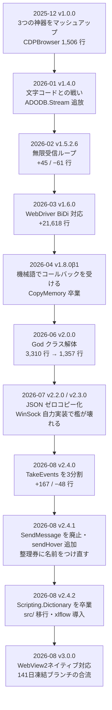

# 寄せ集めのマクロブックは、どうやってコアエンジンになったのか

::: tip 誕生秘話
〜v1.0.0 から v3.0.0 まで、64 個のタグに刻まれた 253 日の記録〜
:::

## 開発したきっかけ

かつて、Windows と Excel を愛する開発者の手元には、1本の魔法の杖がありました。

```vb
Dim objIE As InternetExplorer

'IE(InternetExplorer)のオブジェクトを作成する
Set objIE = CreateObject("InternetExplorer.Application")

'IE(InternetExplorer)を表示する
objIE.Visible = True

'指定したURLのページを表示する
objIE.Navigate "http://www.vba-ie.net/"
```

たった数行で、外部ライブラリも環境構築も要らず、ブラウザが立ち上がった、そんな時代がありました。  
IE のサポート終了は、その**何も準備しない**手軽さを丸ごと奪っていきました。

現在主流の`SeleniumVBA`も**行数**だけで見ればそこまで差はありません。

```vb
Dim driver As WebDriver: Set driver = New WebDriver
With driver

  '開始する
  .StartChrome

  'ブラウザの起動時の設定(Chrome/Edge兼用)
  Dim caps As WebCapabilities: Set caps = .CreateCapabilities

  '開く
  .OpenBrowser caps

  'サイトを開く
  .NavigateTo "https://note.com/sele_chan/n/n61a67c4379de"
End With
```

起動前設定という概念があるとは言え、拘りがなければそんなに差はありません。  
私も初めはそれを受け入れました。

しかし利用者は受け入れても、裏には以下のような概念が付きまとうことになります🫠

- WebDriver運用/管理(一応、SeleniumVBAはこの辺の管理はやってくれる🙂)
- 社内通信環境
- セキュリティポリシー


等と言った実際に動かさないと気付かないような問題が露になりました。  

> 「あの頃の、インストール不要でブラウザを意のままに操れる手軽さを、現代の**AI技術**でなんとか復活させることはできないだろうか🥲」

そんな思いで、2025年年末に開発をスタートしました😶

いまでこそ「Excel VBA 単体で CDP と WebDriver BiDi を喋るコアエンジン」などと名乗っていますが、最初のコミットに詰まっていたのは、正直に言えば **他人のライブラリの寄せ集め** でした。

---

## 答えは既にあるが...

疑問自体の答えはこの時点で既に、ネットにはありました。
- https://qiita.com/kabkabkab/items/9952a796ee9244fc98ad
- https://github.com/longvh211/Chromium-Automation-with-CDP-for-VBA

どちらも確かに完成度の高い作品です。特に前者は日本人作で、読者の様々な感想やフィードバックもあって、より完成度の高いツールです。  
私も最初はこの既製品を使ってしばらくは運用していました。  
 
が、本格的に運用しようとすると、やはり気になる点が出てきてしまいました...
- たまになんか接続がうまくいかない
- うまく情報を取れない（読み込み完了したはずなのに「要素がありません」など）
- クリック時、別タブ・別ウィンドウに飛んでしまうと、ちょっとむずくなる

この辺ついて作者に聞いてなんかいい感じの回答を...🥺と思いました。しかし残念ながら[2024-07-23](https://qiita.com/kabkabkab/items/9952a796ee9244fc98ad#comment-f0e42993833b5c7d7356)を最後に、作者からの返答はパタリと途絶えてしまいまい、これ以上の回答は望めそうにありませんでした。  

解決方法は1つしかありませんでした。

> AIと一緒に、仕組みを理解して直す🔥

この時代はAI全盛期、AIを使いこなさないと置いてきぼりになるほどの時代です。  
でもいざ、AIを使いこなすとなると、目的が不十分だと、そもそもAIを使うきっかけも生まれません。  
「ならば！AIを使いこなす練習も兼ねてDiscussionだ🤠」ということで、私は開発(というより、改修)を決断しました。

## 起点は...

さて、`WebDriver`依存脱却は、先ほどのリンクの通り2つあります。この2つのソースを覗くとこうなります。


- 右：日本人のフィードバックが詰まった[kabkabkab氏](https://qiita.com/kabkabkab/items/9952a796ee9244fc98ad)作のブラウザ制御
- 左：ベトナムのエンジニア [longvh211氏](https://github.com/longvh211/Chromium-Automation-with-CDP-for-VBA)作のブラウザ制御

この2つを見比べて最初に思ったのが、
**前者、Classファイルが多すぎて見づらい🙃後者は少なくてシンプルに見える🥺**

中身の高度なコードなんて見ちゃいません。  
プログラマの直感、**「見た目のファイル数が圧倒的に少ないから」という雑すぎる理由**だけで、私は `longvh211氏` の土台を採用することに決めました。  

「もしかしたら右側には、日本人の知恵とフィードバックが詰まった『至れり尽くせりの便利機能』がたくさん眠っているかもしれない……」

そんな未練をあっさり捨て去ることができたのは、**時代がまさに「AI全盛期」だったから**です。

**「土台さえシンプルなら、足りない機能なんて後からAIと一緒に足していけばいいじゃん。」**

複雑怪奇な多ファイルを解読するよりも、中身を完全に把握できる「たった5つのソースファイル」をAIと魔改造していく道を選んだのです。
AIに頼んでAIが分かっても、自分自身も理解しなきゃ改修の意味もないですからね。

---

## 最初の修正

とりあえずは、時々上手くいかない問題を対処するべく、コア周りを読み解きました。簡潔に言うと
- Chromiumの[仕様変更](https://developer.chrome.com/blog/remote-debugging-port?hl=ja)に対応してなかった
- デバッグブラウザのKill判定が変

これを対処すればひとまずは、時々上手くいかない問題は解消されました🙂  
で少しずつフローが分かってくると

> 一部の設定を、ワークシートに集約したら便利じゃね😳

VBA自体は、プログラミング言語です。でもこれは単体では存在せず、何かしらのアプリにくっついてるある意味特殊な言語です。  
そしてくっついてるのは、Excelです。そしてこのExcelにはワークシートという名のGUIが最初っからついてます。  
`Range("UserName").Value`で簡単に設定情報を読み取れます。

こういった工夫を反映し、最初のバージョン[v1.0.0](https://github.com/Eschamali/StarterWebScrapingKit/releases/tag/v1.0.0)が登場しました。  
何気に初登場からいわゆる、GUI活用と言った差別化要素が作れたわけで、作った自分自身も「便利～🤠」と感じました🥳


## 双方向やり取りの概念を習得

ある日、こんな記事を見つけました
- [[SeleniumVBA]WebDriver BiDiの接続にチャレンジしてみた](https://note.com/sele_chan/n/n2b21c7c26ef8)

簡潔に言うと
- ブラウザ内で起こった出来事を一方的に受信する

という物です。  
従来のブラウザ制御は、
- 送ったコマンドに対する結果を受け取る

といった一方通行方式でした。そしてこのWebDriverBiDiは、先ほど記載した**ブラウザ内で起こった出来事を一方的に受信する**という経路も対応すると言った感じです。  
これ、何がありがたいかというと、こちらから何もコマンドを送らなくても例えば
- ページ読み込み終えたよ！
- 今、この通信を開始したよ！
- JavaScriptAlertが出たよ！

といったスマホの通知みたいなのが勝手に来ると言った感じです。  
これが双方向概念です。

> VBAのWebスクレピングのデファクトスタンダードのSeleniumVBAがBiDiに対応しようとしてる😳うちも対応しなきゃ🫨

ということで、その`WebDriverBiDi`の機能に追従するべく、また修正の手を加えました。  
`Chrome DevTools Protocol`にも双方向機能があるので、あとはそのブラウザから来たイベント通知機能を蓄積させるためのロジックを用意すればいいだけの話です。

こうして生まれたのが、[v1.1.0](https://github.com/Eschamali/StarterWebScrapingKit/releases/tag/v1.1.0)です。  
おなじみの`Dictionary`機能を駆使して、ひとまずはイベント情報も扱えるようになりました。  


その後、イベント情報をより扱いやすくする様々な修正が続いていきます🔥

## 海外製ツール特有の問題

色々とテストしていくと、最初の問題にぶつかりました。
- 日本語が含まれるとエラーになる

```json
{"error":{"code":-32700,"message":"JSON: invalid string at position 52"}}
```

大体原因は察しました。英字だけならちゃんと動くこの感じ。`Shift_JIS`問題です。  
なら対処法は簡単です。`UTF-8`で送ればよいのです。

VBA で「UTF-8 変換」と検索すると、必ず `ADODB.Stream` が出てきます。動く。けれど、どうしても拭えない違和感がありました。

> 「『Stream（データの流れ）』という名前のオブジェクトなのに、なぜテキストの文字コードを変換するためだけに使わされているんだ🫠」

おまけにそのまんま使うと BOM 付きで出てくる。さらに言うと、たまに文字化けするという報告も...🙃  
`.Position` をいじるおまじないまで含めて、不格好すぎた。

で、なんかないかと調べたら見つけました
- [VBAで Windows APIを使った UTF-8 ←→Unicode相互変換](https://qiita.com/yamashiroakihito/items/9b609653fef6fa8a5ab2)

「サイズ確認のための1回目、本番の2回目」という、C 言語っぽい2往復の儀式が必要ですがそんなのは、clsでカプセル化すれば問題ありません。ADODBオブジェクトを挟むより速く、謎の Position 操作も要らない🤠

こうして、[v1.4.0](https://github.com/Eschamali/StarterWebScrapingKit/releases/tag/v1.4.0)が登場しました

::: warning 伏線
ここで追放された `ADODB.Stream` は、**受信ロジックの最適化2**で蘇ります😳
:::

---

## 受信ロジックの最適化1

オリジナルの[受信ロジック](https://github.com/longvh211/Chromium-Automation-with-CDP-for-VBA/blob/main/Class%20Modules/CDPBrowser.cls#L1436)を拝見すると、こういうのを見つけました


`strBuffer = strBuffer & strRes`

こういうのが要所要所ちりばめられています。VBAにちょっと詳しい方ならご存じ、この書き方では処理速度の低下につながってしまう書き方です。

VBAの文字列は「後ろに空きスペース」を持っていません。そのため `&` で結合するたびに、裏では以下のような「引っ越し作業」が発生しています。

1. **新しい土地を探す：** 「元の文字数 ＋ 追加する文字数」が収まる**新しいメモリ領域**を確保する
2. **荷物を全部運ぶ：** 今までの `strBuffer` の内容を、新しい場所に**まるごと全コピー**する
3. **新しい荷物を置く：** 追加分の `strRes` を後ろにくっつける
4. **元の家を解体する：** 古い `strBuffer` のメモリを破棄する

データが小さいうちは一瞬ですが、受信ループが何十回・何百回と回り、バッファが大きくなればなるほど**「毎回、巨大なデータを丸ごと新しい場所にコピーし直す」**ことになります。

受信データが雪だるま式に増えるにつれてコピーにかかる時間も二次関数的に激増し、最終的に「処理がフリーズしたように遅くなる」という現象を引き起こします。

こういったパフォーマンス低下を防ぐべくこのバージョンは色々とテコ入れしました。  
そのせいでオリジナルでは起こらなかった問題が、意図せず次々と発生しては修正...を繰り返す日々が続きました。

時間はかかりましたが、この時点での結論は、`Split(A, vbNullChar)` で一気に[配列にバラして裁く手法](https://github.com/Eschamali/StarterWebScrapingKit/blob/c2ee72e9c843534f9b6bc0686d5faa01e936498d/VBAProject/Class/CDPCore.cls#L869)でした。


「よし、これで遅い結合地獄からは抜け出せた！」
ひとまず実用的な速度を手に入れ、戦いは終わったかのように見えました。

……しかし、これは後に訪れる「真の最適化」へと至る、長大な物語のプロローグに過ぎませんでした。
巨大パケットという怪物を前に、この設計すら過去のものとなる「第2形態」への覚醒は、もう少し先のお話です——。

## 非同期処理の概念を習得

IEで、クリック操作した際、こういうのに出くわした方、いるんではないでしょうか？


そうです。JavaScriptアラートです。いわゆる、VBAでいう`msgbox`です。  
VBAで、`msgbox`出すと、それに**人間**が反応しないと一生処理進みませんよね？  
はい、JavaScriptアラートも同じルールになります。  
今のツールでは、この `alert` が出ると Chrome は Pipe の返事を一切返さず、VBA は永遠に待ち続けてタイムアウトエラーになります。

だから非同期処理、つまり**投げっぱなし**という仕組みが必要になりました。  
そして投げたあとの「ダイアログが開いたぞ」は、`v1.1.0` で頑張って実装した `Dictionary` が裏で拾ってくれます。  
このDemoを完成した時はいい気持ちでした🥳

## 悔しくて搭載。未来の自動化プロトコル - WebDriverBiDi

きっかけは、SeleniumVBA の [Discussions](https://github.com/GCuser99/SeleniumVBA/discussions/164) に刺さった一言でした。


>「将来的には CDP は WebDriver BiDi に置き換わる。CDP には未来がない」

論理としては正しい。  
けれど現場は違う。**Edge は最初から入っている。置けないのは野良の `WebDriver.exe` だけ**。

- でも、数年後に CDP が表舞台から消えたら🥺
- 将来のスクレイピングブログのノウハウが、BiDiだらけになったら🥺

このツールの存在価値が薄まってしまう🥺そんな気持ちがよぎりました。

> 「……だったら、やってやろうじゃないか🔥」

WebDriver BiDi 対応です。`mapperTab.js` という 2 万行の JavaScript を、 **Excel のテーブルに保存してブラウザへ注入する**という仕組みを作り、実際にそのプロトコルでブラウザを制御する仕組みのコアも作り上げました🫠ﾀｲﾍﾝﾀﾞｯﾀﾖ--


なぜ 2 万行の JS を Excel のセルに詰め込むことになったのか、そこに至るまでの経緯はかなり長くなるので、独立した記事があります。

👉 **[なぜ `WebDriver.exe` なしで「WebDriverBiDi」プロトコルで、ブラウザ自動化ができるとわかったのか](/stories/bidi-story)**

---

## JavaScriptの実行方法を豊富に

この頃になるとロジックフローや、CDP知識そのものに対する理解度は、当初とは比べ物にならないほど深くなっていました🤠

これまでのバージョンアップは、言うなれば「便利な機能の継ぎ足し」でした。本家ライブラリの偉大な面影（土台）を保ちつつ、周りに飾り付けをしているような状態です。  
しかし、低レイヤの仕様が頭に入ってきた今、改めてこれまでのコアコードを見つめ直すと、本家ライブラリの「とりあえず動くようにしただけ」の簡素な記述が、どうしても目立ち、気になり始めました🫪

>「もっとCDP本来の、圧倒的な潜在能力を解き放てるはずだ🤠」

まず着手したのが、自動化の勝敗を分ける最重要機能、JavaScript（Runtime.evaluate / functionDeclaration）の実行オプションの拡張でした。

最近のReactやVueなどのSPA（シングルページアプリケーション）が支配するモダンなWebサイトにおいて、ブラウザの内部状況に最も精通しているのは、やはりJavaScript自身です。
そのため、CDPの仕様書には、JavaScriptを実行するためのAPIに膨大な「制御用パラメータ」が用意されていました。


しかし、本家の実装は、ただ「JavaScriptのコード（文字列）」を1つ送るだけの、非常にシンプルな設計になっていました。これでは宝の持ち腐れです🥺


私はCDPのドキュメントを貪り読み、実務で絶対に役立つ強力なパラメータを片っ端からピックアップし、すべて実装コードに叩き込みました。

- objectId：特定のDOM要素などのオブジェクトを直接基準にしてJavaScriptを実行する
- objectArguments：objectId の関数に対して、VBA側から引数を安全に引き渡す
- returnByValue：True にすることで、JavaScriptが返してきた複雑なオブジェクトを、VBA側でパース可能な具体的な「値（JSON構造）」として受け取れる。
- awaitPromise：True にすると、JavaScript内の非同期処理（Promiseの解決など）が終わるまでVBA側を待機させ、最終的な結果をスマートに同期的に受け取れる。
- userGesture：True にすることで、そのJS実行を「人間が手動でクリックやキーボード操作を行った結果」であるとChromeに偽装して認識させる。
- allowUnsafeEvalBlockedByCSP：True にすると、Webサイト側がCSP（コンテンツセキュリティポリシー）で外部スクリプトの実行をガチガチに禁止している環境であっても、それを完全に無視してすべてのJavaScriptの実行を強制許可する。
- これらをすべて満載したため、VBAのメソッドの引数定義は、改行マーク（, _）がこれでもかと並ぶ凄まじい弾幕のようなシグネチャになりました😂


これにより、戻ってきたデータが数値だろうが、テキストだろうが、あるいはパースされたDictionaryやCollectionであっても、シームレスにVBA側で受け取れるようにしたのです。

万が一、JavaScriptの実行中にエラー（例外）が発生した場合、VBAの標準エラー値オブジェクトである CVErr(xlErrValue) を返して即座にエラーを報告させ、別途用意したプロパティに例外のスタックトレースの詳細をきれいに記録する仕組みを構築しました。VBAが持つ「Variantの柔軟性」と「エラー値オブジェクト」という、泥臭くも強力な足腰（言語仕様）をフルに引き出した設計です。


これで、どんな高度なJavaScript操作もVBAから自由自在に実行できる、無敵のJS実行環境が完成しました🤠

## `CDPElement` を作り直す

コア刷新の波は、ツール全体の最大の長所である「要素（Element）操作クラス」にも及びました。

[本家ライブラリ](https://github.com/longvh211/Chromium-Automation-with-CDP-for-VBA/blob/main/Class%20Modules/CDPElement.cls)には、XPathなどで検索した要素を基準にしてクリックや入力をしたり、さらにその要素の下層にある子要素を検索したりする、非常にありがたい要素操作用の「Classオブジェクト（Elementクラス）」がすでに備わっていました。

しかし、その「検索した要素（Element）」の保持方法に、CDPを深く理解した今だからこそ、どうしても許せないまどろっこしさがありました。

本家は、取得した要素(例：[ID要素](https://github.com/longvh211/Chromium-Automation-with-CDP-for-VBA/blob/main/Class%20Modules/CDPBrowser.cls#L771))を以下のように管理していたのです。

```vb
Public Function getElementByID(strID As String) As CDPElement
   'Get a new unique varID
    Dim varID As String: varID = newVarID	' ランダムな文字列

   'Get the object and assign to the varID in the browser
    Dim varJS As String: Dim result As String
    varJS = varID & " = document.getElementById(""" & strID & """)"	'VBA側で一時的なランダムな変数名を生成し、グローバル（window）に保存させていた
    result = jsEval(varJS)

   'Return result
    Set getElementByID = New CDPElement
    getElementByID.init Me, varIDs, varID, varJS, result

End Function

Private Function newVarID() As String
    Dim newID As String

   'Init the ID collection
    If varIDs Is Nothing Then Set varIDs = New Scripting.Dictionary

    Do: newID = "varID" & Format(Rnd * 100000, "000000")
    Loop Until Not varIDs.Exists(newID)
    varIDs.Add newID, newID

   'Return the new varID
    newVarID = newID

End Function
```

ブラウザ側のグローバル空間（window）に、VBA側がランダムな変数名を勝手に生やして要素を代入し、VBA側のDictionaryでその変数名を管理する。
当初は動けばいいと思っていましたが、CDPに精通した今となっては、あまりにも不格好で、不自然なアプローチに思えました🙃

さらに、この 「`window`グローバル空間に、不自然なグローバル変数が大量に生成されていく挙動」 は、近年高度化しているセキュリティ・スクレイピング検知システム（ボット検知）にとって、「一発でプログラムによる自動操作だと見破られて、通信を遮断（ブロック）される」という最大のリスクでもありました🫠

「本物のブラウザ自動操作は、window を1文字も汚すことなく、ブラウザの裏側のメモリだけで静かに行われるべきだ🤠」

解決策は明確でした。CDPが[標準](https://chromedevtools.github.io/devtools-protocol/tot/Runtime/#type-RemoteObject)で提供している objectId 方式に、要素管理のすべてを移行することです 。


要素を取得した際、Chromeが内部メモリで管理している一意のオブジェクト識別子（objectId）を受け取り、VBA側はそのIDだけを静かに保持して操作を指示する。

やることはシンプルですが変更行は割とあります🫠  
こういうときこそAIです😳

> 「この要素操作クラスの変数管理システムを、本家のインターフェース（使いやすさ）は変えずに、内部をすべてCDP標準の`objectId`方式に美しく移管して、リファクタリングして」

一括置換とは違ったいい感じに刷新できました🤠

## Playwright並みの受信捌きロジックへ

このツール改修で最も労力を使ったフェーズです。

きっかけは、現場の相談でした。  
社内 Webサイトから毎月、**5アカウント分**の請求書を落とす仕事。JavaScriptアラート対処の時に実装した非同期を自慢していた自分は、5つ同時に走らせようとした。

エラーになった😵  
イベントが「今、5つのうちどのタブ宛てだ」といった混戦になったのです🫠

もちろん、1アカウントずつ順番に処理する「反復横跳び」に逃げれば、動く。遅いけれど、動く。

> 「画面が順番に変わっていくんじゃなくて、5つの画面が一斉に、同時に変わっていくあの美しい景色が見たいんだ🥺」

今までDemoやメソッド紹介程度しか見なかった[RaiseEvent](https://excel-ubara.com/vba_class/VBA_CLASS_12.html)  
ついに生かすときが来、解体に火をつけました。

2026年5月30日、解体が始まりました。

```text
2026-05-30 `RaiseEvent`で発信するように、レスポンス解析周りを`CDPCore.cls`へ移管
2026-05-30 受信処理と取り出しの責務分離
2026-05-31 大幅な取捨選択作業
2026-06-01 とりあえず、タブ系クラスを用意
2026-06-01 `CDPBrowser`,`CDPCore`にある機能をある程度、排除
```

そこから 6月6日までの**1週間で、15 ファイル・5,887 行追加 / 4,692 行削除**。数字で見ると、こうなりました。

| クラス | v1.8.1.2 | v2.0.0 | 役割 |
| --- | ---: | ---: | --- |
| `CDPBrowser.cls` | 3,310 行 | **1,357 行** | ブラウザ単位の責務だけに |
| `CDPContext.cls` | — | **2,053 行** | 新規。タブ単位の責務 |
| `CDPCore.cls` | 502 行 | **1,076 行** | 通信と配信の心臓部へ |
| `WebDriverBiDiMode.cls` | — | **592 行** | 新規。BiDi 側も同じ形に |

ツールは、**「ブラウザ」「タブ」「通信コア」** の 3 つに割れました。

### 設計を変えた 5 行

解体の中心にあったのは、`CDPCore.cls` に追加されたこの宣言です。

```vb
Public Event CDPBrowserEvent(methodName As String, RawJson As String)
Public Event CDPBrowserID(id As Long, RawJson As String)
Public Event CDPContextEvent(methodName As String, RawJson As String, sessionID As String)
Public Event CDPContextID(id As Long, RawJson As String, sessionID As String)
Public Event ResetCommandID()
```

それまでは、受信ループを回している側が「これは誰宛てのメッセージか」を判断して、直接メソッドを呼びに行っていました。だから `CDPBrowser` が全部を知っている必要があったのです。

`RaiseEvent` に切り替えたことで、コアは **「届いた JSON を種類別に投げるだけ」** になり、`CDPBrowser` と `CDPContext` は **`WithEvents` で自分宛てだけを拾う** 側に回りました。Playwright でいう `EventEmitter` と同じ構図です。

::: info クラス名が決まるまで
新しいタブ用クラスは、当初 `CDPTab.cls` という名前でした。6月5日のコミットで最終的に改名されています。

```text
2026-06-05 残りの、‘CDPTab`→`CDPContext`へのリネーム
```

CDP の世界で「タブ」に相当するのは `Target` であり、その中身は `BrowsingContext`。iframe や Worker も同じ器で扱うことを考えると、`Tab` では狭すぎたのです。
:::

この 1 週間の作業を、当時の自分はコミットメッセージでこう呼んでいました。

```text
2026-06-03 劇的ビフォーアフターに合わせたCDPDemoコードの修正
```

起動ボタンを押した瞬間、5つの Edge が一斉にログインページを開き、混線せず、それぞれが独立した意志を持ったように請求書を回収していく。

> 「動いた……本当に、あの Excel VBA だけで、ブラウザがシンクロして同時に動いている🫨🥹」

画面上でページが同時に切り替わっていく景色を、しばらく黙って見ていました😳

---

## 受信ロジックの最適化2

さてさて2回目の受信ロジックの最適化フェーズに入りました。当初は先ほどの`Split`で満足してましたが、あるきっかけで見直すことになりました。

この反映は、[v2.2.0](https://github.com/Eschamali/StarterWebScrapingKit/releases?page=2#release-v2.2.0)に反映されます🤠

### VBA用Jsonパーサーの世代交代

通信コアを `WithEvents` でスマートにしたのに、パケットの中身を解析する最深部が、**8年以上更新の止まっていた VBA-JSON**を使ってます。この`VBA-JSON`...

- 存在するKeyとValueを全部、Dictionary/CollectionにコピーしてVBAとして扱いやすくする

というロジックです。一般的なRestWebAPIなら、このロジックでも問題ありません。でもCDPはそうはいきません。  
特にイベント情報を扱うとなると下手したら毎秒何百件も来るのもざらにあります😵  
もっと言うと、全部が欲しいわけではないはずです。特定の値さえ取れればそれで十分というのがほとんどです。全部欲しいのは精々ログ表示程度です。

にも拘らず、この`VBA-JSON`は、全部コピーしてしまう🫥でも、VBAでJsonを扱うライブラリはこれしか選択肢名がなく、じゃ～`VBA-JSON`そのものをいじるとなるとまた頭がおかしくなりそうです😵

偶然なのか必然なのか、そんなタイミングでピッタリなJsonパーサーライブラリが登場しました🥳

**[vbacollective-json](https://github.com/vbacollective/json)**

ちょっと難しい解説ですが、  
このJsonパーサー、**JSON 文字列のメモリに `SAFEARRAY` を直接かぶせて、部分文字列を一切コピーせずに読む**（ゼロコピー）という方式を使ってます。パース中に `Dictionary` も `Collection` も生成しません。CDP のレスポンスは 大量に来がちなので、ここが効きます。

ただしこのJsonパーサーは、読み取り専用です。`v1.1.0`で実装した、イベント情報をDictionaryに蓄積では、このライブラリは相性が悪いです。  
が、これもすぐに解決できました。というか、`VBA-JSON`の上位互換がありました🤠

**[VBA-FastJSON](https://github.com/cristianbuse/VBA-FastJSON)**

一応、読み取りも書き出しも両対応ですが、読み取りに関しては、`vbacollective-json`が圧倒的に早いです。  
よって、読み取りと書き出しを分けるような仕組みになりました。

`vbacollective-json`は基本的に、結果を受け取るだけのポジションになりました。

そして、VBAでJsonを扱う際のあの儀式もこのライブラリによって消え去ってくれました🥹

```text
2026-06-28 愚直な文字列探索の廃止
2026-06-29 `instr`比較方式を卒業
```

3月8日に「Json パーサーを回避」と書いた自分に、ようやく胸を張れるコミットでした。

### 追放したはずの `ADODB.Stream` が帰ってきた

`vbacollective-json`のアピールにあるこの

- zero-copy JSON parser

>「zero-copy……なんかめちゃくちゃカッコいいな😳」

そんな憧れから、ふと自分の `Split(CDP, vbNullChar)` をじっくり吟味してみて、ある残酷な現実に気づいてしまったのです🫠

たとえば、CDPレスポンスが一気に100件届いたとします。
> `Split` で100分割された文字列変数がメモリに誕生！ ➔ 100回 `RaiseEvent` ➔ 100個まとめて破棄

……待てよ？😶  
**「これ、メッセージを裁く時間よりも、100個の変数を作って破棄するコストで遅くなってるんじゃないか……！？」😵**

こうしてまた、受信ロジックの見直しが始まりました。  
目指したのは

- 1つの巨大バッファ＋Mid$カーソル制御

です。

<details>
  <summary>仕組みの概念</summary>
  <p>
イメージとしては、**「部屋一面の巨大なホワイトボードと、ペンの位置（カーソル）」**です。

今まではメッセージが届くたびに「新しいミニ付箋を買ってきては捨てる（`&` や `Split`）」という狂気の浪費をしていました。
これを行儀よく、1枚のホワイトボードだけで完結させます。

1. 普段のやり取り（平常運転）
* 最初から **1MB分（特大サイズ）のホワイトボード** を壁にドンと設置しておく。
* データが届いたら、ホワイトボードの **「前回の続き（カーソルの位置）」** から `Mid$` で直接スラスラと書き殴る。
* メッセージの区切り（`vbNullChar`）が見つかったら、そこまでを読み取って `RaiseEvent` で通知！
* 全てを読み終えたら、ボードの左端にキュッとスライド（先頭移動）させ、ペンの位置を巻き戻す。

**新しいボードは買いません。同じボードを何度でも上書きして使い回します。**

2. 想定外の巨大データが来たら……？（バインバイン発動）
しかし、相手は気まぐれなCDPです。
たまにホワイトボードの残りスペース（空き容量）を突き破るような、**規格外の巨大レスポンス**がドカンと送られてくることがあります。

「ヤバい！今のボードじゃ書ききれない！！」

ここで発動するのが **「バインバイン（幾何学的リサイズ）」** です。
少しずつ広げるのではなく、**「今あるボードの横幅を一気に2倍（1MB ➔ 2MB ➔ 4MB...）にガッチャンコ連結！」** します。

* ❌ 1文字足りないから1文字分広げる（引っ越しが毎回起きて元の木阿弥）
* ⭕ **「足りないなら一気に倍にする！！バインッ！！」**

こうすることで、どんな巨大パケットが暴れてきても、メモリの引っ越し回数を「数回」だけで抑え込み、涼しい顔で受け止めることができるのです。
  </p>
</details>

最初はこういうフローにするつもりでした

- Pipe→バイト配列→String変換→巨大なバッファーへ蓄積

Pipeから受け取るデータは、最初はバイト配列です。メッセージを捌くには文字列変数に変換しないといけません。  
当然ながら変換にも多少のコストが必要です。受信の度に変換はなんかいただけません🫠どうせなら...

- Pipe→バイト配列→受信が落ち着くまで、バイト配列のままとして蓄積し続けれる→落ち着いたら、Stringに一括変換→改めて、巨大なバッファーへ蓄積

でもそうなると当然
- バイト配列用のcursor管理

も必要になります。ただでさえ、文字列のカーソル管理でも頭使うのに、バイト配列もと思うと🫠🫠

がしかし、バイト配列だけは便利なチート機能があります。
- ADODB.Stream.Write

「海外製ツール特有の問題」で、文字化けの元凶として追放したはずのクラスです。名前と用途が不一致でダサい、とまで思っていた。  
でもなんとこれだけで、
- 内部のカーソル管理
- SetEOS
- Position

といった便利メソッドで、バイト配列の蓄積も取り出しも行えちゃえます🤠

理由は単純で、**役割が変わったから**でした。かつては「文字コード変換をやらせて失敗していた」。今回は「バイト列をひたすら溜め込む器」としてだけ使い、変換は[先ほどのAPI](https://qiita.com/yamashiroakihito/items/9b609653fef6fa8a5ab2)が最後に一括で行います。バッファ蓄積の速さにおいて、`ADODB.Stream` は VBA 標準の文字列連結より圧倒的に速い。`.Position` も `.SetEOS` も、低レイヤのメモリ管理を C++ 層で代行してくれる道具だった。

> 「文字コードの変換器なんかじゃない。その名の通り、Windows のメモリ上で最高速度で動く、インメモリのバイナリバッファそのものだったんだ」

道具が悪かったのではなく、**使いどころを間違えていた**だけだった、という話です。

そしてまた別の問題が発生しました。  
ブラウザから来るメッセージが大量に来ると、Excelが固まってしまうのです🫠でも対処はいたってシンプルです。

```text
2026-07-02 1024メッセージ処理ごとに`DoEvents`を呼び出し、パフォーマンス向上させる
```

毎回 `DoEvents` を呼べば UI は生き返りますが、それ自体が重い。**1,024 件に 1 回だけ息継ぎする**、という数字は完全に実測で決めました。

こうして、[Ver2.2.0](https://github.com/Eschamali/StarterWebScrapingKit/releases/tag/v2.2.0)はその新世代のVBA用Jsonパーサーに一新したのに置き換えたのをリリースしました🤠

---

## ロマン領域への挑戦

ここまで、ブラウザとの通信路は **匿名パイプ一択**でした。`--remote-debugging-pipe` を使う限り、相手はローカルで自分が起動したブラウザだけです。実務の 99% は、それで足りる。  
業務自動化用途では、専用ブラウザを起動して処理を実行するケースが多い。

ここまで綺麗にツールが出来上がってくると、Chrome Dev Tools関連そのものへの関心が高まってきました。そして調べていくと、見てしまったのです🫥🫥1%のロマンが😇
- [AndroidのChromiumブラウザの制御](https://developer.chrome.com/docs/devtools/remote-debugging?hl=ja)
- [既に起動済みブラウザの制御](https://dev.classmethod.jp/articles/playwright-cli-attach-local-chrome/)

起動済みのブラウザを途中から乗っ取る。USB の向こうの Android 実機の Chrome を動かす。パイプでは物理的に絶対に届かない自動化制御です。

> 「知ってしまった以上、実装せずにはいられない😇」

正直、業務自動化としては完全なオーバースペックです。それでも、Excel 単体から **パイプもポートも両方** 握りたかった。  
まだ、戦いは終わってなかった😇いや、むしろこれからかもしれない...と🤠

### WinHTTP という甘い罠

そんなわけでまた、AIとのプログラミング対談の始まりです。  
先ほど紹介したその2つは`WebSocket`という仕組みで自動化制御できています。

VBA で WebSocket を調べると、ほぼ確実に `WinHttpWebSocket○○` 系 API にたどり着きます。「これを使えば一番楽なはずだ」と、最初は信じていました。  
`WebSocket`...そうこれは、あのkabkabkab氏作の[Seleniumなしチャレンジ](https://qiita.com/kabkabkab/items/e4243694cfc474c4c950)の際に生まれたあのコードと全く一緒です。

そういった前例があるおかげで、すぐにWebSocketルートは確立できました😳

が、ある問題が発生します。

データがない状態で `WinHttpWebSocketReceive` を呼ぶと、Excelがフリーズ😇

これでは困ります🙃
- ネットワークの送受信カウント
- JSアラート検知

等といったどのタイミングで来るのか？どのタイミングで終わるのかが分からないシチュエーションは、Webスクレイピングでは当たり前に存在します。

そんなわけで、この問題にを何とかするべく、AIに尋ねました。
が

- タイムアウト設定すれば行けるよ😆

試せど試せど、うまくいきません🙃事実をAIに伝えても、「じゃ～こっち側の方のタイムアウトを...」と、とにかくタイムアウト連呼です。  
ここで私は初めて**AIのハルシネーション**を身をもって体験しました。

- AIはやっぱ万能ではないんだな🫠

仕方なく、一次ソースであるMicrosoftドキュメントを吟味することにしました。そして悲しい事実が判明しました

- WebSocket 接続に対して、タイムアウトを設定するパラメータそのものが存在しない。
- 「タイムアウトオプションは WebSocket には適用されません」と、どこにも書いていない。

AIのハルシネーションが起こる理屈も分かる気がしました。  
悪いのは AI ではなく、ドキュメントの不親切さでした。

Microsoftは、WebSocketからの受信については、こう考えているのです

- 毎回毎回あるない？聞くのコスト掛かって大変でしょ？🙄こっちから勝手に通知するからその前提で作ってね😉

要するにコールバック思考ってことです。  
世間一般はモダン言語で溢れかえっています。PythonやNode.js、C#等々、選択肢は豊富です。そういった言語ならコールバック派相性抜群です。

しかしVBAはそうはいきません。なんせ、数十年もベースの設計は止まってます。  
WinHTTP の WebSocket コールバックは、**VBA とは物理的に別のワーカースレッドから直接割り込んでくる**。デバッグでマクロを止めた瞬間、Excel はプロセスごと即死する。仮想メモリもフックもサンクも試した。最後まで、このクラッシュは解けませんでした。

> 「WinHTTP は、VBA にとって完全な『死のルート』だ🫠」

こうして、あのAPIに手を出すことに🫪

### 生ソケットへの逆襲

AIとディスカッションを続けたらこんなワードをくれました。

**WinSock**

実態は「Pipeにネットワークの送受信を足した、ただそれだけの土管」。ここで私は、WebSocketの真の仕様をようやく理解しました。

**WebSocketという専用の魔法のパイプが通っているのではない。**  
ただの生ソケット（TCPという土管）の上に、RFC 6455というルールに沿って**「決められた規格の封筒（フレーム）にデータを詰め、ちょっと目隠し（マスク）をして流しているだけ」**だったのです。

---

#### 💡 そもそも[RFC 6455](https://www.rfc-editor.org/info/rfc6455/)の正体ってなんなの？（3つのルール）

1. **フレーム構築（荷札貼り）：**
   「このメッセージはテキストだよ」「長さは○○バイトだよ」「これで終わりだよ（FIN）」という**ヘッダー（荷札）**を先頭にくっつけて、ただの文字列を「1つの小包」に仕立てる作業。
2. **マスクXOR（目隠し）：**
   暗号化（秘密を守る）ではなく、途中の通信機器（プロキシ）が「ん？これ普通のHTTP通信か？」と勘違いしてキャッシュ事故を起こさないよう、**ランダムな4バイトの数字でデータをパラパラと撹乱（モザイク処理）しているだけ**。
3. **断片化（複数個口での発送）：**
   巨大なデータが来たら、「1箱目（続きあり）」「2箱目（これで最後）」と小分けにして土管に流すルール。

---

これをAIに教わり、気づきました。

> そうか、Microsoftが用意した専用API(WinHttpWebSocketReceive等)がなくても、**WinSockで生データを送受信できる土管さえ用意して、この『荷造り（ビット演算）』と『開封作業』をVBAで手書きしてやれば、WebSocketなんて自作できるじゃん！！**」

こうして、PowerShellも使わない、「VBA × 生WinSockによるWebSocket自作」という道が開かれたのです。  
え、でも、**RFC 6455 のフレーム構築・マスク（XOR）・断片化の結合を、VBA で 1 から書く** って大変じゃないかって？🫪

忘れていませんか？今は**AI時代**です。  
こういう、仕様がガチガチに決まってる物を色んなプログラミング言語に翻訳できるのはAIの得意分野です。  
有名言語は既に有志がいい感じのWebSocketライブラリを公開してみんなはそれを使ってるだけ。なのでこのAIの特性(恩恵？)に気付けるのは中々ないでしょう。

ただし、あくまでもこのWebSocketは、CDP専用として使う物とします。ライブラリみたいに、CDP以外の接続口も対応してたら、頭がパンクします🤯  
なんならそういう汎用性を求めるとAIの正確性も落ちてしまうのも感覚的に分かってきました。なのでここはしっかりとスコープを定めました。

> VBAで、WinSockとしてのWebSocketを捌くコードを書いて。なお、あくまでもCDP専用として使うので余計な汎用性はなしで

こうしてAIと幾度も対談しついに、ベースとなる[コア](https://github.com/Eschamali/StarterWebScrapingKit/blob/main/src/classes/CDPCoreViaWebSocket.cls)が出来上がりました🤠  

### 通信経路の拡張はどうしたの？

さて、せっかくCDP via WebSocket のコアClassを出来上がったのに、これをどう拡張するのか🤔  
実はもう答えは頭に浮かんでます。

`RaiseEvent`です。

v2.0.0実装前は全然イメージが付けなかったこの`RaiseEvent`、もう今となっては仕組みを理解済みです。

```vb
'ストリームに書き込み、イベント発信
WebSocketReceiveStream.Write payloadBuffer
RaiseEvent WebSocketReceive(payloadBuffer, TakePayloadSize, AllPayloadReceive And m_WebSocketFrame.isFIN)
```

▲ 受信した内容をイベント発信し...

```vb
Private Sub viaWebSocket_WebSocketReceive(res() As Byte, resSize As Long, EOS As Boolean)
    Const FromProcedureName As String = ThisClassName & ".viaWebSocket_WebSocketReceive"


    'ストリームに流し込む ※バッファー拡張は、`ADODB.Stream`が担います
    CDPPipeStream.Write res
    printMsg Trace_, "Storing received messages...", FromProcedureName

    'メッセージの終わりであれば、その目印も追記
    If EOS Then CDPPipeStream.Write m_NullTerminator

    '取得サイズをcursor管理へ反映し、バッファー拡張判定を行う
    StrBufferCheck resSize + EOS * -1
    printMsg Trace_, "ResSize = " & resSize & " , EOS: " & EOS, FromProcedureName
End Sub
```

▲ コアでイベントを受け取る！

そして、またしてもこの`ADODB.Stream`の恩恵を受けたのです😳

```txt
【--remote-debugging-pipe】   ───> (そのままアペンド) ─────────────────┐
                                                                     │ ──> 【ADODB.Stream】 ──> (一括UTF-8変換) ──> (Midステートメントによる高速カーソル処理)
【--remote-debugging-port】   ───> (IsFIN(EOS)なら、末尾に0x00を付加) ─┘
```

1. Pipe版のデータを受信した場合：
そのまま ADODB.Stream に Write で流し込んで蓄積する。
2. Port版（WebSocket）のデータを受信した場合：
ヘッダーサイズをパースし、メッセージの終わりであることを確認後、コッソリと vbNullChar（0x00） をその場でドッキングさせてから、ADODB.Stream に Write で流し込んで蓄積する。
3. 共通の後続処理：
両者のパケットが溜まった ADODB.Stream から、一括でUTF-8テキストに超高速変換。変換後のテキストに対し、VBAが誇る伝家の宝刀 Mid ステートメントを使って高速にカーソル（cursor）操作を走らせ、vbNullChar を区切り文字として1件ずつ安全にパースして取り出す。
「Port版のデータを、その場で『Pipe版のフォーマット（末尾Null文字）』に翻訳してストリームに流し込む」🤠

このハックを思いついたことで、私は複雑なWebSocket専用の難解な受信パースロジックを新規に書き加えることなく、既存の高速なPipe受信フローと 「ほぼ完全なコピペレベルの一元化（共通化）」 に成功したのです🥳🫨

AIと対談しながら、ミリ秒のカーソル（cursor）管理のデバッグに手こずり、泥臭く調整を重ねた末、ついに「Port」と「Pipe」が完全に合流した、最強の受信エンジンが稼働可能な状態に整いました🥳

これが[v2.3.0](https://github.com/Eschamali/StarterWebScrapingKit/releases/tag/v2.3.0)の登場です。

そして、続く `v2.3.1` で、接続まで自動化していきました。

```text
2026-07-13 「/json/version」にて、ブラウザへのWebSocket接続を簡単に済ませる機能を追加
2026-07-13 「/json/list」にて、タブへのWebSocket接続を簡単に済ませる機能を追加
2026-07-13 `DevToolsActivePort`の中身を読み解いて、接続するアシストプロシージャを用意
```

### できなかったことが、できた

パイプしか握っていなかった頃、相手は「自分が今起動したローカルの Edge」以外にありえませんでした。WinSock で RFC 6455 を自前実装した瞬間、その檻が壊れました。

Excel 単体。PowerShell なし。アドインなし。追加の exe なし。VBA の土管だけで、次の景色が動きます。

#### 今、目の前のブラウザ

パイプでは物理的に不可能だった、「すでに立ち上がっているセッション」への後付け接続です。


::: warning 乗っ取り注意
何もデバッグソフトを動かしていないのに「リモート デバッグを許可しますか？」と出たら、迷わず **キャンセル** してください。許可した瞬間、動画の通り、ブラウザは乗っ取られたように動き始めます。
:::

まさにこの[リンク](https://developer.chrome.com/blog/chrome-devtools-mcp-debug-your-browser-session?hl=ja)通りのことが起こってます🫨  
本来はMCP向けの仕組みなのに、AIの欠片もないVBAが、今開いてるブラウザを制御してる😳この仕組みの真の仕様を知ってしまいました🤠

#### Android 実機の Chrome


::: info ADB について
VBA の WinSock は Windows のネットワーク内にしか届きません。USB の向こうへは、Google 公式の [ADB](https://developer.android.com/tools/adb?hl=ja) で一度だけ橋を架ける必要があります。

```bash
adb forward tcp:9222 localabstract:chrome_devtools_remote
```

この「物理的な橋」さえあれば、あとの制御は Excel の WinSock クラスだけです。Selenium も XLL も要りません。
:::

#### 他アプリに埋め込まれた WebView2


実務の 99% には、パイプで足りる。それでもこの 1% が、235 日の中でいちばん「やってやった」と思えた景色でした。

::: tip 到達点
高級 API に頼らず、土管と仕様書だけで WebSocket を握った。その結果、**Pipe では絶対に届かなかった相手**――目の前のブラウザ、Android、WebView2――まで、同じ `CDPContext` の顔で操れるようになった。
:::

使い方の詳細は [WebSocket モードでできること](/websocket/capabilities) にあります。

---

## 将来の拡張に備えて

`v2.0.0`で磨き上げた、`TakeEvents`  
受信からイベント発火までを一手に引き受けるメソッドでした。それを 3 つに割りました。

| メソッド | 責務 |
| --- | --- |
| `AnalyzeCDP` | 通信路（Pipe / WebSocket）からバイト列を受け取り、テキストに変換する |
| `TakeEvent` | バッファから **1 件だけ** 取り出して `RaiseEvent` する |
| `TakeEvents` | 上の 2 つを使い、届いている分を全件処理する（通常はこれを呼ぶ） |

分割前のコードは、ループの中で「受信」と「解析」と「発火」が絡み合っていました。

```vb
Do While responseCDP.ExistsNewRes
    ' 1件取り出して発火
    Dim tmp As String: tmp = TakeCDPMessage
    Call BrowserReceivedDataCheck(tmp)
    ' ついでに新しく届いた分も取り込む
    If viaWebSocket Is Nothing Then TakePipe ... Else TakeWebSocket ...
    Call ReadyCDPMessage
Loop
```

分割後は、こうなります。

```vb
'1. CDPからバイト配列を受け取り、テキストへ変換
AnalyzeCDP StopApiError, destruction

'2. 新規メッセージがあれば、ループで全てを取り出し終わるまで、`RaiseEvent`します
Do While responseCDP.ExistsNewRes
    If ResCounter Mod RunDoEventsCount = 0 Then DoEvents
    ResCounter = ResCounter + 1
    TakeEvent
Loop
```

目的は下記です

> 特定イベント検出時の「即時割り込み&残りのイベント処理ストップ」等といった上級者向けの手動メソッド

「全部やってくれる便利メソッド」を、**「全部やってくれる便利メソッド」と「1件だけ進める素朴なメソッド」に分ける。**

現時点ではまだ、この`TakeEvent`の活用場面は思いついていません。でもきっとどこかで、活躍する時が来るのを願って😳

## 終章 — 半年前に埋めた種を掘り起こす（v3.0.0）

`v2.4.2` から7日後、2026年8月30日。**メジャーバージョンを上げた**、この記録で初めてのタグです。差分は43ファイル、**18,104 行追加 / 1,786 行削除**。163個のコミットが、たった1つのタグに束ねられています。

ただし、この章の主役の1人は、**8月に生まれたコードではありません**。

::: tip もっと詳しく
このブランチが辿った道のり（きっかけとなった記事、一度は本体と分離してしまった経緯、たーぼーさんからの一通の報告で復活した顛末）は、[WebView2、登場秘話](/stories/webview2-story) にまとめています。
:::

### 春に埋めた種

`git log` を遡ると、奇妙な日付が出てきます。

```text
2026-03-15 WebView2を動かす基盤を作成
2026-03-15 COM コールバックの中から別の COM 非同期呼び出しをしていた再入問題を修正
2026-03-15 QueryInterface が E_NOINTERFACE を返していた問題を修正
2026-03-15 BeginControllerCreation と同じ VARIANT 構造体ベースの引数渡しが適用できていないのが原因でクラッシュする要因を修正
2026-03-15 `oleaut32.dll`でのクラッシュ問題を修正
2026-03-15 vtable オフセットが間違っている影響でクラッシュする問題を修正
```

**3月15日。** 第7章「機械語を書いた春」で `WinHttpSetStatusCallback` と格闘していたのと、ほぼ同じ時期です。裏では、もう1つの低レイヤ格闘――WebView2 を COM 経由で直接叩く実験が、静かに始まっていました。QueryInterface が `E_NOINTERFACE` を返す、vtable のオフセットが1つずれているだけでクラッシュする、VARIANT の渡し方を間違えると `oleaut32.dll` の中で落ちる。第7章と同じ手触りの、地雷原を這うようなデバッグが続きます。

3月17日〜21日にかけて、`CDPBrowser` にあるメソッド群を移植し、非同期イベント受信の導線を確保し、CDP 向け Demo コードまで一旦動くところまで持っていきました。そして4月4日、「リファクタリング」というコミットを最後に――**このブランチは、ぴたりと止まります**。

### 4ヶ月半の氷漬け

次のコミットは、8月23日。

```text
2026-08-23 クレジット表記追加
2026-08-23 英語部分も修正
2026-08-24 v2.4.2のWebView2機能付きとして再構成
```

**141日間、`WebView2` ブランチは誰にも触られませんでした。** その間、本編では第8章の God クラス解体、第9章の JSON ゼロコピー化、第10章の WinSock 自力実装、第13章の `Scripting.Dictionary` 卒業まで、地形が何度も作り変えられています。凍らせておいたブランチを掘り起こしたとき、待っていたのは「3月の自分が書いたコードが、8月の景色にそのままでは馴染まない」という現実でした。`v2.4.2のWebView2機能付きとして再構成` という1行に、その作業のすべてが圧縮されています。

::: tip 伏線の、また別の返し方
これまでの伏線回収は「1つのコメント」や「1つの妥協」が、数ヶ月後に返済される話でした。今回は**ブランチ1本まるごと**が141日間そのまま待っていた、という今までで一番大きなスケールの回収です。
:::

### 疑似Edgeの卒業

再開後、最初に手を付けたのは奇妙にも「引き算」でした。

```text
2026-08-26 疑似Edgeを卒業
2026-08-26 キオスクモード引数の廃止
```

第1部で扱った Lv.1「`msedge.exe` を Kiosk モードで UserForm にドッキングする」手法――見た目こそ WebView2 でしたが、中身は `--kiosk` 引数で武装した本物の Edge プロセスでした。3月から温めていた「本物の WebView2（`ICoreWebView2`）を直接叩く」実装がついに実用段階に達したことで、**この「疑似WebView2」は丸ごと不要になり**、`KioskMode` 引数ごと削除されました。「借り物を自分の言葉に置き換える」というこの物語の癖が、今度は「代役を本役に置き換える」という形で現れた格好です。

### `CDPCoreHost` の誕生 — ローカルブラウザ機能の集約

WebView2 を本実装に組み込む過程で、`CDPBrowser` と `CDPCore` に散らばっていた「ローカルPC上のブラウザプロセスに関する機能」――起動、ポリシーチェック、後始末、クラッシュ復元プロンプトの無効化――が、新設の `CDPCoreHost.cls` に集約されました（このクラスは v3.1.0 で `CDPHost.cls` に改名されています。以降はこの章の当時の名前のまま記述します）。

```text
2026-08-28 ポリシーチェックのコアをbas側へ移管
2026-08-28 ブラウザのパス取得もbasへ
2026-08-29 ローカルブラウザ自体の機能群をまとめる
2026-08-29 コマンドライン生成を`CDPCoreHost`に委ねるように改良
2026-08-29 `CDPCoreHost,CDPCore`に委託したメソッド分を除去
```

ヘッダーコメントには、こう明記されています。

> ローカルPC上のブラウザに関する機能群です。Chromium系のみ取り扱います。※WebView2を除く

WebView2 は独自のライフサイクル（`Environment`/`Controller`/`ICoreWebView2` の COM 生成）を持つため、`CDPCoreHost` の管轄外です。**「ローカルプロセスとしてのブラウザ」と「COMオブジェクトとしてのWebView2」を、同じクラスに混ぜない**という線引きが、明確に引かれました。第8章で `CDPBrowser` を「ブラウザ」「タブ」「通信コア」に割ったのと同じ手つきで、今回は「起動」がもう1段独立した格好です。

### WebSocketモードでの新規起動 — `RunWebSocketModeBrowserCDP`

これまで WebSocket モードは「既に起動しているブラウザへの後付け接続」専門でした。`CDPCoreHost` という受け皿ができたことで、Pipe 版の `Start○○ModeContext` と同じ感覚の、起動から接続までを一気に行うメソッドが生まれます。

```text
2026-08-29 WebSocketモードでローカルブラウザを起動するメソッドを新設
2026-08-30 WebSocketによる新規起動で`CDPBrowser`で返却するように改良
```

```vb
Dim ws As New CDPCoreViaWebSocket
Dim b As CDPBrowser
Set b = ws.RunWebSocketModeBrowserCDP(BrowserList.RunChrome, "https://example.com")
```

ポリシーチェック・残存セッションの後始末・`DevToolsActivePort` の出現待機・接続までを `CDPCoreHost` に委託し、接続済みの `CDPBrowser` を返す。中身は新顔ですが、やっていることの形は `ExecuteCDPAsync` が整理券を返すのと同じ、 **「面倒な手順を1つの呼び出しに畳み込む」** という、この物語で何度も繰り返されたパターンです。

### 仕上げ：親しみやすい名前へ

最後の数日は、命名の整理でした。

```text
2026-08-27 フォームオブジェクト名を変更
2026-08-30 親しみやすい`This○○`にリネーム
```

WebView2 を埋め込む UserForm は `WebView2Form` という名前に固まり、そこから覗ける現在のタブ・WebView2オブジェクトは `ThisCDPContext` / `ThisWebView2` という、`CDPBrowser.ThisCDPCore` などと同じ「This〜」の命名規則に揃えられました。移植元 [WebView2-For-Excel-VBA](https://github.com/tarboh/WebView2-For-Excel-VBA)（たーぼー氏）の機械語サンク・vtable技法はバイト単位でそのまま活かしつつ、その上に乗るクラス名・プロパティ名は、この235日間で育ててきた自分たちの語彙に置き換える。借り物の技術と、自分たちの言葉づかいを両立させる、これまでと同じやり方でした。

::: tip この章の位置づけ
5ヶ月近く凍っていたブランチが、`Scripting.Dictionary` 卒業や `src/` 移行という**足場の総入れ替え**の直後に解凍され、その新しい足場の上で「疑似Edgeの卒業」「`CDPCoreHost` への集約」「WebSocket起動の一本化」という3つの整理を経てマージされる。メジャーバージョンが上がったのは機能が増えたからというより、**「ブラウザとの接点」という設計そのものが一段引き締まった**からだと感じています。
:::

## エピローグ — 数字で振り返る 253 日

主要クラスの行数を、節目のバージョンごとに並べるとこうなります。

| クラス | v1.0.0 | v1.6.0 | v1.8.1.2 | v2.0.0 | v2.4.0 | v2.4.1 | v2.4.2 | v3.0.0 |
| --- | ---: | ---: | ---: | ---: | ---: | ---: | ---: | ---: |
| `CDPBrowser.cls` | 1,506 | 2,580 | **3,310** | 1,357 | 1,471 | 1,453 | 1,467 | 1,111 |
| `CDPContext.cls` | — | — | — | 2,053 | 2,371 | 2,351 | 2,350 | 2,376 |
| `CDPCore.cls` | 369 | 458 | 502 | 1,076 | 1,345 | 1,344 | 1,421 | 1,498 |
| `CDPCoreViaWebSocket.cls` | — | — | — | — | 1,114 | 1,114 | 1,136 | 1,181 |
| `CDPElement.cls` | 673 | 874 | 972 | 987 | 1,227 | 1,270 | 1,298 | 1,298 |
| `WebDriverBiDiCore.cls` | — | 1,095 | 1,224 | 783 | 810 | 808 | 808 | 793 |
| `WebDriverBiDiMode.cls` | — | — | — | 592 | 841 | 825 | 825 | 821 |
| `BiDiCDPJson.cls` | — | — | — | — | 2,860 | 2,860 | 2,860 | 2,860 |
| `Dictionary.cls` | — | — | — | — | — | — | **2,555**（新規） | 2,555 |
| `CDPCoreHost.cls` | — | — | — | — | — | — | — | **642**（新規） |
| `CDPCoreViaWebView2.cls` | — | — | — | — | — | — | — | **598**（新規） |

`CDPBrowser.cls` の折れ線が、この物語のすべてです。**1,506 行で始まり、3,310 行まで太り、1,357 行に砕かれ、育ち直したと思いきや、`CDPCoreHost` への機能移管でさらに 1,111 行まで削られた。**


```mermaid
flowchart TB
  a["2025-12 v1.0.0<br/>3つの神器をマッシュアップ<br/>CDPBrowser 1,506 行"]
  b["2026-01 v1.4.0<br/>文字コードとの戦い<br/>ADODB.Stream 追放"]
  c["2026-02 v1.5.2.6<br/>無限受信ループ<br/>+45 / −61 行"]
  d["2026-03 v1.6.0<br/>WebDriver BiDi 対応<br/>+21,618 行"]
  e["2026-04 v1.8.0β1<br/>機械語でコールバックを受ける<br/>CopyMemory 卒業"]
  f["2026-06 v2.0.0<br/>God クラス解体<br/>3,310 行 → 1,357 行"]
  g["2026-07 v2.2.0 / v2.3.0<br/>JSON ゼロコピー化<br/>WinSock 自力実装で檻が壊れる"]
  h["2026-08 v2.4.0<br/>TakeEvents を3分割<br/>+167 / −48 行"]
  i["2026-08 v2.4.1<br/>SendMessage を廃止・sendHover 追加<br/>整理券に名前をつけ直す"]
  j["2026-08 v2.4.2<br/>Scripting.Dictionary を卒業<br/>src/ 移行・xlflow 導入"]
  k["2026-08 v3.0.0<br/>WebView2ネイティブ対応<br/>141日凍結ブランチの合流"]
  a --> b --> c --> d --> e --> f --> g --> h --> i --> j --> k
```

### この 253 日でわかったこと

**1. 大きな改良ほど、削除行数が多い**

`v1.5.2.6` の無限ループ修正は 45 行追加に対して 61 行削除。`v2.0.0` は 5,887 行追加に対して 4,692 行削除。逆に、機能を足しただけのバージョンは、あとでだいたい書き直すはめになりました。

**2. 借り物を「自分の言葉」に置き換えるのに、半年以上かかった**

`v1.0.0` の README は謝辞だらけでした。いまも先人への敬意は変わりませんが、`CDPCore` も `CDPContext` も `CDPCoreViaWebSocket` も、そして土台の `Scripting.Dictionary` すらも、この 253 日で自分（と、その道の専門家からの借り物）が組み直したものです。

**3. 伏線は、必ず回収される。ときには、ブランチ1本まるごと**

3月に「Json パーサーを回避」と書いた負債は、6月に `BiDiCDPJson.cls` として返済されました。1月に追放した `ADODB.Stream` は、7月に別の役割で戻ってきました。4月に機械語まで書いて生き延びさせようとした WinHTTP は、7月に「死のルート」と見限り、WinSock へ乗り換えました。8月には、`SendMessage` という名前の下に隠れていた「送ると待つの兼任」まで手放し、`Scripting.Dictionary` そのものからも卒業しました。そして同じ8月の終わりに、**3月から4ヶ月半凍らせていた WebView2 ブランチ**まで掘り起こして本編に合流させました。**そのとき妥協で書いたコード（あるいは、そのとき止めた手）は、コミットログの中でずっと待っている。**

::: tip フィナーレ
64 個のタグのうち、胸を張れる大改修は 5、6 個しかありません。残りはタイプミスの修正と、`1 insertion(+), 1 deletion(-)` の恥ずかしいホットフィックスです。

でも、その積み重ねでしか **「安定して動く」** には届かなかった。IE の魔法の杖を失ってから 253 日。いま手元にあるのは、1枚の xlsm を送るだけで、目の前の Edge も、USB の向こうの Android も、Excel自身に埋め込んだWebView2も、同じ顔で動かせる土管です。

253 日分のコミットログを読み返して、いちばん強く思ったのはそれでした。
:::

## こうして登場した1枚のマクロブック

こうして今、1枚のマクロブックが登場しました😳


よくある業務効率ツール？ いいえ  
社員から直してと言われたマクロ？ いいえ  
便利機能を寄せ集めたもの？ そうかも  

このマクロには、かつて存在した**「1行の魔法」**が込められています。

```bas
Sub sample()

　Dim objIE As Object

　' IE(InternetExplorer)のオブジェクトを作成する
　Set objIE = CreateObject("InternetExplorer.Application")
　objIE.Visible = True

End Sub
```

IEの消滅とともに失われた、あの「Excelからブラウザを直接操る魔法」。  
**それを、令和の「Chrome / Edge」として蘇らせました。**

```bas
Sub sample()

　Dim objChrome As Object

　' Chrome（またはEdge）のオブジェクトを作成する
　Set objChrome = Priset.StartBrowser

End Sub
```


**外部ツールのインストールは一切不要**  
もう一度言います。

WebDriverも、アドインも、PowerShellファイル配置等、面倒な設定もいりません。  
このExcelファイルを開くだけで、あなたの目の前でChrome/Edgeが動き出します。  
あ、管理者権限もいりませんよ🤠

## Showcase
### 基本処理


### データ取り出し


> 視聴回数を取り出す

### アラート自動処理


>[!IMPORTANT]
>※本デモは技術検証・教育目的の動作確認です。実際にスクレイピングを行う際は各Webサイトの利用規約をご確認ください。

## 次に読む

- [なぜ `WebDriver` なしでブラウザ自動化ができるとわかったのか](/stories/bidi-story) — 第4章の 19,879 行の正体
- [WebView2、登場秘話](/stories/webview2-story) — 終章で触れたWebView2ブランチの、3月の着手から半年越しの復活までの全貌
- [Excel単独で「真のWebView2」を完全制御する](/userform/vba-only) — 終章で合流したブランチの、利用者向けの使い方
- [WebSocket モードでできること](/websocket/capabilities) — WinSock が開けた 1% の扉
- [アーキテクチャ](/concepts/architecture) — 解体後のクラス構成
- [設計思想](/concepts/design-philosophy) — なぜ「コア」だけに全リソースを振ったのか
- [コアロジック徹底比較](/core-comparison/) — その「コア」は Puppeteer / Playwright とどこまで違うのか
