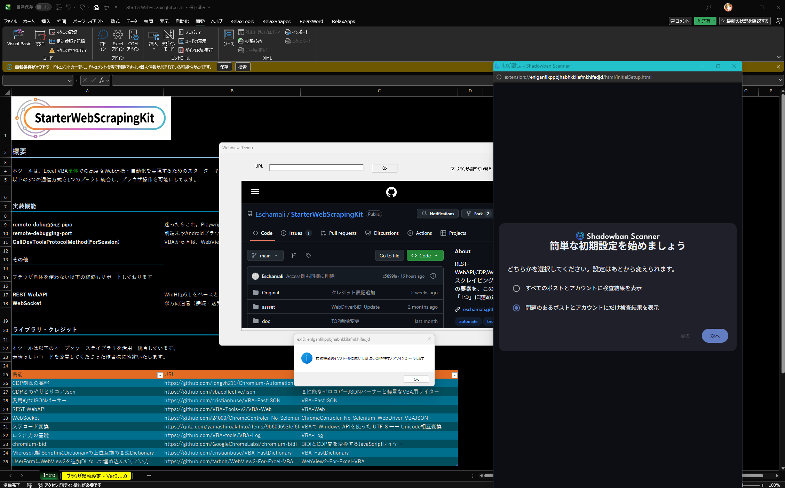

# WebView2、登場秘話

::: tip 登場秘話
〜半年前に自分で埋めた種と、たーぼーさんからの一通の報告〜
:::

[このツールの誕生秘話](/stories/birth-story)の終章でも触れた通り、WebView2対応（v3.0.0）の種は、実は2026年3月頃とほぼ同じ時期――にすでに蒔かれていました。ここでは、その種がなぜ一度は本体と分離し、どうやって半年越しに復活したのかを、もう少し詳しく振り返ります。

---

## Accessへの嫉妬

全ての始まりは、Accessに関する業務(タスク)が飛び込んできたことです。Accessに関する知識も多少はあったので快く引き受け、作業をしていきました。で、ふと見てしまったのです。


> ん、これってもしや🫨

そうです。Accessには、最新のブラウザのChromiumを動かせる仕組み、WebView2機能が備わっていたのです。

実際、既にこれを駆使した自動化制御を行ってる例がSNS等で見かけました。  
例えば下記です。

<blockquote class="twitter-tweet" data-theme="dark"><p lang="ja" dir="ltr">URL判定してページを巡回する処理ができた。ロジックはデスクトップアプリのスコアマネージャーと殆ど同一。 https://t.co/RH5j4miF8s</p>&mdash; たーぼー（インコ） (@fenblen_puyo) <a href="https://x.com/fenblen_puyo/status/1730254340332703769?ref_src=twsrc%5Etfw">November 30, 2023</a></blockquote>

しかし、このWebView2OnAccessは
- 365のサブスクリプションバージョンじゃないと動かない
- Access買い切りの場合は[2024](https://support.microsoft.com/ja-jp/access/use-the-edge-browser-control-on-a-form)から

という金銭的な壁がありました🥲  
「Excelには権限がないのか！？」という嫉妬と絶望の中、私は決意しました。

**「公式が用意してくれないなら、今のExcel環境だけでWebView2を埋め込んで、自力で完全制御する仕組みを作ってやる！」**

一度は、妥協案で始まった物から、ある方の一報を受けて、完全なWebView2埋め込みまでのストーリーを綴ります。

## とりあえずAIに聞いた

するとこんな回答が来ました。

> Edgeをkioskモードで起動して、`SetWindowLongPtr`で、UserFormに埋め込んじゃおう🤠

てっきり、「無理です」と言われると思いきや、ちゃんとルートを教えてくれました。  
というのもこの質問は、新規で訪ねたものではありません。[開発秘話](./birth-story)でも述べた通り、AIをふんだんに駆使してます。つまり、続きとして訊いてます。

当然、会話の履歴には、CDPのやり取りがいっぱい詰まってます。つまり

```text
Excel (VBA)  ↔  CDP via Pipe（--remote-debugging-pipe）  ↔  Edge.exe(UserForm内)
```

という経路が成り立ち、

- 外部起動だけど、CDPという制御コアが整ってるので、`SetWindowLongPtr`で、UserFormに無理やり誘拐しても違和感がない

という風に成り立つのです🤠


*▲ Google ページが UserForm 内に表示された様子。アドレスバーなし・タブなし = 完全 WebView2 ルック*

この辺の詳細は下記にて別途語っております。

- [Edge 埋め込み](/userform/edge)

## どうしても本物のWebView2として使いたい🥲

しかし、やはり心のどこかでは満足してはいませんでした

> あれはあくまでも「Edge.exe」で埋め込んでるに過ぎない🙃「msedgewebview2.exe」という本物のWebView2じゃないと嫌だ🫪

しかし、探しても探してもやはり、**VBA単体でWebView2**の記事は、今まで出てきませんでした。  
プリインストール環境縛りであればあることはありました。


▲ [PowerShell](/userform/powershell)で、WebView2を起動して、そのWebView2を`SetWindowLongPtr`

でも、制御コアは、`ps1`という別ソースにて書かないといけないという別言語の知識も必要になり

> 動くけど、ps1コードを充実させる気力はない🫠

なんというか、もう**外部依存**そのものが嫌という気持ちです。  
もう一度、思い出してください。

IE時代なら
- `CreateObject("InternetExplorer.Application")` 宣言で、すぐにブラウザ制御が始まる
- UserForm内への埋め込みも、「Microsoft Web Browser」コントロール埋め込みで、すぐにブラウザ制御が始まる

**昔はできてたのに今はできなくなった**

それが嫌だったのです

### Qiitaに落ちていた「ブレイクスルー」

そしてついに、見つけました。

🔗 [Excel VBAだけでWebView2を動かす（Qiita）](https://qiita.com/fenblen_puyo/items/4271ab7bd7c9d648d803)

> 「外部DLLの登録も、TLBの参照設定も要らない。純粋なExcel VBAのメモリ空間だけで、本物のWebView2が動く」

初め読んだときは正直、よくわかりませんでした😇  
- Vtable、COM、参照カウント、CoTaskMemAlloc……

最初は完全に呪文でした😇
>「なんでマクロ動かすだけでC言語の教科書みたいな単語と戦わなきゃいけないんだ！？」と。

でも、AIを壁打ち相手にして、仕組みを解剖していくうちに、点と点が一本の線で繋がっていきました。

* **なぜ外部DLLが要らないのか？**
  👉 Windowsに最初から入っている `DispCallFunc` というAPIを使えば、C++の仮想関数テーブル（vtable）の番地を手計算して、VBAから直接ノックできるから。
* **なぜ参照設定（TLB）が要らないのか？**
  👉 設計図（タイプライブラリ）をコンパイラに読ませる代わりに、自分自身がコンパイラになってメモリ上に直接インターフェースの配線をハンダ付けしているから。

>「あ、これ……黒魔術に見えて、Windowsの仕組み（COMとWin32 API）を極限までしゃぶり尽くした**超・正統派の力技**なんだ！」

そう理解できた瞬間、目の前がパーッと開けました。

## しかし、そこは「さらなる巨大な沼」の入り口だった……

3月15日、さっそく手を動かし始めます。

```text
2026-03-15 WebView2を動かす基盤を作成
2026-03-15 QueryInterface が E_NOINTERFACE を返していた問題を修正
2026-03-15 vtable オフセットが間違っている影響でクラッシュする問題を修正
2026-03-15 UserFormに埋め込むウィンドウを用意しそこに埋め込むように改良
```

数日で、UserFormにWebView2を埋め込んで動かすところまでは辿り着きました。  
UserFormの真ん中に、最新のChromium（WebView2）がサクッと表示されたときの感動は、今でも忘れられません🥹

ただし、ここで大きな壁にぶつかります。**当時の本体（`main`）には、まだ `RaiseEvent` による非同期イベント配信の仕組みがありませんでした。** それが整うのは、[通信経路の拡張はどうしたの？](/stories/birth-story#通信経路の拡張はどうしたの？)セクションで `CDPCore.cls` に `RaiseEvent CDPBrowserEvent` 等が生まれる5月末〜6月のことで、この時点ではまだ2ヶ月以上先の話です。

共有できる土台がない以上、やれることは1つでした🥺

```text
2026-03-17 `CDPBrowser`にあったmethodの一部を移植
2026-03-17 別ツールで分けるため、セル定義の整理
2026-03-21 `CDPBrowser`にあるほとんど機能を一旦そのまま移植
2026-03-21 `CDPBrowser`→`WebView2Browser`へ置き換え
```

`CDPBrowser` にあった機能を、ほぼそのまま `WebView2Browser` というクラスにコピーする形で移植しました。動きはします。しかし、結果として生まれたのは、**同じ根から生えた、しかし物理的には完全に別の2本のツール**でした。

- Chromiumブラウザ制御ツール（本体）
- WebView2専用制御ツール（新顔）

コードは似ているのに、修正は毎回2箇所。片方を直せば、もう片方も直さないと辻褄が合わない。**保守が、単純につらい。** この時点の自分には、2本を統合し直す体力も、正しい設計も持ち合わせていませんでした。

::: warning 一旦、諦めました
4月4日の「リファクタリング」を最後に、WebView2ブランチへのコミットは止まります。**ここから約4ヶ月半、このブランチは誰にも触られません。** 悔しさより、「今の本体を育てるほうが先だ」という判断が勝ちました。
:::

---

## 本体だけが、どんどん育っていく数ヶ月

WebView2を脇に置いている間、Chromium制御ツールの方は劇的に進化していきます。

5月末〜6月、God クラス解体で `CDPBrowser` / `CDPContext` / `CDPCore` に責務が割れ、`RaiseEvent` ベースの配信基盤が整いました。これがどれだけ効いたかは、7月の `v2.3.0` で証明されます。**WinSock を自力実装し、WebSocket という2本目の通信路を、既存クラスにほとんど手を入れずに増設できた**のです。

皮肉なことに、「複数の通信路を素直に増やせる土台」は、まさにWebView2に一番欲しかったものでした。それが3月には無く、7月には当たり前のようにできていました。

---

## 転機 — たーぼーさんからの一通の報告

そろそろプログラミング作業から一区切り置こうかと考えていた、8月のある日。WebView2記事の書き手であるたーぼーさんから、こんな報告をいただきました。

> 「ページ自動制御の土台ができました」

その一文を読んだ瞬間、こう思いました。

> 「いまなら、あのWebView2ブランチ、復活できそうじゃね😳😳」

ちょうど新作ゲーム[スプラトゥーン レイダース](https://www.nintendo.com/jp/games/switch2/aadla/index.html)にどっぷり浸かり始めていた時期でしたが、そっちのけでWebView2の再配線工事に取りかかることにしました。

---

## 再配線工事 — 実質、1からやり直し

いざブランチを掘り起こしてみると、想像以上の作業になりました。3月から半年近く経つ間に、本体側は

- `CDPBrowser` / `CDPContext` / `CDPCore` への God クラス解体
- `BiDiCDPJson` によるJSONゼロコピー化
- WinSock自力実装

と、原型を留めないほど作り変えられていました。3月に書いた `WebView2Browser` を、その上にそのまま接ぎ木することはできません。**コード構成としては、実質1からのやり直しでした。**

救いだったのは、この半年でAIを使ったコーディングの精度が上がっていたことです。CDPコマンドの送受信を担う `CallDevToolsProtocolMethodForSession` まわりの部品調達は、AIに相談しながら比較的スムーズに揃えられました。

もう1つ、WebView2ならではの壁がありました。Pipe や WebSocket は「バイト列の断片が何回かに分かれて届く」前提でバッファを組んでいましたが、WebView2はCOMコールバック経由で **「1つの完成したJSONが一発で丸ごと届く」** という、全く違う配送のされ方をします。

```text
2026-08-25 バインバイン以外の拡張ロジックにも対応させる
```

このコミットで、`CDPCore.cls` のバッファ拡張ロジックに、WebView2のこの配送パターンにも対応できる分岐を追加しました。「足りなくなったら倍々に拡張する」という、これまで通用していた前提が、WebView2相手には必ずしも当てはまらなかったということです。

---

## 第三のルート、開通

そうして、Pipe・WebSocketに続く3つ目の通信路として、WebView2がこのツールに合流しました。


*▲ Excel.exe の配下に直接 WebView2 プロセスが生成されています*


*▲ Access.exe の配下にも直接 WebView2 プロセスが生成されています*

特にAccessはシュールです🤠  
**「Access公式の表ルート」** と **「vtableハックによる裏ルート」** という、本来絶対に交わらないはずの2つの世界が同時に生きて動いています。

#### 1. 🟠 公式ルート（Access純正 Edgeブラウザコントロール）
* **仕組み:**
  Accessのリボンにある公式の地球儀アイコン（Edgeブラウザコントロール）をフォームにペタッと配置した正規ルート。
* **表示しているページ:** なぜか **「Selenium」** の公式サイト。

#### 2. 🟢 非公式ルート（密輸UserForm ＋ `WebView2Thunks.bas`）
* **仕組み:**
  Excelから密輸したUserFormに、動的FrameハックでHWNDを掴み、C++の仮想関数テーブル（vtable）を直撃して召喚した完全な裏口ルート。
* **表示しているページ:** なぜか **「Playwright」** のドキュメント。

---

### タスクマネージャーが語る「動かぬ証拠」

右側のタスクマネージャーを見てください。

* **オレンジ枠:** `ユーティリティ (7)` ➔ 公式Edgeコントロールが抱えるWebView2プロセス群
* **緑枠:** `ユーティリティ (6)` ➔ 私がvtableハックで呼び出した真WebView2プロセス群

Microsoft Access というたった1つのアプリの胃袋の中で、
**「公式の安全なおもちゃ（Selenium表示）」** と **「素手でハックした生WebView2（Playwright表示）」** が、
お互いに干渉することもなく平然と2系統並走しています。

「公式コントロールがあるなら、公式を使えばいいじゃない」
……普通の人はそう思います。

でも、左下の起動引数を見てください。
* `AutomationDeclaration`（自動化サイン）
* `BotDetectionAvoidance`（ボット検知回避）
* `--test-type=AccessVBA` (任意の起動引数)

**公式コントロールでは絶対に触らせてもらえない「CDP（生DevTools）による深淵の制御」** をやるためには、この非公式ルート（vtableハック）で真のWebView2を召喚するしかなかったのです。

公式の表玄関から入ったSeleniumと、  
床をブチ抜いて地下から侵入したPlaywright。

Accessの画面上でこの2つが仲良く並んでブラウジングしている光景、
何度見ても技術的シュールさの極みでニヤニヤが止まりません。

::: tip 到達点
あくまでも**CDPツール**として作っているため、WebView2固有の高レベルメソッドはほとんど用意していません。ですが正直なところ、**CDPだけでほぼ賄えます。** `CDPContext.navigate` や `CDPElement.getElementByQuery` など、Pipe / WebSocket でおなじみの操作が、埋め込んだWebView2に対してもそのまま使えます。
:::

唯一CDPの外側にあるのが、`ICoreWebView2Settings`（コンテキストメニューの有効/無効など）や `ICoreWebView2Controller`（表示サイズ・位置）のような、**「Web領域の外側」の設定**です。CDPはあくまでWeb（ページの中身）を制御するプロトコルなので、こういったホスト側の挙動までは届きません。

とはいえ、これも大した負担ではありませんでした。必要になるたびAIに頼んで、数行のプロシージャを1つ足すだけ。`Visible` / `DevToolsEnabled` / `ContextMenuEnabled` といったプロパティは、そうやって都度増設したものです。

そう思っていた矢先、開通したばかりの第三のルートに、最初の穴が見つかります。

---

## 拡張機能という落とし穴（v3.1.0）

`v3.0.0` をマージした直後、いろいろ試していた中で気づきました。**拡張機能まわりのCDPコマンドだけ、WebView2経路で軒並み`Method not available`になる。**

```text
2026-09-01 拡張機能インストール経路を確保
2026-09-01 拡張機能のアンインストール経路を確保
```

Pipe・WebSocketでは何の問題もなく通る `Extensions.loadUnpacked` が、WebView2相手だとエラーで弾かれる。おそらく内部的に `Page` 単位のセッションとして実行されているせいだろう、というのが実機を触っての推測でした。CDPで完結しないなら、WebView2 SDK側が持つ拡張機能専用のAPIを直接叩くしかありません。

ところが、そのAPIを使うには「拡張機能を有効化する」という設定を、**WebView2プロセスを起動する前**に渡しておく必要がありました。しかもその設定の渡し方が厄介でした。`ICoreWebView2EnvironmentOptions` という、これまた `IUnknown` ベースのCOMインターフェースを、こちらから**丸ごと実装してWebView2側に渡す**必要があったのです。

```text
2026-09-01 `EnvironmentOptions`の実装
2026-09-01 `TargetCompatibleBrowserVersion`の既定値を設定するようにする
```

この物語の前半で組み上げたvtable偽造の技法を、今度は「コールバックを受け取る側」ではなく「**設定を聞かれたら答える側**」として使う番でした。空文字のままだと`E_INVALIDARG`で即死する`TargetCompatibleBrowserVersion`のような、実機で1つずつ踏んで確かめた落とし穴もありましたが、`WebView2EnvOptions.cls`として無事に形にできました。



### ついでに全部載せてしまう

vtableを1つ組み上げる大変さを味わったあとだと、不思議な達観が生まれます。

> 「ここまでやったんだから、他のインターフェースも、スカラー値だけならついでに全部繋いじゃえばいいのでは😳」

```text
2026-09-05 `ICoreWebView2Environment`にてスカラー値で取れるプロパティメソッドを追加
2026-09-05 残りの`ICoreWebView2`で取れるスカラー値系プロパティメソッドを追加
2026-09-05 残りの`ICoreWebView2Profile`で取れるスカラー値系プロパティメソッドを追加
2026-09-05 残りの`ICoreWebView2Controller`で取れるスカラー値系プロパティメソッドを追加
```

`ICoreWebView2` / `ICoreWebView2Controller` / `ICoreWebView2Environment` / `ICoreWebView2Settings` / `ICoreWebView2Profile` ――拡張機能のために触ったインターフェース群のvtableさえ整えば、コールバックもイベントも要らない**ただのGet/Letプロパティ**は、驚くほど追加コストが低いとわかったのです。ズーム倍率、既定ダウンロード先、プロファイル名、ステータスバーの文言……気づけば、CDPの外側にあるWebView2固有の設定が一通り触れるようになっていました。

もちろん、際限なく広げたわけではありません。線引きはこの3つです。

- 完了コールバックが必要なメソッド
- イベント系（CDPの`Page.*`等で代替できるため）
- 他のインターフェースへネストして依存するもの

::: tip 到達点（v3.1.0）
1週間前に「CDPだけでほぼ賄えます」と書いたばかりでしたが、その「ほぼ」の穴（拡張機能）を塞ぎに行ったら、ついでに6つのインターフェースが全部繋がってしまいました。`AddBrowserExtension` / `GetBrowserExtensionIds` / `RemoveBrowserExtension` という3つの専用APIと、`EnvironmentOptions`という起動前設定の窓口。詳しい使い方は [WebView2モードでできること](/webview2/capabilities) にまとめています。
:::

## 結論 — 半年寝かせた種は、腐っていなかった

3月に諦めかけたブランチは、8月にはちゃんと芽を出し、その1週間後には拡張機能というおまけまで持ってきました。理由は単純です。**本体側が、新しい通信路を受け止められるだけの土台に育っていたから。** 蒔いた種そのものより、畑（本体の設計）を耕し続けたことのほうが、結果的にものを言った気がしています。

::: tip フィナーレ
ブレイクスルーの記事を教えてくれ、`Wv2Thunks.bas` という土台まで公開してくれた、たーぼーさんに改めて感謝します。あなたの一言の報告がなければ、このブランチはもうしばらく凍ったままだったはずです。
:::

## 次に読む

- [このツールの誕生秘話](/stories/birth-story) — 終章：半年前に埋めた種を掘り起こす
- [WebView2モードの設計思想について](/webview2/design) — 機械語サンク・vtableの技術詳細
- [WebView2モードでできること](/webview2/capabilities) — 拡張機能・`EnvironmentOptions`の使い方
- [Excel単独で「真のWebView2」を完全制御する](/userform/vba-only)

<script setup>
import { onContentUpdated } from 'vitepress'

onContentUpdated(() => {
  if (typeof window !== 'undefined' && window.twttr) {
    window.twttr.widgets.load()
  }
})
</script>
