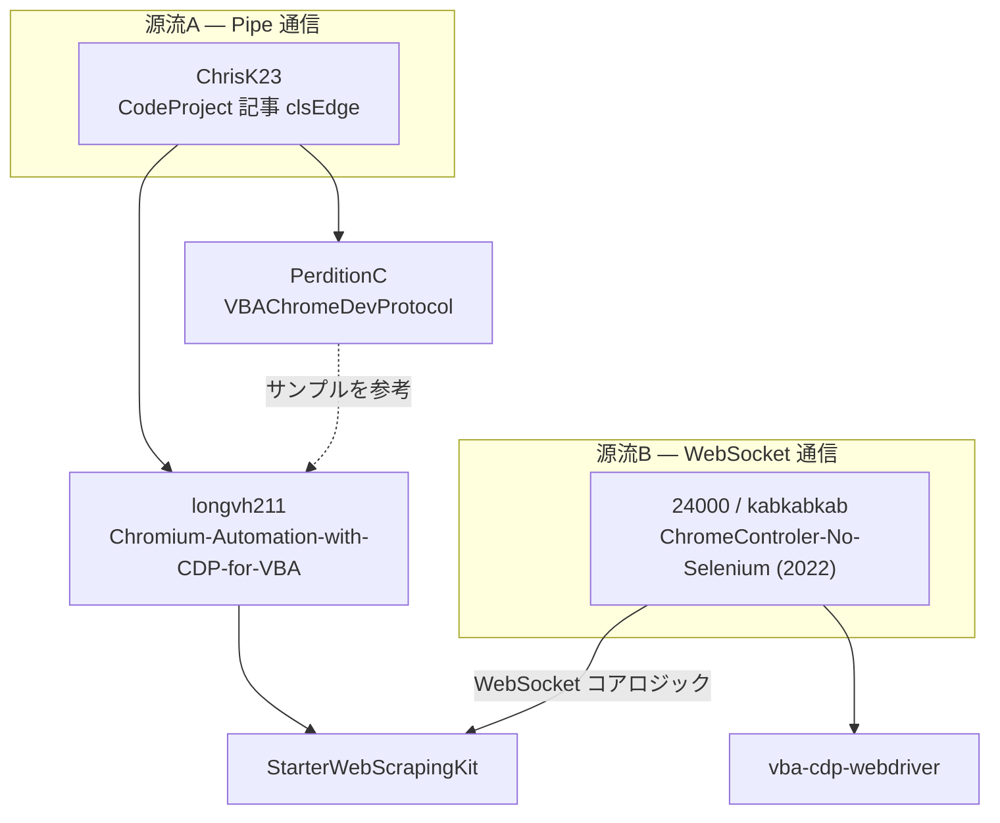

# VBA 圏での CDP 制御 ― 3プロジェクト比較

[Puppeteer / Playwright との比較](/core-comparison/)では「言語の壁を越えて同じ答えに辿り着いた」という話をしました。このコーナーはその逆で、**同じ VBA という土俵の上で、同じ CDP を相手にした3つのプロジェクトが、どこで同じ答えに至り、どこで道を分けたか**を追います。

## 比較対象

| | 作者 | 位置づけ |
| --- | --- | --- |
| **StarterWebScrapingKit** | Eschamali / longvh211 / Daniel Polak | Excel ブック1つで完結する統合スターターキット |
| **[VBAChromeDevProtocol](https://github.com/PerditionC/VBAChromeDevProtocol)** | PerditionC | CDP 全ドメインを自動生成で網羅した低レイヤーラッパー |
| **[vba-cdp-webdriver](https://github.com/24000/ChromeControler-No-Selenium-WebDriver-VBAJSON)** | 24000 / kabkabkab 系 | Selenium 風 API を持つ軽量な派生版 |

README の自己紹介からして性格が違います。VBAChromeDevProtocol は「a VBA version of Puppeteer/Selenium」と名乗りつつ、こう書いています。

> Note: if you can use Puppeteer, Playright, Selenium, or some other tool - then use it!
> But if you can only use VBA, then this is meant to provide a means to automate Chrome or Edge based browsers.

「VBA しか使えないなら」という前置きは、3者に共通する出発点でもあります。

## 系譜 ―― 源流は1つではない

「StarterWebScrapingKit は他2つの美味しいところを融合した」と言いたくなるところですが、調べると**融合というより血縁**でした。しかも源流は2つあります。



- **源流A** は ChrisK23 氏の CodeProject 記事。VBAChromeDevProtocol の README にも `clsCDP derived from clsEdge` と明記されています。ここから **Pipe 通信**の系統が伸びます
- **源流B** は 24000 氏（kabkabkab）の 2022 年の作品。こちらは ChrisK23 氏への言及が一切なく、**WebSocket 前提で独立に生まれた**系統です
- StarterWebScrapingKit は、Pipe 側（longvh211 氏経由で源流A）と WebSocket 側（源流B）の**両方の血を引くハイブリッド**

つまり VBAChromeDevProtocol は直接の親ではなく、**同じ原典から分岐した従兄弟**にあたります。

## 血縁の物的証拠 ―― 同じ名前の関数

系譜の話は、ソースを並べると一目瞭然です。VBAChromeDevProtocol と StarterWebScrapingKit には、**同じ名前・同じコメントの関数**が今も残っています。

```vb
' VBAChromeDevProtocol / clsCDP.cls:63
' CDP messages received from chrome are null-terminated
' It seemed to me you cant search for vbnull in a string
' in vba. Thats why i re-implemented the search function
Private Function searchNull() As Long
    For i = 1 To lngBufferLength
        If Mid(strBuffer, i, 1) = vbNullChar Then
            searchNull = i
            Exit Function
        End If
    Next i
End Function
```

```vb
' StarterWebScrapingKit / CDPCore.cls
'------------------------------------------------------------
' CDP messages received from chrome are null-terminated
' Updated: 25/10/25: Daniel Polak - new faster version
'------------------------------------------------------------
Private Function searchNull(checkString As String, StartPos As Long) As Long
    lngPos = InStr(StartPos, checkString, vbNullChar, vbBinaryCompare)
```

`' CDP messages received from chrome are null-terminated` という**コメントの1行が完全に一致**しています。原典から受け継がれたものが、片方では「VBA では `vbNullChar` を検索できないと思ったので自分で書き直した」という当時の判断のまま残り、もう片方では `InStr` に置き換えられて日付入りの更新履歴が足されている。

この2行の差が、このコーナー全体の縮図です。**出発点は同じで、その後どこまで手を入れ続けたかだけが違う。**

::: info なぜ `InStr` で良かったのか
元コメントの「検索できないと思った」は誤解で、`InStr` に `vbBinaryCompare` を指定すれば `vbNullChar` は普通に見つかります。1文字ずつ `Mid` で回す実装はネイティブ関数1回に置き換えられ、しかもその修正はコア比較の[バッファ管理の話](/core-comparison/transport)にそのまま繋がっています。
:::

## 独立に同じ道を辿った例 ―― Pipe が先、WebSocket が後

もうひとつ面白い一致があります。両プロジェクトとも **「Pipe が本流、WebSocket は後付け」** という同じ順番で進化しました。

> **VBAChromeDevProtocol / README.md**
> Primarily connects directly to browser using ... pipes when started, however, **now also has basic support** for connecting to browser through standard websocket interface

> **StarterWebScrapingKit / README-jp.md**
> **V2.3.0より**、すでに起動している Edge や Chrome などの既存ブラウザセッションに Excel からアタッチできる「WebSocket（Port）ルート」が正式に解禁されました。

これは真似ではなく、**技術的な必然**です。Pipe は `--remote-debugging-pipe` で自分がブラウザを起動するときにしか使えません。一方で「すでにログイン済みのブラウザに後から乗りたい」という要求は、Pipe では原理的に不可能で `--remote-debugging-port` 経由の WebSocket しか道がない。Pipe で作り始めた道具は、実用を重ねると必ずこの壁にぶつかります。

対照的に、源流Bから生まれた vba-cdp-webdriver は最初から WebSocket 一本です。中核クラスの名前がそのまま `a1_WebSocketCommunicator.cls` であることに表れています。

## このコーナーで扱う内容

| ページ | 扱う内容 |
| --- | --- |
| [イベント処理と拡張性](/vba-comparison/events) | 登録制コールバック / `Select Case` 固定 / `RaiseEvent` の3方式 |
| [マルチタブとセッション管理](/vba-comparison/multi-tab) | `sessionId` 多重化・再接続コスト・非同期実行・接続エンドポイントの選択 |
| [クラス構成とコード生成](/vba-comparison/structure) | 3つの異なる分割軸と、236ファイルの自動生成という別解 |
| [使い分けと、分かれ道](/vba-comparison/conclusion) | 用途別の選び方と、3者を分けたもの |

::: tip 先に結論
総合力では StarterWebScrapingKit が抜けていますが、**全部門で1位ではありません**。単体タブだけで手早く済ませたいなら vba-cdp-webdriver が最短で、生の CDP コマンドを直接叩きたいなら VBAChromeDevProtocol の型付きドメイン層が最強です。詳しくは[使い分けのページ](/vba-comparison/conclusion)をご覧ください。
:::

## 関連

- [Puppeteer / Playwright とのコアロジック比較](/core-comparison/) — 同じ比較を Node 勢に対して行ったもの
- [アーキテクチャ](/concepts/architecture) — このキット側のクラス構成
- [設計思想](/concepts/design-philosophy) — なぜコアに全リソースを振ったのか
